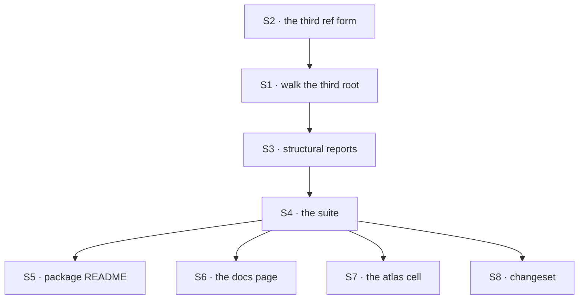

# FIX-1368 · Plan

[Spec](SPEC.md) · [Decisions](DECISIONS.md) · [Rules](BUSINESS-RULES.md) · **Plan**

Written for the implementing agent. IDs cross-reference [BUSINESS-RULES.md](BUSINESS-RULES.md)
(BR-n) and [DECISIONS.md](DECISIONS.md) (D-n). `tdd`. One PR.

## Surfaces

| ID | Package · role | Change | Rules |
|---|---|---|---|
| S1 | `workforce` · the resources reader | After the team-level slot read, walk that team's `workers/` slot and each worker folder, reading a `resources/` slot inside each. Calls the slot reader that is already there; the leaf loop does not change | BR-1 BR-2 BR-3 BR-6 BR-7 BR-8 BR-12 BR-13 |
| S2 | `workforce` · the reader's ref helper | A third form in the one existing helper: `teams/<t>/workers/<w>/<name>`, with `Worker` validated alongside `Team` and `Document` (D1) | BR-4 BR-11 |
| S3 | `workforce` · the reader's structural reports | The `workers/` slot and a worker folder report under their own paths with the existing `unreadable-slot` kind and shared wordings. **No new error kind** | BR-9 BR-10 |
| S4 | `workforce` · the reader's suite | Every rule above, each bad case planted in a tree that also holds a healthy worker document and a healthy team document | all |
| S5 | Docs · `packages/workforce/README.md` | Third root in the tree, third form in the ref table, and the *namespace, not a visibility boundary* paragraph extended one level deeper (D2) | BR-14 BR-16 |
| S6 | Docs · `apps/docs/docs/workforce/documents-on-disk.md` | The same three edits, plus the closing list — *"it does not read a team's `workers/` folder"* is now wrong | — |
| S7 | Docs · `docs/atlas/workforce.html` | The `workers/<name>/resources/` cell stops reading NAMED GAP and reads what shipped | — |
| S8 | `.changeset/*.md` | One `patch` for `@flow-state-dev/workforce` | — |

Nothing is removed, and nothing in `src/` outside `read-resources-directory.ts` is edited. A diff
touching `hire.ts`, `manifest.ts` or `resources-from-docs.ts` has left the plan (BR-15, BR-16).

## Sequence



## Checks

| ID | Runs after | Passes when |
|---|---|---|
| V1 | S2 | BR-4 and BR-11 — three levels of `handbook` coexist; a worker folder that breaks the segment rules reports without its file being read |
| V2 | S1 | BR-1, BR-2, BR-3, BR-6, BR-13. The happy path and all four silences |
| V3 | S1 | BR-7, BR-8, BR-12 — the leaf conditions read identically at the third level, asserted against the **same wording constants** the team level uses, never re-typed strings |
| V4 | S3 | BR-9, BR-10 — each reported once, under its own path, with a healthy sibling document surviving the same tree |
| V5 | S1 | BR-5 — documents load from a `WORKER.md`-less folder, and the roster reader's report for that tree is unchanged (D3) |
| V6 | — | BR-14, BR-15, BR-16 — **the second path.** The shipped reader suite, `hire.test.ts` and `resources-from-docs.test.ts` pass unmodified; a tree with no worker documents is byte-identical |
| V7 | S5 S6 | Every code block in the two docs pages runs as written |

**No goal check on a real model**, stated rather than skipped: nothing here reaches one, and the
behaviour a model would exercise is [D2](DECISIONS.md#d2)'s deferred half.

## Pinned names · the only one

| Where | Name | Why pinned |
|---|---|---|
| The ref form | `teams/<team>/workers/<worker>/<name>` | Public: a storage-key namespace, an accessor key, and what the atlas teaches. Path-joined, for the reason the team form is |

Everything else is yours, including whether the worker walk is a loop inside the team loop or its
own helper.

## Guardrails

| Rule | Because |
|---|---|
| Every wording at the third level comes from the constant the other levels use (tenet 5) | Three copies of one refusal is the drift the loader extract exists to end, and this reader is where two would land |
| No new `ResourceDocErrorKind` | A third *place* the five conditions occur, not a sixth condition. A new kind makes callers branch on where a document sat |
| The org root's code path is untouched (BP-030) | BR-14 is a byte-for-byte promise |
| A worker folder is classified before it is listed, and a symlink refused at both new levels (BP-031) | Two new levels, each a place a link could take the read outside the configured root |
| The reader still does not read `WORKER.md` | D3. The moment it does, one reader runs another's job |

## Docs

- **EXTEND** `packages/workforce/README.md` — the tree, the ref table, the visibility paragraph.
  *Voice risk:* writing "private to that worker". It is not.
- **EXTEND** `apps/docs/docs/workforce/documents-on-disk.md` — "The tree", "A document's ref",
  the namespace-not-a-boundary section (now covering all three levels), and the closing list.
  *Voice risk:* user-facing, so no issue ids and no history of the gap.
- **EDIT** `docs/atlas/workforce.html` — one cell of the path-level-is-scope figure and its table
  row. Internal, so it may say what changed.
- **No new page.**

## Sketch · pseudocode, illustrative, react to the shape

```
readResourcesDirectory(root):
    ...org root, unchanged...
    for each team folder (unchanged loop):
        read the team's resources slot        ← unchanged
        open the team's workers slot          ← new, structural, may be absent
        for each entry in it:
            classify it; a file is not a worker slot, so skip in silence
            read that worker folder's resources slot, minting refs as
                teams/<team>/workers/<worker>/<name>
```

The leaf — what a document file is, what a directory in the slot means, which keys are refused —
is the helper that already exists, called with a third ref minter. That is the whole shape.

**POC:** `spec-poc/FIX-1368-third-root/probe.mts` on this branch —
`pnpm tsx spec-poc/FIX-1368-third-root/probe.mts`. Four probes against shipped code. It showed
the third root is read by nothing **and reported by nothing**; that the worker reader walks past
the same folder; that bare-name coexistence already works through the ref form alone, so no new
collision mechanism is needed; and that the obvious per-seat install refuses to mint a worker kind
holding a block-declared lazy resource. The last turned [D2](DECISIONS.md#d2) into a priced fork.

## At implement time

- **Re-read [D2](DECISIONS.md#d2)'s answer first.** If the owner chose the fence, this plan is
  wrong at S1: the reader becomes per-seat and the surfaces move into `readWorkforce` and
  `hireWorkforce`.
- **[FIX-1389](https://github.com/fixpoint-labs/flow-state-dev/pull/1810) may have landed.** If
  its `openRoot` and `forEachTeam` exist, S1 consumes them for the top two levels. If not, extract
  nothing — this issue is not the extract
  ([ER-10](https://github.com/fixpoint-labs/flow-state-dev/pull/1718)).
- **The `workers/` slot open and the worker-folder classify already exist verbatim** in
  `read-workforce-directory.ts`. Copy the behaviour, share the wordings, file the follow-up below.
- **[FIX-1357](https://github.com/fixpoint-labs/flow-state-dev/pull/1804)** may have republished
  the loader primitives from a new subpath.

## Follow-ups

- **The worker-slot walk will exist twice** once this lands, and FIX-1389's extract stops at the
  team folder. Flag it there rather than filing a new issue — same duplication, one level down.
- **Access control for documents**, if [D2](DECISIONS.md#d2) defers it: a ticket of its own the
  moment a consumer exists.
