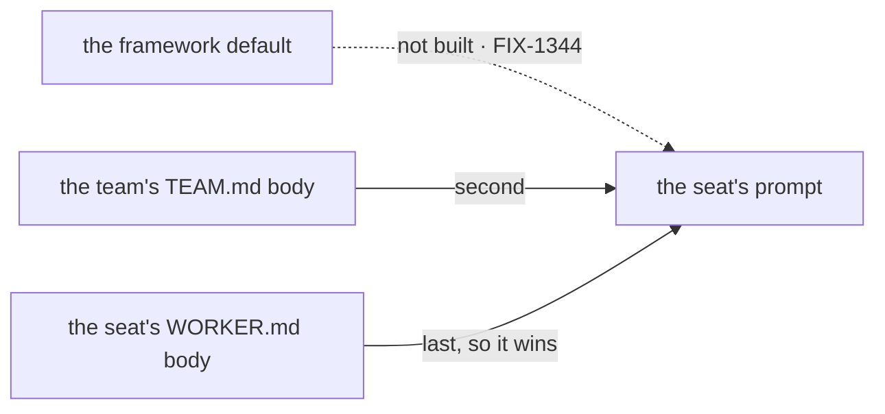

# FIX-1377 · Business rules

[Spec](SPEC.md) · [Decisions](DECISIONS.md) · **Rules** · [Plan](PLAN.md)

The cases, written as rules: what a person or the system does, and what happens. The *proved by*
column is the check the plan runs. A human reviews this page; the plan turns it into work.

## Reading the file

| # | When | Then | Proved by |
|---|---|---|---|
| BR-1 | A team folder holds no `TEAM.md` | No team layer, and no report. Every seat on that team hires exactly as it does today, with nothing extra in its bag — **not an empty string, not an empty placeholder**, since an empty layer would change what a kind's schema sees for every team that has no file | CI · and the existing loader suite, unchanged |
| BR-2 | `teams/<id>/TEAM.md` declares a `description` and carries a body | A team record loads: the team's id from the folder, its description, and its instructions from the body verbatim. Every seat under that team carries those instructions | Goal check, real route · CI |
| BR-3 | `TEAM.md` declares no `description`, or an empty one | One failure reported under `teams/<id>/TEAM.md`, in the dialect's existing wording. The team's **workers still load**, and they load without the layer — so a caller that boots past a non-empty `errors` runs seats short of instructions their author wrote. That is the reader's standing posture (collect, never throw) and the caller's standing call, not a new one | CI |
| BR-4 | `TEAM.md` has frontmatter but an empty or whitespace-only body | The description loads; there is **no** instruction layer. Whitespace is not instructions — the same rule hire already applies to a worker's body | CI |
| BR-5 | `TEAM.md` is a symlink | One failure under `teams/<id>/TEAM.md`, in the shared refusal wording. Symlinks are never followed at any level. The team's workers still load | CI |
| BR-6 | `TEAM.md` is there and cannot be read | One failure under `teams/<id>/TEAM.md`, in the shared unreadable wording. Distinct from absent (BR-1): a file that exists and will not open is instructions the app has lost | CI |
| BR-7 | `TEAM.md` is a directory | Reported, naming the file to write instead — the resources convention's existing `folder-where-file-belongs` condition, reused rather than respelled. A directory with that name is a mistake, and reading it as *absent* would lose it | CI |
| BR-8 | `TEAM.md` declares a key this convention **derives** — the team's id — or one that would read it as a seat declaration (`flow:`, `instructions:`) | Refused by name, as a set, per [ER-4](https://github.com/fixpoint-labs/flow-state-dev/pull/1718). `flow:` is refused because `TEAM.md` is not a second seat door; `instructions:` because the body is the instructions and two sources for one value have no precedence rule | CI, one case per refused key |
| BR-9 | `TEAM.md` declares any other key | Carried verbatim on the team record, uninterpreted, as every record in this dialect carries its frontmatter | CI |
| BR-10 | A file named `TEAM.md` sits at `org/`, or anywhere outside a team folder | Read by nothing, reported by nothing. There is no `ORG.md` and no org-level instruction layer | CI · a planted file is invisible |

## Reaching the seat

| # | When | Then | Proved by |
|---|---|---|---|
| BR-11 | A seat's team has instructions and its kind composed the `WorkerConfig` contract | A block running inside that seat's action reads the team's instructions at `ctx.flow.config.teamInstructions`, and its own at `ctx.flow.config.instructions`. Two values, both present, neither merged | Goal check, real route, no model |
| BR-12 | A seat's team has no instructions | `teamInstructions` is absent from the bag, the same way `instructions` is absent for a bodyless seat. Absent, not empty | CI · goal check, sibling team |
| BR-13 | Two teams each carry a `TEAM.md` | Each team's seats get their own team's instructions and not the other's — the same isolation the skills register already proves per seat | Goal check · CI |
| BR-14 | A kind on the roster has **not** composed the `WorkerConfig` contract | The whole roster refuses at hire, unchanged from [FIX-1367](https://linear.app/fixpoint-labs/issue/FIX-1367)'s BR-2. This issue adds no second refusal door and no conditional imposition | Existing suite, once FIX-1367 lands |
| BR-15 | A record was hand-built and never passed the loader | No team layer. `teamInstructions` is absent, exactly as `skills` is absent on such a record — *nobody read for it* and *it has none* are the same value in the bag and stay distinguishable only on the record | CI, on the thinnest record |
| BR-16 | A `WORKER.md` declares `teamInstructions:` itself | Refused by name, at the loader and at hire, from the same constant. A seat may not author the layer its team owns | CI, both doors |

## The prompt

| # | When | Then | Proved by |
|---|---|---|---|
| BR-17 | A seat of the built-in `agent` kind has both a team layer and its own body | Its prompt carries the team's text first and the seat's own second, joined. The seat's is last, so a role-specific line wins an ordinary conflict with a team-wide one | CI, on the seam |
| BR-18 | A seat of the built-in kind has a team layer and **no** body | Its prompt is the team's text alone — not an empty line, not a stray separator | CI |
| BR-19 | A seat of the built-in kind has a body and **no** team layer | Its prompt is byte-for-byte what it is today | CI · existing suite, unchanged |
| BR-20 | A kind composes the contract and reads `teamInstructions` nowhere | It mints and runs exactly as before. Ignoring the layer is not an error | CI |

The dashed edge is the slot this issue leaves room for and does not fill. The order is the
architect's lock, and BR-17 is what proves it.

## Failure taxonomy

Every failure here is a **startup misconfiguration**. Reader failures are collected under the
path that produced them and never thrown, so one broken `TEAM.md` never costs an app its workers;
whether a non-empty `errors` stops the app stays the caller's explicit call, as today. Hire
failures are fatal and collected, so one run names them all. Nothing retries, nothing degrades,
and none of it is reachable from a request — by the time a seat can be addressed, admission
already held.

The one non-failure worth stating: a team with no `TEAM.md` is not a problem of any kind (BR-1).

## Acceptance criteria this issue owns

A workforce tree with **two** teams, one carrying a `TEAM.md` and one not, read by the real
loader and hired into a **non-agent** kind that composed the `WorkerConfig` contract. Over the
real HTTP route, a block **nested inside** each seat's action reads its own `ctx.flow.config`:
the first team's seats show their team's instructions *and* their own, as two separate values;
the second team's seats show their own and no team layer. Graded from inside the running block,
never off the returned instance, and asserting the sibling's value **absent** as well as its own
present — one shared bag is always right for somebody.

Model-free: the property under test is which values reach a running block. The prompt's **order**
(BR-17) is a unit check on the seam, where it is asserted exactly rather than inferred from what a
model said.

This is `TEAM.md`'s non-lab consumer for the epic's
[ER-15](https://github.com/fixpoint-labs/flow-state-dev/pull/1718).
