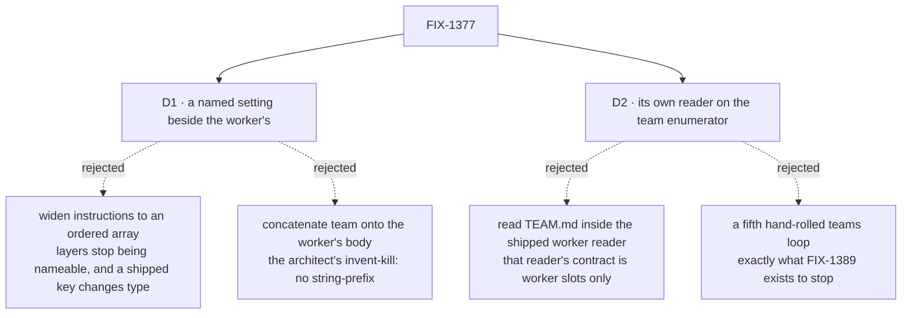

# FIX-1377 · Decisions

[Spec](SPEC.md) · **Decisions** · [Rules](BUSINESS-RULES.md) · [Plan](PLAN.md)

Most of this issue was decided before it reached a spec: the file contract, the compose order and
the invent-kills are the architect's lock of 2026-09-12, recorded under *Decided, not asked*. Two
choices were left open, and both are about **where** the team layer enters rather than what it is.

## The tree

Solid edges are what you're signing. Dashed edges lost, and the label says why.

## D1 · The team's text is its own imposed setting on the `WorkerConfig` contract

| | |
|---|---|
| **Instead of** | Widening the shipped `instructions` key to an ordered array of layers, or concatenating the team's text onto the worker's body before hire |
| **Because** | The layers have to stay tellable apart at the seam — a kind that wants only the seat's own charter must be able to have it, and a merged string cannot offer that. Concatenation is also the architect's named invent-kill. And the package already has this pattern: `seatSkills`, a framework-imposed setting spelled apart from the author-written `skills` beside it |
| **Locks in** | The `WorkerConfig` contract [FIX-1367](https://linear.app/fixpoint-labs/issue/FIX-1367) is about to ship carries **one more key than it was approved with**, and a kind that composed it admits a setting it may ignore. It also sequences this issue behind FIX-1367: the alternative is hire's current probe-the-kind-and-stay-silent-if-absent hack, which is the exact silence FIX-1367 exists to delete. Flagged up to the epic rather than folded in quietly |

**What would change my mind:** a kind that genuinely wants one merged string. None exists — and a
kind that wants one merges in a line, while nothing recovers a split from a value merged before it
arrived.

**What separate layers do not buy: precedence.** They buy a fixed, checkable position and the
ability for a kind to read one without the other. Nothing in the prompt path adjudicates a
contradiction between them ([BR-17](BUSINESS-RULES.md)).

## D2 · `TEAM.md` gets its own reader, on FIX-1389's team enumerator

| | |
|---|---|
| **Instead of** | Reading `TEAM.md` inside `readWorkforceDirectory`, which is already standing at the team folder and would need no new walk at all |
| **Because** | That reader's whole contract is *worker slots only* — its header promises a team's siblings are passed over in silence, and the docs teach it as a rule. Reading a team-level file is a different convention, and it is what [FIX-1389](https://linear.app/fixpoint-labs/issue/FIX-1389)'s enumerator was extracted for: its D1 names *the next conventions* as why the seam sits at the team folder. The join then mirrors how a seat's skills already reach it — `readWorkforce` joins, it does not walk |
| **Locks in** | This issue sequences behind FIX-1389. Without it there is no enumerator, and a fourth reader would hand-roll a fifth `teams/` loop — the drift FIX-1389 exists to end, and a regression of its own BR-16. If FIX-1389 is reshaped or dropped, this trade re-opens and the cheaper answer becomes widening the worker reader |

**It composes — checked against that spec, not assumed.** `TEAM.md` sits **at** the team folder,
not in a slot beneath it, so it falls on the correct side of FIX-1389's D1 boundary ("enumerates
teams, does not read slots") and is exactly the *part that is actually this convention's* inside
the enumerator loop. Two coordination notes, neither a blocker: FIX-1389 leaves its enumerator's
name and shape to its implementer, so nothing here may pin them; and its failure `kind` union is
per-reader, so this reader brings its own conditions rather than borrowing another's.

**"Mirrors the skills join" means the orchestration, not the I/O.** `readWorkforce` joins and
readers walk — that transfers. *Where the read happens* does not: a seat's skills are read inside
the worker loop because they are per seat, and a team's instructions are one value per team. The
read happens once, into a map ([PLAN](PLAN.md) S3, its guardrail and V9).

**What would change my mind:** FIX-1389 stalling. If the extract is still unbuilt when this is
scheduled, widening the worker reader is the honest fallback — recorded so it is a fallback rather
than a rediscovery.

## Decided, not asked

- **The file contract, the compose order and the invent-kills are the architect's lock**
  (2026-09-12, on the epic PR): `teams/<teamId>/TEAM.md`, frontmatter `description`, body =
  team instructions; optional, and absent means **no layer** rather than an empty one; order is
  framework default → team → worker; no `ORG.md`; no Team L1 type; seats stay `WORKER.md`.
  Not re-decided here.
- **The prompt slot is already an array.** `generator`'s `prompt` takes a list and joins it, and
  the built-in kind's slot carries a comment naming this as the marked insertion point. This issue
  is the re-decision that comment asks for, so the comment is rewritten rather than left
  describing a seam that moved.
- **`description` is required when the file exists**, and its absence is reported like any other
  malformed declaration. The dialect requires it on `WORKER.md`, on `SKILL.md` and on a resource
  document; a fourth answer would be the cargo cult ER-11 names.
- **`description` ships with no consumer.** Nothing reads it — no roster view exists, and
  [FIX-1310](https://linear.app/fixpoint-labs/issue/FIX-1310) is out of this epic. It is surfaced
  on the loader's result rather than parsed and dropped: validating a value and discarding it is
  worse than either reading it or not asking for it. Building its reader here is a feature nobody
  asked for.
- **The team record carries its frontmatter verbatim**, like every record in this dialect. That is
  the loader's standing promise, not a feature this issue adds.
- **The loader's result surfaces a `teams` aggregate — dialect consistency, not speculative
  surface.** The join builds the records anyway; returning them is one field, it matches how every
  other convention hands back what it read, and it is what stops `description` being a value we
  validate and throw away. Attaching to worker records and returning nothing else saves a field now
  and costs a re-specification the day anything wants the description.
- **The imposed key is refused at all three doors — `TEAM.md`, `WORKER.md`, hire — through one
  exported constant**, exactly as `seatSkills` is, and never by a literal spelled into a reader.
  Its spelling is the implementer's, which is precisely why: a literal would keep refusing a name
  the framework had since renamed, and the door would be open again with nothing said.
- **Size reads *small*.** One optional file, one small reader, one join, one key, one seam edit.

## Considered and dropped

| Alternative | Why not |
|---|---|
| Let the team layer ride in `instructions` as `string[]` | Keeps the contract at three keys and breaks a shipped one: `instructions` is a string on the built-in kind and on FIX-1367's approved contract, and the frontmatter-versus-body collision refusal would have to grow a story about arrays |
| Concatenate at the loader, so hire never sees two values | The cheapest possible change, and it throws the layering away at the one point it is still recoverable. Also the architect's explicit invent-kill |
| A `TeamManifest` that hire takes as a second argument | A second door onto hire, for a value every record can carry. The record is where the loader already puts per-seat findings (`skills`), and hire reads records |
| Ship the team layer only for the built-in `agent` kind | Needs no contract key and no FIX-1367 dependency — and it makes "a team's instructions reach its seats" true only for the kind that needed it least, which is the dishonesty ER-7 was written against |
| Make the team layer dominate the worker's on conflict | Team-policy-dominates-seat is an explicit reopen per the architect's lock, not this ticket. Note what the chosen order does *not* buy: position, not precedence — nothing in the prompt path adjudicates a contradiction ([BR-17](BUSINESS-RULES.md)) |

## Open

**One live fork, and the contingency it carries.** Both are flagged **up to the epic**
([ER-14](https://github.com/fixpoint-labs/flow-state-dev/pull/1718)) rather than answered here,
because they land on [FIX-1368](https://linear.app/fixpoint-labs/issue/FIX-1368)'s own live fork.
One ask, two parts: answer the fork, and know what the second part commits you to.

### The fork · after this change, the team folder tells two stories about who can see what

- *The fork.* Ship the team instruction layer now, beside team documents that scope differently —
  or hold it until the team folder has one answer about visibility?
- *In plain terms.* Team instructions really do reach only that team's seats — they ride each
  seat's own configuration. Team documents do not: they are installed on a worker *kind*, so every
  seat of that kind can reach every team's documents, which is what the shipped page teaches today
  — *"the team folder is a namespace, not a visibility boundary."* Both are true, for different
  reasons, and after this change they describe two files in one folder.
- *The trade-off.* Shipping gets a team its shared instruction layer now, and accepts that an
  author has to learn two rules about one folder. Holding blocks a small, wanted change behind
  FIX-1368's D2, which is itself unresolved and unscheduled.
- *Recommendation: ship, and make the atlas teach the difference explicitly* — instructions are
  per-seat configuration, documents are installed on a kind. The mechanisms genuinely differ, so
  one rule would be a false simplification; and holding a wanted layer for a teaching problem
  costs more than the paragraph that fixes it.
- *What would change my mind.* If the owner intends `teams/<id>/` to become a real visibility
  boundary, this should be specified against that answer rather than ahead of it. That is the
  contingency below, and it is not hypothetical.
- *If wrong.* A docs correction, and possibly an author who put something in a resources folder
  expecting it to stay with the team. Nothing on disk moves, no storage ref changes, no
  configuration key changes. Cheap to reverse.

### The contingency · this spec is bound to FIX-1368's D2, and is re-written if that lands on the fence

**This spec ships on the *address* reading of a folder** — a folder names whose something is, and
does not limit who can read it. That is the reading FIX-1368's D2 proposes, and **D2 is not
resolved**: its own sign-off still reads *Open: one*. Stating the binding plainly, because a
conditional rewrite is not the same as "may need revisiting":

| If D2 resolves to… | Then FIX-1377… |
|---|---|
| **address** — a folder names, it does not fence (the proposed reading) | ships exactly as written, and the docs obligation in [PLAN](PLAN.md) S9 stands: the atlas teaches both rules out loud |
| **fence** — a team or worker folder really does limit who can read | is **re-spec'd against one folder rule.** Team instructions and team documents would then scope the same way, taught once instead of twice, and the Open above dissolves rather than being answered. The cases in [BUSINESS-RULES.md](BUSINESS-RULES.md) survive; the teaching and the docs plan do not |
| **report-only** — the folder is reported rather than loaded, and scoping stays undecided | ships as written, and the docs obligation **still stands**, because team documents keep behaving as they do today. Nothing about team-level visibility is settled by that arm |

Same class as D2's own FIX-1389 contingency: a named, priced re-decision recorded before it is
needed, rather than a surprise at implement time. The owner keeps this one — it is their call on
FIX-1368, not a second call here.

## How it got here

- **Draft (Sep 17)** — the architect's lock settled the file and the compose order, so the
  research went to where the layer *enters*: a named key on the contract FIX-1367 is about to
  ship, and a small reader on the enumerator FIX-1389 is about to extract. Both make this issue
  wait on unbuilt work, which is cheap here because nothing in the set waits on this issue. The
  scoping divergence against the shipped documents teaching was found while checking FIX-1368,
  and is flagged rather than resolved.
- **Review round 1 (Sep 17)** — direction ratified; **no decision changed.** D1, D2 and the
  absent-versus-empty rules were all confirmed, and the Open question was checked against the cited
  page and found accurate. Five folds, none of them a pivot.
  **One narrowed a promise:** BR-17 said the seat's text, being last, *wins* a conflict. It does
  not — prompt assembly in `@flow-state-dev/core` is plain concatenation with no precedence path
  anywhere, so the rule now promises deterministic **order** and says outright that resolving a
  contradiction is the model's, not the framework's. The old wording had a check that could not
  fail on the thing it claimed (BP-003), which is the worse half of the defect.
  **The rest:** the plan's *"follow the skills join"* was corrected — that join is per **seat**,
  this one is per **team**, so the read happens once into a map (a guardrail and V9 hold it); the
  imposed key became refused in `TEAM.md` too, **through the shared constant rather than a
  literal**, since its spelling is not locked and a stale literal would re-open the door in silence
  (BR-8a); `docs/architecture/workforce-default-worker-kind.md` joined the docs plan by name, as it
  states the two-element compose order this change makes three; and the FIX-1368 binding above was
  written out as a conditional rewrite across all three of that fork's arms.
