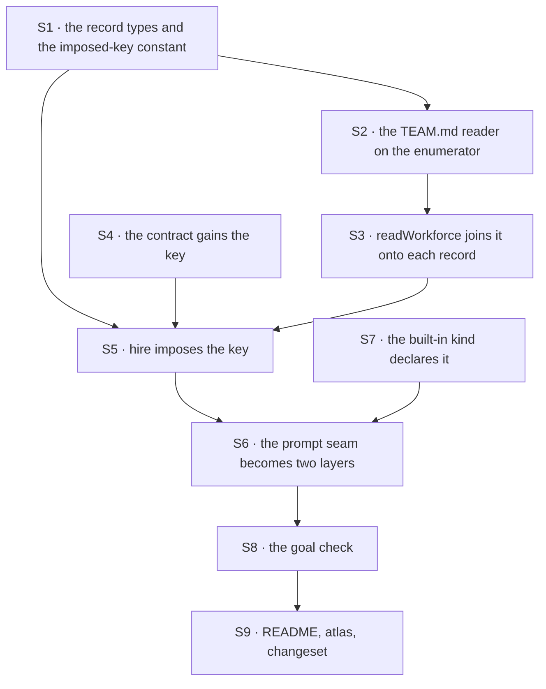

# FIX-1377 · Plan

[Spec](SPEC.md) · [Decisions](DECISIONS.md) · [Rules](BUSINESS-RULES.md) · **Plan**

Written for the implementing agent. IDs cross-reference [BUSINESS-RULES.md](BUSINESS-RULES.md)
(BR-n) and [DECISIONS.md](DECISIONS.md) (D-n). `tdd`. One PR.

## Before you start — two dependencies, both hard

| Wait for | Why | If it has not landed |
|---|---|---|
| [FIX-1367](https://linear.app/fixpoint-labs/issue/FIX-1367) · `WorkerConfig` admission | S4 adds a key to the contract that issue creates. Without it the only way to impose the key is hire's probe-the-kind-and-stay-silent hack, which FIX-1367 exists to delete ([D1](DECISIONS.md#d1)) | Stop and say so. Do **not** reintroduce the probe |
| [FIX-1389](https://linear.app/fixpoint-labs/issue/FIX-1389) · loader primitives extract | S2 consumes its team enumerator. Without it this is a fifth hand-rolled `teams/` loop and a regression of that issue's BR-16 ([D2](DECISIONS.md#d2)) | Stop and say so. The recorded fallback — widening the worker reader — is a **re-decision**, not a licence |

Both are sequencing, not scope: nothing in the epic waits on this issue, so waiting is cheap.

## Surfaces

| ID | Package · role | Change | Rules |
|---|---|---|---|
| S1 | `workforce` · `manifest.ts` | The team record type (id, description, instructions, the verbatim frontmatter); `WorkerManifest` gains the team's instructions, **filled by the join and absent on a hand-built record** — the same shape and the same doc-comment story as `skills`. The imposed-key constant and its two-door refusal wording, beside `SEAT_SKILLS_KEY` | BR-2 BR-9 BR-15 BR-16 |
| S2 | `workforce` · loader · the `TEAM.md` reader | A new small reader on FIX-1389's team enumerator. Its whole leaf job: classify the file, read it, parse the dialect's frontmatter, refuse the derived and second-door keys. **No `teams/` loop of its own, no ignore list of its own, no root open of its own** | BR-1 BR-3 to BR-10 |
| S3 | `workforce` · loader · `readWorkforce` | Join: call S2, surface the team records on the result, and attach each team's instructions to that team's worker records. It already joins skills this way — follow it, do not add a third walk | BR-2 BR-12 BR-13 |
| S4 | `workforce` · the `WorkerConfig` contract (FIX-1367's) | One more imposed key, optional, string. Documented as imposed-never-authored, like `seatSkills` | BR-11 BR-12 BR-14 BR-20 |
| S5 | `workforce` · `hire.ts` | Impose the key from the record when the record carries one, and **not at all** when it does not (BR-12 — absent, not empty). Refuse an authored one by name, beside the existing `seatSkills` refusal | BR-11 BR-12 BR-15 BR-16 |
| S6 | `workforce` · `agent-worker-flow.ts` · the prompt seam | The slot becomes the array the seam's own comment anticipates: the team layer, then the seat's own. **Rewrite that comment** — it currently says the seam should be re-decided rather than widened, and this is that re-decision. Keep the surviving fact: the framework default is still FIX-1344's and still unbuilt | BR-17 BR-18 BR-19 |
| S7 | `workforce` · `settingsSchema` of the built-in kind | Declare the new key so the built-in kind admits it. Every other key keeps its spelling | BR-17 BR-19 |
| S8 | Goals · a new goal check under `goals/workforce-conventions/` | The acceptance criteria, on the real HTTP route, model-free, non-agent kind, two teams | BR-11 BR-13 |
| S9 | Docs · README, atlas page, changeset | Below | — |

**Nothing is removed.** That is unusual here and worth stating: this is an additive optional
file. If you find yourself deleting a refusal or relaxing a check to make room for it, stop —
that is the weakened-refusal failure the seat factory's comments already name.

## Sequence



## Checks

| ID | Runs after | Passes when |
|---|---|---|
| V1 | — | **The red state, written first.** Plant `teams/<id>/TEAM.md` in a fixture tree and assert it appears in neither `workers` nor `errors` on today's code — then that the same tree produces a team record after S2/S3. This is the premise the issue rests on and it is the one check that can catch a reader that was silently already looking (BR-1, BR-10) |
| V2 | S2 | Every reading rule: absent, well-formed, no description, empty body, symlink, unreadable, a directory, each refused key, an unknown key carried, a planted `org/TEAM.md` invisible. One case each (BR-1, BR-3 to BR-10) |
| V3 | S3 | Two teams, one with a file and one without: the first team's records carry the layer, the second's carry nothing, and neither carries the other's (BR-2, BR-12, BR-13) |
| V4 | S5 | The two-door refusal of an authored key, and a hand-built record hiring with no layer (BR-15, BR-16). Plant the key at each door as the red state |
| V5 | S6 S7 | The seam, asserted directly: both layers in order, the team layer alone for a bodyless seat, and today's exact prompt for a seat whose team has no file (BR-17, BR-18, BR-19). **BR-19 is the regression guard** — run the existing built-in-kind suite unchanged |
| V6 | S5 | A kind that composes the contract and never reads the key mints and runs unchanged (BR-20) |
| V7 | S8 | The goal check, real HTTP route, model-free, graded from a **nested** block and after the stores are closed and the host rebuilt — matching its siblings under `goals/workforce-seats/`. Its control: the same run with the join removed must show the layer absent for every seat |
| V8 | S2 S3 | Executed, not read: no second `teams/` loop, no second ignore list, no second root open entered the package (FIX-1389's BR-16, which this must not regress) |

**The evidence base.** One counted fact: nothing reads a `TEAM.md` today. Asserted and controlled
before publishing — a repo-wide search of `packages/` for that filename returns **0**, while the
same search for `WORKER.md` hits all three readers and for `CHANNEL.md` the channel modules, so it
reaches the code it claims about. It does **not** prove runtime silence; V1 is the runtime form of
the same claim, which is why it is written first.

**The second path (BP-035):** the absent file (BR-1) is the common case and gets a case, not an
afterthought; the null boundary is *absent versus empty* and appears twice (BR-4 body, BR-12 bag);
the legacy path is a hand-built record that never met the loader (BR-15); and the off-state of the
whole feature is BR-19, a tree with no `TEAM.md` anywhere behaving byte for byte as today.

## Pinned names · one

| Where | Name | Why pinned |
|---|---|---|
| The file | `TEAM.md` | The architect's locked file contract, and an author types it |

Everything else is yours: the reader's name, the record type's name, the imposed key's spelling
(**follow `seatSkills`' precedent** — a framework-imposed key spelled apart from any
author-written neighbour), and the shape of the join. The enumerator's name is FIX-1389's
implementer's and must not be pinned from here.

## Guardrails

| Rule | Because |
|---|---|
| Absent means **no layer** — never an empty string, never a placeholder | The architect's lock, and the seat factory already learned this the hard way: an empty body handed over as a setting turned every thin seat into a failed hire. The same trap, one level up |
| `TEAM.md` never declares a seat and never reaches `hireWorkforce` as a roster entry | The epic's fence (ER-5, and the architect's "not a second door"). A second seat list is the one failure this whole epic refuses |
| The reader owns no walk of its own | D2, and FIX-1389's BR-16. A fifth `teams/` loop undoes the issue that made this one cheap |
| One wording per condition, reused from the shared primitives | Three suites already assert on that text, and a fourth spelling of "refused for safety" is drift nobody reviews |
| No `org/` scope, no `ORG.md`, not even a locked-open door | ER-13's failure mode — a declared door that reports nothing teaches a rule we are about to contradict. The issue names `ORG.md` out |
| The seat's layer is composed **last** | The architect's lock. Team-policy-dominates-seat is an explicit reopen, not a thing to try |

## Docs

- **EXTEND** `packages/workforce/README.md` — under *Reading a workforce from files*, the
  optional team file: what it declares, that it is optional, and the two settings a hired seat
  receives. Terse, in the list-of-exports register the surrounding sections use. *Voice risk:* it
  is a reference entry, not a tutorial.
- **EXTEND** `apps/docs/docs/workforce/workers-on-disk.md` — `TEAM.md` in *The tree*, a short
  section after *What a WORKER.md says*, and a line in *What is passed over in silence*, which
  currently implies everything beside `workers/` is unread. **Plus the scoping paragraph the Open
  question is about** — instructions are per-seat configuration, documents are installed on a kind
  — cross-linked to `documents-on-disk.md`'s *"a namespace, not a visibility boundary"* section, so
  the two rules are read together. *Voice risk:* "scope" and "visibility" are jargon; say who can
  read what, in those words.
- **No new page.** One optional file inside a tree that already has a page; a page per file
  fragments the sidebar. ER-18's placement (Workforce, behind the reader) is satisfied — the reader
  ships in this change.
- **Coordinate with [FIX-1358](https://linear.app/fixpoint-labs/issue/FIX-1358)** (Spec Approved),
  which owns the atlas tree teach. Whichever lands second folds `TEAM.md` into the other's tree
  rather than drawing a second one.
- **One `minor` changeset.** The pre-1.0 test is whether a consumer can trip over it: a kind that
  composed the contract gains a key it did not declare, and the loader's result type grows a
  field. Name both.

## Sketch · pseudocode, illustrative, react to the shape

```
readTeams(root, report):                       # S2 — the leaf, and nothing else
    for each team in <the enumerator from FIX-1389>:
        f = classify(team/TEAM.md)
        absent      -> nothing, silently                    (BR-1)
        symlink     -> report the shared refusal            (BR-5)
        unreadable  -> report the shared wording            (BR-6)
        directory   -> report folder-where-file-belongs     (BR-7)
        file        -> parse the dialect:
                         description missing  -> report     (BR-3)
                         a derived / second-door key -> report  (BR-8)
                         else -> a team record; body.trim() empty means NO instructions  (BR-4)

readWorkforce(root):                           # S3 — a join, not a walk
    workers = <today>                          # unchanged
    teams   = readTeams(root, …)
    for each worker: if its team has instructions, attach them   (BR-2, BR-13)

hire(record):                                  # S5
    if record carries team instructions -> put them in the bag under the imposed key
    # and NOT otherwise. absent, never ""                   (BR-12)

# S6 — the seam the code already marked
prompt: [ teamInstructions(config), instructions(config) ]     # framework default still unbuilt
```

## POC · none

No premise here needs building to check. The one fact the spec leans on was settled with a grep
and two controls (above), the composition question against FIX-1389 was settled by reading that
spec's own boundary, and the seam is three lines of a file already in the repo.

## At implement time

- Read FIX-1367's and FIX-1389's **merged** implementations, not their specs. S2 and S4 attach to
  what shipped, and both left names to their implementers.
- If FIX-1344's framework default landed meanwhile, the seam is a three-element array, order still
  framework → team → seat. Nothing else changes.
- Check the epic PR for the Open question's answer before writing the docs section. The teaching
  depends on it; the code does not.

## Follow-ups

- **A roster consumer for the team description.** Nothing reads it
  ([FIX-1310](https://linear.app/fixpoint-labs/issue/FIX-1310) is out of this epic). Not a gap
  this issue closes; named so the next reader does not read it as an oversight.
- **`ORG.md` / org-wide instruction inheritance.** Named out by the issue. If it is ever built,
  the seam gets re-decided rather than widened a second time — the comment in
  `agent-worker-flow.ts` should keep saying so after S6.

## Notes from review

*(none yet)*
