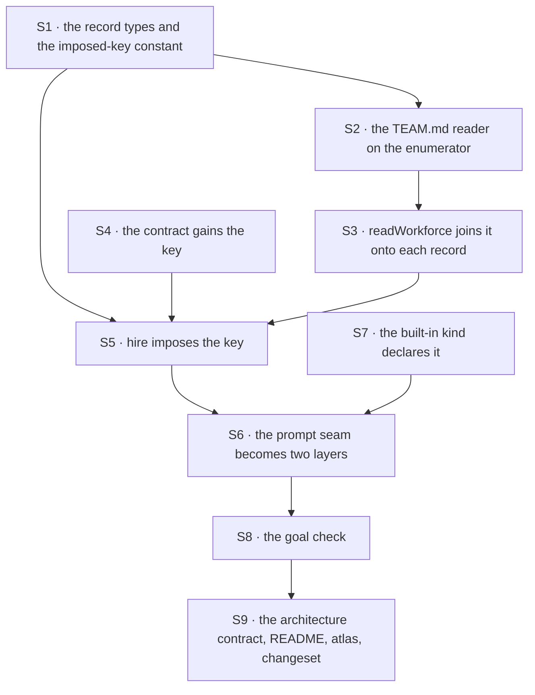

# FIX-1377 · Plan

[Spec](SPEC.md) · [Decisions](DECISIONS.md) · [Rules](BUSINESS-RULES.md) · **Plan**

Written for the implementing agent. IDs cross-reference [BUSINESS-RULES.md](BUSINESS-RULES.md)
(BR-n) and [DECISIONS.md](DECISIONS.md) (D-n). `tdd`. One PR.

## Before you start — two dependencies, both hard

| Wait for | Why |
|---|---|
| [FIX-1367](https://linear.app/fixpoint-labs/issue/FIX-1367) · `WorkerConfig` admission | S4 adds a key to the contract that issue creates. Without it the only way to impose the key is hire's probe-the-kind-and-stay-silent hack, which FIX-1367 exists to delete ([D1](DECISIONS.md#d1)) |
| [FIX-1389](https://linear.app/fixpoint-labs/issue/FIX-1389) · loader primitives extract | S2 consumes its team enumerator. Without it this is a fifth hand-rolled `teams/` loop and a regression of that issue's BR-16 ([D2](DECISIONS.md#d2)) |

Both are sequencing, not scope: nothing in the epic waits on this issue, so waiting is cheap.

**Step 0, before S1 — check each one against `main` and say out loud what you found.** A *small*
issue resting on **two** unbuilt ones is exactly the shape where a recorded fallback is forgotten
at the moment it is needed, so this is a step, not a footnote.

1. **FIX-1389 landed?** Look at the merged code, not the approved spec. If yes, consume the
   enumerator and say so in the PR body.
2. **FIX-1389 not landed?** Do not hand-roll a `teams/` loop and do not wait silently. Take the
   named fallback — read `TEAM.md` inside the shipped worker reader — and **record it as a
   re-decision**: a line in `DECISIONS.md → How it got here`, a note on the PR, and a reply on the
   epic PR, since a fourth reader in the tree is FIX-1389's BR-16's problem. Re-read D2's *Locks
   in* row first; that is the trade you are re-opening.
3. **FIX-1367 landed?** Same check, and there is **no** fallback — D1 forbids the probe. If it has
   not landed, stop and say so.

## Surfaces

| ID | Package · role | Change | Rules |
|---|---|---|---|
| S1 | `workforce` · `manifest.ts` | The team record type (id, description, instructions, the verbatim frontmatter); `WorkerManifest` gains the team's instructions, **filled by the join and absent on a hand-built record** — the same shape and the same doc-comment story as `skills`. The imposed-key constant — **exported, and referenced by all three doors** (`TEAM.md`, `WORKER.md`, hire) rather than re-spelled in any of them — declared beside `SEAT_SKILLS_KEY`, with one refusal wording worded like it: *the framework owns this key*, never *unknown setting*. You choose the spelling; nothing may hardcode it | BR-2 BR-8a BR-9 BR-15 BR-16 |
| S2 | `workforce` · loader · the `TEAM.md` reader | A new small reader on FIX-1389's team enumerator. Its whole leaf job: classify the file, read it, parse the dialect's frontmatter, refuse the derived and second-door keys, **and the imposed key itself via S1's constant** (BR-8a — the key this feature claims, refused in the file that looks most like the natural place to write it). **One pass over the teams, producing team id → instructions as a map.** No `teams/` loop of its own, no ignore list of its own, no root open of its own | BR-1 BR-3 to BR-10 (incl. BR-8a) |
| S3 | `workforce` · loader · `readWorkforce` | Join: call S2 **once**, surface the team records on the result, and attach each team's instructions to that team's worker records **by looking them up in S2's map**. The orchestration mirrors the skills join — `readWorkforce` joins, readers walk — but **not its I/O shape**: a seat's skills are read per seat because they are per seat, and a team's instructions are not. Do not add a third walk, and do not add a read per worker | BR-2 BR-12 BR-13 |
| S4 | `workforce` · the `WorkerConfig` contract (FIX-1367's) | One more imposed key, optional, string. Documented as imposed-never-authored, like `seatSkills` | BR-11 BR-12 BR-14 BR-20 |
| S5 | `workforce` · `hire.ts` | Impose the key from the record when the record carries one, and **not at all** when it does not (BR-12 — absent, not empty). Refuse an authored one by name, beside the existing `seatSkills` refusal | BR-11 BR-12 BR-15 BR-16 BR-8a |
| S6 | `workforce` · `agent-worker-flow.ts` · the prompt seam | The slot becomes the array the seam's own comment anticipates: the team layer, then the seat's own. **Rewrite that comment** — it currently says the seam should be re-decided rather than widened, and this is that re-decision. Keep the surviving fact: the framework default is still FIX-1344's and still unbuilt | BR-17 BR-18 BR-19 |
| S7 | `workforce` · `settingsSchema` of the built-in kind | Declare the new key so the built-in kind admits it. Every other key keeps its spelling | BR-17 BR-19 |
| S8 | Goals · a new goal check under `goals/workforce-conventions/` | The acceptance criteria, on the real HTTP route, model-free, non-agent kind, two teams | BR-11 BR-13 |
| S9 | Docs · the architecture contract, README, atlas page, changeset | Below. **`docs/architecture/workforce-default-worker-kind.md` is the one that must not be missed** | BR-17 |

**Nothing is removed.** That is unusual here and worth stating: this is an additive optional
file. If you find yourself deleting a refusal or relaxing a check to make room for it, stop —
that is the weakened-refusal failure the seat factory's comments already name.

## Sequence



## Checks

| ID | Runs after | Passes when |
|---|---|---|
| V1 | — | **The red state, written first.** Plant `teams/<id>/TEAM.md` in a fixture tree and assert it appears in neither `workers` nor `errors` on today's code — then that the same tree produces a team record after S2/S3. This is the premise the issue rests on and it is the one check that can catch a reader that was silently already looking (BR-1, BR-10) |
| V2 | S2 | Every reading rule: absent, well-formed, no description, empty body, symlink, unreadable, a directory, each refused key, an unknown key carried, a planted `org/TEAM.md` invisible. One case each (BR-1, BR-3 to BR-10, BR-8a's own arm in V4) |
| V3 | S3 | Two teams, one with a file and one without: the first team's records carry the layer, the second's carry nothing, and neither carries the other's (BR-2, BR-12, BR-13) |
| V4 | S2 S5 | **Three doors, one constant.** The imposed key planted in a `TEAM.md`, in a `WORKER.md`, and in a hand-built record: each refused, in the same wording (BR-8a, BR-16). The `TEAM.md` arm is the red state that matters — write it against a file with an **empty body**, where a pass-through produces no layer and says nothing. Then rename the constant and confirm **all three** refusals move with it; a case that still passes is one holding a literal (BR-8a). Plus a hand-built record hiring cleanly with no layer (BR-15) |
| V5 | S6 S7 | The seam, asserted directly: both layers **in order**, the team layer alone for a bodyless seat, and today's exact prompt for a seat whose team has no file (BR-17, BR-18, BR-19). **Assert order, and claim only order** — the prompt path is plain concatenation with no precedence mechanism, so a passing check here says nothing about which line a model follows (BR-17's note). **BR-19 is the regression guard** — run the existing built-in-kind suite unchanged |
| V6 | S5 | A kind that composes the contract and never reads the key mints and runs unchanged (BR-20) |
| V7 | S8 | The goal check, real HTTP route, model-free, graded from a **nested** block and after the stores are closed and the host rebuilt — matching its siblings under `goals/workforce-seats/`. Its control: the same run with the join removed must show the layer absent for every seat |
| V8 | S2 S3 | Executed, not read: no second `teams/` loop, no second ignore list, no second root open entered the package (FIX-1389's BR-16, which this must not regress) |
| V9 | S3 | **The N+1 guard, counted.** One team, one `TEAM.md`, N workers under it: exactly **one** read of that path for the whole `readWorkforce` call, whatever N is. Count the reads — asserting the records came out right passes with a read per worker, which is the failure this check exists for |

**The evidence base.** One counted fact — nothing reads a `TEAM.md` today — asserted before
publishing by a repo-wide search of `packages/`, with `WORKER.md` and `CHANNEL.md` as controls that
the search reaches the readers. V1 proves the same thing at runtime, which is the version that
counts.

**The second path (BP-035):** the absent file (BR-1) is the common case and gets a case, not an
afterthought; the null boundary is *absent versus empty* and appears twice (BR-4 body, BR-12 bag);
the legacy path is a hand-built record that never met the loader (BR-15); and the off-state of the
whole feature is BR-19, a tree with no `TEAM.md` anywhere behaving byte for byte as today.

## Pinned names · one

| Where | Name | Why pinned |
|---|---|---|
| The file | `TEAM.md` | The architect's locked file contract, and an author types it |

Everything else is yours: the reader's name, the record type's name, the imposed key's spelling
(**follow `seatSkills`' precedent** — a framework-imposed key spelled apart from any
author-written neighbour), and the shape of the join. The enumerator's name is FIX-1389's
implementer's and must not be pinned from here.

## Guardrails

| Rule | Because |
|---|---|
| Absent means **no layer** — never an empty string, never a placeholder | The architect's lock, and the seat factory already learned this the hard way: an empty body handed over as a setting turned every thin seat into a failed hire. The same trap, one level up |
| `TEAM.md` never declares a seat and never reaches `hireWorkforce` as a roster entry | The epic's fence (ER-5, and the architect's "not a second door"). A second seat list is the one failure this whole epic refuses |
| The reader owns no walk of its own | D2, and FIX-1389's BR-16. A fifth `teams/` loop undoes the issue that made this one cheap |
| **Never read or parse `TEAM.md` from the worker loop** — build the map once, look up per worker | A team's instructions are per *team*; a seat's skills are per *seat*, which is why the skills join reads inside that loop and this one must not. Copying its shape buys a file read per seat for a value identical every time, and a test that only checks the records came out right passes anyway (V9 counts instead) |
| **No key this feature owns ever falls through as metadata** | The epic's recurring failure is silent acceptance — `org/channels/` declarable and unread, the worker `resources/` root read by nothing and reported by nothing. A `teamInstructions:` carried as arbitrary frontmatter is the same bug in the file that *looks* like the right place to write it |
| **The architecture contract changes in this PR, not later** (Docs, below) | A doc left promising the old compose order after the code moved is the incoherence tenet 5 names, and it is the half of a change reviewers cannot see in a diff of `src/` |
| One wording per condition, reused from the shared primitives | Three suites already assert on that text, and a fourth spelling of "refused for safety" is drift nobody reviews |
| No `org/` scope, no `ORG.md`, not even a locked-open door | ER-13's failure mode — a declared door that reports nothing teaches a rule we are about to contradict. The issue names `ORG.md` out |
| The seat's layer is composed **last** — and that is a position, not a precedence rule | The architect's lock. Prompt assembly is plain concatenation with no override path, so do not write a check, a doc line or a PR sentence claiming the seat's text *wins*: that is the model's behaviour, not the framework's (BR-17) |

## Docs

- **EXTEND `docs/architecture/workforce-default-worker-kind.md` — do this one first.** It is the
  authoritative contract for this kind (authority level 2, above best practices) and it states the
  compose order as **two** elements in two places: the mermaid node `prompt: [default,
  instructions]` (~line 49) and the prose *"Instructions compose as `prompt: [default,
  instructions]`"* (~lines 66–67). Both become three. Its settings-bag section (~line 193)
  describes how `seatSkills` is imposed and handed over by hire; the team layer is the second
  instance of that pattern and belongs beside it. A framework implementer reading the unchanged
  document would build to a prompt contract the code no longer honours. *Internal reference, not
  site content — the voice rules do not apply.*
- **EXTEND** `packages/workforce/README.md` — under *Reading a workforce from files*, the
  optional team file: what it declares, that it is optional, and the two settings a hired seat
  receives. Terse, in the list-of-exports register the surrounding sections use. *Voice risk:* it
  is a reference entry, not a tutorial.
- **EXTEND** `apps/docs/docs/workforce/workers-on-disk.md` — `TEAM.md` in *The tree*, a short
  section after *What a WORKER.md says*, and a line in *What is passed over in silence*, which
  currently implies everything beside `workers/` is unread. **Plus the scoping paragraph the Open
  question is about** — instructions are per-seat configuration, documents are installed on a kind
  — cross-linked to `documents-on-disk.md`'s *"a namespace, not a visibility boundary"* section, so
  the two rules are read together. *Voice risk:* "scope" and "visibility" are jargon; say who can
  read what, in those words.
- **No new page.** One optional file inside a tree that already has a page; a page per file
  fragments the sidebar. ER-18's placement (Workforce, behind the reader) is satisfied — the reader
  ships in this change.
- **Coordinate with [FIX-1358](https://linear.app/fixpoint-labs/issue/FIX-1358)** (Spec Approved),
  which owns the atlas tree teach. Whichever lands second folds `TEAM.md` into the other's tree
  rather than drawing a second one.
- **One `minor` changeset.** The pre-1.0 test is whether a consumer can trip over it: a kind that
  composed the contract gains a key it did not declare, and the loader's result type grows a
  field. Name both.

## Sketch · pseudocode, illustrative, react to the shape

```
readTeams(root, report):                       # S2 — the leaf, and nothing else
    for each team in <the enumerator from FIX-1389>:
        f = classify(team/TEAM.md)
        absent      -> nothing, silently                    (BR-1)
        symlink     -> report the shared refusal            (BR-5)
        unreadable  -> report the shared wording            (BR-6)
        directory   -> report folder-where-file-belongs     (BR-7)
        file        -> parse the dialect:
                         description missing  -> report     (BR-3)
                         a derived / second-door key -> report  (BR-8)
                         <the imposed key, via S1's constant> -> report,
                           SAME wording as WORKER.md's and hire's.
                           never fall through, never a literal      (BR-8a)
                         else -> a team record; body.trim() empty means NO instructions  (BR-4)

readWorkforce(root):                           # S3 — a join, not a walk
    workers = <today>                          # unchanged
    teams   = readTeams(root, …)               # ONCE. a map, keyed by team id
    for each worker: look its team up in that map and attach     (BR-2, BR-13)
                     # a read inside this loop is the N+1 the guardrail forbids

hire(record):                                  # S5
    if record carries team instructions -> put them in the bag under the imposed key
    # and NOT otherwise. absent, never ""                   (BR-12)

# S6 — the seam the code already marked
prompt: [ teamInstructions(config), instructions(config) ]     # framework default still unbuilt
```

## POC · none

No premise here needs building to check. The one fact the spec leans on was settled with a grep
and two controls (above), the composition question against FIX-1389 was settled by reading that
spec's own boundary, and the seam is three lines of a file already in the repo.

## At implement time

- Read FIX-1367's and FIX-1389's **merged** implementations, not their specs. S2 and S4 attach to
  what shipped, and both left names to their implementers.
- If FIX-1344's framework default landed meanwhile, the seam is a three-element array, order still
  framework → team → seat. Nothing else changes.
- Check the epic PR for the Open question's answer before writing the docs section. The teaching
  depends on it; the code does not.

## Follow-ups

- **A roster consumer for the team description.** Nothing reads it
  ([FIX-1310](https://linear.app/fixpoint-labs/issue/FIX-1310) is out of this epic). Not a gap
  this issue closes; named so the next reader does not read it as an oversight.
- **`ORG.md` / org-wide instruction inheritance.** Named out by the issue. If it is ever built,
  the seam gets re-decided rather than widened a second time — the comment in
  `agent-worker-flow.ts` should keep saying so after S6.

## Notes from review

Recorded verbatim for the implementer to weigh against real code. None of these changed the
design; the round's folds are in the surfaces, checks and guardrails above.

**Round 1 · Cursor (approved), on D2's cost:**

> Short-term cost: **two** team-folder enumerations per `readWorkforce` (directory walk +
> enumerator) and a **hard** dependency on FIX-1389.

> Accept ~2× team enumeration at boot until FIX-1389 composes readers on one enumerator pass.

**Round 1 · Cursor, on document shape:**

> Absent-vs-empty, compose order, and ER-14 open question appear in several places. Fine for
> review gates; implementers would benefit from one canonical invariant block and shorter
> cross-links (same pattern as optional notes on recent epic specs).

**Round 1 · Cursor, a hygiene idea for implementation time:**

> **Shared `parseDescriptionRequiredMd` across worker/channel/resource/team** — nice hygiene
> during implementation; out of spec scope.

**Round 1 · Cursor, addressed to epic scheduling rather than to this plan:**

> For FIX-1389, the spec's honest fallback (widen worker reader) is materially cheaper if
> scheduling slips — flagging for epic owners: "wait on 1389" vs "ship with recorded
> re-decision" is a calendar trade, not a technical unknown.
