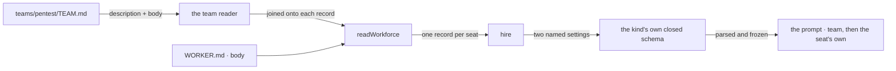

# FIX-1377 · A team says once what all its seats are told

**Spec** · [Decisions](DECISIONS.md) · [Rules](BUSINESS-RULES.md) · [Plan](PLAN.md)

Feature · `workforce` · small · 1 PR · epic [FIX-1351](https://github.com/fixpoint-labs/flow-state-dev/pull/1718)

## Four people, before and after

| Someone who… | Today | After |
|---|---|---|
| **runs five seats under one house rule** | Pastes the same paragraph into five worker files, and edits five files when it changes. One that drifts is invisible | Writes it once in the team's `TEAM.md`. Every seat on that team is told it, and no seat's own file repeats it |
| **opens a team folder and asks what this team is** | The folder name, and nothing else. A team is the one thing in the tree that cannot describe itself | The team carries its own one-line description, loaded with the roster |
| **reads a seat's prompt and asks where a line came from** | Nothing to ask — there is one layer, because there was nowhere to put shared text but the seat's own body | The team's text and the seat's own reach the seat as two named settings. The seat's comes last, so it wins an ordinary conflict |
| **has no `TEAM.md`** | Today's behaviour | Today's behaviour, byte for byte. The file is optional, and its absence adds no layer and no empty placeholder |

**Why now.** The tree already teaches that a level is a scope — `teams/<id>/skills/` and
`teams/<id>/resources/` are things a whole team has. Instructions are the most obvious thing a
team shares and the one thing with no team-level place to put them, so authors duplicate them per
seat. And the seam that would carry a second layer is already there: the built-in kind's prompt
slot is marked in the code as an insertion point waiting for exactly this.

## What changes


Read the right column's stacks. The team layer is one source reaching two seats, and it sits
**above** each seat's own lines rather than inside them — which is the whole difference between
this and pasting the paragraph twice. The dashed slot is the framework default that
[FIX-1344](https://linear.app/fixpoint-labs/issue/FIX-1344)'s second half owns and has not
shipped; this issue does not build it and does not wait for it.

**The file an author adds:**

```diff
  workforce/
    teams/pentest/
+     TEAM.md
      workers/recon/WORKER.md
      workers/scout/WORKER.md
```

```md
---
description: Red-team operations for the customer pentest lab.
---
Stay inside the engagement's scope. Never touch a host the brief does not name.
```

**And what each seat's own file stops carrying:**

```diff
  ---
  description: Recon sweeps.
  ---
- Stay inside the engagement's scope. Never touch a host the brief does not name.
  Sweep the named hosts and report what is open.
```

## How it reaches the seat



Hire hands the team's text over as its own setting, the way it already hands a seat its skills.
The kind's schema is what admits it, so a kind that has not composed the contract refuses at the
mint rather than silently dropping the layer ([D1](DECISIONS.md#d1)).

## What stays as it is

- **`WORKER.md`.** Same keys, same body, same refusals. `TEAM.md` declares no seat, and hire
  still keys the roster off `workers/*/WORKER.md` alone.
- **The team folder's slots.** `skills/`, `resources/`, `channels/`, `tools/` are untouched.
  `TEAM.md` is a file at the team folder, not a fifth slot.
- **`org/`.** No `ORG.md`, no org-level instruction layer, no org-wide inheritance. Named out by
  the issue and not reopened here.
- **The built-in `agent` kind's own settings.** `instructions`, `model`, `tools` and `skills`
  keep their spelling and their meaning.
- **The framework default prompt.** Still unshipped, still FIX-1344's. The seam gains room for
  it; this issue does not fill it.

## Sign off

1. **[D1](DECISIONS.md#d1) · The team's text arrives as its own named setting beside the worker's,
   on the `WorkerConfig` contract — not merged into `instructions`.** If wrong: every hireable
   kind admits a key most of them ignore, and this issue cannot start until
   [FIX-1367](https://linear.app/fixpoint-labs/issue/FIX-1367) ships the contract that holds it.
2. **[D2](DECISIONS.md#d2) · `TEAM.md` gets its own small reader on
   [FIX-1389](https://linear.app/fixpoint-labs/issue/FIX-1389)'s team enumerator; the shipped
   worker reader is not widened.** If wrong: a one-file convention waits on a refactor it could
   have skipped, and the loader grows a third reader instead of a wider second.
3. **Open · [the team folder will tell two stories about who can see what](DECISIONS.md#open).**
   Team instructions really do reach only that team's seats. Team *documents* do not — the
   shipped docs teach that a team folder is a namespace, not a visibility boundary. Both are
   true, for different reasons, and after this change they sit in one folder. Flagged up to the
   epic ([ER-14](https://github.com/fixpoint-labs/flow-state-dev/pull/1718)) rather than decided
   here, because it touches [FIX-1368](https://linear.app/fixpoint-labs/issue/FIX-1368)'s own
   live fork.

Number 3 is the one to weigh; 1 and 2 are sequencing with a consequence each. What lost and why:
[DECISIONS.md](DECISIONS.md). The cases: [BUSINESS-RULES.md](BUSINESS-RULES.md). The build:
[PLAN.md](PLAN.md).
