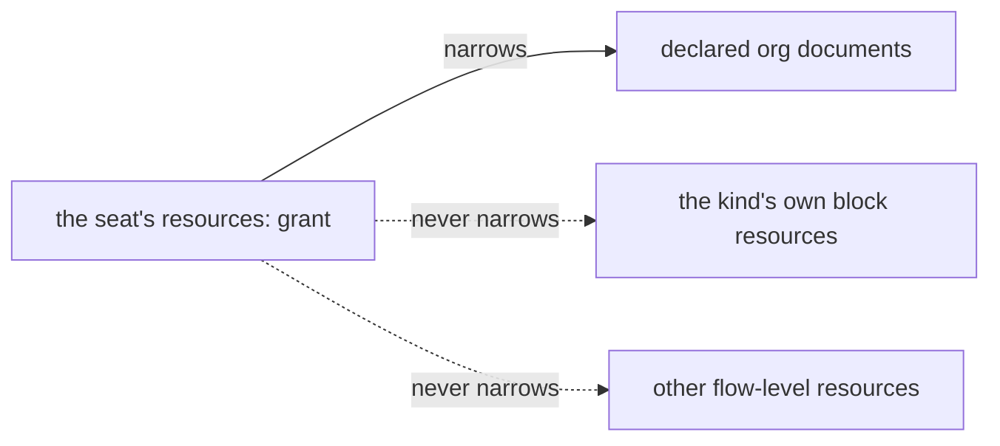

# FIX-1381 · Business rules

[Spec](SPEC.md) · [Decisions](DECISIONS.md) · **Rules** · [Plan](PLAN.md)

The cases, written as rules. Each says what a person or the system does and what happens.
The *proved by* column is the check the plan runs. A human reviews this page; the plan
turns it into work.

## Declaring a grant

| # | When | Then | Proved by |
|---|---|---|---|
| BR-1 | A seat names a document and no mode | It reaches that document, read-only. Reads succeed; a state write and a content write both refuse | CI |
| BR-2 | A seat names a document with `rw` | It reaches that document and may write it, exactly as it can today | CI |
| BR-3 | A seat declares `resources:` at all | It reaches the documents it named **and no other declared document** | CI |
| BR-4 | A seat declares no `resources:` key | Unchanged: every declared document, writable, as today (D1) | CI, against the pre-change behaviour |
| BR-5 | A seat declares `resources: []` — present and empty | It reaches **no** declared documents. Present-and-empty is a real answer, not an absent key | CI |
| BR-6 | A seat names a mode that is neither `ro` nor `rw` | The hire refuses, naming the seat, the ref and the two valid modes | CI |

BR-5 is the row that earns its place. Everywhere else in this package, present-and-empty
means *read and found nothing* and absent means *nobody asked* — `seatSkills` and
`seatTools` both work that way. A seat that writes `resources: []` is locking itself out on
purpose, and reading that as "declared nothing, so give it everything" would make the one
unambiguous way to say *no access* mean its opposite.

## What the allowlist does not govern

| # | When | Then | Proved by |
|---|---|---|---|
| BR-7 | A seat's kind declares its own resources on its blocks — a board, an inbox, a store | Those stay reachable and writable whatever the seat's `resources:` says. They are the kind's machinery, not org documents. **True only because BR-8 refuses a name collision** — the merge itself would let a colliding grant win | CI · the negative control, for names that do not collide |
| BR-15 | The app declared non-document resources at flow level, beside its documents | Those stay reachable and writable too. The grant narrows the documents inside the app's flow-level map and leaves the rest of it standing | CI · the P5 pair |
| BR-8 | A granted ref collides with a name the kind's blocks declare | The hire refuses, naming the seat, the ref and the kind. Flow-level declarations win this merge, so honouring the grant would replace the kind's machinery with a document — a seat file editing the kind's wiring | CI |

The solid edge is what a seat's `resources:` governs; the dashed ones are what it never
touches. So "this seat reaches one document" means one *document*, not one resource — a
seat locked down to nothing still reaches everything its own kind and its app wired into
it.

BR-8 is stated the way it is because the substrate points the other way from the intuition:
a flow-level declaration **overrides** a block's for the same accessor name
(`defineFlow.ts` → `mergeFlowResourceMap`, "flow-level declarations always win"). The grant
is passed as the seat's flow-level map, so a colliding grant would win — silently. Refusing
the collision is the only reading under which BR-7 stays true, and it keeps a
seat file able to *select* access without ever *repointing* what the kind wired (BP-031).

## Getting it wrong

| # | When | Then | Proved by |
|---|---|---|---|
| BR-9 | A seat names a ref no document matches | The hire refuses, naming the seat and the unmatched ref. Every bad ref in the roster is named in one message | CI |
| BR-10 | A seat names the same ref twice | The hire refuses. Two grants for one document have no precedence rule, the way two skills of one name have none | CI |
| BR-11 | A seat names the same ref twice with different modes | The hire refuses, for BR-10's reason, and the message names both modes so the author can see the conflict | CI |
| BR-12 | A block reaches for a document the seat was not granted | The framework's existing "not registered" refusal. Not a new error code, and not a silent `undefined` | CI |
| BR-13 | A block writes a document granted `ro` | Refused at the write seam, as a read-only resource. The failure names the resource | CI |
| BR-14 | The model calls its built-in write tool on a document granted `ro` | Refused, by uri, as a resource that is not writable for the model. `ro` holds against the model as well as against code — **at the call, not by withholding the tool**: that tool is one generic tool over every resource, so a kind that wires it offers it regardless | CI |
| BR-16 | A seat grants `rw` to a document whose own frontmatter declares it unwritable | The hire refuses, naming the seat, the ref, and the document's own declaration. A grant *selects* from what the app declared; it never widens past it | CI |
| BR-18 | A seat declares `resources:` but the hire step was given no catalog of the app's documents | The hire refuses, naming the seat and what is missing. Every grant would otherwise resolve to nothing, which is a lockout that looks like a typo | CI |

> Rule numbers are append-only while this spec is in review — BR-15 to BR-18 arrived in
> round 1 and are placed beside the rules they belong with rather than renumbering the set
> under reviewers who have already cited it.

## Failure taxonomy

Every problem with a *declaration* is fatal at boot: a bad ref, a bad mode, a duplicate, a
collision with the kind's own names, an `rw` the document itself forbids, a grant with no
catalog to resolve against.
That matches the rest of the hire step, which refuses the whole roster rather than hiring
some of it, and it is the right severity because a grant that silently does nothing is a
security hole that looks like a feature. Every problem at *runtime* is an ordinary refusal
on an existing path — unregistered resource, or read-only resource. Nothing retries, and
nothing degrades to wider access: a grant that cannot be honoured refuses rather than
falling back.

## Acceptance criteria this issue owns

Two seats of one kind, in one org, hired from files: one granted a document read-only, one
granted a different document read-write. The first reads its document, cannot write it, and
cannot see the second's. The second writes its own and cannot see the first's. A third seat
that names nothing sees both and writes both. That is the goal check the plan runs.
