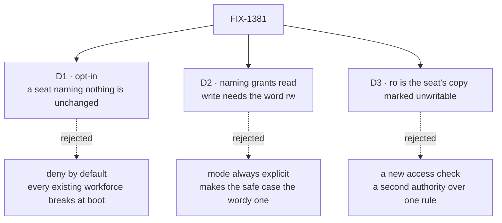

# FIX-1381 · Decisions

[Spec](SPEC.md) · **Decisions** · [Rules](BUSINESS-RULES.md) · [Plan](PLAN.md)

What was considered, what was chosen, and what each choice locks in. Three decisions are
the sign-off surface; everything else here is context for them.

D-11 ([FIX-1380](https://linear.app/fixpoint-labs/issue/FIX-1380), Done) already settled two
things these cards do **not** reopen: a thin seat allowlist of refs plus `ro`/`rw` **is** the
access surface, and org access is read-only automatically with write granted by permission.

## The tree

Solid edges are what you're signing. Dashed edges lost, and the label says why.

## D1 · The allowlist is opt-in — a seat that declares no `resources:` keeps the reach it has today

| | |
|---|---|
| **Instead of** | Deny by default: a seat reaches only what it names, from the day this ships |
| **Because** | Deny-by-default is the right end state and the wrong first move. Every workforce running today has seats that name nothing and read documents they need, so flipping the default turns a security improvement into a boot-time outage for existing apps. Opt-in delivers the whole capability — an org can lock any seat down completely, today — without breaking anyone |
| **Locks in** | *Being able to* control access is not *access being controlled*. Until an org edits its seat files it is exactly as exposed as now, and we cannot tell a customer their documents are segregated. Flipping the default later is a breaking change for anyone who never adopted it, and it gets more expensive the longer we wait |

**What would change my mind:** evidence that few enough workforces are running that a
breaking flip is affordable now. Then deny-by-default ships here instead, and the migration
is one `resources:` line per seat rather than a second decision later.

## D2 · Naming a document grants read; write takes the extra word `rw`

| | |
|---|---|
| **Instead of** | Requiring a mode on every entry — always `ref: ro` or `ref: rw` |
| **Because** | This writes D-11 Ask 3 into the syntax: read is automatic, write is a permission. The common grant is then the shortest thing to type and the safest thing to get wrong, and every write grant is visible at a glance because they are the only entries with a word after them |
| **Locks in** | A bare ref means read-only, forever. If a bare ref ever meant read-write, every seat file already written would silently widen. Adding a third mode later means deciding what a bare ref means against it |

## D3 · `ro` is the seat's own copy of the document, marked unwritable — not a new access check

| | |
|---|---|
| **Instead of** | A gate consulted on each access, or a wrapper that refuses writes |
| **Because** | The framework already refuses writes to a document marked unwritable, at the one place writes commit, for state and content alike — and refuses the model's write tool separately. A second check beside that is a second authority over one rule, and two authorities fail the way that only bites in production: the door nobody wired. Reusing the flag means `ro` holds everywhere writes already converge, including paths this ticket never touches |
| **Locks in** | `ro` means exactly what that flag means. Where the flag does not reach, `ro` does not reach. The plan's guardrail makes that convergence explicit rather than assumed, because the day someone adds a second write path is the day `ro` quietly stops holding |

## Decided, not asked

- **The grant is applied at the mint**, below every worker kind. No kind declares or reads
  anything, and a custom kind gets the allowlist for free.
- **A ref matching no document refuses the hire**, every bad ref named in one message.
- **`ro` closes the model's write tool too.** A mode holding against the implementer but not
  the model is backwards on a ticket about what a seat may do.
- **No new readable allowlist object.** The seat's own narrowed map already records which
  refs are its and what each permits; that is what FIX-1382 reads.

## Considered and dropped

| Alternative | Why not |
|---|---|
| A fifth seat-contract key (`seatResources`, beside `seatSkills` / `seatTools`) | The contract is what every kind must admit, so every kind would declare a key most never read. Enforcement sits below the kind, so nothing needs it in the bag — and the ticket puts resource access outside `WorkerConfig` on purpose |
| A setting on the built-in `agent` kind, the way `capabilities:` works | Ties access control to one kind; a custom kind would get none. Wrong thing to make optional |
| A second registry of grants beside `flow.resources` | Killed on the ticket, and rightly: two tables describing one document is how they disagree |
| Folding access into the skills bag | Killed on the ticket. A skill is what a seat knows how to do; access is what it may touch |
| Per-document configurability now (expressed on the document) | The owner ties this to resource templates, which do not exist yet. Declaring from the seat needs nothing new |

## Settled

A characterization test on this branch (`spec-poc/FIX-1381-seat-resource-allowlist/`) ran
four premises on the real path. **All four CONFIRMED**, so nothing in the approach changed —
which is the result worth recording, not a silent pass.

- **A seat can be minted with its own narrowed map, and two seats of one kind can differ.**
  The excluded document is absent from the registry lookup *and* from direct property access.
- **An unwritable grant reads but refuses writes** — state and content both; the same
  document granted writable still writes.
- **A resource the kind's own blocks declare escapes the narrowing and stays writable.** A
  fence rather than a win: it is why [BR-7](BUSINESS-RULES.md) is stated out loud.
- **The grant is readable off the hired seat** — the seat's flow-level resource keys are
  exactly the granted refs, excluding the kind's machinery. That is FIX-1382's seam.

Every assertion was watched fail before it was trusted: the mode flags were un-flipped and
the mint was made to ignore the grant. A green check nobody has seen go red is not evidence
(tenet 7).

## How it got here

- **Draft** — framed as *which documents may this seat touch*, not *where documents are
  declared*; the grant resolved at the mint and enforced through the framework's existing
  unwritable-document path, so the ticket adds an authoring surface and no new gate. Scoped
  opt-in after the four premises above were pinned.

**Open: none.**
