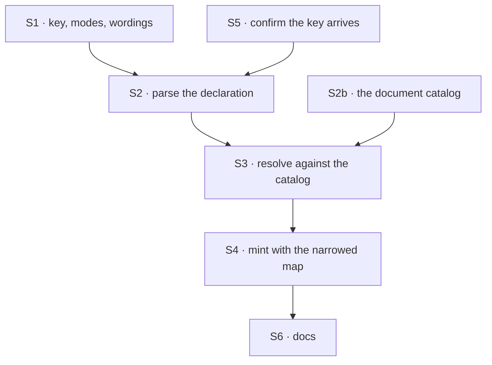

# FIX-1381 · Plan

[Spec](SPEC.md) · [Decisions](DECISIONS.md) · [Rules](BUSINESS-RULES.md) · **Plan**

Written for the implementing agent. IDs cross-reference [BUSINESS-RULES.md](BUSINESS-RULES.md)
(BR-n) and [DECISIONS.md](DECISIONS.md) (D-n). `tdd`. One PR.

## Surfaces

| ID | Package · role | Change | Rules |
|---|---|---|---|
| S1 | `workforce` · record shapes and refusal wordings | The grant key, its two modes, and the wordings for a bad mode, an unmatched ref and a duplicate — in one place. Every door reads these, never a literal | BR-6 BR-9 BR-10 BR-11 |
| S2 | `workforce` · parse a seat's declaration | `resources:` → ref → mode. Absent and present-empty are **different answers** and stay so all the way down | BR-1 BR-2 BR-4 BR-5 BR-6 |
| S2b | `workforce` · **the document catalog** | The hire step is **told** which flow-level resources are documents: the app hands over the same `resourcesFromDocs(...)` map it already spreads into its own flow-level map. Nothing infers a document from its shape, and nothing reads provenance off the seat file (D4, BP-031) | BR-15 BR-18 |
| S3 | `workforce` · resolve the grant | Match each ref against the catalog; refuse what does not match, what the kind's blocks already name, and an `rw` the document itself forbids. Build this seat's map as **the kind's flow-level entries that are not documents, plus the granted documents** — `ro` entries unwritable **and** closed to the model's write tool (D3). Collected, not thrown per seat | BR-1 BR-3 BR-9 BR-13 BR-14 BR-15 BR-16 |
| S4 | `workforce` · the hire step | Pass that map as the seat's own flow-level resource map at the mint. A seat with no declaration passes nothing and mints as today (D1) | BR-3 BR-4 BR-7 BR-8 BR-12 |
| S5 | `workforce` · the loader's seat reader | Likely nothing — `resources:` looks like an ordinary frontmatter key today. **Confirm no door refuses or strips it** before building on that | BR-4 |
| S6 | Docs | `packages/workforce/README.md` EXTEND · one `apps/docs` page EXTEND · one `minor` changeset | — |

**Nothing is removed** — this adds an authoring surface and reuses an existing refusal. If
you find an older access path to delete, the spec missed something: surface it.

## Sequence



## Checks

| ID | Runs after | Passes when |
|---|---|---|
| V1 | S2 | A bare ref parses read-only, `rw` parses read-write (BR-1, BR-2); a bad mode refuses naming both valid ones (BR-6); **absent and present-empty parse differently** (BR-4, BR-5) |
| V2 | S3 | An unmatched ref refuses naming seat and ref (BR-9); duplicates refuse (BR-10, BR-11); **every bad grant in one roster is named in one message**, not just the first |
| V3 | S4 | A granted seat reaches what it named and nothing else (BR-3) — by `get()` **and** by direct property access. The flat registry spreads its handles, so covering only `get()` proves half of it |
| V4 | S4 | A `ro` grant reads and refuses both a state write and a content write (BR-1, BR-13); the model's write tool is closed (BR-14); the same document granted `rw` still writes (BR-2) |
| V5 | S4 | **The second path (BP-035): a seat declaring nothing** reaches and writes every declared document, identical to pre-change behaviour (BR-4, D1). This is what fails if the default gets flipped by accident, and the check most likely to be skipped |
| V6 | S4 | The kind's own block resources stay reachable and writable on the narrowest seat (BR-7). **Re-derived in round 1:** the old wording asserted a collision "resolves as today" — it asserted nothing about precedence and would have passed while the rule read backwards. Assert the refusal (BR-8), and assert it by *constructing* the collision rather than trusting none exists |
| V7 | S4 | **A flow-level resource that is not a document survives a narrowing grant** (BR-15) — and a documents-only map drops it. Run both; the second is what makes the first mean anything. This is the round-1 finding, and the check that fails if the resolver reverts to a plain replace |
| V8 | S3 | An `rw` grant on a document whose frontmatter declares it unwritable refuses at hire (BR-16); a seat declaring `resources:` with no catalog supplied refuses, naming what is missing (BR-18) |
| VG | S4 | Goal, real path: the acceptance criteria in [BUSINESS-RULES.md](BUSINESS-RULES.md) — three seats of one kind in one org, hired from files, each reaching exactly what its file says |

The POC pins the substrate; these check the feature. It substitutes for none of them.

## Pinned names · the only three

| Where | Name | Why pinned |
|---|---|---|
| The seat file's key | `resources` | Public. A person types it, and it matches the `resources/` folder documents come from |
| Write mode | `rw` | Public. D2 makes it the word that grants write |
| Read mode | `ro` | Public. Accepted explicitly though a bare ref means the same, for authors who prefer symmetry |

An entry has **three** shapes, not four: a bare ref, `ref: ro` (the same thing, spelled
out), and `ref: rw`. Explicit `ro` is sugar and carries no separate meaning.

Everything else is yours — internal functions, the parsed shape, how wordings are composed.

## Guardrails

| Rule | Because |
|---|---|
| A seat declaring no `resources:` mints with **no** map passed — not an empty one, not a reconstructed full one (D1, BP-030) | Passing a map *replaces* the kind's own. Reconstructing "everything" diverges the moment the kind's map changes; passing empty silently locks out every existing seat. Invisible in a test that only checks granted seats, which is why V5 exists |
| Absent and present-empty stay distinct end to end (BR-4, BR-5) | They mean opposite things: *nobody restricted this seat* and *this seat is restricted to nothing*. Collapsing them turns the one way to say "no access" into "full access" |
| `ro` closes the code write seam **and** the model's write tool (D3) | Two independent doors on one document. Closing one leaves a mode that holds against the implementer and not the model — backwards for this feature |
| Every place a grant becomes access goes through the one resolver (tenet 5) | This is a permission boundary. A second construction site is a second place `ro` can be forgotten, and that surfaces as "it worked in testing" |
| Refusals read the key and modes from S1's constants, never literals | A renamed key with a literal left behind leaves a door open with nothing said — here, an access grant that silently does not apply |
| The narrowed map derives from the app's declared documents; a seat file supplies only a ref (BP-031) | A seat file is author-controllable input. It may *select* from what the app declared; it must never *define* a document or repoint its storage |
| The narrowed map is built by **subtraction from the kind's flow-level map**, never assembled from the granted documents alone (BR-15, V7) | `options.resources` REPLACES. A map built from grants alone silently deletes every non-document flow-level resource the app declared — no refusal, no warning, and invisible to any test whose fixture declares nothing but documents. That was exactly the POC's fixture, which is how this got past four premises |
| A grant never widens what the document declared (BR-16) | A document may declare itself unwritable in its own frontmatter — `writable` is not in `DERIVED_RESOURCE_KEYS`. If `rw` could override that, a seat file would be overruling the document's own author |

## Docs

- **EXTEND** `packages/workforce/README.md`, under the seat-file keys: the `resources:` key,
  bare ref versus `rw`, and that declaring nothing changes nothing. *Voice risk:* never
  "secure by default" — it is not, by D1, and a README is how that gets misremembered.
- **EXTEND** the `apps/docs` page listing what a `WORKER.md` may declare, beside `tools:` and
  `skills:`. Confirm its real path at implement time. *Voice risk:* no ticket ids.
- **No new page.** One key on a file whose keys are already documented.
- **One `minor` changeset** — a new public authoring key on a published package (BP-022).

## Sketch · pseudocode, illustrative, react to the shape

```
at the hire step, per seat record:
    declaration ← the seat's `resources:` key
    if ABSENT:
        mint as today, passing no resource map          ← D1, and the whole of V5
    otherwise:
        grants ← parse into ref → mode                  (bare ref means read-only)
        for each grant:
            if no declared document matches:  collect a refusal
        narrowed ← the kind's flow-level entries NOT in the catalog
                    (the app's boards, stores, whatever else it declared)
                  + { for each granted ref:
                        the app's own definition — and if read-only, that same
                        definition marked unwritable and closed to the model's
                        write tool }
        mint with `resources: narrowed`                 ← replaces the kind's flow-level map,
                                                          which is why the first half exists
refusals collect across the roster and throw once
```

**POC:** `spec-poc/FIX-1381-seat-resource-allowlist/`, ten cases, run with
`pnpm exec vitest run --config spec-poc/FIX-1381-seat-resource-allowlist/vitest.config.ts`.
Five premises pinned; the evidentiary story is in [DECISIONS.md](DECISIONS.md) → *Settled*
rather than repeated here. P5 was added in round 1 and is the one that changed the plan.

## At implement time

- **Re-confirm S5 first.** That `resources:` reaches the record untouched is a read of the
  loader, not a run. If a door refuses or strips it, that is a missing surface, not a detail.
- **Confirm how the hire step gets the catalog (S2b).** The app calls `resourcesFromDocs`
  and spreads the result into its own flow-level map; the hire step never sees it today
  (`HireOptions` carries `kinds`, `seatBlocks`, `channelBoards` and nothing else). Passing
  it is a new public option on a published package — name it deliberately, and check
  whether the loader already holds the documents somewhere that makes the option
  unnecessary.
- **[FIX-1368](https://linear.app/fixpoint-labs/issue/FIX-1368)** (worker-level definitions)
  may have landed. Its refs should be just more refs; if they need a special case, say so.
- **[FIX-1382](https://linear.app/fixpoint-labs/issue/FIX-1382) is the consumer** — it reads
  the grant, it does not re-declare one. **Hand it the seam as pinned in
  [DECISIONS.md](DECISIONS.md), not the seat's whole flow-level key set:** that set carries
  the app's boards and stores too (BR-15), and mounting those is the concrete way this goes
  wrong downstream. If this makes that ticket awkward, raise it there.
- **[FIX-1454](https://linear.app/fixpoint-labs/issue/FIX-1454) is a different issue** —
  whether a resource can be *scoped* to one seat. This adds no scope; drifting toward one
  means you have left the spec.

## Notes from review · round 1

Recorded for the implementer, not folded into the design. Nothing here changes the
approach; the findings that did are already in the surfaces and checks above.

- **Prefer one slim `goals/` check over a new `labs/*` tree** at implement time — the
  `pentest-lab` or `workforce-seats` spine already exists, and V1–V8 own the rule matrix.
  A new tree would be a second place the same behaviour is demonstrated. *(Cursor,
  explicitly non-blocking.)*
- **Reviewer read of the direction**, recorded because a "no concerns" is evidence too:
  the scope was read as the thin version of the problem rather than an over-built one, and
  four alternatives were ruled out by name. Weigh it as one opinion — the same review
  signed off on BR-7 while the row beneath it stated the substrate's precedence backwards,
  which is the whole reason V6 is re-derived above.

## Follow-ups

- **Flipping the default to deny-by-default** is D1's other half and is not filed. File it
  once this has adoption; the migration is one `resources:` line per seat.
- `writable` (code) and `llmWritable` (the model's tool) express one intent through two
  doors and must be set together. Out of scope; worth `improve-codebase-architecture` if a
  third door appears.
