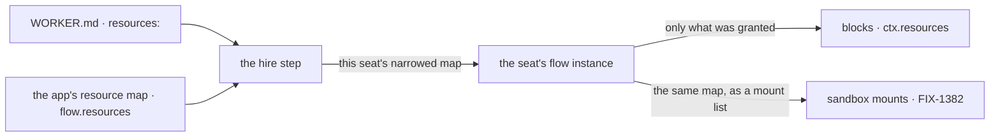

# FIX-1381 · Seat resource allowlist — thin seat/kind refs + `ro`/`rw`

**Spec** · [Decisions](DECISIONS.md) · [Rules](BUSINESS-RULES.md) · [Plan](PLAN.md)

Feature · `workforce` · small · 1 PR · epic [FIX-1407](https://linear.app/fixpoint-labs/issue/FIX-1407)

## Four people, before and after

| Someone who… | Today | After |
|---|---|---|
| **runs an org where one team's seat handles customer data and another's doesn't** | Every seat reaches every org document. A support seat can read the payroll doc, and write it | A seat reaches the documents its own file names, and nothing else |
| **wants a seat to consult a handbook without editing it** | No way to say that. Handing a seat a document hands it the pen too | Naming the document is the whole grant, and it is read-only. Writing takes a second word |
| **asks "what can this seat actually touch?"** | Read the app's resource map and assume every seat sees all of it | Read that seat's file. What it names is what it reaches |
| **already runs a workforce and changes nothing** | Today's behaviour | Today's behaviour, unchanged. A seat that names no documents keeps the reach it has |

The gap is real today and nothing guards it. `resourcesFromDocs` installs every document
in an org at flow level, so it lands in every seat's map; the seat contract admits
instructions, team instructions, skills and tools, and has no key for resource access;
and no allowlist, access gate, or per-seat filter exists anywhere in `workforce` or
`orchestration`. The only gate we have is `tools:`, which controls **which blocks a seat
may run**, not **which documents those blocks can read**.

## What changes


Left is today: two seats, six lines, every document reachable and writable by both. Right
is after: each seat reaches only what it named. Payroll has no line at all — not because
it is hidden, but because no seat asked for it.

**What a seat's author writes**, in that seat's `WORKER.md`:

```diff
  ---
  description: Engineering lead
  tools: [search, file_write]
+ resources:
+   - teams/engineering/handbook      # naming it grants read
+   - teams/engineering/notes: rw     # writing takes the extra word
  ---
```

A seat that writes no `resources:` key is untouched — same documents, same access, byte
for byte ([D1](DECISIONS.md#d1)).

## How the grant reaches the seat



The grant is applied where a seat is minted, so it sits **below** every worker kind: the
built-in one and anybody's custom one get it without declaring anything. Nothing new is
stored, and the seat's own map is what the sandbox ticket later reads to decide mounts.

## What stays as it is

- **Where documents are defined.** They stay on `flow.resources` and the `resources/` file
  convention ([FIX-1354](https://linear.app/fixpoint-labs/issue/FIX-1354)). This is access,
  not a second place to declare a document.
- **Document scope.** Every document stays org-scoped. This adds no seat scope — that is
  [FIX-1454](https://linear.app/fixpoint-labs/issue/FIX-1454)'s question, and a different one.
- **The seat contract.** `instructions`, `teamInstructions`, `seatSkills`, `seatTools` —
  unchanged, and no fifth key. Resource access is not a `WorkerConfig` declaration.
- **The kind's own machinery.** A board, an inbox, a store the kind's blocks declare stays
  reachable and writable; the allowlist governs declared documents, not a seat's own wiring
  ([BR-7](BUSINESS-RULES.md)).
- **Sandboxes and bash.** No provider, no mounts, no filesystem projection here. That is
  [FIX-1382](https://linear.app/fixpoint-labs/issue/FIX-1382), and this ticket's job is to
  give it something to read.

## Sign off

1. **[D1](DECISIONS.md#d1) · The allowlist is opt-in: a seat that names no documents keeps
   today's full reach.** If wrong: an org that never adopts it is exactly as exposed as it is
   now, and the gap this ticket names stays open for them until someone edits every seat file.
2. **[D2](DECISIONS.md#d2) · Naming a document grants read; write needs the word `rw`.** If
   wrong: the safe default is also the silent one, and an author who wanted write gets a
   refusal at runtime rather than at boot.
3. **[D3](DECISIONS.md#d3) · `ro` is enforced by marking the seat's copy of the document
   unwritable, not by a new access check.** If wrong: we inherit whatever that flag does and
   doesn't cover, and a door it misses is a door the allowlist misses.

**Open: none.** Number 1 is the one to weigh — it is the difference between *we can now
control seat access* and *seat access is now controlled*. The reasoning and what each
rejected is in [DECISIONS.md](DECISIONS.md); the cases are in
[BUSINESS-RULES.md](BUSINESS-RULES.md).
