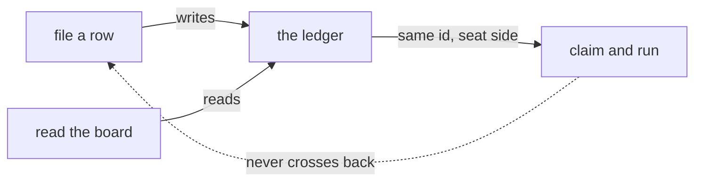

# FIX-1385 · Business rules

[Spec](SPEC.md) · [Decisions](DECISIONS.md) · **Rules** · [Plan](PLAN.md)

The cases as rules: what someone does, what happens, and which check proves it. A human reviews this page; the plan turns it into work.

## Declaring a board

| # | When | Then | Proved by |
|---|---|---|---|
| BR-1 | A `CHANNEL.md` declares `boards: [work]` | The channel holds one ledger, minted `<channelId>.work`, at `org` scope. The transcript is untouched | CI |
| BR-2 | A `CHANNEL.md` declares no `boards:` | It holds none, and opens, reads and posts exactly as today | CI, against a recorded roster |
| BR-3 | `boards:` is not a list of plain names — an object, a number, a nested id | The whole roster is refused, naming the channel and the rule. Nothing registers partially | CI |
| BR-4 | A board name repeats inside one channel, or would mint an id another channel already minted | Refused at bind, naming both. An id is a storage key, and a duplicate is two teams' work in one ledger | CI |
| BR-5 | A board name is unusable as a collection id — empty, a path separator, a pattern token, a prototype member | Refused at bind, with the rule, rather than at first write | CI |
| BR-6 | A `CHANNEL.md` declares a board *and* a custom `flow:` kind | **Refused at bind, by name**, saying that boards are built-in-kind only and which channel broke it. `ChannelKind` is `{ kind } & (() => FlowInstance)` — zero-arg — and handing board ids through it is a permanent public widen for no consumer that exists. A silent no-op would be worse than both | CI · asserted on the refusal text |
| BR-23 | A channel's folder is renamed or moved | Its boards re-key with it, and rows filed under the old id are unreachable. Nothing migrates and nothing refuses — a board id is a storage key derived from a path ([D1](DECISIONS.md#d1)). BR-16's warning is what makes it visible, because the seat still names the old id | Documented · and the warning asserted on a renamed fixture |
| BR-18 | `boards:` is added to a channel whose session is **already open** | The next bind reconciles it: the declared projection on the live session is rewritten from the file, and the board becomes usable without deleting the channel | CI · a recorded open session, re-bound |
| BR-19 | A reconcile runs on a channel with a transcript | The transcript survives untouched. Only the declared keys are rewritten — a reconcile is not a re-open, and `stateFor` builds `transcript: []` | CI · **the negative control that matters most on this issue** |

## Filing and reading

| # | When | Then | Proved by |
|---|---|---|---|
| BR-7 | A member files a row naming a board the channel declared | The row lands there `pending`, carrying the caller's `assignee` if it gave one | CI · goal check |
| BR-8 | A caller names a board the channel did not declare | Refused by name, listing what this channel holds. No ledger is created | CI |
| BR-9 | A caller names a board another channel declared | Unreachable rather than refused: the ledger resolves from the session's own identity, so the name can only address this channel's. Caller-controllable input selects no storage (BP-031) | CI · asserted on the resolved id, not on the refusal |
| BR-10 | A row is filed carrying an `author` the channel does not list | Refused with the channel's own `author-not-a-member` reason and wording — the same roster check a post meets, in the same words. **It is a validity check against the roster, not authentication**, and the module says so at `channel-flow.ts:162`. `author` is optional and stored `authorVerified: false`, so a caller that omits it is not checked, on this path or the post path | CI · asserted on the refusal **and** on the omitted-author case going through |
| BR-20 | A model files a row through `taskTools` | It lands. `addTask` carries no author at all, so no roster check runs. **Filing is not members-only and this issue does not make it so** — see [Not closing here](DECISIONS.md#not-closing-here) for why no identity on this path can currently deliver that | CI · asserted, so the gap is pinned rather than discovered |
| BR-11 | A model calls `addTask` through `taskTools` pointed at a channel board | The same row, on the same ledger, as the channel action would have written. Both paths resolve one `TaskCollectionRef` | CI · asserted by writing through one door and reading through the other |
| BR-12 | Anyone reads the channel | The declared board names come back beside members and the transcript. The rows do not — reading a board is a board read | CI |
| BR-21 | A channel board is resolved twice — once by the channel, once by a seat | Both resolutions pass **one** `defineTaskCollection` value, minted once and memoised by its id. So a freeze a seat's board sets is read by the channel's own writes, instead of each side holding a private policy over shared rows | CI · a seat board that hands off, then a channel-side `setAssignee` declining |

## What does not move

| # | When | Then | Proved by |
|---|---|---|---|
| BR-13 | A channel session opened before this shipped is read | It is still a bound channel and still accepts posts. An absent board list reads as none, never as unparseable state (BP-030). The board list is the one declared key that may be defaulted — `members` and `instructions` are required on purpose, because their absence is what `channel-not-bound` tests | CI · a recorded pre-upgrade session, and the negative control below |
| BR-14 | This issue names a Layer 2 concept on any new surface — a key, an action, an error, a doc heading | It uses the settled name and never the superseded one: *Channel* not *room*, *Role* not *Worker*, *Strategy* not *Pattern*, *Instructions* not *prompt template*, *stream visibility* not `agentType` | CI · a check over the diff, not a reading |
| BR-15 | A seat declares a board id no channel minted | Nothing here refuses it. A seat's board is the seat's, and this issue adds no registry of legal board ids | Existing suite |
| BR-16 | A channel declares a board and no flow in the app declares its minted id | A **warning** at hire, naming the channel and the id. Never a refusal: a seat may legitimately live in another process, and a channel may hold a board before its seat exists. The rows still sit `pending` — the warning only stops that being silent | CI · asserted on a roster with one attended and one unattended board |
| BR-17 | A seat is to reach a channel board with a model | It reaches it through the **kind-installed `taskTools` capability** — the same eight tools over the same resolver — and not by naming them in its own `tools:`. They are capability *controls*, minted per resolver and unnameable, so a `tools:` list can neither grant nor withhold them. A seat composing the capability holds all eight, `assignTask` and `updateTask` included | CI · asserted on a seat declaring `tools: []` that still holds the board |
| BR-22 | A channel-board tool is colocated in a seat's own `blocks/` folder | Refused by name at hire: it declares an org-scoped resource, and `seatBlockProblems` refuses that. The model's door is the kind's capability or it does not exist | CI · asserted on the refusal message |

Left of the line is everything a channel does with a board, the ledger included. One arrow crosses, and what it carries is a ledger id rather than a call. The mermaid below is the same paths by name.

## Failure taxonomy

Everything about a **declaration** is fatal at boot and collected: a bad `boards:`, or a board on a custom kind, refuses the whole roster and names every bad channel, because a roster that boots short is a team missing a board with nothing said. Everything about a **call** is a per-request refusal leaving the ledger untouched — an undeclared name, a roster-invalid author — reported with the channel's existing refusal shape, so a caller branches on a reason rather than on message text. One case is neither: an **unattended board** (BR-16) warns and boots, because the evidence for it is incomplete by construction. Nothing retries.

## Acceptance criteria this issue owns

A team declared entirely in files — seats, a channel, and one `boards:` line — has work filed onto that channel's board by one seat and run to completion by another, which claimed it rather than being handed it. That is the goal check the plan runs last: it exercises the surface the epic's exit gate stands on, end to end, for a **single row** — the queue proof of ER-20, a coordinator assigning across several seats with more rows than seats so one waits, is FIX-1430's.
