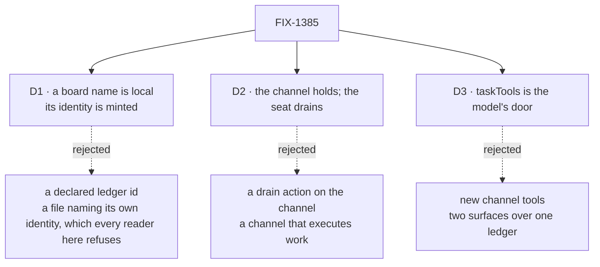

# FIX-1385 · Decisions

[Spec](SPEC.md) · **Decisions** · [Rules](BUSINESS-RULES.md) · [Plan](PLAN.md)

What was chosen and what each choice locks in. Three decisions are the sign-off surface; the rest is context. The calls this issue may not take — a board is a channel-attached `TaskCollection`, `assignee` is not a seat, no new Layer 1 type — are the epic's, cited rather than re-argued.

## The tree

Solid edges are what you're signing. Dashed edges lost, and the label says why.

## D1 · A `boards:` entry is a plain local name; the ledger's identity is minted from the channel

| | |
|---|---|
| **Instead of** | Letting the file declare the ledger outright — `boards: [{ id: eng-feature-work, scope: org }]` |
| **Because** | Every reader in this dialect refuses a declared identity by name: a channel may not write `id:`, a document may not write `ref:` or `scope:`. Where the file sits decides those. A `boards:` entry carrying an id would be the one place a hand-written file chose its own storage key, and the convention would stop meaning one thing. `members:` is the precedent — plain names, read and not displayed |
| **Locks in** | A board belongs to one channel forever and cannot be shared. Renaming or moving a channel folder re-keys its boards and orphans live rows — the cost `boardId` already carries, now paid by an author editing a folder name. A board's payload shape stays in code, because a name cannot carry one |

The rejected shape reads fine on the first file and badly on the tenth, when one key has two sources of truth. Minting also buys [BR-9](BUSINESS-RULES.md) for free: the ledger resolves from the session's own identity, so no caller-controlled input can reach another channel's rows.

## D2 · The channel holds the board and never drains it

| | |
|---|---|
| **Instead of** | A `drain` action on the channel kind, so a channel could run its own board |
| **Because** | Workers do, channels hold (the epic's D3). A channel that drains is an assignable channel acting as an executor, which the epic invent-killed. It is also what keeps this issue small: claiming, the lease, the start gate and the hand-off all stay on the seat side where they already work. `defineFlow` refuses a flow declaring a task *entry* with no board reachable; it asks nothing of a flow declaring only a collection, so holding costs the channel no machinery |
| **Locks in** | Filing work always takes two parties. A channel can hold a board no seat is pointed at, and those rows sit with nothing reported — no drain means nothing is watching. That silence is the price of the fence, and FIX-1405's inventory is what will make an unattended board visible, rather than a guard added here |

## D3 · A model reaches a channel board through `taskTools`, not through new channel tools

| | |
|---|---|
| **Instead of** | A second, channel-flavoured set of model-facing tools over the same rows |
| **Because** | `createTaskToolsCapability` already takes an injectable board resolver, so pointing the eight existing tools at a channel's ledger is the whole integration. The landed `tools:` fence also closes the alternative: a block in a seat's own folder that declares a resource, or needs org context, is **refused by name at hire time** — and a channel board is an org-scoped resource collection. So the model's door cannot be a seat-colocated tool. It is the kind's, or it does not exist |
| **Locks in** | Whatever `taskTools` refuses, a channel board refuses — including the claim-ticket ownership check, which is coordinator-shaped rather than conversational. Widening the channel's door later means widening `taskTools` for every consumer, a far larger blast radius than a channel-local tool would have had. And a seat reaches these tools only by naming them in its own `tools:`: registration makes a name resolvable, declaration grants use, and this issue does not loosen that |

## Decided, not asked

- **Boards are `org`-scoped, derived, never declared.** File-declared documents already install at org scope, and a channel session is opened with an org for that reason.
- **The PR-5 propagation pass covers the vocabulary *this issue mints*, not a repo-wide rename.** The project's PD-4 says the pass waits for the vocabulary lock, and running it early costs the rename twice. So this issue checks its own new surface against the settled names and files what it finds elsewhere. [BR-14](BUSINESS-RULES.md) is the check.
- **`boards:` is optional**, and an absent key is not an empty list behaving differently. The list rides in session state **defaulted to `[]`**: boundness is one parse of the whole state, so a required field would read every already-open channel as unbound and refuse every post on it (BP-030).
- **The channel-kind contract gains the board ids its records declared**, so a custom kind carries them as the built-in does. Otherwise `flow:` and `boards:` are silently incompatible.
- **Membership stays the channel's own, and filing reuses the post path's fence.** ER-3's "the live layer answers membership" is a contrast with the *declared* layer, not an instruction to relocate the fence onto an org resource — ruled on the epic, [#1905](https://github.com/fixpoint-labs/flow-state-dev/pull/1905#issuecomment-5738908078). The code agrees: the post path reads `members` off the channel's own session state, in the session the post lands in, so it is already live and authoritative at post time. Filing adds no second lookup and no second copy of who is in a channel.
- **The PR plan is a four-node DAG**, two nodes independent. Shape: [PLAN.md](PLAN.md).

## Considered and dropped

| Alternative | Why not |
|---|---|
| **One shared ledger for every channel**, rows keyed by channel | No roster coupling, and fatal: a seat's board drains a collection, and with no per-board filter one seat picks up every other channel's rows |
| **A `boards/` folder in the tree** | Invent-killed as teaching (FIX-1421). The loader walks `workers/`, `skills/`, `resources/` and `channels/` and ignores the rest in silence, so such a folder looks declared and is read by nobody |
| **Leave it in app code, document the recipe** | The simplest option, and what the DevForce lab does today. It loses the two things only the convention layer reaches — an identity derived from the channel, and the membership fence — and leaves the epic's premise of a declared team half true |
| **A new Layer 1 board type** | Refused by the epic (ER-6). There is one claim system and this composes it |
| **A `boards:` entry listing its allowed assignees** | Conflates a board-worker routing key with the seat roster, which is how the two get read as one thing |

## How it got here

- **Draft** — framed as the one missing declaration rather than a new board system: a channel already holds members, a charter and a transcript, so it holds a ledger the same way. The seat keeps the drain, and the two meet on one ledger id.

**Open: none.**
