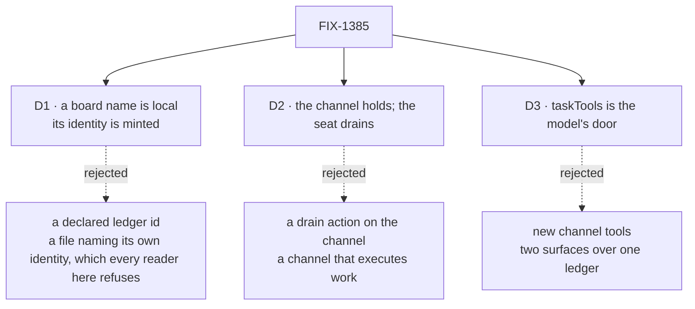

# FIX-1385 · Decisions

[Spec](SPEC.md) · **Decisions** · [Rules](BUSINESS-RULES.md) · [Plan](PLAN.md)

What was chosen and what each choice locks in. Three decisions are the sign-off surface; the rest is context. The calls this issue may not take — a board is a channel-attached `TaskCollection`, `assignee` is not a seat, no new Layer 1 type — are the epic's, cited rather than re-argued.

## The tree

Solid edges are what you're signing. Dashed edges lost, and the label says why.

## D1 · A `boards:` entry is a plain local name; the ledger's identity is minted from the channel

| | |
|---|---|
| **Instead of** | Letting the file declare the ledger outright — `boards: [{ id: eng-feature-work, scope: org }]` |
| **Because** | Every reader in this dialect refuses a declared identity by name: a channel may not write `id:`, a document may not write `ref:` or `scope:`. Where the file sits decides those. A `boards:` entry carrying an id would be the one place a hand-written file chose its own storage key, and the convention would stop meaning one thing. `members:` is the precedent — plain names, read and not displayed |
| **Locks in** | A board belongs to one channel forever and cannot be shared. Renaming or moving a channel folder re-keys its boards and orphans live rows — the cost `boardId` already carries, now paid by an author editing a folder name. A board's payload shape stays in code, because a name cannot carry one |

The rejected shape reads fine on the first file and badly on the tenth, when one key has two sources of truth. Minting also buys [BR-9](BUSINESS-RULES.md) for free: the ledger resolves from the session's own identity, so no caller-controlled input can reach another channel's rows. And because a minted id is unique across the roster by construction (BR-4), it is safe to key a process-wide declaration registry on — which is what [BR-21](BUSINESS-RULES.md) needs.

## D2 · The channel holds the board and never drains it

| | |
|---|---|
| **Instead of** | A `drain` action on the channel kind, so a channel could run its own board |
| **Because** | Workers do, channels hold (the epic's D3). A channel that drains is an assignable channel acting as an executor, which the epic invent-killed. It is also what keeps this issue small: claiming, the lease, the start gate and the hand-off all stay on the seat side where they already work. `defineFlow` refuses a flow declaring a task *entry* with no board reachable; it asks nothing of a flow declaring only a collection, so holding costs the channel no machinery |
| **Locks in** | Filing work always takes two parties, and a channel can hold a board no seat is pointed at. Review pushed back on that silence and it is now a **warning at hire** ([BR-16](BUSINESS-RULES.md)) rather than nothing: the roster can see every minted id and every flow's declared resources, so it can say "nobody declared this". It stays a warning, never a refusal — a seat may live in another process, where the check is blind |

## D3 · A model reaches a channel board through `taskTools`, not through new channel tools

| | |
|---|---|
| **Instead of** | A second, channel-flavoured set of model-facing tools over the same rows |
| **Because** | `createTaskToolsCapability` already takes an injectable board resolver, so pointing the eight existing tools at a channel's ledger is the whole integration. The alternative is also closed from the other side: a block in a seat's own folder that declares a resource, or needs org context, is **refused by name at hire time** — and a channel board is an org-scoped resource collection ([BR-22](BUSINESS-RULES.md)). So the model's door cannot be a seat-colocated tool. It is the kind's, or it does not exist |
| **Locks in** | **All eight tools, or none.** `taskTools` contributes its handlers as capability *controls*, which the capability contract exempts from the seat's `tools:` fence and mints per resolver — so a `tools:` list can neither name them back in nor fence them out. A seat composing the channel-board capability therefore holds `assignTask` and `updateTask` alongside `addTask`, including the claim-ticket ownership check, which is coordinator-shaped rather than conversational. Narrowing that set means a different resolver or a different capability, not a shorter `tools:` line. And widening the channel's door later means widening `taskTools` for every consumer |

**Review corrected this card's reasoning, not its choice.** The first draft said a seat reaches these tools by naming them in its own `tools:` — "registration makes a name resolvable, declaration grants use". That is true of the app *catalog* and of colocated blocks. It is false of controls, which is what these are, and the module says so itself: they are minted per resolver, so a `tools:` list has no stable key to let them back in. The choice survives because its load-bearing premise is [BR-22](BUSINESS-RULES.md), which holds; only the fence half was wrong. The cost is the all-eight grant, now stated above instead of implied away.

Seat-level opt-in or opt-out of a capability's controls would be a named catalog surface or a capability-selection contract on shipped orchestration. **Not built here** to make the old wording true — that is epic territory under ER-15.

## Decided, not asked

- **Boards are `org`-scoped, derived, never declared.** File-declared documents already install at org scope, and a channel session is opened with an org for that reason.
- **The activation story is named, and it is reconcile-on-re-bind.** A bound session is left untouched today (`channel-binder.ts:572`), so editing a `CHANNEL.md` and re-binding changes nothing — already true of `members:` and the charter, and this issue is what makes it bite, because a stale board list *refuses calls* rather than merely reading stale. Three ways out were open: **recreate** (costs the transcript, which is the channel), a **loud refusal** telling the operator to delete and re-open (same cost, later), or **reconcile the declared projection** — rewrite the declared keys on the live session, leave the transcript alone ([BR-18](BUSINESS-RULES.md), [BR-19](BUSINESS-RULES.md)). Reconcile, because it is a projection rewrite rather than a data migration: state derived from a file is re-derived from that file. BP-030 asks that this be decided in the open rather than discovered.
- **One declaration object per minted id, memoised.** Two separate `defineTaskCollection` calls sharing an id share rows but not policy — `define-task-collection.ts` documents that under-reach itself, and the assignee freeze is a `WeakSet` on the declaration. So the channel and the seat must pass one value, or a seat's hand-off freeze never reaches the channel's writes ([BR-21](BUSINESS-RULES.md)). Process-local, which is all this layer can reach; the rest is Layer 1's, and the module says so.
- **Filing is not members-only, and the spec no longer says it is.** The roster check runs on an optional, explicitly unverified `author` — the module calls itself *"a validity check against the declared roster, NOT authentication"* — so omitting the label skips it, and `taskTools`' `addTask` carries no label at all ([BR-10](BUSINESS-RULES.md), [BR-20](BUSINESS-RULES.md)).
  **Fencing on the session `principal` instead was proposed in review and does not work.** It is trusted, and it is also *constant*: `channel-flow.ts` states in its header that a session is bound to one user, so `principal` is the same value on every line of a given channel and distinguishes no participant from another. Taken literally against a roster of seat names it would refuse every post. The finding is the reviewers' and it stands; only the remedy is refuted, and it is raised on the thread rather than folded.
  So **no identity on this path can express members-only filing today** — not the unverified label, not the constant principal. That is a missing per-caller identity on the channel session contract, which is above this issue. Parked below, named, and not half-built here.
- **The PR-5 propagation pass covers the vocabulary *this issue mints*, not a repo-wide rename.** The project's PD-4 says the pass waits for the vocabulary lock, and running it early costs the rename twice. [BR-14](BUSINESS-RULES.md) is the check.
- **`boards:` is optional**, and an absent key is not an empty list behaving differently. The list rides in session state **defaulted to `[]`**: boundness is one parse of the whole state, so a required field would read every already-open channel as unbound and refuse every post on it (BP-030).
- **Boards are built-in-kind only, and a custom `flow:` beside `boards:` is refused loudly** ([BR-6](BUSINESS-RULES.md)). The draft widened the kind contract to carry board ids. `ChannelKind` is zero-arg, so that is a permanent public widen bought for no consumer that exists today — and the failure it prevents is better served by a named refusal, which teaches. Review's cut, taken.
- **Membership stays the channel's own, and filing reuses the post path's check.** ER-3's "the live layer answers membership" is a contrast with the *declared* layer, not an instruction to relocate the check onto an org resource — ruled on the epic, [#1905](https://github.com/fixpoint-labs/flow-state-dev/pull/1905#issuecomment-5738908078). The code agrees: the post path reads `members` off the channel's own session state, in the session the post lands in. That ruling settled *where* membership lives and is untouched by the bullet above, which is about how much it proves.
- **The PR plan is a four-node DAG**, two nodes independent. Shape: [PLAN.md](PLAN.md).

## Considered and dropped

| Alternative | Why not |
|---|---|
| **One shared ledger for every channel**, rows keyed by channel | No roster coupling, and fatal: a seat's board drains a collection, and with no per-board filter one seat picks up every other channel's rows |
| **A `boards/` folder in the tree** | Invent-killed as teaching (FIX-1421). The loader walks `workers/`, `skills/`, `resources/` and `channels/` and ignores the rest in silence, so such a folder looks declared and is read by nobody |
| **Leave it in app code, document the recipe** | The simplest option, and what the DevForce lab does today. It loses the two things only the convention layer reaches — an identity derived from the channel, and the roster check — and leaves the epic's premise of a declared team half true |
| **A new Layer 1 board type** | Refused by the epic (ER-6). There is one claim system and this composes it |
| **A `boards:` entry listing its allowed assignees** | Conflates a board-worker routing key with the seat roster, which is how the two get read as one thing |
| **Refuse a roster whose declared board nobody drains** | Cannot be proved from one process. It warns instead (BR-16) |

## Not closing here

The epic's Open list is not empty for this child. This issue takes the **first cut of the claim path** — a row is filed, and a seat's existing drain picks it up — and that cut genuinely does not need the four walls FIX-1408 returned. It does not close them either. These stay on epic Open under ER-15, and a later PR on this branch that reaches one **escalates to [#1905](https://github.com/fixpoint-labs/flow-state-dev/pull/1905) rather than deciding it locally** (BP-002):

| Parked | What would reach it |
|---|---|
| Reuse-vs-create session policy | A filed row minting or reusing a linked session |
| Auto-scale and the busy copy | More than one seat drawing on one board under load |
| `hire`-or-`dispatch`-with-parent naming | Anything on this branch naming the parent of a dispatched run |
| The sub-agent-background-work-on-a-row surface | A row that carries its own background work rather than being claimed |
| A per-caller identity on the channel session contract | Any promise that filing or posting is members-only ([BR-20](BUSINESS-RULES.md)) |
| A named catalog surface, or capability selection on shipped orchestration | Any attempt to let a seat opt out of the board capability's eight controls ([BR-17](BUSINESS-RULES.md)) |

The boundary in one line: **this cut declares, files, reads and drains. It does not assign across the fence, mint a session, narrow a capability, or authenticate a filer.**

The seat-side `channelBoard(...)` helper is a file-convention teach of a shared logical board — soft-cite **FIX-1426**, and the double-declare claim-gate tax stays **interim on FIX-1408**, not reinvented here.

## How it got here

- **Draft** — framed as the one missing declaration rather than a new board system: a channel already holds members, a charter and a transcript, so it holds a ledger the same way. The seat keeps the drain, and the two meet on one ledger id.
- **Round 1** — four P1s, all verified against the code before folding, plus the review's own cuts. Two changed the design: the declared projection now reconciles on re-bind, and one declaration object is minted per id so the assignee freeze crosses. One changed a reason and a cost without changing a choice (D3). One changed a promise: filing is not members-only, and the spec says so now instead of implying otherwise. The kind contract stopped widening, and the bare *Open: none* became the table above. One proposed remedy was refuted by the code and returned to the thread rather than folded — the `principal` fence.

**Open here: none. Parked on the epic: five, above.**
