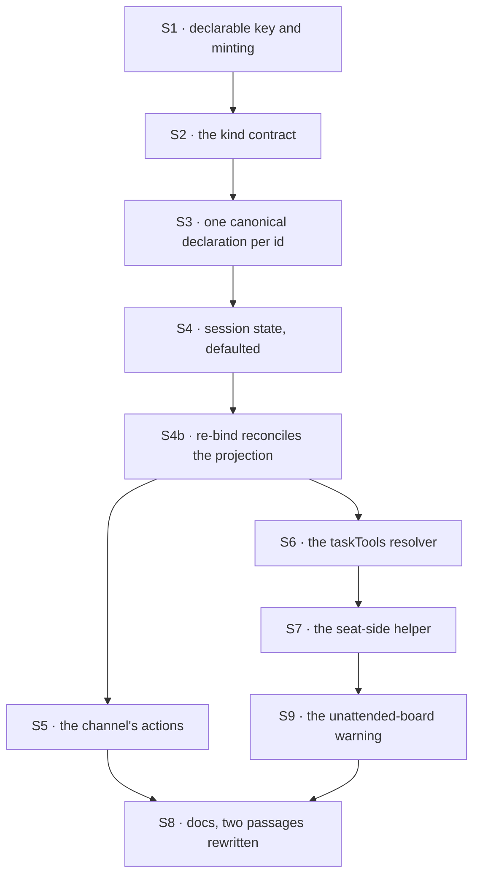

# FIX-1385 · Plan

[Spec](SPEC.md) · [Decisions](DECISIONS.md) · [Rules](BUSINESS-RULES.md) · **Plan**

For the implementing agent. IDs cross-reference [BUSINESS-RULES.md](BUSINESS-RULES.md) (BR-n) and [DECISIONS.md](DECISIONS.md) (D-n). `tdd`. Four PRs; the seam is the declaration — nothing starts until a channel can hold a ledger. Written against `d8e4c99`.

## Surfaces

| ID | Package · role | Change | Rules |
|---|---|---|---|
| S1 | `workforce` · the binder's validation pass | `boards` joins the closed key list: plain names, each minted `<channelId>.<name>`, each checked as a collection id, duplicates refused. In the pass that already walks the roster | BR-1 BR-3 BR-4 BR-5 |
| S2 | `workforce` · the built-in kind only | The built-in kind receives the board ids its records declared. **`ChannelKind` is not widened** — it is zero-arg, and a record pairing `boards:` with a custom `flow:` is refused by name at bind instead | BR-6 |
| S3 | `workforce` · the canonical declaration | **One `defineTaskCollection` per minted id, memoised by that id**, `org` scope, declared as a flow resource. Every resolution — the kind's and the seat helper's — hands back the same object, so a freeze set on one side is read by the other (D1 makes the id unique, which is what makes an id-keyed memo safe). **No board, no drain, no task entry** (D2) | BR-1 BR-2 BR-21 |
| S4 | `workforce` · channel session state | The declared-board list, **defaulted to `[]`**, written at open and projected by the read | BR-12 BR-13 |
| S4b | `workforce` · re-bind reconciliation | An already-open channel has its **declared projection** rewritten from the file — board list, members, charter — and **nothing else**. The transcript is not in the projection and must survive. Today the binder leaves a bound session exactly as it is (`channel-binder.ts:572`), which is why `boards:` added to a live channel does nothing | BR-18 BR-19 |
| S5 | `workforce` · two new channel actions | File a row; read the board. Ledger resolved from the session's identity plus the caller's local name; an undeclared name refuses; the post path's roster check reused **with its real semantics** — a validity check on an optional unverified label, which the action's own docs must say rather than imply (BR-10, BR-20) | BR-7 BR-8 BR-9 BR-10 BR-20 |
| S6 | `workforce` → `orchestration` · the model's door | A resolver pointing `createTaskToolsCapability` at a channel's ledger, on the **kind**. All eight arrive as *controls* — composing the capability is the grant, and a `tools:` list neither names nor fences them (BR-17). Nothing colocated in a seat's folder: a board is an org-scoped resource, refused there at hire (BR-22) | BR-11 BR-17 BR-20 BR-22 |
| S7 | `workforce` · the seat-side helper | The same canonical collection, from a channel id and a board name, so a seat declares one thing rather than a minted string. Resolves through S3's memo — a second declaration would share rows and not policy | BR-15 BR-21 |
| S9 | `workforce` · the unattended-board warning | At hire, each minted board id is looked for in the declared resources of the flows `hireWorkforce` already receives. Missing → a warning naming the channel and the id. **Never a refusal** — the check is blind to another process | BR-16 |
| S8 | Docs · three pages and one changeset | Including **two passages removed and rewritten**, not added to. Detail under [Docs](#docs) | BR-14 |

## Sequence



### PR plan

| id | deliverables | depends_on |
|---|---|---|
| PR-A | S1 S2 S3 S4 S4b — a channel can hold a ledger, and an existing one can be given it; nothing calls it yet | — |
| PR-B | S5 — the channel's own door | PR-A |
| PR-C | S6 S7 S9 — the model's door, what a seat declares, and the warning when nobody does | PR-A |
| PR-D | S8 — docs and the propagation check | PR-B, PR-C |

B and C are independent: one adds actions to the kind, the other a resolver, a helper and a hire-time pass, and neither reads the other's surface.

## Checks

| ID | After | Passes when |
|---|---|---|
| V1 | S1 | BR-3, BR-4, BR-5. A roster with several bad declarations refuses once, naming every one. **Negative control:** plant a channel minting an id another already minted, watch BR-4 go red, remove it |
| V2 | S4 | BR-13 on a **recorded pre-upgrade session**: still bound, still accepts a post. **Negative control:** drop the default, watch every post fail `channel-not-bound`, restore it. A green that has never gone red proves nothing |
| V7 | S4b | BR-18 and BR-19 on one recorded open session carrying a transcript: add `boards:`, re-bind, the board is usable **and the transcript is byte-identical**. **Negative control:** reconcile with `stateFor` wholesale instead of the projection, watch the transcript assertion go red. That is the mistake this surface is one line away from |
| V3 | S5 | BR-7, BR-8, BR-10. **BR-9 asserted on the resolved ledger id**, not on a refusal — a test reading the error message would pass against a guard you could delete. BR-10's second half is the one that must exist: a row filed with **no** `author` goes through, so nobody later reads the rule as a gate |
| V10 | S2 | BR-6: a record pairing `boards:` with a custom `flow:` refuses, and the message names the channel and the reason. **Negative control:** drop the check, watch the board silently not exist |
| V4 | S6 | BR-11, both directions: written through the channel action, read through `taskTools`, and the reverse. BR-17 on a seat declaring `tools: []` that **still holds all eight**. BR-20 on a `taskTools` row landing with no author. BR-22 on the colocated refusal |
| V8 | S3 S7 | BR-21: a seat board that hands off freezes the ledger, and a channel-side `setAssignee` on the same id then **declines**. **Negative control:** give the seat helper its own `defineTaskCollection` call, watch the decline turn into a silent success. That is the bug this surface exists for |
| V5 | S3 | BR-1, BR-2, BR-6. BR-2 byte for byte against a recorded roster naming no board |
| V9 | S9 | BR-16 on a roster with one attended and one unattended board: one warning, naming the unattended one, and the hire **succeeds** |
| VG | S7 | **Goal, real path:** a tree declaring two seats and one channel holding one board. One seat files a row, the other's board drains it, it completes, nothing dispatched by hand. Under `goals/` — one row over the surface the exit gate stands on. The multi-seat queue proof (ER-20) is FIX-1430's, and builds on this |
| V6 | S8 | BR-14: a check over this issue's diff for the superseded names, run rather than read |

## Pinned names · the only two

| Where | Name | Why pinned |
|---|---|---|
| Frontmatter | `boards` | Public. An author types it, and it joins a closed list |
| The ledger id | `<channelId>.<boardName>` | Public. A seat types it to reach the same rows; D1 locks it. Dot-joined: a channel id already is, and a collection id carries no path separator |

Everything else is yours, the seat-side helper included. One note on its shape, not blocking: `channelBoard("eng.feature", "work")` re-states an identity bind time already fixed, so a typo drifts silently into a second ledger. A `channelRef(...).board("work")` form, or generated constants, single-sources it. Worth ten minutes when you get there.

## Guardrails

| Rule | Because |
|---|---|
| The board list is defaulted, never required (BP-030) | Boundness is one parse of the whole session state, so a required field reads every already-open channel as *not a channel* and refuses every post on it |
| A reconcile writes the declared projection and never the whole state | `stateFor` builds `transcript: []`. Reusing it on a live channel is a one-line change that silently deletes the conversation |
| The ledger comes off session state, never the call (BP-031) | It picks storage, and the fan-out already reads the roster this way. **The roster check on `author` is not in this class** — it never decided authority, and BR-10 now says so |
| Do not fence membership on the session `principal` | It is trusted and *constant*: one channel is one session bound to one user, so the same value rides every line. Against a roster of seat names it refuses everyone; against nothing it proves nothing. Review proposed it; `channel-flow.ts`'s header refutes it |
| One declaration object per minted id, always through the memo | Two declarations of one id share rows and not policy. The seat's hand-off freeze is a `WeakSet` on the object, so a second call is a routing key that can be changed after hand-off |
| No drain, task entry or dispatcher reaches the channel kind | D2 is the fence, and reading the kind's declaration is cheaper than arguing three rounds later |
| The `tools:` fence is not widened | It lands on the app catalog and colocated blocks. Controls are exempt by the capability contract — so there is nothing here to widen, and anything that looks like widening it is the wrong fix |
| BR-4 and BR-5 run in S1 only | They are bind-time roster checks over a fixed list. Re-running them per file or per read puts a validation pass on a hot path for an answer that cannot have changed |

## Docs

- **EXTEND** the channels page — *Holding a board*, after *Declaring a channel*: the key, the minted id, who may file (and what that check does and does not prove), what a seat declares, and what happens when you add `boards:` to a channel that already exists. **Two passages are rewritten**: the "when a channel, and when something else" tip sends a claim away from the channel, and the declaring section says four keys are declarable and the list is closed. *Voice risk:* the obvious framing is "channels now do work". They do not — write *hold*, and say plainly that posting still hands nobody a claim.
- **EXTEND** the task-board page — one paragraph: a board can be attached to a channel instead of built in app code. Cross-link both ways.
- **EXTEND** the `workforce` README — the fifth key, the minted id, the seat-side helper, and that composing the board capability grants all eight tools.
- **No new page**; one would split channels across two. **One `minor` changeset** (BP-022): a published package gains a key a consumer writes.

## Sketch · pseudocode, illustrative, react to the shape

```
at the binder, in the pass that already walks the roster:
    for each channel record:
        boards <- the declared list          (absent -> none)
        refuse unless it is a list of plain names
        for each name:
            id <- "<this channel's id>.<name>"
            refuse an unusable id, or one already minted in this roster
            hand the id to the kind, and remember it for the session

at the kind:
    one task collection per id, FROM THE MEMO (id -> declaration), org scope,
    declared as a resource -- and nothing else: no board, no drain, no task entry

at bind, when the session is already open:
    rewrite ONLY the declared keys on the live state
    leave the transcript exactly where it is

at the file action:
    name   <- the caller's
    refuse unless the SESSION's own declared list carries it
    ledger <- resolve("<this session's id>.<name>")   <- never from the payload
    check the author against members, if one was given <- a typo check, not a gate
    add the row

the model's door: the same eight tools, resolver injected, installed on the kind
the seat's side:  the same memoised declaration; a board over it; drain it
at hire:          every minted id no flow declares -> warn, do not refuse
```

**Performance, once, in the request path:** mint the id and call `resolveResourceCollection` **once per request** and hand the result to all eight tools. Resolving per call re-walks the registry eight times for one answer that cannot change inside a request.

**POC: none.** D2's premise — may a flow declare a task collection with no board? — was read rather than run: `defineFlow` refuses a task *entry* no reachable board hands off to, and that check returns early when a flow declares no entries. The second premise, that two flows declaring one collection id share rows, is already pinned by the cross-flow hand-off test in `orchestration` — and round 1 sharpened it: they share rows and **not** the assignee freeze, which is what S3 exists for.

## At implement time

Both W3 inputs are **landed** at `d8e4c99`; read the code, not their specs.

- **Controls are not fenced.** `createTaskToolsCapability` contributes its eight handlers as `controlTools`, minted per resolver and unnameable — `packages/orchestration/src/skills/task-tools-capability.ts`, and the contract at `docs/architecture/capabilities.md` ("a block holds a control only because it composed the capability — that composition *is* the declaration"). Do not try to narrow them with a `tools:` list; it cannot work, and BR-17 is written to what does.
- **The colocated-block refusal is the one that still bites.** `seatBlockProblems` refuses a seat-folder block declaring a resource or needing org context — read it and its call site in `hire.ts` before wiring S6 or S7. This is what D3 rests on.
- **The freeze is process-local and set only for handed-off boards.** `taskBoard` freezes when the board declares dispatcher seats. S3 makes the policy reach across the fence inside one process; across processes it does not, and `define-task-collection.ts` parks that on the resource contract, not on us.
- **FIX-1405's declared roster may have landed since.** If so, read channel records through it. No decision here changes.
- **Which path is whose, so the two children do not collide.** S4b touches the **binder's** re-bind path. FIX-1405's inventory rows are written on the shared **ChannelFlow open** path, so every kind's channels appear there. Different surfaces: board *declaration* is built-in-kind-only with a refusal (BR-6); channel *inventory* is every kind's. If a diff here reaches the open path, say which of the two it means.
- **The DevForce lab declares one ledger twice on purpose** — FIX-1408's interim cross-flow claim-gate cost, labelled interim where it lives. Not how a board is declared, and not yours to remove.

## Follow-ups

- The lab's hand-rolled ledger could become a channel board once this lands. File it; editing the lab while it is the epic's evidence is a bad trade.
- **A trusted invoking-seat identity** would turn BR-10's typo check into a real fence. Parked on the epic — [Not closing here](DECISIONS.md#not-closing-here).
- **Declaration drift beyond this channel.** S4b fixes `members:` and the charter as a side effect of fixing `boards:`, because they share one projection. Whether other file-declared records have the same drift is worth one sweep, and is not this issue's.
