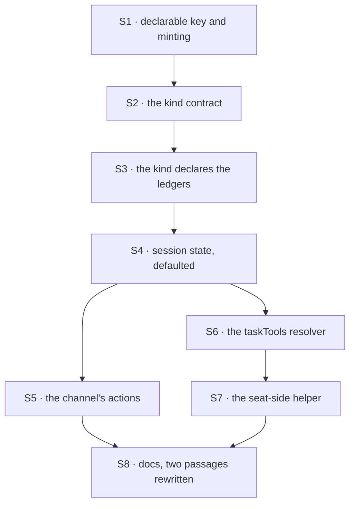

# FIX-1385 · Plan

[Spec](SPEC.md) · [Decisions](DECISIONS.md) · [Rules](BUSINESS-RULES.md) · **Plan**

For the implementing agent. IDs cross-reference [BUSINESS-RULES.md](BUSINESS-RULES.md) (BR-n) and [DECISIONS.md](DECISIONS.md) (D-n). `tdd`. Four PRs; the seam is the declaration — nothing starts until a channel can hold a ledger. Written against `d8e4c99`.

## Surfaces

| ID | Package · role | Change | Rules |
|---|---|---|---|
| S1 | `workforce` · the binder's validation pass | `boards` joins the closed key list: plain names, each minted `<channelId>.<name>`, each checked as a collection id, duplicates refused. In the pass that already walks the roster | BR-1 BR-3 BR-4 BR-5 |
| S2 | `workforce` · the channel-kind contract | A kind receives the board ids its records declared — the built-in and a `kinds` entry alike, so `flow:` and `boards:` compose | BR-6 |
| S3 | `workforce` · the kind's declaration | One `defineTaskCollection` per minted id, `org` scope, as a flow resource. **No board, no drain, no task entry** (D2) | BR-1 BR-2 |
| S4 | `workforce` · channel session state | The declared-board list, **defaulted to `[]`**, written at open and projected by the read | BR-12 BR-13 |
| S5 | `workforce` · two new channel actions | File a row; read the board. Ledger resolved from the session's identity plus the caller's local name; an undeclared name refuses; the post path's membership fence reused | BR-7 BR-8 BR-9 BR-10 |
| S6 | `workforce` → `orchestration` · the model's door | A resolver pointing `createTaskToolsCapability` at a channel's ledger, on the **kind**. No new tool, nothing colocated in a seat's folder — a board is an org-scoped resource, refused there at hire (D3) | BR-11 BR-17 |
| S7 | `workforce` · the seat-side helper | The same collection, from a channel id and a board name, so a seat declares one thing rather than a minted string. Not a block, so the `tools:` fence does not gate it | BR-15 |
| S8 | Docs · three pages and one changeset | Including **two passages removed and rewritten**, not added to. Detail under [Docs](#docs) | BR-14 |

## Sequence



### PR plan

| id | deliverables | depends_on |
|---|---|---|
| PR-A | S1 S2 S3 S4 — a channel can hold a ledger; nothing calls it yet | — |
| PR-B | S5 — the channel's own door | PR-A |
| PR-C | S6 S7 — the model's door, and what a seat declares | PR-A |
| PR-D | S8 — docs and the propagation check | PR-B, PR-C |

B and C are independent: one adds actions to the kind, the other a resolver and a helper, and neither reads the other's surface.

## Checks

| ID | After | Passes when |
|---|---|---|
| V1 | S1 | BR-3, BR-4, BR-5. A roster with several bad declarations refuses once, naming every one. **Negative control:** plant a channel minting an id another already minted, watch BR-4 go red, remove it |
| V2 | S4 | BR-13 on a **recorded pre-upgrade session**: still bound, still accepts a post. **Negative control:** drop the default, watch every post fail `channel-not-bound`, restore it. A green that has never gone red proves nothing |
| V3 | S5 | BR-7, BR-8, BR-10. **BR-9 asserted on the resolved ledger id**, not on a refusal — a test reading the error message would pass against a guard you could delete |
| V4 | S6 | BR-11, both directions: written through the channel action, read through `taskTools`, and the reverse. BR-17 on a seat that registers the tools and declares none |
| V5 | S3 | BR-1, BR-2, BR-6. BR-2 byte for byte against a recorded roster naming no board |
| VG | S7 | **Goal, real path:** a tree declaring two seats and one channel holding one board. One seat files a row, the other's board drains it, it completes, nothing dispatched by hand. Under `goals/` — the epic's exit gate on this surface |
| V6 | S8 | BR-14: a check over this issue's diff for the superseded names, run rather than read |

## Pinned names · the only two

| Where | Name | Why pinned |
|---|---|---|
| Frontmatter | `boards` | Public. An author types it, and it joins a closed list |
| The ledger id | `<channelId>.<boardName>` | Public. A seat types it to reach the same rows; D1 locks it. Dot-joined: a channel id already is, and a collection id carries no path separator |

Everything else is yours, the seat-side helper included.

## Guardrails

| Rule | Because |
|---|---|
| The board list is defaulted, never required (BP-030) | Boundness is one parse of the whole session state, so a required field reads every already-open channel as *not a channel* and refuses every post on it |
| Both the ledger and the membership check come off session state, never the call (BP-031) | Both are caller-controllable otherwise, and one of them picks storage. The fan-out already reads the roster this way |
| Both doors resolve one collection ref and write through one path (tenet 5) | Two write paths over one ledger drift on what they refuse, and that shows up as a model being allowed what a person is not |
| No drain, task entry or dispatcher reaches the channel kind | D2 is the fence, and reading the kind's declaration is cheaper than arguing three rounds later |
| The `tools:` fence is not widened | It landed stricter than its own spec read, and a board tool is exactly the shape that tempts a loosening |

## Docs

- **EXTEND** the channels page — *Holding a board*, after *Declaring a channel*: the key, the minted id, who may file, what a seat declares. **Two passages are rewritten**: the "when a channel, and when something else" tip sends a claim away from the channel, and the declaring section says four keys are declarable and the list is closed. *Voice risk:* the obvious framing is "channels now do work". They do not — write *hold*, and say plainly that posting still hands nobody a claim.
- **EXTEND** the task-board page — one paragraph: a board can be attached to a channel instead of built in app code. Cross-link both ways.
- **EXTEND** the `workforce` README — the fifth key, the minted id, the seat-side helper, and the `tools:` line a seat needs to reach a board with a model.
- **No new page**; one would split channels across two. **One `minor` changeset** (BP-022): a published package gains a key a consumer writes.

## Sketch · pseudocode, illustrative, react to the shape

```
at the binder, in the pass that already walks the roster:
    for each channel record:
        boards <- the declared list          (absent -> none)
        refuse unless it is a list of plain names
        for each name:
            id <- "<this channel's id>.<name>"
            refuse an unusable id, or one already minted in this roster
            hand the id to the kind, and remember it for the session

at the kind:
    one task collection per id handed over, org scope, declared as a resource
    and nothing else -- no board, no drain, no task entry

at the file action:
    name   <- the caller's
    refuse unless the SESSION's own declared list carries it
    ledger <- resolve("<this session's id>.<name>")   <- never from the payload
    refuse unless the author is a member              <- the post path's fence
    add the row

the model's door: the same eight tools, resolver injected, installed on the kind
the seat's side:  declare the same id; a board over it; drain it
```

**POC: none.** D2's premise — may a flow declare a task collection with no board? — was read rather than run: `defineFlow` refuses a task *entry* no reachable board hands off to, and that check returns early when a flow declares no entries. The second premise, that two flows declaring one collection id share rows, is already pinned by the cross-flow hand-off test in `orchestration`.

## At implement time

Both W3 inputs are **landed** at `d8e4c99`; read the code, not their specs.

- **The `tools:` fence is stricter than FIX-1416's spec read.** Registering a block in a seat's folder does not grant its use; the declared `tools:` does. Re-read `resolveDeclaredTools` and its call site in `hire.ts` before wiring S6 or S7.
- **FIX-1405's declared roster may have landed since.** If so, read channel records through it. No decision here changes.
- **The DevForce lab declares one ledger twice on purpose** — FIX-1408's interim cross-flow claim-gate cost, labelled interim where it lives. Not how a board is declared, and not yours to remove.

## Follow-ups

- The lab's hand-rolled ledger could become a channel board once this lands. File it; editing the lab while it is the epic's evidence is a bad trade.
- **An unattended board reports nothing** (BR-16). FIX-1405's inventory is where that becomes visible.
