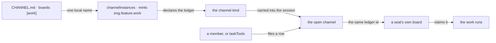

# FIX-1385 · Channel workstreams and boards

**Spec** · [Decisions](DECISIONS.md) · [Rules](BUSINESS-RULES.md) · [Plan](PLAN.md)

Feature · `workforce` + `orchestration` · large · 4 PRs · epic [FIX-1407 · W4](https://github.com/fixpoint-labs/flow-state-dev/pull/1905)

Written against landed code at `d8e4c99`, which carries both W3 inputs: the team layer (FIX-1377) and the seat's `tools:` fence (FIX-1416). Neither is cited as a spec here; both are read as what is on `main`.

## Six people, before and after

| Someone who… | Today | After |
|---|---|---|
| **has work for a team of seats** | Nowhere shared to put it. Every piece is dispatched by hand, from code, at one seat at a time | Names a board in the channel the team already talks in. Work goes on it, and a seat claims it or is assigned it |
| **wires a board for a team today** | Around forty lines of app code per team, invisible to the team itself | One line in the channel's own file. The code left is the seat's: which rows it runs, and how |
| **asks a model to file and triage work** | Gets a private board nobody else can see, or hand-writes tools over a shared one | The eight task tools it already has, pointed at the channel's board. Same rows a person sees |
| **is not a member of the channel** | A post claiming to be them is refused | Filing a row is refused the same way, for the same reason, in the same words |
| **already has channels open** | — | Nothing moves. A channel naming no board holds none, and reads and posts byte for byte as today |
| **renames a channel's folder** | The transcript moves with it | The rows do not. A rename is a re-key, and rows filed under the old name are orphaned |

**Why this one.** W3 made a team *describable* — seats, skills, documents and a channel, all in files. Nothing says where that team's **work** lives. The one shared, claimable place FSD has is the task board, and a board can only be built in code, so a declared team still gets its work handed out one dispatch at a time.

## What changes


The fence is the design: the channel is always on the left. It **holds** rows and never runs them, so nothing about claiming, leasing or dispatching moves into the conversation layer.

**What a team writes:**

```diff
  ---
  description: Where this team talks about the feature it is building.
  members: [eng.em, eng.coder, eng.reviewer]
+ boards: [work]
  ---

  One feature per channel. The EM files the row; nobody else does.
```

`boards` is a list of plain local names, as `members` is. The board's real identity is minted from the channel's — this one becomes `eng.feature.work` — so no file ever writes an id.

**What the seat that runs the work writes, in app code:**

```diff
+ const work = channelBoard("eng.feature", "work")   // the ledger the channel holds
+
  defineFlow({
    kind: "coder",
+   resources: { [work.id]: work },
    actions: {
+     drain: { block: taskBoard({ boardId: work.id, collection: work, workers }).drain },
    },
  })
```

## How a row reaches a seat



Nothing new carries the row. Both sides name one ledger id, so both read and write the same rows — the shape the cross-flow hand-off already uses.

## What stays as it is

- **Posting.** Still a post: it lands a line and wakes members, and hands nobody a claim.
- **The claim system.** One task board, unchanged. `assignee` stays optional and `TaskStatus` gains no member.
- **`assignee` is not a seat.** It is a routing key on a row; which seat it reaches is the seat-side board's wiring.
- **The nested cascade** — personal boards, request boards — is phase-2 inside W4, not built here.
- **Channel create, delete and invite** stay with FIX-1415. A board is written into a file, never called into being.

## Sign off

1. **[D1](DECISIONS.md#d1) · A `boards:` entry is a plain local name; the ledger's identity is minted from the channel.** If wrong: we ship the one thing this convention refuses everywhere else — a file declaring its own identity — and renaming a board becomes a second rename, separate from renaming its channel.
2. **[D2](DECISIONS.md#d2) · The channel holds the board and never drains it.** If wrong: a channel becomes something that executes work, and a team can file rows no seat is pointed at and see nothing wrong until nobody does them.
3. **[D3](DECISIONS.md#d3) · A model reaches a channel board through the `taskTools` it already has.** If wrong: two tool surfaces over one ledger, drifting apart on what they refuse.

**Open: none.** Number 2 is the one to weigh — it decides whether a team's work can go unnoticed. Reasoning and what lost: [DECISIONS.md](DECISIONS.md). The cases: [BUSINESS-RULES.md](BUSINESS-RULES.md).
