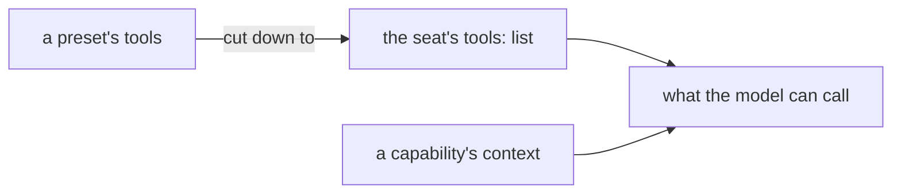

# FIX-1388 · Business rules

[Spec](SPEC.md) · [Decisions](DECISIONS.md) · **Rules** · [Plan](PLAN.md)

The cases, written as rules. Each says what a person or the system does and what happens. The
*proved by* column is the check the plan runs. A human reviews this page; the plan turns it into
work.

## Finding the files

| # | When | Then | Proved by |
|---|---|---|---|
| BR-1 | A `.ts` file sits in a `resources/` folder the convention reads | It appears in the generated module under the same ref a document of that name would get, so where it sits is what names it | CI, over a fixture tree |
| BR-2 | Its basename breaks the rules for a name in this tree | Refused by name, and **nothing is generated** — one run names every bad entry, not the first | CI |
| BR-3 | A `resources/` folder is a symlink, or is there and cannot be listed | Reported at that path. Symlinks are never followed, at any level | CI |
| BR-4 | A `.md` and a `.ts` in one folder share a basename | Refused, naming both files. They would mint one ref between them, and a silent winner is the failure this issue is about | CI |
| BR-5 | Any other file sits in the folder — a note, an image | Passed over without a word, as today | CI |
| BR-6 | The tree has changed and the generated module has not | `fsdev gen --check` exits non-zero and says which files disagree | CI |

## Installing what was found

| # | When | Then | Proved by |
|---|---|---|---|
| BR-7 | A discovered module exports a capability | It lands on the worker kind through the same `uses` option an app writes by hand, and its declared resources reach the flow from there | CI |
| BR-8 | A discovered module exports a resource or a collection | It merges into the same resource map the Markdown documents fill, under its own ref. There is one map | CI |
| BR-9 | A discovered module exports neither | The app's own typecheck fails and names the file. Nothing in the walk opens a module to find out | CI, a failing fixture compile |
| BR-10 | A discovered resource's ref collides with a document's | Refused at startup, naming both. Not a silent overwrite | CI |

## What a seat picks up

| # | When | Then | Proved by |
|---|---|---|---|
| BR-11 | A worker's file names a capability and the presets it wants | Those presets apply to that seat, and to no other seat of the same kind | CI · goal check |
| BR-12 | A worker's file names nothing | It carries each installed capability's own defaults — today's behaviour for every seat | CI |
| BR-13 | A worker names a capability its kind does not carry | Refused when the roster is hired, by name, listing what the kind does carry | CI |
| BR-14 | A worker names a preset the capability does not declare | Refused when the roster is hired, by name — **not** when the seat next answers. A typo in a file must not surface as a failed turn in front of a user | CI |
| BR-15 | Two seats of one kind name different selections | Each carries its own. Neither sees the other's | CI · goal check |

## The fence over what a seat may call

| # | When | Then | Proved by |
|---|---|---|---|
| BR-16 | A seat selects a preset that carries a tool, and the seat's `tools:` does not name it | The model cannot call it. Selecting a capability is not a way to widen the fence | CI |
| BR-17 | A seat declares `tools: []` and selects any capability at all | Zero tools reach the model | CI |

Context and tools arrive together and are treated differently on purpose: context is what the
capability is *for*, and the tool half passes through the one fence (FIX-1393).

## Door A, unchanged

| # | When | Then | Proved by |
|---|---|---|---|
| BR-18 | Any `.md` document that reads today is read again after this change | Same refs, same settings, same bodies, same reported errors, byte for byte | Existing suite, unchanged |
| BR-19 | A directory sits where a document file belongs | Still reported, as today | Existing suite |

## Failure taxonomy

Two fatal classes, both loud and both early. A refusal while the module is generated stops the
command and writes nothing, so a tree is never half-registered. A refusal while the roster is
hired stops boot and names every bad seat in one message, which is the bargain `hireWorkforce`
already makes. Everything else degrades: a folder that cannot be read is collected and reported
with its path, and the app decides whether that is fatal. Nothing retries, and nothing is
discovered while a request is in flight.

## Acceptance criteria this issue owns

Someone adds one TypeScript capability to a team's `resources/` folder, runs the command, and two
seats of the same kind — differing only in what their own files name — answer differently because
of it, with the one that named nothing behaving exactly as it did before. That is the goal check
the plan runs last, on the real path.
