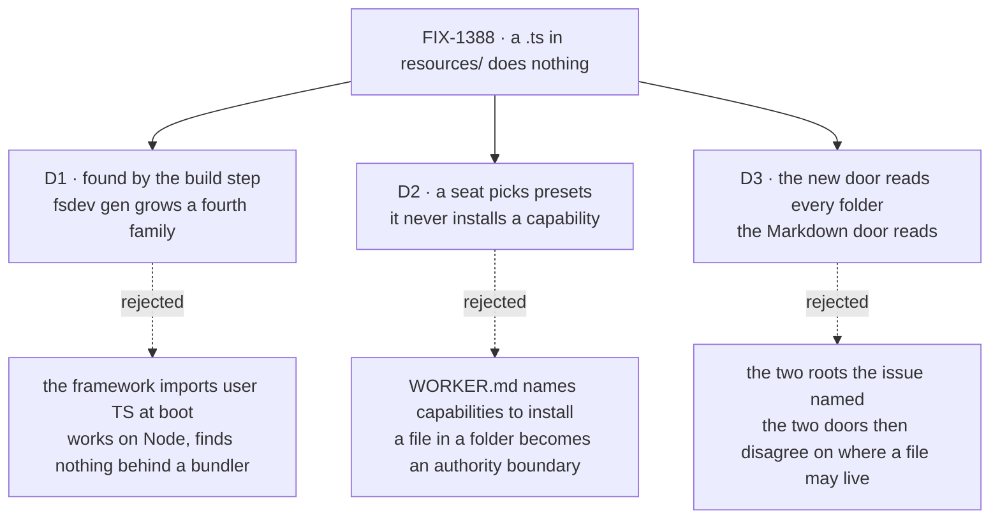

# FIX-1388 · Decisions

[Spec](SPEC.md) · **Decisions** · [Rules](BUSINESS-RULES.md) · [Plan](PLAN.md)

What was considered, what was chosen, why, and what each choice locks in. Three decisions are the
sign-off surface. Everything else here is context for them.

## The tree

Solid edges are what you're signing. Dashed edges lost, and the label says why.

## D1 · A `.ts` resource is found by the build step, not by the running framework

| | |
|---|---|
| **Instead of** | The framework opening and importing the app's TypeScript when it starts |
| **Because** | A walk that works on a plain Node host finds nothing once an app is built for Vercel or Next: by then those files are not separate modules. We made this call once already, for worker kinds and blocks — a command reads the tree and writes a committed module of ordinary imports. A second discovery mechanism beside it is two answers to one question (tenet 1) |
| **Locks in** | Adding a capability is two steps forever: write the file, run the command. A team that forgets the second gets a seat that is quietly short, and the only thing that catches it is `fsdev gen --check` in CI — now load-bearing for a team's resources, not just its code |

The cost is a promise about ergonomics: the pitch of the file convention is *put a file in a
folder and it works*, and this puts a command between the two. It is the bargain the kinds and
blocks convention already struck, and the alternative is a convention that works in development and
silently empties itself in production.

**What would change my mind:** evidence that apps on this convention deploy to plain Node only. Then
a run-time read is one step instead of two and the command is pure overhead.

## D2 · A seat picks presets from what its kind carries; it never installs a capability

| | |
|---|---|
| **Instead of** | A worker's file naming capabilities to attach to itself |
| **Because** | What a workforce *may* be able to do is the app's call, and a file a team edits is not where that is decided. Picking presets is the shape the skills switch already has, so an author who has written one worker file can read this one. A seat that names nothing carries the capability's defaults, which is what every seat gets today |
| **Locks in** | A seat adds; it never takes away. An app that wants a capability quieter for some seats turns it down where it installs it. Reversing that later lets a team's file subtract from what the app configured — an authority change, by which time rosters are written against the additive reading |

The subtractive version is the tempting one and the one that costs. Once a seat's file can turn off
what the kind installed, "what can this worker do?" is answered by two files owned by two people,
and every future capability has to decide which wins. Additive keeps one answer (tenet 5).

**What would change my mind:** a concrete seat that has to run with *less* than its kind's default —
a cost or a privacy reason, not a preference. Then the fork is real and worth its own issue.

## D3 · The new door reads every `resources/` folder the Markdown door reads — the organisation's, a team's, and a single worker's own

| | |
|---|---|
| **Instead of** | The two roots the issue named when it was cut |
| **Because** | The third one shipped since (FIX-1368, done 2026-09-17), so a Markdown document works in all three today. A TypeScript door that read only two would give the silence this issue exists to remove, in the one folder where the file beside it works — and "it works for documents but not for capabilities, in that one folder" is a rule people remember badly |
| **Locks in** | One folder means one thing whatever file is in it, which is the convention's whole claim. It does **not** loosen who installs: a worker's folder is an address, not an authority, and D2 still stands — a seat's file picks presets and installs nothing |

Decided on the Architect's coherence pass, 2026-09-17, on the ground that the asymmetry was an
accident of sequencing rather than a call anyone made. Not a fork for the product owner.

## Decided, not asked

- **Capabilities reach the kind through the `uses` option that already exists**, and their declared
  resources bubble from there. Settled on FIX-1364's review; nothing here reopens it.
- **A module's plain resources merge into the map Door A already builds.** One map, one call site,
  no second registry (tenet 3).
- **Module discovery and the Markdown walk stay separate readers** over the shared walk primitives
  FIX-1389 published. Neither reader learns the other's convention.
- **The `.ts` skip in the Markdown reader stays a skip, and its comment is corrected** — it claims a
  non-`.md` file carries no sign anyone meant it, which stops being true here.
- **A file's path still mints its scope**, exactly as it does for a document.

## Considered and dropped

| Alternative | Why not |
|---|---|
| A new `resources` option on the worker kind | Dropped on FIX-1364's review. A second install seam for a job `uses` does |
| Teaching the Markdown reader to also read `.ts` | One reader holding two conventions, and it widens Door A while Door A is held closed |
| Declaring capabilities in `.md` frontmatter | Frontmatter cannot author a schema. Ruled out when Door A was cut |
| A capability registry the seat looks names up in | A second place a capability can exist, to keep in step with the kind's `uses`. The generated map already is the list |
| Shipping Discover alone | A command that finds files and drops them. The three layers are one story |

## How it got here

- **Draft** — framed on the silent skip a `.ts` file gets in `resources/` today; joins the existing
  build-step discovery convention rather than adding a second one; installs through the `uses` seam
  that already exists, so the only new authoring surface is one key in a worker's file.
- **Review** — the open question about which folders the new door reads closed as D3, all three,
  because the worker-level root has since shipped on the Markdown door.

**Open: none.**
