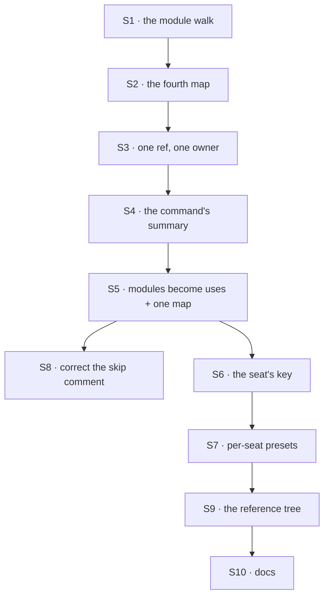

# FIX-1388 · Plan

[Spec](SPEC.md) · [Decisions](DECISIONS.md) · [Rules](BUSINESS-RULES.md) · **Plan**

Written for the implementing agent. IDs cross-reference [BUSINESS-RULES.md](BUSINESS-RULES.md)
(BR-n) and [DECISIONS.md](DECISIONS.md) (D-n). `tdd`. Three PRs; the seams are between Discover,
Install and Select.

## Surfaces

| ID | Package · role | Change | Rules |
|---|---|---|---|
| S1 | `workforce` · the code-convention walk | A fourth family beside the three locked code folders: **all three** scoped `resources/` roots — the organisation's, a team's and a worker's own (D3) — TypeScript entries only, refs minted the way the document walk mints them. A separate adapter over the shared walk primitives, consuming what FIX-1389 published rather than growing a parallel walk | BR-1 BR-2 BR-3 BR-5 BR-20 |
| S2 | `workforce` · the code-convention render | A fourth exported map on the generated module, keyed by ref, typed so a module exporting the wrong shape fails the app's own typecheck rather than the walk | BR-9 |
| S3 | `workforce` · the one place both doors' refs are known | Refuse a basename claimed by both a document and a module. The convergence point for ref uniqueness — where both lists exist, not in either walk | BR-4 BR-10 |
| S4 | `cli` · the generate command | Count and print the new family in the summary; `--check` covers it with no special case | BR-6 |
| S5 | `workforce` · the install half, beside the one that turns documents into resources | Split a module's exports into the capabilities an app hands to the kind's `uses` and the resources it merges into the one map. Pure and isomorphic, like its sibling | BR-7 BR-8 |
| S6 | `workforce` · the built-in worker kind's seat settings | One authored key naming capabilities and the presets a seat wants, validated at the mint against what the kind carries and what each capability declares | BR-13 BR-14 |
| S7 | `workforce` · the built-in kind's capability slot | A per-seat resolver that adds the presets the seat named, over the kind's static entries. Static entries keep declaring the resources | BR-11 BR-12 BR-15 BR-16 BR-17 |
| S8 | `workforce` · the document reader's skip branch | **Rewrite the comment**, not the branch: it claims a non-`.md` entry carries no sign anyone meant it, which stops being true here. The module header repeats the claim | — |
| S9 | `apps/kitchen-sink` · the workforce tree | One discovered capability and two seats that name different selections — the fixture the goal check grades on | BR-11 BR-15 |
| S10 | Docs | New page and two README entries; one `minor` changeset covering `workforce` and `cli` | — |

Nothing is removed. The one thing that looks removable — the silent skip in the document reader —
stays: Door A keeps passing over what is not its file.

## Sequence



### PR plan

| PR | Deliverables | depends_on |
|---|---|---|
| P1 · Discover | S1 S2 S3 S4 | — |
| P2 · Install | S5 S8 | P1 |
| P3 · Select | S6 S7 S9 S10 | P2 |

P1 ships a command that finds the files and a map nothing reads yet — deliberate, and reviewable on
its own. P2 makes the map usable. P3 is the seat's half, and the only one touching the built-in kind.

## Checks

| ID | Runs after | Passes when |
|---|---|---|
| V1 | S1 | BR-1, BR-2, BR-3, BR-5, BR-20 over a fixture tree covering all three roots. Refusals collect — one run names every bad entry |
| V2 | S2 | BR-9: a fixture module exporting the wrong shape fails to compile, naming its file |
| V3 | S3 | BR-4 and BR-10 refuse, naming both files. The negative control: remove the rule and watch the fixture pass silently |
| V4 | S4 | BR-6: `--check` red on a changed tree, green after regenerating |
| V5 | S5 | BR-7, BR-8. A capability's declared resources reach a real `defineFlow`; a module resource lands in the same map as a document |
| V6 | S6 S7 | BR-12 through BR-15. BR-14 asserted **at hire**, not at turn time — the test that fails a typo must fail before any request runs |
| V7 | S7 | BR-16, BR-17: a seat with `tools: []` and a tool-bearing selection reaches zero tools |
| V8 | S8 | Door A's existing suite unchanged (BR-18, BR-19) — run before S1 and after S8, same result |
| VG | S9 | Goal, real path: one capability added to a team folder; two seats of one kind, one naming a preset and one naming nothing; each answers with only what its own file gave it. New goal beside the two `workforce-conventions` goals |

**Negative control, run.** V3 and V6 exist to catch a silence, so each is seen red first: plant the
colliding pair, plant the misspelled preset, watch each fail, remove them (tenet 7).

## Pinned names · the only two

| Where | Name | Why pinned |
|---|---|---|
| A worker's file | `capabilities:` | Public. A person types it, and it has to read as the sibling of `skills:` |
| The generated module | `resourceModules` | Public. An app imports it beside `kinds` and `blocks` |

Everything else is yours to name.

## Guardrails

| Rule | Because |
|---|---|
| The two doors stay two readers over one set of shared walk primitives | One reader holding both conventions is the mega-loader the primitives extract exists to prevent |
| Nothing in a shipped package imports a path it discovered | That property is what makes a bundled build behave like a local one. It is the whole of D1 |
| One rule mints every ref in this tree, documents and modules alike (tenet 5) | Two spellings of one ref is how a module and a document silently overwrite each other, and S3 can only refuse what it can see |
| A bad name in a worker's file refuses at hire, never mid-turn | The per-seat resolver runs inside a request, and a typo surfacing as a failed answer is worse than the bug this closes |
| Door A's suite runs unchanged before anything is added, and again at the end | Released behaviour. "We didn't mean to change it" is not evidence (BP-030) |
| A capability's tools still pass through the seat's `tools:` list | Selecting is not widening. The fence is the claim this package publishes hardest |

## Docs

- **CREATE** `apps/docs/docs/workforce/capabilities-on-disk.md` — the `.ts` door: what a module may
  export, why the command runs, what a seat's `capabilities:` key does. Sidebar: the `Workforce`
  category, immediately after `workforce/documents-on-disk`, where a reader meets the folder first.
  *Voice risks:* define **capability** and **preset** plainly on first use; not "seamless" or
  "powerful"; no issue or PR numbers on the page.
- **EXTEND** `apps/docs/docs/workforce/documents-on-disk.md` — two or three sentences where it says
  a document is a `.md` file, on what a `.ts` file beside it means now. Not a second copy.
- **EXTEND** `packages/workforce/README.md` (the module half and the seat key) and
  `packages/cli/README.md` (the command's fourth family).
- **One `minor` changeset** for `workforce` and `cli` — published packages, consumer-visible
  surface (BP-022).

## Sketch · pseudocode, illustrative, react to the shape

```
at generation:
    for each resources/ folder the convention reads:
        for each entry:
            .md  -> the document walk's, untouched
            .ts  -> this walk's: mint the ref from the path, record the import
    refuse any ref claimed by both walks
    render one more map: ref -> the module's default export

at install (the app's own call site, visibly):
    capabilities, resources <- split(resourceModules)
    kind = defineAgentWorkerFlow({ uses: [...capabilities], ... })
    flow resources = { ...resourcesFromDocs(documents), ...resources }

at the mint, per seat:
    for each (capability, presets) the seat's file names:
        refuse if the kind carries no such capability      (BR-13)
        refuse if the capability declares no such preset   (BR-14)

per turn, in the kind's capability slot:
    the kind's static entries, as today
    plus, for this seat only, each named capability with its named presets
```

**No POC.** Every premise this rests on is already running code: the build-step discovery
convention, the kind's capability option, the per-seat switches on the skills key, and the
published walk primitives. Nothing here is a claim nobody has checked.

## At implement time

- **The tools fence may have moved.** FIX-1393 (#1852) is in review, not merged, and BR-16 and
  BR-17 are its behaviour. If it has landed, assert against it. If not, assert only what the kind
  honours today and do **not** build a second intersection here — and a Select goal check that
  assumes the hard fence waits on it.
- **The shared walk primitives are on `main`**, but FIX-1389 is still in development and carrying
  follow-ups. Consume its published primitives — root open, team walk, path classification, the
  ignored-name list, the segment rule — rather than growing a parallel walk, and do not
  parameterise an existing reader.
- **The reference app's workforce tree is reachable from nothing** — imported by no entry point and
  absent from the Next build, already recorded against the code-convention goal. Shape VG on the
  real hire-and-answer path, and do not take that blocker on here.

## Follow-ups

- The reference app's workforce subtree demonstrates the convention and is executed by nothing.
  Recorded against `goals/workforce-conventions/code-comes-from-files-alone/goal.md`; Door B makes
  it more visible, and it wants its own issue.
- Two `validateSegment` functions in two packages enforce overlapping rules and cannot see each
  other. Recorded on the same goal; out of scope here.
