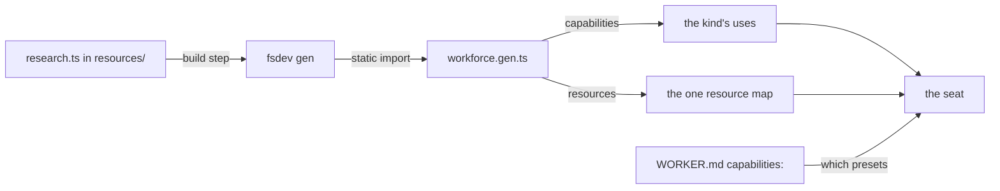

# FIX-1388 · Resources Door B: capability and resource modules

**Spec** · [Decisions](DECISIONS.md) · [Rules](BUSINESS-RULES.md) · [Plan](PLAN.md)

Feature · `workforce` + `cli` · large · 3 PRs · no epic parent (relates to FIX-1351, moved out 2026-09-16)

## Five people, before and after

| Someone who… | Today | After |
|---|---|---|
| **drops a `.ts` capability into a team's `resources/` folder** | Nothing happens. The file is passed over without a word — no document, no error, no seat that can use it | The file is found, the capability lands on the team's worker kind, and every seat of that kind can reach it |
| **wants one seat to research and another not to** | Impossible from the files. A capability is on the whole kind or on none of it | The seat's own file names what it wants. A seat that names nothing carries the capability's own defaults |
| **wires a capability by hand in the app's TypeScript today** | Adds an import and an entry per capability, in a file the person who writes the team's folders usually can't edit | Adds a file to the folder and runs one command. The app's own source names no capability |
| **deploys the same tree to Vercel** | The Markdown half works. There is no TypeScript half to break | Both halves work, and behave the same as they do locally |
| **writes `tools: []` on a seat** | No tool reaches the model | Unchanged. Picking a capability's presets never widens what a seat may call |

A sixth: someone who only writes `.md` documents sees today's behaviour, byte for byte. A seventh puts a capability inside one worker's own folder and is told, by name, that capabilities live a level up — because every seat of a kind shares that kind's capabilities ([D3](DECISIONS.md#d3)).

The silent skip is the part that hurts most. A team can write a perfectly good capability, put it exactly where the convention says team things go, and get no signal at all — not a document, not a refusal, not a log line. Everything else here follows from closing that.

## What changes


One folder, two doors, one destination. The top band is today; the bottom is what this adds. The Markdown arrow is the same arrow in both bands on purpose — Door A does not move ([D1](DECISIONS.md#d1) is about the new path only).

**What a team author adds to the folder:**

```diff
  workforce/teams/engineering/resources/
    handbook.md
+   research.ts
```

```ts
// research.ts — an ordinary capability, written the way one always is
export default defineCapability({
  name: "research",
  presets: { briefing: { context: [companyBriefing] }, default: [] },
});
```

**What the seat's own file says, to pick it up:**

```diff
  ---
  description: Holds the board.
  model: openai/gpt-5.4-mini
+ capabilities:
+   research: [briefing]
  ---
```

**What the app's own source changes:**

```diff
- import { kinds } from "./workforce.gen";
+ import { kinds, resourceModules } from "./workforce.gen";
```

The generated module is written by `fsdev gen`, which already writes the kinds and blocks maps beside it. Nothing in the app names `research`.

## How it reaches the seat



The file is read at build time and imported at run time, which is why the same tree behaves the same on a Node host and behind a bundler. Nothing in the framework opens a file the app wrote.

## What stays as it is

- **Door A.** A `.md` file in `resources/` is still a read-only document, read by the same walk, with the same refusals. No Markdown file changes meaning, and no frontmatter key gains one.
- **The tools fence.** A seat may call exactly the catalog keys its `tools:` names. A capability a seat selects contributes context and tools like any other, and the tool half is still cut down to that list (FIX-1393).
- **The install seam.** Capabilities reach a kind through the `uses` option that already exists. No new option, and no capability registry beside it.
- **Who decides the roster's capabilities.** The app does, at the one place it builds its kinds. A seat's file picks among them; it never adds one — and a capability found inside one worker's own folder is refused by name rather than installed, because every seat of a kind shares that kind's capabilities.

## Sign off

1. **[D1](DECISIONS.md#d1) · A `.ts` resource reaches a seat only after `fsdev gen` runs.** If wrong: a team can add a file, see nothing happen, and have no error telling them why — the same silence this issue exists to kill, moved one step later. The guard is `fsdev gen --check` in CI, which every app has to wire.
2. **[D2](DECISIONS.md#d2) · A seat picks presets; it can add to what it carries, never take away.** If wrong: seats that need less than the kind gives have no way to say so from their own file, and we would be reopening the seat-versus-app authority line later, after people have written rosters against it.
3. **[D3](DECISIONS.md#d3) · The new door reads every `resources/` folder the Markdown door reads — the organisation's, a team's, and a single worker's own.** If wrong: the two doors disagree about where a file may live, and the gap is invisible until someone hits it.

**Open: none.** Number 1 is the one to weigh. The full reasoning, what was rejected, and what each locks in is in [DECISIONS.md](DECISIONS.md). The cases the code must satisfy are in [BUSINESS-RULES.md](BUSINESS-RULES.md).
