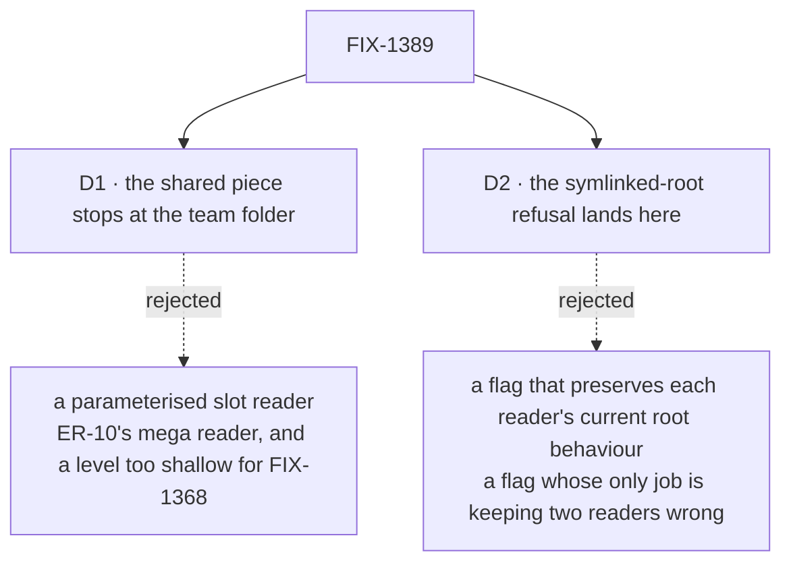

# FIX-1389 · Decisions

[Spec](SPEC.md) · **Decisions** · [Rules](BUSINESS-RULES.md) · [Plan](PLAN.md)

Two decisions carry this, and only one changes any behaviour. The rest of the page is what was
decided without asking, and what was looked at and left alone — which on a refactor is most of
the value.

## The tree

Solid edges are what you're signing. Dashed edges lost, and the label says why.

## D1 · The shared piece enumerates teams; it does not read slots

| | |
|---|---|
| **Instead of** | One parameterised reader every convention calls with its slot name, a file-or-folder flag, its error-kind map and its refused-key hook |
| **Because** | The three readers agree exactly down to the team folder and diverge immediately after it, so that is the seam. Covering the divergence needs all four of those parameters, which is the mega reader the epic answered *no* to. And the next convention in the queue reads a folder **inside a worker**, deeper than any slot — a team enumerator composes with that; a team-level slot reader does not |
| **Locks in** | Each convention keeps its own leaf loop, so one that wants to differ still can. The bill: a fix inside a leaf loop is still three edits, accepted because the leaf is where they are *supposed* to differ |

**What would change my mind:** two conventions' leaf loops turning out identical once written
side by side. Then the seam is one level lower than this says, and the piece grows — after
there is evidence, not before.

## D2 · The symlinked-root refusal lands in the shared open, and FIX-1375 closes with it

| | |
|---|---|
| **Instead of** | Leaving the hole for [FIX-1375](https://linear.app/fixpoint-labs/issue/FIX-1375) to fix on its own afterwards, or shipping the shared open with a per-reader flag that preserves what each does today |
| **Because** | A flag whose only purpose is keeping two of four readers wrong is the drift this issue exists to end, and the very next ticket would remove it. Both readers' own headers already say symlinks are never followed at any level; only the code disagrees. This issue's locked guidance says symlink honesty lands **once**, in the shared walk |
| **Locks in** | One behaviour changes. An operator whose root is a symlink gets a thrown error where a roster used to load — loud, at boot, reversible in one line. But it is a behaviour change inside a change otherwise sold as pure movement, so it is signed as one |

**What would change my mind:** someone deliberately running a symlinked root. But two of the four
readers already refuse it, so such a setup is already only half working — which makes it a bug
report, not a use case.

## Decided, not asked

- **The worker reader's failures gain a `kind` tag.** The other three carry one, and a shared
  enumerator must report into one shape. Additive for callers.
- **`openRoot` throws rather than collecting.** All four readers throw on a bad root already;
  the channels and resources wording is the one kept.
- **The org folder open stays in the resources reader.** One caller, two lines. Moving it would
  hand the channels reader an `org/` scope it is specifically not allowed to use.
- **Size reads *small*, against the epic plan's *medium*.** Half the extract landed with the
  conventions that needed it; what is left is two primitives and four call sites.
- **Nothing above a `patch` changeset.** Additive surface plus one refusal; nothing removed.

## Considered and dropped

| Alternative | Why not |
|---|---|
| Put the skills reader on the team enumerator too | It never enumerates teams — it jumps to three known folders from a caller-supplied team and worker, which is why it needs an ancestor-symlink check no downward walk does. Forcing it on is the fourth caller contorting to fit three |
| Extract the three frontmatter parsers as well | Same twelve lines three times, but the difference is the error wording, and the wording differs because a document is a file while a worker and a channel are folders. Outside this issue's named scope |
| Fold in `orchestration`'s skills-folder reader, the fourth ignore list | It sits below this package. Reaching it means moving these primitives down a layer — re-scoping a merged module for a two-line saving |
| Wait until a fifth convention proves the need | Three copies have already drifted twice: the missing root check, the missing tag. The evidence is behind us |
| Ship the extract and let FIX-1375 fix the root after | Two tickets on the same four functions, the second deleting what the first wrote |

## Open

**None.** One coordination question is live but is sequencing, not a fork, and is recorded here
so no reviewer reads it as undecided.

**Who exports the primitives — this issue or FIX-1357?** That spec, in review as this is written,
carries a surface publishing the same primitives from the loader subpath, and names the three
ignore-list copies as a net subtraction. Not the same work, though: FIX-1357 **publishes** what
already exists, FIX-1389 **creates and de-duplicates** what does not, and the overlap is exactly
the ignore list. Whichever lands first does it; the other finds it done. Neither blocks, neither
re-gates. Flagged up to the epic rather than settled locally
([ER-14](https://github.com/fixpoint-labs/flow-state-dev/pull/1718)), since its seam table has no
row for it.

## How it got here

- **Draft (Sep 17)** — measured the duplication before designing it. Two of the four walk
  primitives were already extracted, which shrank the issue; the team walk and the root open
  were not. The enumerator was chosen over a slot reader on FIX-1368's depth, and the root
  refusal folded in on the issue's own locked guidance.
