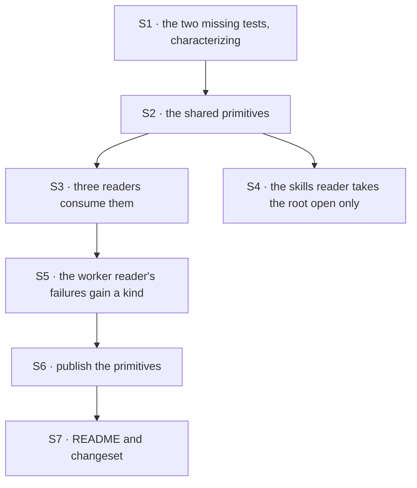

# FIX-1389 · Plan

[Spec](SPEC.md) · [Decisions](DECISIONS.md) · [Rules](BUSINESS-RULES.md) · **Plan**

Written for the implementing agent. IDs cross-reference [BUSINESS-RULES.md](BUSINESS-RULES.md)
(BR-n) and [DECISIONS.md](DECISIONS.md) (D-n). `tdd`. One PR.

## Surfaces

| ID | Package · role | Change | Rules |
|---|---|---|---|
| S1 | `workforce` · the channels and resources test suites | **Write first, and expect them green.** A symlinked team folder and an unreadable one, a case each, mirroring the worker suite's pair. Both readers already report these: S1 closes a coverage gap, it does not change behaviour. V3 is where the red lives | BR-5 BR-6 |
| S2 | `workforce` · the walk primitives module, beside the existing `classify` and structural open | Add the one ignore list, the shared root open, and the team enumerator. The last two are spelled out in the sketch below | BR-1 BR-2 BR-5 BR-6 BR-7 BR-8 |
| S3 | `workforce` · the worker, channels and resources readers | Consume S2. **Remove** three ignore lists, three root opens, three team loops | BR-3 BR-4 BR-14 BR-16 |
| S4 | `workforce` · the skills reader | Consume the shared root open **only**. Level list, ancestor check and duplicate refusal untouched | BR-1 BR-13 |
| S5 | `workforce` · the worker reader's result type | Its failure entries gain `kind`, so the enumerator reports into one shape. **Tag the whole closed union, not just the enumerator's path**, mirroring the siblings: `unreadable-slot` for a refused structural folder, a worker-load condition for a slot that would not load, the reader's existing declaration refusal. Every `errors.push` in the file gains one | BR-9 |
| S6 | `workforce` · the loader subpath's export map | Publish the primitives. **Coordinate:** FIX-1357's spec carries the same publication — whichever lands first does it ([Open](DECISIONS.md#open)) | BR-18 |
| S7 | Docs · changeset | `packages/workforce/README.md`: the loader entry gains the primitives. One **`minor`** changeset. **No `apps/docs` change** — none of this is author-facing | — |

**Removed: three ignore lists, three root opens, three team loops.** If you find yourself adding
a parameter to the enumerator, stop — that branch belongs in a reader's leaf loop (D1).

## Sequence



## Checks

| ID | Runs after | Passes when |
|---|---|---|
| V1 | S1 | Both new cases **pass against unmodified code**, asserting the path, message and `kind` each reader already produces, and still pass after S3. Red here means the case has the contract wrong, not the code |
| V2 | S3 | The package suite is green: 272 today plus S1's two and V4's. Records, failure paths and message text unchanged for every reader (BR-2 to BR-8, BR-10 to BR-14) |
| V3 | S3 | **The red state for S1.** Fold the team-folder reporting out of the enumerator: **three** suites must fail, where the same mutation fails one today. Fewer means a new case passes beside the extracted code rather than through it |
| V4 | S3 S4 | BR-1 in all four readers. New cases for the worker and skills readers — write the failing one first, confirming that a file outside the tree loads through the link today |
| V5 | S5 | Every entry of every failure list carries a `kind`; repo-wide typecheck clean |
| V6 | S3 S6 | BR-16 and BR-18, executed not read: search the package for a second ignore list, root `readdir` or `teams/` loop, and resolve the export map |

**No goal check, deliberately.** Nothing here reaches a model or a running flow, and the one
end-to-end path — a tree read into records and hired — is already covered by the joined reader's
suite and the hire suite, both of which run in V2.

**The second path (BP-035):** an absent `teams/`, a root with no teams, a team with no slot, an
empty failure list. All four have cases already; keep them passing rather than rewriting them.

## Pinned names · two, and only because they are published

| Where | Name | Why pinned |
|---|---|---|
| The shared root open | `openRoot` | Named in the issue's locked shape and in FIX-1375; two specs refer to it |
| The failure entry's tag | `kind` | The other three readers ship it. A fourth spelling would defeat S5 |

The enumerator's name and signature, and whether it yields or takes a callback, are yours;
`forEachTeam` in the spec's diff is illustrative.

## Guardrails

| Rule | Because |
|---|---|
| Message text is copied, never rewritten (tenet 3) | Three suites assert on it, and a reworded error inside a "pure movement" PR is invisible in review and loud in production |
| No reader's leaf loop is touched at all | It is where the conventions legitimately differ (D1), and a tidy-up there costs the parity claim the PR rests on |
| One behaviour change, named in the PR body (D2) | A refactor that quietly alters a runtime path is what reviewers cannot catch by reading the diff |
| No reader gains an `org/` scope it lacked | The channels org door is deliberately unowned; widening it here decides someone else's open question |

## Docs

- **EXTEND** `packages/workforce/README.md` — one line on the loader entry naming the primitives
  a convention consumes. *Voice risk:* a list of exports, not a tutorial.
- **One `minor` changeset** — not `patch`: the pre-1.0 rule is whether existing consumer code
  can trip over the change, and here it can twice ([D2](DECISIONS.md#d2)). Name the root refusal
  as well as the widened type; an operator reading only the changeset should learn about it.
- **No `apps/docs` page.** Nothing changes what an author writes in the tree, and
  [ER-18](https://github.com/fixpoint-labs/flow-state-dev/pull/1718) teaches behind a reader.

## Sketch · pseudocode, illustrative, react to the shape

```
openRoot(root):
    if root is a symlink        → throw the refusal          (BR-1)
    list it; on failure         → throw the one wording      (BR-2)

forEachTeam(root, report):
    open `teams/` structurally; refusal → report, then stop  (BR-4)
    absent → nothing to walk, silently                       (BR-3)
    for each entry:
        ignored name            → skip                       (BR-8)
        symlink or unreadable   → report under teams/<id>    (BR-5, BR-6)
        not a directory         → skip                       (BR-7)
        otherwise               → yield it to the reader
```

**No POC.** That the three loops are the same loop is a property of merged code, so it was
measured rather than prototyped: 21 lines in the worker reader and 29 in each of the others,
differing only by the condition tag; three identical ignore constants; the root wording four
times, twice unguarded.

## At implement time

All three were unlanded when this was written. Re-check them before building:

- **FIX-1357** may have landed S6 already, and with it the ignore-list collapse. Take the export
  as given and keep the rest.
- **FIX-1368** adds a documents folder *inside a worker*, a level below anything here. If its
  spec has since put that walk on a team-level slot reader, that is the D1 conversation and it
  goes up to the epic.
- **`hire.ts`** has edits in flight from FIX-1367 and FIX-1377, and its duplicated
  absent-`flow:` rule is explicitly **not** this issue's to extract.

## Follow-ups

- The three frontmatter parsers are the same twelve lines three times, differing only in how
  they name the file. Left alone ([dropped](DECISIONS.md#considered-and-dropped)); worth a look
  when a fourth arrives.
- `orchestration`'s skills-folder reader holds a fourth ignore list, across the package boundary.
