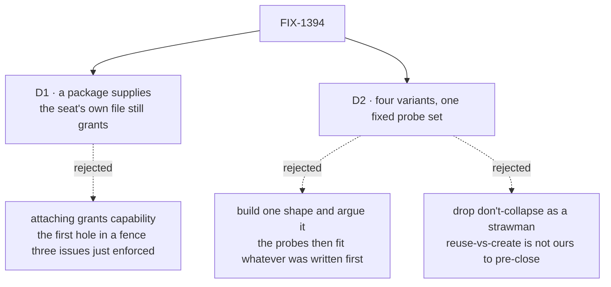

# FIX-1394 · Decisions

[Spec](SPEC.md) · **Decisions** · [Rules](BUSINESS-RULES.md) · [Plan](PLAN.md)

Two decisions are the sign-off surface. Nothing is open — the one question that was went up to the
epic under ER-15 and came back ruled ([Settled](#settled)).

## The tree

Solid edges are what you are signing. Dashed edges lost, and the label says why.

## D1 · A package *supplies* capability; the seat's own file still *grants* it

| | |
|---|---|
| **Instead of** | Attachment granting capability — dropping a package on a seat gives that seat the tools the package carries, without its file naming them |
| **Because** | One rule already holds across every convention in the tree, at four independently written enforcement points: nothing reaches a seat that the seat's own `WORKER.md` did not name (BR-1). A package that granted would be the first thing in the tree able to widen a seat's reach without the seat saying so — and the stated reason a seat cannot switch a capability *off* is that what a workforce may do is the app's call, not one worker file's |
| **Locks in** | Handing a team a working capability is **two steps, permanently**: drop the package, then name it. That cost lands on every handover, so the format has to pay it back in discoverability — a package whose tool is not granted must say so at the point of use, naming the package and the line to add. Without that, this decision makes today's silent failure permanent |

**Not a schema question.** Every candidate layout survives or fails on this one question, which
is why it sits above the matrix rather than inside it.

**What would change my mind:** evidence that the two-step handover is what actually blocks teams —
that people are stuck because a capability cannot travel as one unit, not confused about where a
tool goes. Then the fence is what to revisit, as its own issue.

## D2 · Four variants, one probe set fixed before any of them is built — and *don't collapse* is one of the four

| | |
|---|---|
| **Instead of** | Building the shape that seems most likely and arguing the rest on paper · or dropping *don't collapse* and *create a new format* as strawmen |
| **Because** | A matrix whose probes are chosen per variant proves nothing: the first shape written defines what counts as passing. And neither obvious cut is ours — *reuse-vs-create* is reserved for the owner ([ER-13](https://github.com/fixpoint-labs/flow-state-dev/pull/1905)), so a matrix omitting *create* answers a question nobody asked, and *don't collapse* is the cheapest outcome for the framework and has to be able to win |
| **Locks in** | Four builds before a ratify — the bulk of this issue's cost. The probe set becomes the definition of what "one package format" must mean, so a probe nobody thought of is a gap the ratify inherits. **How many variants is the owner's to move**; four is a recommendation, not a closed item |

![A grid of six fixed probes down the side against four candidate variants across the top: reuse the SKILL.md format, reuse the seat-folder shape, create a new package file, and don't collapse at all. Every variant is judged on the same six probes: ships instructions, ships a tool, ships a document, attaches both ways, the grant gate still holds, and nothing that works today breaks. Every probe is satisfiable by something that exists today, and the don't-collapse column is a real candidate rather than a control.](figures/probe-matrix.svg)

Read down a column, not across a row. **Every probe in the set is satisfiable by something that
exists today** — review caught P3 drafted so that no candidate could pass it, which would have
consumed a column while distinguishing nothing and let the matrix ratify a format that cannot
carry documents in both modes. The grid is empty because the cells are the deliverable.

## Decided, not asked

- **Every probe must be satisfiable before the set is fixed.** A probe no candidate can pass
  distinguishes nothing and costs a column. P3 was drafted that way and rewritten (BR-12); the
  check now runs on the whole set, not just on the probe that was caught.
- **Written against landed code, not two approved specs.** FIX-1377 and FIX-1416 merged to `main`
  (PRs #1911, #1909) while this was drafted; ER-18 assumes neither had. Where the shipped
  behaviour differs — FIX-1416 shipped *stricter* — the code wins.
- **No *premise* POC on this spec PR.** The one premise that would have justified one — whether a
  package can grant a seat a tool — is settled from the repo and asserted by
  `evidence/check-conventions.mjs` (BR-1). The four variants are a different thing: they are this
  issue's deliverable, they live under `spec-poc/` at implement time, and building one now would
  pre-empt the gate.
- **The ratify is recorded on the epic.** ER-2 names this answer as the epic's contract.

## Considered and dropped

| Alternative | Why not |
|---|---|
| Ship the collapse from research, skipping the matrix | ER-8 forbids it, and the reason is good: four conventions are in daily use, so being wrong costs a migration rather than an edit |
| Decide the exact package schema here | Reserved for the owner (ER-13). A spec that closes it is a second authority over one rule |
| Put a hole in the `tools:` fence so a package brings its own tool | The fence was enforced across three issues. Reopening it is a decision in its own right, not a side effect of a file format |
| Treat a package's tools as `controlTools`, which already cross | The precedent does not transfer: a control crosses because it is built inside its capability and never exported. A package's tool is exported by construction |
| Collapse only instructions, leaving tools and documents alone | The smallest real version, carried into the matrix as variant D's fallback. Not the headline, because it answers none of the tool question |

## Settled on the epic

**Four of five session-policy walls went back; one stays here.** Raised on the epic PR under
ER-15 rather than answered locally, and ruled there.

The epic recorded FIX-1408's five unclosed walls as evidenced by **this** POC. Four of them are
about how a dispatched worker gets its session and its history, which this matrix does not touch;
making one comparison answer two unrelated questions would have cost the variants their
comparability on the thing they were built to compare.

**The ruling: keep one, return four.** *Which opt-in history packs are v1* stays — a history pack
is a library package with opt-in attachment, which is exactly what P4 probes. The other four go
back to the epic for re-homing, and **FIX-1385 takes the board-row one**. The probe set is six,
and fixed.

## Open

**None.**

## How it got here

- **Draft** — framed as an attachment-semantics question rather than a schema question, after the
  code showed a single grant gate enforced at four points; deliverable shaped as a four-variant
  matrix against six fixed probes, with *don't collapse* as a real candidate.
- **Review** — the evidence base was weaker than it read. P3 was unpassable by any candidate and
  is now an observable behaviour (BR-12); P1 forbade a prompt layer every package-bearing variant
  would need, and now protects the reserved `default` rather than the array (BR-10); the
  grant-gate check asserted that implementation identifiers appeared in a file, and now anchors on
  four behavioural suites, one per enforcement point — including the capability fence it never
  reached; the totality check scanned one door of three and now covers all seven readers, with the
  negative control planting in the door it had been missing. The ER-15 fork was ruled in the same
  round.
