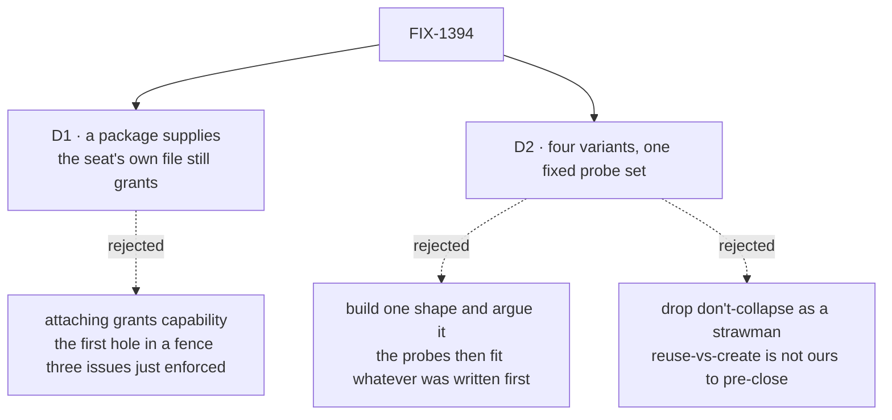

# FIX-1394 · Decisions

[Spec](SPEC.md) · **Decisions** · [Rules](BUSINESS-RULES.md) · [Plan](PLAN.md)

Two decisions are the sign-off surface; one question is open and goes back to the epic.

## The tree

Solid edges are what you are signing. Dashed edges lost, and the label says why.

## D1 · A package *supplies* capability; the seat's own file still *grants* it

| | |
|---|---|
| **Instead of** | Attachment granting capability — dropping a package on a seat gives that seat the tools the package carries, without its file naming them |
| **Because** | One rule already holds across every convention in the tree, at four independently written enforcement points: nothing reaches a seat that the seat's own `WORKER.md` did not name (BR-1). A package that granted would be the first thing in the tree able to widen a seat's reach without the seat saying so — and the stated reason a seat cannot switch a capability *off* is that what a workforce may do is the app's call, not one worker file's |
| **Locks in** | Handing a team a working capability is **two steps, permanently**: drop the package, then name it. That cost lands on every handover, so the format has to pay it back in discoverability — a package whose tool is not granted must say so at the point of use, naming the package and the line to add. Without that, this decision makes today's silent failure permanent |

**Not a schema question.** Every candidate layout survives or fails on this one question, which
is why it sits above the matrix rather than inside it.

**What would change my mind:** evidence that the two-step handover is what actually blocks teams —
that people are stuck because a capability cannot travel as one unit, not confused about where a
tool goes. Then the fence is what to revisit, as its own issue.

## D2 · Four variants, one probe set fixed before any of them is built — and *don't collapse* is one of the four

| | |
|---|---|
| **Instead of** | Building the shape that seems most likely and arguing the rest on paper · or dropping *don't collapse* and *create a new format* as strawmen |
| **Because** | A matrix whose probes are chosen per variant proves nothing: the first shape written defines what counts as passing. And neither obvious cut is ours — *reuse-vs-create* is reserved for the owner ([ER-13](https://github.com/fixpoint-labs/flow-state-dev/pull/1905)), so a matrix omitting *create* answers a question nobody asked, and *don't collapse* is the cheapest outcome for the framework and has to be able to win |
| **Locks in** | Four builds before a ratify — the bulk of this issue's cost. The probe set becomes the definition of what "one package format" must mean, so a probe nobody thought of is a gap the ratify inherits. **How many variants is the owner's to move**; four is a recommendation, not a closed item |

![A grid of six fixed probes down the side against four candidate variants across the top: reuse the SKILL.md format, reuse the seat-folder shape, create a new format, and don't collapse at all. Every variant is judged on the same six probes: ships instructions, ships a tool, ships a document, attaches both ways, the grant gate still holds, and nothing that works today breaks. The ships-a-document row is marked as the one expected to fail in every variant, because a file-declared document installs at flow level and cannot be lazy. The don't-collapse column is a real candidate and not a control.](figures/probe-matrix.svg)

Read down a column, not across a row. The shaded row is expected to fail everywhere, and is in the
set for that reason: a file-declared document installs at flow level and is refused
`prefetchMode: "lazy"`. Learning that during the matrix is cheap; learning it after ship tickets is
not.

## Decided, not asked

- **P3 stays in the set even though it is expected to fail.** A probe dropped because you know the
  answer is how a format ships that works for instructions and tools but not documents.
- **Written against landed code, not two approved specs.** FIX-1377 and FIX-1416 merged to `main`
  (PRs #1911, #1909) while this was drafted; ER-18 assumes neither had. Where the shipped
  behaviour differs — FIX-1416 shipped *stricter* — the code wins.
- **No `spec-poc/` in this pass.** The one premise justifying one is settled from the repo (BR-1),
  and the matrix is this issue's deliverable: building a variant now pre-empts the gate.
- **The ratify is recorded on the epic.** ER-2 names this answer as the epic's contract.

## Considered and dropped

| Alternative | Why not |
|---|---|
| Ship the collapse from research, skipping the matrix | ER-8 forbids it, and the reason is good: four conventions are in daily use, so being wrong costs a migration rather than an edit |
| Decide the exact package schema here | Reserved for the owner (ER-13). A spec that closes it is a second authority over one rule |
| Put a hole in the `tools:` fence so a package brings its own tool | The fence was enforced across three issues. Reopening it is a decision in its own right, not a side effect of a file format |
| Treat a package's tools as `controlTools`, which already cross | The precedent does not transfer: a control crosses because it is built inside its capability and never exported. A package's tool is exported by construction |
| Collapse only instructions, leaving tools and documents alone | The smallest real version, carried into the matrix as variant D's fallback. Not the headline, because it answers none of the tool question |

## Open

**Do five session-policy questions belong on this POC?** *(Decides: the owner, on the epic. Blocks: the matrix's scope, before any variant is built.)*

- **The fork.** The epic records FIX-1408's five unclosed walls — reuse-vs-create session policy,
  auto-scale and busy-copy, hire-or-dispatch-with-parent naming, which opt-in history packs are
  v1, and how a sub-agent's background work surfaces on a board row — as evidenced by **this** POC
  (ER-15). Keep all five, or return four to the epic for re-homing?
- **In plain terms.** Four are about how a dispatched worker gets its session and its history. One
  — which opt-in history packs ship first — is about what a reusable, opt-in unit carries, which is
  what this matrix already builds.
- **The trade-off.** Keeping all five makes one comparison answer two unrelated questions: each
  variant would model session behaviour it does not touch, and the four stop being comparable on
  the thing they were built to compare. Returning four leaves them unowned until somebody files —
  which is how a *Still open* item quietly becomes nobody's.
- **My recommendation: keep one, return four.** Keep *which opt-in history packs are v1*: a history
  pack is a library package with opt-in attachment, and P4 already probes it.
- **What would change my mind.** If the five meant "use whatever this POC reveals" rather than
  "this POC must answer them," nothing is loaded onto the matrix and this is a wording fix on the
  epic. Confirming that closes it.
- **If wrong.** Keeping all five costs a matrix nobody can read and a ratify nobody trusts.
  Returning all five costs four orphaned questions that resurface at the exit gate, expensively.

*Raised on the epic PR rather than decided here, per ER-15.*

## How it got here

- **Draft** — framed as an attachment-semantics question rather than a schema question, after the
  code showed a single grant gate enforced at four points; deliverable shaped as a four-variant
  matrix against six fixed probes, with *don't collapse* as a real candidate.
