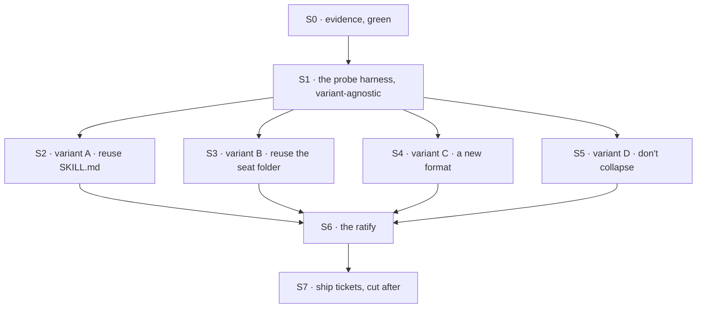

# FIX-1394 · Plan

[Spec](SPEC.md) · [Decisions](DECISIONS.md) · [Rules](BUSINESS-RULES.md) · **Plan**

Written for the implementing agent. IDs cross-reference [BUSINESS-RULES.md](BUSINESS-RULES.md)
(BR-n) and [DECISIONS.md](DECISIONS.md) (D-n). `tdd` for each variant's probes. **No PR to `main`.**

**Read this first.** The deliverable is a built comparison and a ratified answer, not a shipped
format. Every surface below lives on the spec branch under `spec-poc/`, which CI ignores, and is
thrown away after the ratify. A surface under `packages/` is a defect.

## Surfaces

| ID | Package · role | Change | Rules |
|---|---|---|---|
| S0 | `spec/FIX-1394/evidence/` · the factual base | **Already built and green — 25 claims.** Re-derives BR-1 to BR-8 from the repo; `--negative-control` plants an eighth convention reader in **Door C** and confirms C1 catches it | BR-1 – BR-8 |
| S1 | `spec-poc/FIX-1394-probes/` · the probe harness | The six probes as one variant-agnostic harness: give it a built variant, get a cell per probe. Written **before** any variant (D2) | BR-9 – BR-15 |
| S2 | variant A · reuse `SKILL.md` | The existing skill format as the one package — instructions, `allowed-tools`, bundled `files[]` — attached always-on, held opt-in | BR-10 – BR-15 |
| S3 | variant B · reuse the seat folder | A file plus colocated `skills/`, `resources/`, `blocks/` as the package, with a library copy attached opt-in | BR-10 – BR-15 |
| S4 | variant C · a new package file | Present because reuse-vs-create is the owner's to close (ER-13), not because it is recommended | BR-10 – BR-15 |
| S5 | variant D · don't collapse | **Builds no package tree.** Write the placement rule, and close the one real gap: a package's tool failing silently instead of naming the line to add (D1's *Locks in*). Its column is filled by **characterizing today's behaviour** — P5 and P6 are today's state and pass by construction; P1 to P4 record what an author has to do by hand, or *n/a* where the probe presupposes a package | BR-10 – BR-16 |
| S6 | `spec/FIX-1394/RATIFY.md` | The filled matrix, the chosen variant, what it means for ER-2. Mirrored to the epic-spec | BR-16 |
| S7 | Ship tickets | **Not cut here.** After the ratify, per ER-8 |

**Nothing is removed** (tenet 3's usual prompt) — because nothing is added. The removals belong to
whichever ship ticket the ratify produces; naming them now designs the format this spec
deliberately leaves open.

## Sequence



**Why there is no sub-PR DAG.** A Large issue normally carries one as executable routing, but this
issue merges nothing — sub-PRs would target a branch that never lands. S2 to S5 are genuinely
parallel once S1 exists, and the DAG above is that parallelism.

## Checks

| ID | Runs after | Passes when |
|---|---|---|
| V0 | S0 | All 25 claims green; `--negative-control` prints PASS. Re-run before the ratify, not only at draft |
| V1 | S1 | **Six violating fixtures, one per probe** — each a package tree built to fail exactly that probe and satisfy the rest — and the harness marks that probe *fail* and the others *pass*. One empty fixture cannot do this: an empty tree cannot fail P5 (nothing crosses the gate) or P6 (an unchanged tree *is* P6's pass), so a harness that always reported *fail* would look correct against it (tenet 7) |
| V2 | S2 – S5 | Each variant has a recorded cell for **all six** probes, including probes it was not built for and probes that are *n/a* for it (S5). A blank cell is a result nobody has |
| V3 | S2 – S5 | BR-14: the **four existing vitest suites** S0's C4 names are re-run with the variant's package attached. Don't write new gate assertions — those four already exercise each tool source against a restricted seat, the fourth of them against the capability fence in `packages/core/src/blocks/generator.ts`. The gate holds or the variant fails, whatever else it passed |
| V4 | S2 – S5 | BR-15: the existing workforce suite passes unmodified against a tree with no package authored. **Once per matrix, not once per variant** — the tree is the same in all four cases, so re-running it four times measures nothing new |
| VG | S6 | Goal, real path: one seat, one capability, handed over twice — attached to the seat, then held in a library and activated — under the ratified variant. The seat does the same work both times. `goals/package-cohesion/one-capability-two-modes/run.mts` |
| V5 | S6 | The ratify names one variant, cites the cell that decided it, and says what ER-2 now means. A ratify with no losing cell cited has not chosen |

**The second path (BP-035)** is the *off* state: a tree with no package authored behaves byte for
byte as today (BR-15, V4). Every variant is checked there, not only where it looks good.

**Run `--run-tests` first.** Without it, C4 asserts the four suites and their named cases exist —
which catches a rename, not a test that stopped proving what its name says. It was **never
runnable in the authoring session** (no `node_modules` there), so it has never been executed.

## Pinned names · one

| Where | Name | Why pinned |
|---|---|---|
| The ratified answer | `spec/FIX-1394/RATIFY.md` | ER-2 and three siblings point at it. Everything else here is yours to name |

Variant folder names, probe ids, and every symbol inside a variant are the implementer's.

## Guardrails

| Rule | Because |
|---|---|
| Fix the probe set before building variant A (D2) | The first shape written otherwise defines what passing means, and the remaining three are judged against it |
| Record every cell, including expected failures and probes a variant was not built for (BR-9) | A matrix with blanks is a matrix that can be read whichever way its author prefers |
| No file under `packages/` changes in this issue (ER-8) | The ratify is what authorizes a ship ticket. Code that exists before the gate is code someone will merge |
| Do not close the exact package schema, reuse-vs-create, or how many POCs precede a ship cut (ER-13) | Reserved for the owner. Exploration may lean; leaning is not closing |
| A cross-cutting question goes up on the epic PR, never answered locally (ER-15) | [DECISIONS.md](DECISIONS.md) on the epic is the single place. A local answer is a second authority |
| Write against landed FIX-1377 and FIX-1416 code, not their specs | Both merged to `main` while this was drafted, and FIX-1416 shipped stricter than its spec promised |
| `don't collapse` must be able to win (D2) | A control that cannot win is not a control, and it is the outcome that costs the framework least |

## Docs

**No docs change from this issue** — no format ships and no file's meaning moves. The work belongs
to whichever ship ticket the ratify cuts, and it is substantial: `apps/docs/docs/workforce/` and
`apps/docs/docs/skills/` both teach the current split, and a collapse rewrites both. Flagged so
the ratify prices it rather than discovering it.

If the ratify returns *don't collapse*, docs **are** the deliverable: the placement rule (which
convention a tool, an instruction and a document belong in, and why a skill's `allowed-tools`
grants nothing) extends `apps/docs/docs/workforce/built-in-worker.md` under *Skills*. *Voice
risk:* the honest version sounds like an apology. It is a design decision.

## Sketch · the probe harness, pseudocode, illustrative

```
fix the probes first, as data:
    P1 instructions · P2 a tool · P3 a document
    P4 both attachment modes · P5 the grant gate · P6 nothing breaks

prove the harness can say no, one probe at a time:
    for each probe:
        build a fixture that violates THAT probe and satisfies the other five
        expect exactly one red cell, in that probe's row          (V1)

for each variant:
    build a tree holding one package that carries all four kinds of content
    attach it to a seat          → run the probes        → record a cell each
    hold it in a library, opt in → run the same probes   → record a cell each
    re-run the grant-gate assertions with the package attached   (P5)
    run the existing workforce suite against a tree with no package  (P6)

the ratify reads columns, not rows
```

**POC:** none built in this pass, deliberately. The one premise that would have justified one —
whether a package can grant a seat a tool — is answered in the repo and asserted by
`spec/FIX-1394/evidence/check-conventions.mjs` (BR-1, four enforcement points). The matrix itself
is this issue's deliverable, so building a variant before the gate would pre-empt the shape the
gate has not approved.

## At implement time

- **Re-run S0 first.** `main` moved twice while this was drafted — FIX-1377 (`TEAM.md`, PR #1911)
  and FIX-1416 (seat `blocks/`, PR #1909) both landed. The checker tells you what else has.
- **FIX-1416 shipped stricter than its spec.** The spec promised a seat's own `blocks/` folder
  would be callable "without being listed anywhere"; the merged code intersects it with the seat's
  declared `tools:` (`resolveDeclaredTools`, `packages/workforce/src/hire.ts`). BR-3 is the
  shipped rule. Do not carry the spec's sentence into a variant.
- **The epic-spec still records both as unlanded**, and ER-18 with it. Stale; raised on the epic
  PR. Follow the epic if it has been refreshed by the time you build.
- **The probe set is six, and settled.** The epic ruled on ER-15: one of FIX-1408's five session
  walls stays here (*which opt-in history packs are v1*, which P4 already probes), and four went
  back to the epic for re-homing ([Settled](DECISIONS.md#settled)). S1 is not re-shaped.

## Follow-ups

- **P3's opt-in half needs a mechanism chosen, not invented** (BR-5, BR-12). Two exist: declare
  the document on the block that needs it, where `prefetchMode: "lazy"` *is* allowed, or ship it
  beside the package the way a skill folder already ships supporting files. The refusal that made
  this look impossible is flow-level only, and its own message names the first remedy. Pick per
  variant and record which; if a variant can reach neither, that is its P3 cell, not a framework gap.
- **A skill's `allowed-tools` fails silently on the workforce path.** It is validated, then
  granted nothing, and nothing tells the author. Independent of which variant wins, and worth a
  ticket on its own — it is the most common confusion this issue found.
