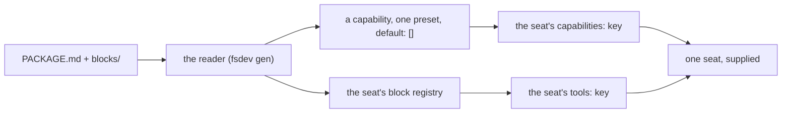

# FIX-1394 · The ratify

[Spec](SPEC.md) · [Decisions](DECISIONS.md) · [Rules](BUSINESS-RULES.md) · [Plan](PLAN.md) · **Ratify**

Four variants, six probes fixed before any of them was built, every cell recorded. Built
against landed code at `d8e4c99`, the whole comparison under
[`spec-poc/FIX-1394-probes/`](../../spec-poc/FIX-1394-probes/README.md), nothing under
`packages/` touched.

## The answer, in one line

**This is not designing a format. It is adding an authoring surface to a package mechanism
that already ships.** A worker can already opt into a named bundle of instructions and tools,
and its own `tools:` still decides what it may call. What a file format adds is that a team
could write one in Markdown instead of an engineer writing it in TypeScript.

**The one part that does not already work is documents, and it does not work for anybody.**
There is no per-seat document channel in the framework at all. Every candidate that passed the
document probe passed it by putting the document's text in the prompt.

Two things follow, and they outrank the choice of format:
[the document finding](#the-finding-that-outranks-the-matrix) and
[a correction to BR-6 on the approved spec](#correction-to-br-6-approved-spec).

## The matrix

| probe | A · reuse `SKILL.md` | B · reuse the seat folder | C · a new package file | D · don't collapse |
|---|---|---|---|---|
| **P1** instructions | **FAIL** | PASS | PASS | n/a |
| **P2** a tool | **FAIL** | PASS | PASS | n/a |
| **P3** a document | **FAIL** | PASS \* | PASS \* | n/a |
| **P4** both modes | PASS | PASS | PASS | n/a |
| **P5** the grant gate | PASS | PASS | PASS | PASS |
| **P6** nothing breaks | PASS | PASS | PASS | PASS |

\* passes as prompt text, because there is no other way to pass it. See
[The finding that outranks the matrix](#the-finding-that-outranks-the-matrix) directly below —
it is the most important line on this page.

`n/a` is a recorded result, not a blank: D authors no package, so four probes presuppose
something it says should not exist (BR-16).

## The finding that outranks the matrix

**There is no per-seat document channel in this framework.** Not a weak one, not an awkward
one — none. It is not in any cell, because the probe set deliberately states behaviour and
leaves mechanism to the candidates (BR-12), and it matters more than which format wins.

Three ways a document could reach one seat. All three were run:

| Route | What happens |
|---|---|
| A capability preset carrying `resources` | Cannot be selected by a seat at all. `resources` is build-time only, and naming such a preset is refused at the mint |
| The file-declared documents convention | Installs at **flow** level, which is the kind's. Every sibling seat of that kind receives it, held package or not |
| A skill's supporting files (`files[]`) | Stored in the collection and **never rendered into the holding seat's context** — before activation or after. Only the delegation surface reads them |

So every variant that passed P3 passed it by putting the document's text in the prompt: on
every turn when attached, on activation when held. That is readable, and it is what P3 asks
for. **It is not a document you can address, update at run time, or leave out of a turn's
tokens.** Any format that claims to carry documents is claiming something the framework cannot
do for it.

### Correction to BR-6 (approved spec)

**BR-6 is false as written, and it is on an approved spec.** Recorded here as a correction by
name so it cannot be read past.

> **BR-6** — *"A package travels opt-in and wants to carry a document · A skill folder already
> carries supporting files beside its `SKILL.md`. One opt-in-attachable unit that ships a
> document therefore already exists."*

The carrying is real. **The arriving is not.** A skill's supporting files are stored in the
skills collection and read only by the delegation surface and the worker materializer; they
never render into the holding seat's own context, before activation or after. Run, not read:
the skill's body appears on `/handover` and the supporting file's body appears on neither turn.

**How it survived review.** `evidence/check-conventions.mjs`'s `C3-skill-files` asserted that
the `SkillFile` type exists and that `InitialSkill` has a `files?` field, then concluded *"an
opt-in unit can ship a document today"*. Both halves of the regex are true. Neither is the
claim. That is a check aimed at a neighbour of the claim — the same BP-003 defect round 1
caught on the grant gate and fixed there, sitting unre-checked in a different row of the same
document. The claim is now `C3-skill-files-type` and says only what a source regex can say: a
skill *carries* supporting files, and whether they reach a seat's context is a runtime question
it cannot answer — they do not.

**What it changes.** BR-12 already states P3 as an observable behaviour and leaves the mechanism
open, so no cell moves. What moves is the cost of the *document* half of any package format:
BR-6 said one of the two mechanisms already existed, and it does not.

## The three cells that decided it

**A is out, on P2.** A `SKILL.md` folder has no channel that registers a block. Its
`allowed-tools:` is validated and grants nothing, which was already known — what the build
added is what happens when an author works around that by naming the tool in the seat's own
`tools:` instead. The framework refuses, for the whole roster:

> `worker "support.holder" — ... "tools": names tool "ledger-append", which nothing registers
> for this seat — neither its own blocks/ folder nor the app's tool catalog.`

So a `SKILL.md` package can carry a tool's *name* and never its code, and the seat that trusts
it does not start. A also fails P1 and P3 for one reason: a skill is in context only while it
is active, so the format has exactly one attachment mode and cannot express *always on*.

**B and C return the same verdict in all twenty-four cells**, with both files genuinely
parsed. The two dialects are read by one parser and compiled by one compiler, and the parse is
where their differences actually live:

| | B · `WORKER.md` | C · `PACKAGE.md` |
|---|---|---|
| `tools:` holds | bare NAMES; code found by walking `blocks/`, as a seat's colocated blocks are | PATHS to the modules |
| which modes it supports | the seat dialect has no key for it — a seat has no modes | `attach: [seat, library]`, and the reader is held to it |

Neither difference reaches what the package can DO — same instructions, same registered block,
same gate, same two modes. So capability still cannot settle reuse-vs-create; that question
stays the owner's (ER-13), and the lean below is a lean.

**This claim was wrong in round 1 and is corrected here.** Round 1's compiler took the
instructions, the document and the tool from the harness's own constants and never opened the
file either variant authored, so "identical" was a statement about the compiler rather than
about the two formats — P1, P3 and VG would all have stayed green against an empty
`PACKAGE.md`. Both reviewers caught it. The reader now parses the authored bytes, the fixtures
corrupt those bytes rather than switching a flag, and a new reader control asserts that an
empty manifest turns P1, P2 and P3 red. The verdicts did not move; the reason to believe them
did.

**D holds its ground on P5 and P6**, measured rather than assumed: today's hand-written seat
calls the tool it names and the sibling that registered the same block and named nothing
reaches the model with zero tools.

**P5 was also wrong in round 1, for the same class of reason.** It read the *bystander* — a
seat no package was attached to — so its empty tool list proved only that an unattached seat
has no tools, and a reader that widened the fence for every package-holding seat would have
passed. There is now a third seat in every candidate's tree that holds the package exactly as
the holder does and differs in one line, the `tools:` grant; the probe asserts it is genuinely
holding the package *before* it reads the fence, so the cell cannot go green vacuously. The
verdicts did not move here either.

## Recommended: **C**, scoped to instructions and tools

One new file, `PACKAGE.md`, with its own frontmatter, and its `blocks/` beside it. Documents
out of v1, with the reason recorded.

**Why C over B.** They can do the same things, so the tiebreak is what an author writes wrong.
B's package file is a `WORKER.md` sitting somewhere that is not `teams/<id>/workers/<name>/` —
which is either a package or a misfiled seat, and nothing in the tree can tell which. The
loader's own rule is that a declared entry is consumed or refused loudly, never passed over,
and B spends its one ambiguity at exactly the place that rule is strictest. C costs an eighth
convention against a tree that counts seven; it buys a file that cannot be mistaken for
anything else.

**Why scoped.** P1 and P2 pass because both have a real per-seat channel. P3 does not have one.
Shipping documents in v1 would freeze a design around a document that is prompt text wearing a
resource's name.

## What C actually adds, and what already ships

The reason B and C pass at all is that their reader compiles a package into machinery that is
already in `main`:

Every box right of the reader ships today and is documented
(`apps/docs/docs/workforce/capabilities-on-disk.md`). A seat already names presets of a
capability its app installed; the seat's `tools:` already decides what it may call. Verified in
this matrix: a seat that names the capability but no tool receives the instructions and **zero
tools** — D1's *supplies, does not grant*, already true, already enforced.

The two halves travel separately, and the docs are explicit about why: *"selecting a
tool-bearing preset is a way to give one worker that preset's context, not a way around its
tool list."* So the reader compiles instructions into the preset and the tool into that one
seat's block registry — not into the app's catalog, which is app-wide and would make a package
attached to one seat nameable by every seat of the kind.

So **C is an authoring surface, not a capability.** What it buys is that a team can write a
package in Markdown instead of an engineer writing a capability in TypeScript. That is a real
thing to buy. It is a much smaller thing than "one package format" sounds like, and it is the
fork below.

## Need your sign-off

### Who writes a package — a team in Markdown, or an engineer in TypeScript?

**Plain terms.** The thing we were going to build is a file format so that one team can hand
another team a working capability as a folder. Building the comparison showed that the working
part already exists: a capability with a preset an individual worker can opt into, plus the
worker's own tool list. Today an engineer writes that in code. The format would let a
non-engineer write the same thing as a Markdown file and a folder. The capability is the same
either way; what changes is who can produce one without asking an engineer.

**The trade-off.** Building it means a new file convention, a reader for it, and a rewrite of
two documentation sections that currently teach the split. Not building it means handing a
capability over stays a conversation with an engineer, and the "why doesn't my skill's tool
work" question stays live — that one is the most common confusion this issue found, and it is
worth its own small fix either way.

**My recommendation: build it, as C, scoped to instructions and tools.** The machinery is
already there and already enforced, so this is the cheapest version of this feature we will
ever get — it is a reader and a file, not a subsystem. Two siblings in this epic grow surfaces
on top of whichever answer lands, and "whoever builds first settles it by accident" is the risk
the issue was opened for. Scoping documents out costs nothing today, because nothing can carry
one to a single seat regardless.

**What would change my mind:** whether anyone outside the app's engineers is actually going to
author one of these. If packages will in practice be written by the same people who write the
app's TypeScript, the format buys documentation rather than capability, and the honest answer
is *don't collapse* — write the placement rule down, fix the silent failure, and leave the
seven conventions alone. You know who the authors are; I don't.

**Cost of being wrong: moderate, and asymmetric.** Not building it and being wrong costs a
quarter of people working around it, and the format stays available. Building it and being
wrong ships an eighth convention into a tree that already has seven, and a published file
format is expensive to take back.

### Documents in v1: leave them out, or pay for a per-seat document channel?

**Plain terms.** A package can carry instructions and a tool to one worker. It cannot carry a
*document* — a reference page the worker reads — to one worker. Today a document is installed
for a whole category of workers at once, or it is pasted into the prompt on every turn.

**The trade-off.** Leaving it out means a package's "document" is prompt text, re-sent every
turn and counted against every turn's cost, and nobody can update one while the system runs.
Paying for it means a framework change to give a single worker its own documents — a real
piece of work, and not a file format.

**My recommendation: leave it out of v1 and say so in the format.** A package that declares it
carries documents and delivers prompt text is the kind of promise that is discovered by a
customer rather than by us.

**What would change my mind:** if one of the siblings in this epic is planning on per-worker
documents. Then it is one framework change serving two issues rather than one serving none.

**Cost of being wrong: low.** Adding a document slot to a format later is additive. Shipping
one that quietly means something else is not.

## What this means for ER-2

ER-2 previously pre-named the answer. It should now bind what this page records:

> **ER-2.** The package format is one file, `PACKAGE.md`, with colocated `blocks/`, compiled to
> a capability preset a seat opts into by name plus that seat's own block registry. It carries
> **instructions and tools**; it does not carry documents in v1, because no per-seat document
> channel exists. Attaching a package never widens what a seat may call — the seat's `tools:`
> is still the only grant (D1, unchanged and re-verified in every column).
>
> **This is conditional on the authorship fork above.** If the answer is that app engineers are
> the only realistic authors, ER-2 binds *don't collapse*: the placement rule is written down,
> the silent `allowed-tools` failure is fixed, and no format ships.

## Verification

| Check | Result |
|---|---|
| V0 · the evidence base | 26 claims green at `d8e4c99`, including `C4-run` — the four grant-gate suites, 62 tests, all pass |
| V0 · negative control | PASS — a planted eighth convention reader in Door C turns C1 and C1-total red |
| V1 · the harness can say no | PASS — six violating fixtures, each red in exactly its own row and green in the other five. Three now corrupt the authored file's BYTES rather than the reader |
| V1 · the reader control | PASS — an empty `PACKAGE.md` turns P1, P2 and P3 red, and a manifest the parser cannot read is refused rather than compiled |
| V2 · no blanks, and no drift | 24 cells recorded — 17 `PASS`, 3 `FAIL` (all A's), 4 `n/a` (all D's). `run.mts` now ASSERTS this table and exits non-zero on any cell that moves |
| V4 · the off state | The workforce suite unmodified: 32 files, 527 tests, all pass |
| VG · the goal | PASS — one authored capability, attached then held and activated, the same working seat both times, sibling seat untouched in both |

**V3 reads differently than the plan wrote it.** The plan says to re-run the four grant-gate
suites *with the variant's package attached*. Those suites live under `packages/`, and editing
them is what ER-8 forbids, so the equivalent observation is made where it actually belongs: P5
attaches each variant's package to a real tree and reads the tool list the model receives, and
the four suites are run unmodified to show the gate itself did not move. Both are green.

## What this POC did not prove

- **That anyone wants to author one.** The fork above; no build can answer it.
- **That the reader is cheap.** `package-reader.mts` plus `compile.mts` parse one manifest
  dialect pair and trust the result. A real `fsdev gen` reader owes refusals, symlink
  containment and name validation like every other reader in the loader, plus a row in
  `published-tree-surface.test.ts` — call it a week, not an afternoon.
- **Anything about migration.** No existing tree was converted. Four conventions are in daily
  use and none of them moved here.
- **That prompt-text documents are acceptable at scale.** One document, one turn. Nothing here
  measured what a handful of attached packages does to a prompt's size or cost.

## One incidental finding, worth its own ticket

A skill's `allowed-tools` is parsed, validated, rendered into the prompt as *"only these tools
are available: ..."* — and grants nothing. An author gets a sentence in the model's context
promising a tool the seat cannot call. It is independent of every answer above, and it is the
most common confusion this issue found. D1's *Locks in* already says a package whose tool is
not granted must name the line to add; this is the same fix, one layer down, and it is worth
doing whether or not a format ships.
