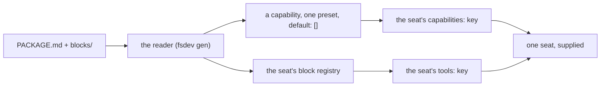

# FIX-1394 · The ratify

[Spec](https://github.com/fixpoint-labs/flow-state-dev/blob/6fb3633cf683957483f2bc72e6920db7c798e8a5/spec/FIX-1394/SPEC.md) · [Decisions](https://github.com/fixpoint-labs/flow-state-dev/blob/6fb3633cf683957483f2bc72e6920db7c798e8a5/spec/FIX-1394/DECISIONS.md) · [Rules](https://github.com/fixpoint-labs/flow-state-dev/blob/6fb3633cf683957483f2bc72e6920db7c798e8a5/spec/FIX-1394/BUSINESS-RULES.md) · [Plan](https://github.com/fixpoint-labs/flow-state-dev/blob/6fb3633cf683957483f2bc72e6920db7c798e8a5/spec/FIX-1394/PLAN.md) · **Ratify**

*(The four spec documents live on the approved branch `spec/FIX-1394`, pinned above at its reviewed commit. This branch carries the ratify and its evidence.)*

Four variants, six probes fixed before any of them was built, every cell recorded. Built
against landed code at `d8e4c99`, the whole comparison under
[`spec-poc/FIX-1394-probes/`](../../spec-poc/FIX-1394-probes/README.md), nothing under
`packages/` touched.

## The answer, in one line

**This is not designing a format. It is adding an authoring surface to a package mechanism
that already ships.** A worker can already opt into a named bundle of instructions and tools,
and its own `tools:` still decides what it may call. What a file format adds is that someone
could write one in Markdown instead of an engineer writing it in TypeScript — eventually anyone,
with an LLM writing it for them, which is the owner's ruling and the reason to build it.

**The one part a package cannot carry is a document, and it cannot for anybody.** There is no
per-seat document channel in the framework at all — every candidate that passed the document probe
passed it by putting the document's text in the prompt. That turned out to be a design, not a gap:
documents are **org-scoped**, and the owner has now ruled that they stay that way
([the decision](#decided-documents)).

Two things follow, and they outrank the choice of format:
[the document finding](#the-finding-that-outranks-the-matrix) and
[a correction to BR-6 on the approved spec](#correction-to-br-6-approved-spec).

**Both forks are now decided by the owner, and nothing on this page is waiting on anybody.**
Documents are org-scoped and out of the format, with per-seat reach routed to FIX-1381
([the decision](#decided-documents)). The format is approved and **C is ratified**, with the
authorship answer carrying a constraint that shapes the build
([the decision](#decided-authorship)).

## The matrix

| probe | A · reuse `SKILL.md` | B · reuse the seat folder | C · a new package file | D · don't collapse |
|---|---|---|---|---|
| **P1** instructions | **FAIL** | PASS | PASS | n/a |
| **P2** a tool | **FAIL** | PASS | PASS | n/a |
| **P3** a document | **FAIL** | PASS \* | PASS \* | n/a |
| **P4** both modes | PASS | PASS | PASS | n/a |
| **P5** the grant gate | PASS | PASS | PASS | PASS |
| **P6** nothing breaks | PASS | PASS | PASS | PASS |

\* passes as prompt text, because there is no other way to pass it. See
[The finding that outranks the matrix](#the-finding-that-outranks-the-matrix) directly below —
it is the most important line on this page.

`n/a` is a recorded result, not a blank: D authors no package, so four probes presuppose
something it says should not exist (BR-16).

## The finding that outranks the matrix

**There is no per-seat document channel in this framework.** Not a weak one, not an awkward
one — none. It is not in any cell, because the probe set deliberately states behaviour and
leaves mechanism to the candidates (BR-12), and it matters more than which format wins.

Three ways a document could reach one seat. All three were run:

| Route | What happens |
|---|---|
| A capability preset carrying `resources` | Cannot be selected by a seat at all. `resources` is build-time only, and naming such a preset is refused at the mint |
| The file-declared documents convention | Installs at **flow** level, which is the kind's. Every sibling seat of that kind receives it, held package or not |
| A skill's supporting files (`files[]`) | Stored in the collection and **never rendered into the holding seat's context** — before activation or after. Only the delegation surface reads them |

So every variant that passed P3 passed it by putting the document's text in the prompt: on
every turn when attached, on activation when held. That is readable, and it is what P3 asks
for. **It is not a document you can address, update at run time, or leave out of a turn's
tokens.** Any format that claims to carry documents is claiming something the framework cannot
do for it.

**The middle row is not a broken route — it is the design, and the owner has now said so.** Rows
one and three are mechanisms that fail to deliver. Row two delivers exactly what it was built to:
a document is an **org-level** thing a seat reaches, not a seat-level thing a package hands over.
So the framework is not missing a per-seat document channel the way the other two rows are missing
one; it declines to have one. What it *is* missing is **reach control** — every seat in the org
reaches every org document today. That gap is real, it is not this issue's, and it is filed. Both
halves are settled directly below.

### Correction to BR-6 (approved spec)

**BR-6 is false as written, and it is on an approved spec.** Recorded here as a correction by
name so it cannot be read past.

> **BR-6** — *"A package travels opt-in and wants to carry a document · A skill folder already
> carries supporting files beside its `SKILL.md`. One opt-in-attachable unit that ships a
> document therefore already exists."*

The carrying is real. **The arriving is not.** A skill's supporting files are stored in the
skills collection and read only by the delegation surface and the worker materializer; they
never render into the holding seat's own context, before activation or after. Run, not read:
the skill's body appears on `/handover` and the supporting file's body appears on neither turn.

**How it survived review.** `evidence/check-conventions.mjs`'s `C3-skill-files` asserted that
the `SkillFile` type exists and that `InitialSkill` has a `files?` field, then concluded *"an
opt-in unit can ship a document today"*. Both halves of the regex are true. Neither is the
claim. That is a check aimed at a neighbour of the claim — the same BP-003 defect round 1
caught on the grant gate and fixed there, sitting unre-checked in a different row of the same
document. The claim is now `C3-skill-files-type` and says only what a source regex can say: a
skill *carries* supporting files, and whether they reach a seat's context is a runtime question
it cannot answer — they do not.

**What it changes.** BR-12 already states P3 as an observable behaviour and leaves the mechanism
open, so no cell moves. What moves is the cost of the *document* half of any package format:
BR-6 said one of the two mechanisms already existed, and it does not.

## Decided · documents are org-scoped, and out of v1

The owner has ruled the documents fork. In his words:

> For documents, all docs are org scoped for now. Later we might decide to make that configurable,
> once we provide resource templates (used to define the resource, but isn't the resource itself).
> For now though, a seat is just a resource under that seat on the org. Security wise, the other
> workers technically have the ability to access those documents, but we should be giving them
> specific access to what resources they can actually work with. If thats not done yet (the ability
> to control resource access within workers/skills) then we will need to file it.

**The call and the shipped behaviour agree** — which is the half worth checking rather than
assuming, given what this page already had to correct once. `resources-from-docs.ts` builds every
file-declared document with `scope: "org"` as a literal, written *after* the frontmatter
passthrough so no file can reach it, and `scope` is one of `DERIVED_RESOURCE_KEYS`, so a document
that names it is refused **by name** rather than silently overridden. Two independent mechanisms,
both pinned by behaviour and both watched failing: [V5](#verification). A third guard showed up
only by watching them fail: with the literal gone, `defineResource()` refuses the document outright
instead of defaulting, so there is no quiet non-org state to land in.

**So the format carries no documents in v1, and the reason is now structural rather than
provisional.** The earlier reason was *"no per-seat document channel exists"* — which reads as a
gap someone might fill, and invited a fork about whether to pay for one. There is no gap to fill. A
package attaches to **one seat**; a document installs at **org** scope. Those are different
altitudes, and a format that declared a document would be a seat-level unit minting an org-level
resource: it lands in the app's document namespace, and until reach control ships every other seat
in the org can read it. That holds whichever format wins, so it is not a tiebreak
between B and C — it is a reason to keep documents out of both.

**The security half is a separate issue, and it is filed.** The conditional in the owner's last
sentence fired: nothing today lets a seat or a skill declare which resources it may read — a seat's
`tools:` names blocks, and a block grant is not a resource grant. The route is **FIX-1381, "seat
resource allowlist"**, which the owner pulled into this epic. Its spec is on
[#1935](https://github.com/fixpoint-labs/flow-state-dev/pull/1935) and is **still converging a
review round**, so it is named here as the route and not as behaviour anyone can build on; nothing
on this page is written against its design.

**One near-miss worth recording, because it will look like a fourth route.** Once FIX-1381 lands, a
package's document *could* be installed as an ordinary org document and then named in exactly one
seat's allowlist — org storage, one-seat reach, composed from two mechanisms. It was considered and
it does not change v1: the document still occupies the org namespace, the composition rests on a
spec still in review, and what it actually nets depends on that spec's default for a seat that
names nothing, which is theirs to settle and not this page's. Revisit once FIX-1381 has shipped and
been used, not before.

**The configurable future stays a future.** Resource templates, and a document scope that is not
always `org`, are named here so the ratify is not read as closing them. They are not a deliverable
of this issue, and v1 binds nothing about them.

## The three cells that decided it

**A is out, on P2.** A `SKILL.md` folder has no channel that registers a block. Its
`allowed-tools:` is validated and grants nothing, which was already known — what the build
added is what happens when an author works around that by naming the tool in the seat's own
`tools:` instead. The framework refuses, for the whole roster:

> `worker "support.holder" — ... "tools": names tool "ledger-append", which nothing registers
> for this seat — neither its own blocks/ folder nor the app's tool catalog.`

So a `SKILL.md` package can carry a tool's *name* and never its code, and the seat that trusts
it does not start. A also fails P1 and P3 for one reason: a skill is in context only while it
is active, so the format has exactly one attachment mode and cannot express *always on*.

**B and C return the same verdict in all twenty-four cells**, with both files genuinely
parsed. The two dialects are read by one parser and compiled by one compiler, and the parse is
where their differences actually live:

| | B · `WORKER.md` | C · `PACKAGE.md` |
|---|---|---|
| `tools:` holds | bare NAMES; code found by walking `blocks/`, as a seat's colocated blocks are | PATHS to the modules |
| which modes it supports | the seat dialect has no key for it — a seat has no modes | `attach: [seat, library]`, and the reader is held to it |

Neither difference reaches what the package can DO — same instructions, same registered block,
same gate, same two modes. So capability still cannot settle reuse-vs-create; that question
stays the owner's (ER-13), and the lean below is a lean.

**This claim was wrong in round 1 and is corrected here.** Round 1's compiler took the
instructions, the document and the tool from the harness's own constants and never opened the
file either variant authored, so "identical" was a statement about the compiler rather than
about the two formats — P1, P3 and VG would all have stayed green against an empty
`PACKAGE.md`. Both reviewers caught it. The reader now parses the authored bytes, the fixtures
corrupt those bytes rather than switching a flag, and a new reader control asserts that an
empty manifest turns P1, P2 and P3 red. The verdicts did not move; the reason to believe them
did.

**D holds its ground on P5 and P6**, measured rather than assumed: today's hand-written seat
calls the tool it names and the sibling that registered the same block and named nothing
reaches the model with zero tools.

**P5 was also wrong in round 1, for the same class of reason.** It read the *bystander* — a
seat no package was attached to — so its empty tool list proved only that an unattached seat
has no tools, and a reader that widened the fence for every package-holding seat would have
passed. There is now a third seat in every candidate's tree that holds the package exactly as
the holder does and differs in one line, the `tools:` grant; the probe asserts it is genuinely
holding the package *before* it reads the fence, so the cell cannot go green vacuously. The
verdicts did not move here either.

## Ratified: **C**, scoped to instructions and tools

One new file, `PACKAGE.md`, with its own frontmatter, and its `blocks/` beside it. **Documents
out** — settled by the owner, not deferred ([the decision](#decided-documents)). The owner has
approved building it ([the decision](#decided-authorship)); what follows is the reasoning that was
put to him, kept as written.

**Why C over B.** They can do the same things, so the tiebreak is what an author writes wrong.
B's package file is a `WORKER.md` sitting somewhere that is not `teams/<id>/workers/<name>/` —
which is either a package or a misfiled seat, and nothing in the tree can tell which. The
loader's own rule is that a declared entry is consumed or refused loudly, never passed over,
and B spends its one ambiguity at exactly the place that rule is strictest. C costs an eighth
convention against a tree that counts seven; it buys a file that cannot be mistaken for
anything else.

**Why scoped.** P1 and P2 pass because both have a real per-seat channel. P3 does not have one,
and now will not: a document is an org-level resource, so a seat-level package is the wrong thing
to declare one from. Shipping documents here would freeze a design around prompt text wearing a
resource's name, and would put the format in the way of FIX-1381, which is where per-seat reach
over org documents actually belongs.

## What C actually adds, and what already ships

The reason B and C pass at all is that their reader compiles a package into machinery that is
already in `main`:

Every box right of the reader ships today and is documented
(`apps/docs/docs/workforce/capabilities-on-disk.md`). A seat already names presets of a
capability its app installed; the seat's `tools:` already decides what it may call. Verified in
this matrix: a seat that names the capability but no tool receives the instructions and **zero
tools** — D1's *supplies, does not grant*, already true, already enforced.

The two halves travel separately, and the docs are explicit about why: *"selecting a
tool-bearing preset is a way to give one worker that preset's context, not a way around its
tool list."* So the reader compiles instructions into the preset and the tool into that one
seat's block registry — not into the app's catalog, which is app-wide and would make a package
attached to one seat nameable by every seat of the kind.

So **C is an authoring surface, not a capability.** What it buys is that someone can write a
package in Markdown instead of an engineer writing a capability in TypeScript. That is a real
thing to buy, and it is a much smaller thing than "one package format" sounds like. Who that
someone is was the second fork, and it is decided directly below: eventually anyone, with an LLM
writing it for them.

## Decided · build it, and who writes one

The owner answered the authorship fork. In his words:

> We are moving to a place where eventually we will allow anyone to write their own through an LLM
> creating it for them, but those won't be saved to disk, but as a resource. I think for now (if I
> understand correctly) your recommendation is fine.

**Build it, as C, scoped to instructions and tools.** The fork asked whether a package would in
practice be written by a team or only by the app's engineers. The answer is neither option as
posed: the direction is *anyone*, with an LLM writing the file for them. That is a stronger reason
to build than the one the recommendation rested on.

### The constraint that comes with the answer

**Eventually those packages are not files.** They are generated at run time and stored as a
resource. That is not a delivery detail, it is a different lifecycle, and it lands unevenly on the
two halves of the format:

| Half | On disk today | Arriving as a resource |
|---|---|---|
| **Instructions** | Markdown body, compiled into a capability preset | Text is text. A new caller, not a new design |
| **A tool** | a module in `blocks/`, found by a build-time walk, rendered into a typed map the app typechecks | **No route today.** A block is registered before the app runs, and model-authored code becoming a registered block is a far larger question than a file format |

**That asymmetry is worth more to whoever builds this than the format is.**
`packages/workforce/src/codegen/discover-seat-blocks.ts` — the reader that walks `blocks/` — states
the invariant at its own door: *"nothing scans a folder while an app runs — a bundled deploy has to
register exactly what a local one does"*, and *"it reads the **tree**, never the modules in it"*. A
package arriving at run time is in no rendered map and was typechecked against nothing. So the
resource path is not a second source for one reader: for instructions it is nearly free, and for
tools it is a lifecycle question nobody has opened.

*Source-shaped claim, named as one.* This is the design invariant written at that reader, not a
runtime behaviour this page ran. That is the right altitude for a constraint on a design and the
wrong one for a claim about what a running app does — the distinction BR-6 got wrong.

### The engineering call: a recorded constraint, not a v1 requirement

**Mine to make, and I took the narrow one.** v1 does **not** build for the resource path. What v1
owes is one line of hygiene: **keep the parse separate from the walk** — whatever turns package
bytes into a manifest takes the bytes, and finding packages on disk is a separate caller. That is
not an abstraction layer, it is declining to conflate two jobs, and it is the shape the neighbouring
reader already has (*"a separate reader over the shared walk primitives ... rather than a parameter
on either"*). It costs no surface and is better practice regardless.

**Why v1 does not build the resource path**, in order of weight:

1. **It would not buy what it appears to buy.** The expensive half is tools, and a pluggable source
   does nothing for it. Shipping the seam would make the format *look* ready for a path it cannot
   carry — the same failure this page already rejected for documents, where a format declaring it
   carried a document would have delivered prompt text. Same mistake, different noun.
2. **There is nothing to build against.** No issue, no spec, no timeline; and the repo's standing
   rule is that we do not add flexibility nobody asked for.
3. **The owner scoped it himself** — *"for now"*. Eventually is not a deliverable.

**Cost of being wrong.** If the resource path arrives sooner than expected, the instructions half is
a new caller against an already-separated parse, and the tool half needs its own design either way
— which is true whether or not a seam is built now. The asymmetry above is recorded precisely so
that work starts from the real blocker instead of rediscovering it.

### One thing to check, not a fork

His answer carries *"if I understand correctly"*, so it is worth stating plainly what was approved:
**a package an author writes as Markdown on disk, scoped to instructions and tools, documents out.**
"Anyone, through an LLM, stored as a resource" is where his own words put the future —
*"eventually"*, *"won't be saved to disk"* — and it is not in v1. If he read the recommendation as
already delivering that, then v1 is narrower than he thinks. That is worth one sentence back to
him; it is not a re-opened gate.

<b>The ask as it was put, and the reasoning he approved</b>

### Who writes a package — a team in Markdown, or an engineer in TypeScript?

**Plain terms.** The thing we were going to build is a file format so that one team can hand
another team a working capability as a folder. Building the comparison showed that the working
part already exists: a capability with a preset an individual worker can opt into, plus the
worker's own tool list. Today an engineer writes that in code. The format would let a
non-engineer write the same thing as a Markdown file and a folder. The capability is the same
either way; what changes is who can produce one without asking an engineer.

**The trade-off.** Building it means a new file convention, a reader for it, and a rewrite of
two documentation sections that currently teach the split. Not building it means handing a
capability over stays a conversation with an engineer, and the "why doesn't my skill's tool
work" question stays live — that one is the most common confusion this issue found, and it is
worth its own small fix either way.

**My recommendation: build it, as C, scoped to instructions and tools.** The machinery is
already there and already enforced, so this is the cheapest version of this feature we will
ever get — it is a reader and a file, not a subsystem. Two siblings in this epic grow surfaces
on top of whichever answer lands, and "whoever builds first settles it by accident" is the risk
the issue was opened for. Scoping documents out is settled above and costs this fork nothing
either way.

**What would change my mind:** whether anyone outside the app's engineers is actually going to
author one of these. If packages will in practice be written by the same people who write the
app's TypeScript, the format buys documentation rather than capability, and the honest answer
is *don't collapse* — write the placement rule down, fix the silent failure, and leave the
seven conventions alone. You know who the authors are; I don't.

**Cost of being wrong: moderate, and asymmetric.** Not building it and being wrong costs a
quarter of people working around it, and the format stays available. Building it and being
wrong ships an eighth convention into a tree that already has seven, and a published file
format is expensive to take back.

## What this means for ER-2

ER-2 previously pre-named the answer. Both forks are now decided, so it binds what this page
records, unconditionally:

> **ER-2.** The package format is one file, `PACKAGE.md`, with colocated `blocks/`, compiled to
> a capability preset a seat opts into by name plus that seat's own block registry. It carries
> **instructions and tools**; it does **not** carry documents, in v1 or as a deferred slot,
> because a document is org-scoped by design and a package attaches to one seat. Per-seat reach
> over org documents belongs to FIX-1381, not to this format. Attaching a package never widens
> what a seat may call — the seat's `tools:` is still the only grant (D1, unchanged and
> re-verified in every column).
>
> **v1 is authored on disk, and is not designed disk-only.** The eventual path is a package an
> LLM writes for someone and stores as a **resource** rather than a file. v1 does not build that
> path; it owes only that the parse is separable from the walk, so the instructions half is later
> a new caller rather than a rewrite. The tool half has no run-time registration route at all and
> needs its own design whenever that arrives — recorded here so it is not discovered late
> ([the constraint](#decided-authorship)).
>
> **Both clauses are settled** by the owner's rulings ([documents](#decided-documents),
> [build it](#decided-authorship)). Nothing in ER-2 is now conditional, and *don't collapse* is
> no longer a live branch of it.

## Verification

| Check | Result |
|---|---|
| V0 · the evidence base | 26 claims green at `d8e4c99`, including `C4-run` — the four grant-gate suites, 62 tests, all pass. **Re-run at this head** when V5 was added: same 26, same 4 files, same 62 tests |
| V0 · negative control | PASS — a planted eighth convention reader in Door C turns C1 and C1-total red |
| V1 · the harness can say no | PASS — six violating fixtures, each red in exactly its own row and green in the other five. Three now corrupt the authored file's BYTES rather than the reader |
| V1 · the reader control | PASS — an empty `PACKAGE.md` turns P1, P2 and P3 red, and a manifest the parser cannot read is refused rather than compiled |
| V2 · no blanks, and no drift | 24 cells recorded — 17 `PASS`, 3 `FAIL` (all A's), 4 `n/a` (all D's). `run.mts` now ASSERTS this table and exits non-zero on any cell that moves |
| V4 · the off state | The workforce suite unmodified: 32 files, 527 tests, all pass |
| VG · the goal | PASS — one authored capability, attached then held and activated, the same working seat both times, sibling seat untouched in both |
| V5 · documents are org-scoped | PASS — `pnpm exec vitest run packages/workforce/test/resources-from-docs.test.ts`, 21 tests, all pass. Three of them are what the decision rests on: the body arrives *at org scope*; a document declaring `scope:` is refused *naming the ref*; a document resolves only on a request that carries an org |
| V5 · negative control | PASS — deleting the `scope: "org"` literal from `resources-from-docs.ts` turns **8 of the 21 red** (13 stay green), including all three cells above. Two things the red state showed that reading the source would not have: `defineResource()` **refuses** a document with no scope at all — *"requires an explicit scope of `session`, `user`, or `org` (got undefined)"* — so there is no silent default to land in; and all eleven derived-key refusal cases stay **green**, correctly, because the literal and the `DERIVED_RESOURCE_KEYS` refusal are two independent mechanisms rather than one check counted twice. Source restored, re-verified by hash and by a clean `git status` |
| V6 · the resource-path constraint | **Source-shaped, and labelled as such — not a run.** The claim that a package's tool half is registered before an app runs is the invariant `packages/workforce/src/codegen/discover-seat-blocks.ts` states at its own door (*"nothing scans a folder while an app runs"*, *"it reads the tree, never the modules in it"*). No probe was built for it: it constrains a design that does not exist yet, and a runtime claim is not what is being made. `published-tree-surface.test.ts` was checked for a guard that pins it behaviourally and does not contain one — so this row is provenance, not evidence, and is written that way on purpose |

**V3 reads differently than the plan wrote it.** The plan says to re-run the four grant-gate
suites *with the variant's package attached*. Those suites live under `packages/`, and editing
them is what ER-8 forbids, so the equivalent observation is made where it actually belongs: P5
attaches each variant's package to a real tree and reads the tool list the model receives, and
the four suites are run unmodified to show the gate itself did not move. Both are green.

## What this POC did not prove

- **That anyone wants to author one.** No build could answer it, and none tried. The owner
  answered it directly ([above](#decided-authorship)): eventually anyone, with an LLM writing it
  for them. That is a statement of direction, not evidence, and it is recorded as his call rather
  than as a finding of this POC.
- **That the reader is cheap.** `package-reader.mts` plus `compile.mts` parse one manifest
  dialect pair and trust the result. A real `fsdev gen` reader owes refusals, symlink
  containment and name validation like every other reader in the loader, plus a row in
  `published-tree-surface.test.ts` — call it a week, not an afternoon.
- **Anything about migration.** No existing tree was converted. Four conventions are in daily
  use and none of them moved here.
- **That prompt-text documents are acceptable at scale.** One document, one turn. Nothing here
  measured what a handful of attached packages does to a prompt's size or cost.

## One incidental finding, worth its own ticket

A skill's `allowed-tools` is parsed, validated, rendered into the prompt as *"only these tools
are available: ..."* — and grants nothing. An author gets a sentence in the model's context
promising a tool the seat cannot call. It is independent of every answer above, and it is the
most common confusion this issue found. D1's *Locks in* already says a package whose tool is
not granted must name the line to add; this is the same fix, one layer down, and it is worth
doing whether or not a format ships.
