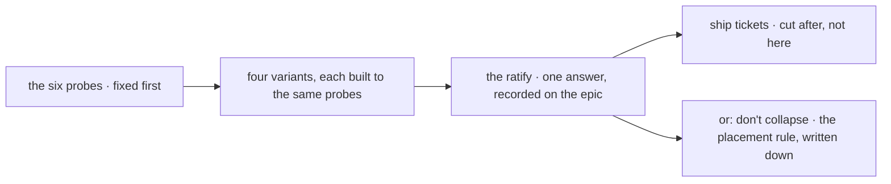

# FIX-1394 · Package cohesion — one package format, two attachment modes

**Spec** · [Decisions](DECISIONS.md) · [Rules](BUSINESS-RULES.md) · [Plan](PLAN.md)

Feature (exploration) · `workforce` + `orchestration` · large · POC matrix → ratify → ship tickets (not cut here) · epic [FIX-1407](https://github.com/fixpoint-labs/flow-state-dev/pull/1905)

## Five people, before and after

| Someone who… | Today | After this issue |
|---|---|---|
| **wants to give a seat one new capability** | Picks between seven file conventions with no rule saying which. Instructions go in one, a tool in another, a document in a third, and the reusable version of the same thing in a fourth | Still picks — but from a ratified rule, backed by a built comparison rather than by whoever argued last |
| **wants to hand another team a working capability** | Sends a folder and a paragraph of instructions on where to put it and which line to add. There is no unit that travels | Knows what a shippable unit is, and what the receiver still has to do by hand |
| **writes a skill that needs a tool** | Declares `allowed-tools`, watches it get validated, and gets no tool. The seat's own `tools:` is the only grant, and nothing says so at the point of writing | Knows this is the rule rather than a bug, and whether it is the rule we are keeping |
| **builds the next thing on top of a seat** (boards, channel admin) | Decides twice — once for the seat surface, once for the skill surface — and picks a side the other child may contradict | Builds against one ratified contract, or against a written rule that two surfaces are correct |
| **has a workforce running today** | — | Today's behaviour, byte for byte. This issue ships no format and changes no file |

**Why now.** Half this epic's title is package cohesion, and two of its siblings grow board and
tool surfaces on top of whichever answer we land on. Whoever builds first will settle this by
accident if nobody settles it on purpose ([ER-15](https://github.com/fixpoint-labs/flow-state-dev/pull/1905)).

**What this issue is not.** It does not ship a package format. Its deliverable is a built
comparison and a ratified answer — and *don't collapse* is one of the four answers it can return,
not a strawman. If the comparison says the two systems are correctly two, that result is worth
the same as any other, and it is the outcome that costs the framework least.

## What changes


The gate is the same line in both halves, and this issue does not move it. What moves is the left
column collapsing into one box with two modes — **if** the ratify chooses that; the right half is
one of four possible answers, not a foregone one. Whether a package may ever cross that gate on
its own is [D1](DECISIONS.md#d1), and it is the thing worth your attention.

**The rule as it stands today, verified in the code rather than read off a doc** — every source of
a tool passes through one key in the seat's own file:

```diff
  # teams/support/workers/clerk/WORKER.md
  ---
  description: Handles the front desk.
  tools: [desk-note]
  ---
```

```diff
  # a skill the clerk holds, in any of its three folders
  ---
  name: check-inventory
  description: Looks up stock.
- allowed-tools: [inventory]      ← validated, and then granted nothing
  ---
```

`inventory` is not in the clerk's `tools:` list, so the clerk cannot call it — no matter what the
skill declares. That is deliberate and enforced at four separate points
([`BUSINESS-RULES.md → BR-1`](BUSINESS-RULES.md)), and it is the constraint every candidate
package format has to survive.

## What this issue produces



The probes are fixed before any variant is built, which is the only thing that makes four builds
comparable ([D2](DECISIONS.md#d2)). Nothing merges to `main` from this issue.

## What stays as it is

- **The grant gate.** A seat's `tools:` list stays the one thing that decides what it may call.
  This issue proposes no hole in it and no exception to it.
- **`SKILL.md` as the Agent Skills format.** Compatibility with external skill directories is a
  property we have, not one we are spending here.
- **Everything FIX-1377 and FIX-1416 just landed.** Both merged to `main` while this was being
  written ([PLAN.md → At implement time](PLAN.md)); this writes against the shipped code, not
  against their specs as the epic still records.
- **FIX-1430's proof.** It consumes the *ratified contract*, so it is not waiting on a package to
  ship.

## Sign off

1. **[D1](DECISIONS.md#d1) · A package *supplies*; the seat's own file still *grants*.** Attaching
   a package never widens what a seat may call. *If wrong:* handing a team a capability stays a
   two-step job forever, and every "why doesn't my skill's tool work" question stays a question —
   or, if we go the other way, the fence three issues just finished enforcing gets its first hole.
2. **[D2](DECISIONS.md#d2) · Four variants, one fixed probe set, and *don't collapse* is one of
   the four.** *If wrong:* we spend four builds on a comparison whose probes were chosen to suit
   whichever variant was written first, and ratify a format on it.

**Open: none.** The one question that was — whether five session-policy walls the epic loaded onto
this POC belong here — went up under ER-15 and came back ruled: one stays, four return, and
FIX-1385 takes the board-row one ([Settled](DECISIONS.md#settled)). Number 1 is the one to weigh.
The reasoning and what lost: [DECISIONS.md](DECISIONS.md). The cases:
[BUSINESS-RULES.md](BUSINESS-RULES.md).
