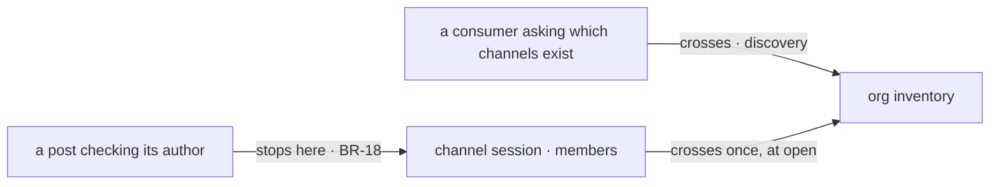

# FIX-1405 · Business rules

[Spec](SPEC.md) · [Decisions](DECISIONS.md) · **Rules** · [Plan](PLAN.md)

The cases, written as rules. Each says what a person or the system does and what happens. The
*proved by* column is the check the plan runs. A human reviews this page; the plan turns it into
work.

## Reading the declared tree

| # | When | Then | Proved by |
|---|---|---|---|
| BR-1 | An app reads a tree that loads cleanly | Records for every worker, team, document and channel the three readers return, in their walk order, and an empty `problems` | CI · the same tree both labs read |
| BR-2 | Any reader reports an error | One entry in `problems` per reported path, each carrying the layer it came from, the path, and the reader's own wording verbatim | CI |
| BR-3 | A seat's skills fail at a level shared by several seats | One entry per affected seat, not one for the level — the way the underlying reader reports it | CI · the red state is a single entry |
| BR-4 | A tree has problems | Every record that loaded is still returned. Nothing throws | CI |
| BR-5 | The root itself is unreadable or a symlink | Throws, naming the root — the rule all three readers already follow | CI |
| BR-6 | A folder no reader walks is added (`boards/`, say) | The records are identical and `problems` is still empty. An unwalked folder is neither an error nor a record | Goal check · the existing decoy-tree control |
| BR-7 | A team declares a `TEAM.md` | It appears in `teams`. A team with no file is absent, not present-and-empty | CI |

## Writing the live inventory

| # | When | Then | Proved by |
|---|---|---|---|
| BR-8 | The binder runs over a roster | One row per channel and one per seat, keyed by the record's own id, in the org the binder was given | CI |
| BR-9 | The binder runs again over an unchanged roster | A no-op. Rows are upserted; nothing duplicates and nothing is appended | CI |
| BR-10 | The binder runs after a channel's members changed in the file | The row reflects what the **open channel** holds, not the file. Re-opening is not a migration and neither is this | CI |
| BR-11 | The binder is given no `orgId` | Refuses, naming the roster. An org-scoped write with no org is a write nobody can read back | CI · the red state is a silent empty inventory |
| BR-12 | One row fails to write | The rest are still attempted and the failure is named. One bad channel is not an app with no inventory | CI |
| BR-13 | An app never turns the inventory on | Nothing declared, nothing written, channels behave as today byte for byte | CI · the off state (BP-035) |

## Reading the live inventory

| # | When | Then | Proved by |
|---|---|---|---|
| BR-14 | A flow in the same org reads the channel collection | Every open channel's row: its id, its kind, its members, and when it opened | CI |
| BR-15 | A flow in a **different** org reads it | Nothing. An org-scoped resource is keyed by org; this is the multi-tenant boundary (BP-035) | CI · two orgs, one process |
| BR-16 | A consumer holds both a declared record and a live row | They join on `id` and nothing else. No mapping table, no second identity | CI · type-level and at run time |
| BR-17 | A seat asks which channels it is in | The rows whose `members` contain its id — a filter over the collection, not a new index | CI |
| BR-18 | A caller wants to know whether a post will be accepted | It asks the channel. The inventory's `members` is a discovery mirror, and a stale mirror is a wrong answer to an authorization question | CI · the inventory is never read on the post path |
| BR-19 | A seat reaches the inventory through a tool | Only if its own `tools:` names that tool. A block colocated with the seat that its file does not name is still not callable, and this change does not widen the fence | CI · the red state is an unnamed tool resolving |

One path crosses each way, and the middle one does not cross at all. That middle path is BR-18, and it is the rule most likely to be got wrong by someone reading the inventory as a source of truth about membership.

## Failure taxonomy

**Fatal:** an unreadable root (BR-5), and a binder run with no org (BR-11). Both are wiring
mistakes an app cannot recover from and should not boot past.

**Collected, never thrown:** everything the three readers report (BR-2, BR-4), and a per-row write
failure (BR-12). The caller decides what is fatal, which is the rule the readers already follow.

**Silent and correct:** an app that never turns the inventory on (BR-13), and an org with no rows
yet (BR-14 returning nothing). Neither is an error.

Nothing retries.

## Acceptance criteria this issue owns

Both labs read their tree through the one shared export, their private copies are gone, and every
existing goal check still passes — including the decoy-tree control (BR-6), which is what makes
"the composer changed nothing about what the tree produces" a measurement rather than a claim.
Separately, a channel opened under an org appears in that org's inventory and is readable from a
second flow in the same org, and not from one in another org (BR-15).
