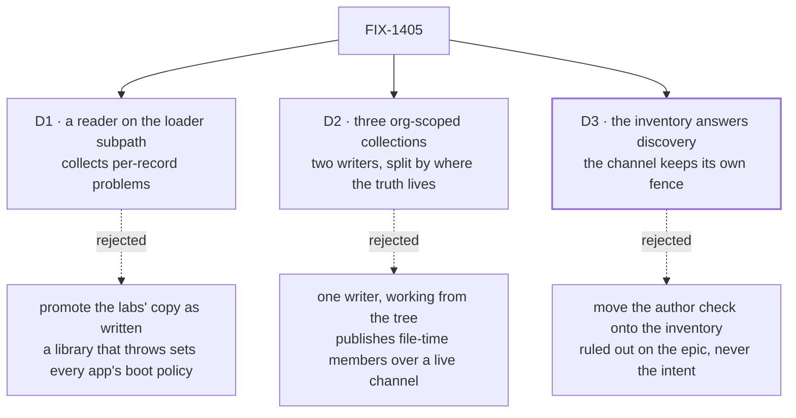

# FIX-1405 · Decisions

[Spec](SPEC.md) · **Decisions** · [Rules](BUSINESS-RULES.md) · [Plan](PLAN.md)

The **two-layer shape is not decided here** — it is D5 on the epic
([#1905](https://github.com/fixpoint-labs/flow-state-dev/pull/1905)), locked 2026-09-16 and
ratified at the objective gate. These three decide how it gets built.

## The tree

Solid edges are what you are signing; dashed ones lost, and the label says why. D3's heavy border is
the Architect's ruling: recorded, not open.

## D1 · The declared roster is a reader on `@flow-state-dev/workforce/loader`; it collects per-record problems, and only an unreadable root throws

| | |
|---|---|
| **Instead of** | Promoting the labs' `readLabTree` as written, which throws on any problem · or putting the export on the package root |
| **Because** | Each reader under it says, in its own header, that a library handing back data does not set an app's boot policy; a promoted throw makes the shared export the one exception. And the package root is deliberately node-free — the readers sit behind `./loader` so importing it does not pull a consumer onto `node:fs` |
| **Locks in** | Every caller writes its own one-line refusal, so that line stays duplicated in both labs — the one part genuinely each lab's. A published subpath is breaking to move, so this is the moment to place it |

The one exception is the root: unreadable or a symlink throws, naming it
([BR-5](BUSINESS-RULES.md)), because all three readers already do and there is no record to collect
against. Everything below the root is collected.

What the helper shares is the flattening: five error channels into one `problems` list, each entry
tagged with its layer — the part both labs got wrong independently. It also returns `teams`, which
neither lab surfaces although `readWorkforce` has returned it since `TEAM.md` landed.

## D2 · The live inventory is three org-scoped collections, with **two writers** split by where the live truth lives

| | |
|---|---|
| **Instead of** | Writing rows lazily on the first post · one writer, working from the declared roster · one collection holding a union of the row shapes |
| **Because** | Lazy leaves an untouched channel invisible — the staleness this layer exists to remove. Separate collections keep each row schema closed and let a consumer read only what it needs. And the two row types keep their live truth in different places, so one writer cannot be right for both |
| **Locks in** | The inventory is only as complete as the org its sessions were opened under, and a session's org is fixed at creation — an app that opens channels with no org gets an empty one permanently. Turning it on is a boot option; an app that does not is unaffected |

**The two writers.** A **seat** has no session, and its live truth is the roster the process was
hired from — so the binder upserts seat rows directly. A **channel** has a session, and its
`members` live there and nowhere else — so the channel writes its own row as it registers, from its
own state; the binder names it and carries **no member data** ([BR-10a](BUSINESS-RULES.md)).
[PLAN → Write moments](PLAN.md) is canonical for the order and the cost.

This rules out one writer working from the roster. The roster holds the **file's** copy of
membership; an open channel's `members` live in its session, which is where the post fence and the
fan-out read them. A writer working from the tree would publish the file-time copy under a live name
for any channel whose session holds something else — one a bind refused, one another process opened,
one minted by a kind this roster does not describe. That is the declared layer's copy of membership
wearing a live name, which [D3](#d3) refuses and [BR-10](BUSINESS-RULES.md) forbids.

A re-bind now re-derives an open channel's declared projection — board list, **members**, charter —
from its file ([FIX-1385](https://linear.app/fixpoint-labs/issue/FIX-1385)'s BR-18, on the same
`channel-binder.ts` path this spec cites). So the two copies converge once a boot rather than never.
That narrows the window; it does not move the truth. The channel still writes its own row from its
own session state, which is why the row follows a file edit at the **next boot** and not at the
edit.

**Why a third collection.** A collection's only narrowing is `list(prefix)`, which the store
compiles to a key predicate — a real source-side filter. Membership is a *field*, not a key, so
"which channels is this seat in" over the channel collection loads every channel and discards most,
which BP-033 refuses. Keying the fact — `inventory/members/<seatId>/<channelId>` — makes it one
prefix read. It is a **projection of the channel row, not a second source of truth**: same writer,
same upsert, same session state. ER-12 forbids a parallel index *that can disagree*; this one cannot
be written without the row it derives from.

Read the bottom row. An open channel with no traffic is the common case at boot, and where lazy
writing quietly reports the org short.

## D3 · The live inventory answers cross-channel discovery; a channel session keeps answering its own post fence

| | |
|---|---|
| **Instead of** | Moving membership, the author check and the fan-out roster onto the inventory — the literal reading of the epic's ER-3 |
| **Because** | A channel's `members` is already live: written when it opens, read on the refusal path, in the same session the post lands in. Moving it to an org resource puts one fact in two places that can disagree, and makes every post pay a lookup for what the session already holds. What a session cannot answer is anything *across* channels — which exist, which ones a seat is in, whether a pair already has somewhere to talk. That is the gap, and the whole gap |
| **Locks in** | The inventory is a **discovery** surface, never an authorization one. FIX-1385 assigns from the inventory and posts through the channel; FIX-817 reads the inventory and never the fence |

**Confirmed by the Architect, 2026-09-19.** Raised as an ER-15 item rather than decided locally,
because ER-3 admits two readings: a contrast with the **declared** layer, or an instruction to
relocate ChannelFlow's fence. The ruling
([#1905](https://github.com/fixpoint-labs/flow-state-dev/pull/1905#issuecomment-5738911437)): the
second "was never the intent". **What would reopen it** is evidence that a channel's `members` is
*not* current on the refusal path. A caller finding the second lookup inconvenient is not that.

## Decided, not asked

- **The collections declare `flowIsolation: false` explicitly**, unlike `defineSkillsCollection`,
  which leaves it undefined. An undefined org entry inherits `flowIsolateOrgState`, so an app
  setting that flag would give every flow a private inventory and silently break BR-14, BR-21 and
  BR-24. A shared directory is the point, which is why it diverges from the precedent.
- **The binder upserts and never deletes** ([BR-23](BUSINESS-RULES.md)). Reconciling means deleting
  from a roster that may be partial, which can remove a live channel's row — worse than a row
  outliving its file. A reconcile verb is a follow-up if a consumer needs one.
- **One prefix, three patterns** — `inventory/seats/*`, `inventory/channels/*`,
  `inventory/members/**`. Not configurable; nothing asked for it.
- **`DeclaredRoster.channels` inherits `readChannelsDirectory` exactly**, including that there is no
  `org/channels/` level the way there is for resources. The composer widens no reader.
- **The inventory is an option on the existing boot call**, not a custom kind an app registers.
- **A row's `id` is the record's `id`.** That is the whole join rule: no mapping table.
- **The seat `tools:` fence is not widened** (BR-19). It shipped stricter than FIX-1416's spec
  promised; this spec is written to the code.
- **A `patch` changeset per PR**, PR-A's included — ruled in review.
- **`createWorkforceCapability` is not touched** — a pre-existing stub, flagged as a follow-up.

## Considered and dropped

| Alternative | Why not |
|---|---|
| Ship the inventory as a capability | A capability earns its place carrying tools or context. This carries neither yet; FIX-817 adds the tools and can wrap these then |
| One collection, a discriminated row schema | Saves an export, costs a union schema, forces a consumer wanting channels to read seats too (BP-033) |
| Filter membership in memory over the channel collection | What round 1 caught. `list()` narrows by key prefix only, so it loads every channel and discards most — BP-033, and it degrades with org size rather than at a threshold a test would notice |
| A resource collection over `SessionStore.list` instead of rows | Checked in review: `handleListSessions` in `session-routes.ts` does not forward `orgId`, so there is no org-narrowed session listing to build on |
| Ship the channel collection only, and let a later child add seats | Round 1's second look, and a fair challenge — no rule here read a seat row. The rules were incomplete, not the collection: ER-3 names membership and fan-out, both of which start from *which seats exist*, and a block cannot walk folders to find out. [BR-21](BUSINESS-RULES.md) is the missing rule, [two writers](#two-writers) the missing trigger |
| An `assert…` helper beside the reader | A second export whose body is a throw, saving each caller one line. The line is policy; the flattening is what was worth sharing |
| Widen `openChannels` to write the rows | Its `client` is a session door by design, typed so the package depends on no client package. Widening a shipped option is breaking |

**Open: none.**

## How it got here

- **Draft** — written against the epic's D5 and the readers on `main`. D3 was added once the code
  showed `members` is already session-live, which ER-3's wording leaves open to two readings.
- **Review round 1** — the plan's sketch had one writer upserting from the declared roster, a
  file-time copy of membership under a live name; two reviewers found it independently, and D2
  became [two writers](#two-writers) plus [the membership index](#the-membership-index). A second
  look found the seat rows had neither a stated reader nor a stated trigger — both gaps closed
  rather than the rows being dropped. Three claims about landed code were checked before folding:
  the isolation default, the org key's missing tenant component, and the absence of an org-narrowed
  session listing.
- **Architect ruling** — D3 confirmed; the relocation reading "was never the intent".
