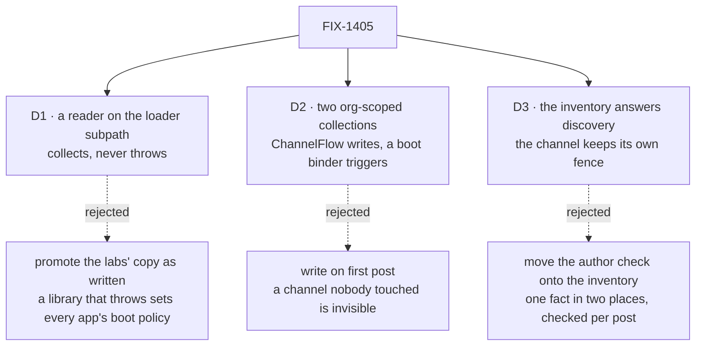

# FIX-1405 · Decisions

[Spec](SPEC.md) · **Decisions** · [Rules](BUSINESS-RULES.md) · [Plan](PLAN.md)

The **two-layer shape is not decided here** — it is D5 on the epic
([#1905](https://github.com/fixpoint-labs/flow-state-dev/pull/1905)), locked by the owner on
2026-09-16 and ratified at the objective gate. These three decide how that shape is built, and
where each question gets its answer.

## The tree

Solid edges are what you are signing. Dashed edges lost, and the label says why.

## D1 · The declared roster is a reader on `@flow-state-dev/workforce/loader`; it collects problems and never throws

| | |
|---|---|
| **Instead of** | Promoting the labs' `readLabTree` as written, which throws · or putting the export on the package root |
| **Because** | Each reader under it says, in its own header, that a library handing back data does not set an app's boot policy. A promoted throw makes the shared export the one exception. And the root is deliberately node-free — the readers sit behind `./loader` so importing the package does not pull a consumer onto `node:fs` |
| **Locks in** | Every caller writes its own one-line refusal, so that line stays duplicated in both labs — the one part genuinely each lab's. A published export's subpath is breaking to move, so this is the moment to place it |

What the helper shares is the flattening: five error channels into one `problems` list, each entry
tagged with its layer — the part both labs got wrong independently. It also returns `teams`, which
neither lab surfaces although `readWorkforce` has returned it since `TEAM.md` landed.

## D2 · The live inventory is two org-scoped resource collections, written by ChannelFlow, triggered by one boot binder

| | |
|---|---|
| **Instead of** | Writing rows lazily on the first post · a second writer beside ChannelFlow · one collection holding a union of both row shapes |
| **Because** | Lazy leaves a channel nobody has touched invisible, which is the staleness this layer exists to remove. Two collections keep each row schema closed and let a consumer read only what it needs. And the write must run where an org resolves — inside a flow — which `openChannels` is not: it talks to the session route, so no block runs |
| **Locks in** | The inventory is only ever as complete as the org its sessions were opened under, and a session's org is fixed at creation. An app that opens channels with no org gets an empty inventory permanently. Turning it on is one option at boot; an app that does not is unaffected |

Read the bottom row. A channel that is open with no traffic is the common case at boot, and it is where lazy writing quietly reports the org short.

## D3 · The live inventory answers cross-channel discovery; a channel session keeps answering its own post fence

| | |
|---|---|
| **Instead of** | Moving membership, the author check and the fan-out roster onto the inventory — the literal reading of the epic's ER-3 |
| **Because** | A channel's `members` is already live: written when the channel opens, read on the refusal path, in the same session the post is landing in. Moving it to an org resource puts one fact in two places that can disagree, and makes every post pay a lookup for something the session already holds. What a session genuinely cannot answer is anything *across* channels — which exist, which ones a seat is in, whether a pair already has somewhere to talk. That is the gap, and the whole gap |
| **Locks in** | The inventory is a **discovery** surface, never an authorization one. A consumer that needs to know whether a post will be accepted asks the channel. FIX-1385 assigns from the inventory and posts through the channel; FIX-817 reads the inventory and never the fence |

**What would change my mind.** A caller that must decide membership with no channel session in
hand — a fan-out addressing seats before any channel is open. Nothing in the set needs that today.

**This is an ER-15 item, not a local call.** ER-3 reads *"membership, author check, fan-out and DM
find-or-create are answered by the live layer"*. Read as a contrast with the **declared** layer —
do not answer membership from the tree — that is this decision. Read as an instruction to relocate
ChannelFlow's fence, it is not. This card is the sign-off surface for that reading.

## Decided, not asked

- **One prefix, two patterns** — `inventory/seats/*`, `inventory/channels/*`, configurable the way
  `defineSkillsCollection` makes its prefix configurable.
- **The inventory is an option on the existing boot call**, not a custom kind an app registers.
- **A row's `id` is the record's `id`.** That is the whole join rule: no mapping table.
- **Rows are upserted, never appended**, so re-running the binder is a no-op, as `openChannels` is.
- **The seat `tools:` fence is not widened.** Reaching the inventory through a tool means naming
  that tool, as it does for any other (BR-19). The fence shipped stricter than FIX-1416's spec
  promised; this spec is written to the code.
- **`createWorkforceCapability` is not touched** — a pre-existing stub, flagged as a follow-up.

## Considered and dropped

| Alternative | Why not |
|---|---|
| Ship the inventory as a capability | A capability earns its place carrying tools or context. This carries neither yet; FIX-817 adds the tools and can wrap these then |
| One collection, a discriminated row schema | Saves an export, costs a union schema, forces a consumer wanting channels to read seats too (BP-033) |
| Skip the seat collection — the tree lists them | True on disk, false at run time: a block cannot walk folders. It would also decide silently that seats are never hired dynamically, which is on the epic's still-open list |
| An `assert…` helper beside the reader | A second export whose body is a throw, saving each caller one line. The line is policy; the flattening is what was worth sharing |
| Widen `openChannels` to write the rows | Its `client` is a session door by design, typed so the package depends on no client package. Widening a shipped option is breaking |

**Open: none.**

## How it got here

- **Draft** — written against the epic's D5 and the readers as they stand on `main`. D3 was added
  once the code showed `members` is already session-live, which ER-3's wording leaves open to two
  readings.
