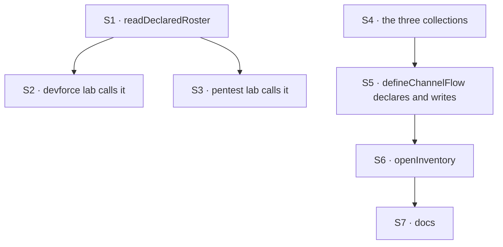

# FIX-1405 · Plan

[Spec](SPEC.md) · [Decisions](DECISIONS.md) · [Rules](BUSINESS-RULES.md) · **Plan**

For the implementing agent. IDs cross-reference [BUSINESS-RULES.md](BUSINESS-RULES.md) (BR-n) and
[DECISIONS.md](DECISIONS.md) (D-n). `tdd`. **Two PRs**, seamed at the two layers. PR-A ships alone
and is useful alone.

## Surfaces

| ID | Package · role | Change | Rules |
|---|---|---|---|
| S1 | `workforce` · `./loader` | **New** `readDeclaredRoster(root)` — a join over the three readers, returning records plus one flattened `problems`. Not a fourth walker (D1) | BR-1 – BR-5, BR-7 |
| S2 | `goals/devforce-lab` · `lab/host.mts` | **Remove** the private `LabRoster` and `readLabTree`; call S1. Keep the lab's own refusal line | BR-1 BR-4 BR-6 |
| S3 | `goals/pentest-lab` · `lab/host.mts` | **Remove** the same copy; call S1 | BR-1 BR-4 |
| S4 | `workforce` · root | **New** `defineSeatInventoryCollection` / `defineChannelInventoryCollection` / `defineMembershipIndexCollection` — org-scoped, modelled on `defineSkillsCollection`, closed row schemas, each declaring **`flowIsolation: false` explicitly** (D2) | BR-14 BR-16 BR-17 BR-21 BR-24 |
| S5 | `workforce` · `defineChannelFlow` | Declare the collections **only when the app asked**, and hold the write. Reads members from **its own session state**, writes the channel row and its index rows in one upsert. On the **factory**, never behind a `kind === "channel"` branch (BR-22). Follow the fan-out entry's precedent: no slot, no declared entry | BR-8 BR-10 BR-13 BR-20 BR-22 |
| S6 | `workforce` · a new boot binder | **New** `openInventory` — upserts **seat** rows from the roster it holds, and registers **channels** by id only, **carrying no member data** (BR-10a). Refuses with no org; collects per-row failures; deletes nothing (BR-23) | BR-8 BR-9 BR-10a BR-11 BR-12 BR-23 |
| S7 | Docs | `packages/workforce/README.md` rows · one new `apps/docs` page · PR-B's `patch` changeset | — |

**Not a surface, deliberately:** the channel post fence, `hireWorkforce`, the three readers, and
`createWorkforceCapability`.

## Write moments · the one place this is specified

Three surfaces implied three different systems in the first draft. This is the answer; where
anything else disagrees, this wins.

| What | Written by | When | Why there |
|---|---|---|---|
| **Seat rows** | `openInventory`, **directly** | Boot, before or after `openChannels` — order does not matter | A seat has no session-held truth to contradict. Its id and kind come from the roster the binder holds, which *is* the live answer. No flow run, no dispatch |
| **Channel rows** and **their index rows** | **the channel kind**, one action run **per channel, in that channel's own session** | Boot, **strictly after `openChannels`** | Members live in the channel's session state and nowhere else. A flow action runs in one session, so reading channel X's members means running in session X. This is the only shape that satisfies BR-10 |
| **Nothing** | the binder, for member data | never | BR-10a. The binder names channels; it never carries members |

**The binder dispatches for channels only, never for seats.** The boot cost is one extra action run
per **channel**, on a loop that already makes one network `createSession` per channel, serially — it
roughly doubles a boot-time loop and adds nothing per request. Accepted deliberately: the
alternative that avoids it is the binder writing members from the tree, the staleness BR-10 forbids.

**The door `openInventory` takes, and why it is not `openChannels`'.** The binder runs an action
inside each channel's own session, so it needs an **action** door where `openChannels` needs a
session one. Structurally typed, for the same reason `openChannels`' is: this package depends on no
client package, and `@flow-state-dev/engine` is a **devDependency** here — `runAction` is reachable
from a test and not from shipped code. The shipped action client is bound to one `flowKind` at
creation while channels may be several, so the app passes a small adapter closing over it rather
than a client instance. [SPEC → Turning the live inventory on](SPEC.md) shows the shape.

**Why not write the row inside `openChannels`.** Its `client` is a session door by design,
structurally typed so the package depends on no client package. It creates the session through the
session route, where **no block runs** — no flow context to read state or reach a resource from.
Widening it to carry an action door is a breaking change to a shipped option.

**Where the channel's half lives.** On `defineChannelFlow`, so every kind built through the factory
carries it. A custom kind is an arbitrary factory (`ChannelKind = { kind: string } & (() =>
FlowInstance)`), so a hand-rolled one carries the registration action the way `channel-binder.ts`
already requires it to carry `cardinality: "singleton"` — the contract stated at
`channel-flow.ts:322`, which this extends. A kind that does not is a **named** per-row failure
(BR-12), never a silent gap. Put the write behind `kind === "channel"` and BR-14's *every open
channel* is false for any custom kind (BR-22).

## PR plan

| PR | Delivers | Surfaces | depends_on |
|---|---|---|---|
| PR-A | The declared roster, and both labs off their private copies | S1 S2 S3 | — |
| PR-B | The live inventory and its boot binder | S4 S5 S6 S7 | PR-A |

PR-B depends on PR-A only for the docs page's shape; the two layers share no code. **Each PR
carries its own `patch` changeset** for `@flow-state-dev/workforce` — PR-A's included, ruled in
review; do not upgrade either to `minor`. The labs are private and get none.

## Sequence



S4 does not depend on S1: the layers share no code, and the binder takes the roster as an argument
rather than reading one.

## Checks

| ID | Runs after | Passes when |
|---|---|---|
| V1 | S1 | BR-1, BR-2, BR-4, BR-7. Red state: a tree with one bad worker slot, one bad document and one bad channel returns three `problems` **and** every record that loaded |
| V2 | S1 | BR-3 — a failing shared skills level gives one entry per affected seat. Red state: flattened into one |
| V3 | S1 | BR-5 — a symlinked root throws, naming it |
| V4 | S2 S3 | Both labs' suites pass; neither file declares `LabRoster` or `readLabTree` |
| VG | S2 | Goal, real path: `goals/devforce-lab/it-wakes-the-seat-a-file-declared/`, including BR-6's decoy-tree control — what makes "the records did not change" a measurement |
| V5 | S4 | BR-14, BR-16, BR-21 — every open channel's row and every seat's row read back from a flow that is **not** a channel, and a row's id is the record's id the layers join on |
| V6 | S5 S6 | BR-8, BR-9, BR-12. Red state for BR-9: a second run doubling the rows |
| V7 | S6 | BR-11 — no org refuses. Red state: it writes, and every flow reads back empty |
| V8 | S5 | **BR-13, the off state (BP-035).** Nothing declared, nothing written, channel tests byte for byte |
| V9 | S4 S6 | **BR-15, the org boundary (BP-035).** Two orgs in one process, each reading only its own rows |
| V10 | S5 S6 | **BR-10 and BR-10a, the finding round 1 caught.** Open a channel, then run `openInventory` **alone** over a roster whose record for it names different members: the row holds the **session's** members, not the roster's. Red state is the row taking the roster's — what a binder carrying member data would write. **Not a whole boot, deliberately:** [FIX-1385](https://linear.app/fixpoint-labs/issue/FIX-1385)'s BR-18 makes a re-bind refresh an open channel's declared projection from its file, so running `openChannels` first makes the two copies identical and the check stops discriminating |
| V11 | S4 S5 | **BR-17, BP-033.** The membership read is one prefix read. Red state: a full-collection read filtered in memory — assert on the store call, not on the returned rows, since both shapes return the same answer |
| V12 | S5 | BR-20 — the index and the channel row never disagree, because one write produces both |
| V13 | S4 | **BR-15a, the tenant limitation.** Two tenants sharing one `orgId` in one process see the same rows. This check *pins* the limitation rather than fixing it — `resolveOrgStorageKey` (`packages/engine/src/stores/scope-keys.ts:151`) has no tenant component, and tenant store-key isolation is deferred (`createFlowApiRouter.ts:81`). It fails the day someone adds one, which is the point |
| V14 | S4 S5 | **BR-24, the isolation pin.** The same app with `flowIsolateOrgState: true`: a reader flow that is not a channel still sees the rows. Red state is the collections leaving `flowIsolation` undefined — the rows go private per flow and every reader but the writer reads empty |
| V15 | S5 | **BR-22, custom kinds.** Register a second kind through `channelInstances`'s `kinds` map, open a channel of it, and it appears in the inventory. Red state: the write behind a `kind === "channel"` branch, so only the built-in's channels have rows |
| V16 | S6 | **BR-23, no deletion.** Boot twice, the second time with a roster missing one channel and one seat: the rows the first boot wrote are still there. Red state is a binder that reconciles and drops a live channel's row |

## Pinned names · what an app types

| Where | Name | Why pinned |
|---|---|---|
| `./loader` | `readDeclaredRoster` · `DeclaredRoster` | Public, and FIX-817 specs against it (ER-23). `read*` matches the five readers beside it |
| `DeclaredRoster` fields | `workers` · `teams` · `documents` · `channels` · `problems` | The first four are the readers' own spellings — `documents`, not `resources`, was that reader's deliberate choice — and a goal check already asserts on three |
| Root | `defineSeatInventoryCollection` · `defineChannelInventoryCollection` · `defineMembershipIndexCollection` | Public. `define*Collection` matches `defineSkillsCollection` |
| Root | `openInventory` | Public, and it sits beside `openChannels` at boot. The pairing is the point |
| Storage | `inventory/seats/*` · `inventory/channels/*` · `inventory/members/<seatId>/<channelId>` | Public keys, breaking to move. The third's **shape is the feature**: the seat id must be a whole path segment ahead of the channel id, or the prefix read that makes BR-17 source-filtered does not exist |
| Row identity | the record's `id` | D2, and the whole join rule (BR-16) |

Everything else is yours — the rows' remaining fields, the binder's internals, how the channel kind
holds the write, a `problems` entry's fields beyond `layer`.

## Guardrails

| Rule | Because |
|---|---|
| `readDeclaredRoster` calls the three readers and walks nothing itself | A fourth walk is a fourth answer to "what is in this tree" — ER-12 at this altitude |
| Each entry carries the reader's wording verbatim | The readers own one wording per refusal, checked in their own tests. Re-phrasing gives one failure two spellings |
| The inventory is never read on the post or fan-out path | D3, BR-18. The fan-out reads members from session state on purpose (BP-031); a mirror on a delivery path is a staler second answer |
| Member data is only ever written from a channel's own session state | BR-10a. Anything else republishes the declared layer's file-time copy under a live name, which is D3's whole invent-kill arriving through the back door |
| Every inventory read narrows at the source (BP-033) | `list()` narrows by key prefix only. A question the keys cannot express needs a key that can, not a loop over the collection |
| A declared entry appears only when the app asked for one | The fan-out entry in the same file works this way: an entry that exists to do nothing is worse than none |
| New nullable row fields are `== null`-guarded, older rows still read (BP-030) | Rows are persisted org state that outlives the process (BR-23), and FIX-817 and FIX-1415 will both add to them |
| Every collection spells `flowIsolation: false` | Leaving it undefined inherits `flowIsolateOrgState` (`defineFlow.ts` ~953). A shared directory that goes private per flow when an unrelated app flag flips is the failure nobody would trace back here |
| No code comment cites a spec path | The spec closes and the path rots. CI rejects one; state the reason at the line |

## Docs

- **CREATE** `apps/docs/docs/workforce/inventory.md`, after `channels.md` — what each layer
  answers, which question goes where, the boot snippet. *Voice risk:* "single source of truth" is
  the obvious phrase and it is wrong here; there are two sources answering two questions.
- **EXTEND** `packages/workforce/README.md` — Exports rows for the five new exports, Error
  Semantics rows for BR-5, BR-11, BR-12, and **limitation rows for BR-15a, BR-23 and BR-10** (an org
  boundary, not a tenant one; rows outlive what declared them; a row reports what the open channel
  holds, and a re-bind **does** refresh that from the file, so an edited `CHANNEL.md` reaches the row
  at the next boot rather than at the edit). Do not write the older limitation — that an edit never
  reaches an open channel — which the README states today at the channels section and which
  [FIX-1385](https://linear.app/fixpoint-labs/issue/FIX-1385) makes false. "What channels do not do yet" stays
  true and is not edited: this adds no join or leave verb.
- **A `patch` changeset per PR** for `@flow-state-dev/workforce` (BP-022) — PR-A's included, ruled
  in review. The labs are private and get none.

## Sketch · pseudocode, illustrative, react to the shape

```
readDeclaredRoster(root):
    call the three readers                      ← no walking here
    problems ← for each reader's error channel:
                   one entry per reported path, tagged with its layer,
                   the reader's own message kept verbatim
               (skill errors stay per-seat, not per-level)          BR-3
    return { workers, teams, documents, channels, problems }

openInventory({ seats, channels }, { run, userId, orgId }):
    refuse if no orgId                                              BR-11
    for each SEAT, in id order:
        upsert its row from the roster — id and kind                BR-8
        ← a seat holds no session, so the roster IS the live answer
    for each CHANNEL, in id order:
        dispatch into ITS session: "register yourself"              BR-10a
        ← the binder passes NO member data. It knows the tree,
          and the tree's members are file-time, not live.
    a failure is collected and named; the walk continues            BR-12
    nothing is ever deleted                                         BR-23

a channel registering itself (on defineChannelFlow, not the built-in kind):
    read members from ITS OWN session state                         BR-10, BR-22
    upsert the channel row, keyed by the channel's id               BR-9
    upsert one index row per member,
        keyed inventory/members/<seatId>/<channelId>                BR-17, BR-20
    ← both writes from the one live source, in the one upsert
```

**POC:** none built. Both premises are exercised by shipped code — both labs compose the three
readers today, and `defineSkillsCollection` already puts an org-scoped collection behind a package
export. Round 1's contested claims about landed code were settled by reading the one call site each
turns on — `defineFlow.ts` ~953 for the isolation default, `scope-keys.ts:151` for the org storage
key, `session-routes.ts` for the missing `orgId` on session listing — which is cheaper than a POC
and no less conclusive.

## At implement time

- **Both W3 inputs have landed** since the epic-spec was written, though ER-18 still reads them as
  unlanded specs. Write against the code at `d8e4c99`:
  - **`TEAM.md` (FIX-1377)** — `readWorkforce` returns `teams` and `teamErrors`, and
    `readTeamsDirectory` is exported. That is where BR-7 and the fifth error channel come from.
  - **Custom tools as files (FIX-1416)** — shipped **stricter than its spec**, which said a block
    in a seat's own `blocks/` folder is callable without being listed. `resolveDeclaredTools`
    (`packages/workforce/src/hire.ts:282`, called at `:515`) iterates the seat's declared `tools:`
    and resolves names out of the registry, so a colocated block the file does not name never
    becomes a seat tool. BR-19 is written to the code; do not carry the looser claim forward.
- The two lab copies are **still byte-identical** over the 35 lines this removes — two differing
  lines, a BR number in a comment and a trailing comma. Re-check before deleting; meaningful
  divergence is a finding, not a merge conflict.
- **The FIX-1385 seam, and who rebases.** Both issues edit the channel flow factory and the binder:
  [FIX-1385](https://linear.app/fixpoint-labs/issue/FIX-1385)'s PR-A adds re-bind reconciliation
  (its S4b, on the binder's already-open branch) and the declared-board list on channel session
  state (its S4). **PR-A lands first; PR-B here rebases onto it.** FIX-1385 is the critical path and
  its spec already names this seam one-directionally; this is the other half. The two touch
  different paths on purpose — S4b is the binder's **re-bind** branch, S5 here is the shared
  **ChannelFlow open** path so every kind's channels get rows — so a diff reaching the other's path
  should say which of the two it means.
- **V10 is scoped to `openInventory` alone because of that seam.** Once S4b lands, a whole-boot
  version of the check goes false-green: `openChannels` refreshes the open channel's members from
  the file, so the row legitimately takes the file's values and the stated red state becomes
  indistinguishable from the green. Run the binder alone over a roster that disagrees with the
  session instead — that still discriminates BR-10a, which is the behaviour V10 exists for.
- If FIX-1385 has landed a board surface reading the inventory, it is the third caller and D3's
  boundary is worth re-reading against it.

## Watches from review · not findings, but read them before building

- **`DeclaredRoster.channels` inherits `readChannelsDirectory`'s gaps**, including that there is no
  `org/channels/` level the way there is for resources. Do not teach "the whole tree" as including
  one until that reader closes it.
- **BR-11's no-org refusal lines up with the lean in #1889.** If that lands first, match its
  wording rather than minting a second one for the same condition.
- **Dynamic seat hire stays open on the epic.** The row shapes must tolerate a seat appearing later
  without this spec deciding when it may (ER-15). BR-23 already says a row outlives what declared
  it, so a seat arriving late is an upsert, not a migration.
- **FIX-1385's optional bind-time wiring check** — that a channel declaring a board has some seat
  naming its minted id — would be a second seat-row reader if it lands in that cut. It arrives with
  its own trigger either way, so nothing here waits on it.

## Follow-ups

- **`createWorkforceCapability` is a stub** — a duplicate-name check, a `TODO` naming
  `AgentRegistry` (which ER-6 invent-kills), and a capability carrying nothing. Pre-existing and
  out of scope. Worth a decision: fill it, or retire it.
- **The refusal line is written twice**, once per lab (D1). A third caller is when a shared helper
  earns its place.
- **No reconcile verb** (BR-23). Rows outlive what declared them, deliberately — the binder cannot
  tell a shrunken roster from a partial one. A consumer that needs removal is the trigger to add
  one, with the roster completeness it would require stated at that point.
- **Tenant-scoped store keys are deferred framework-wide** (`createFlowApiRouter.ts:81`). BR-15a
  names the consequence here; closing it is not this issue's to close.
