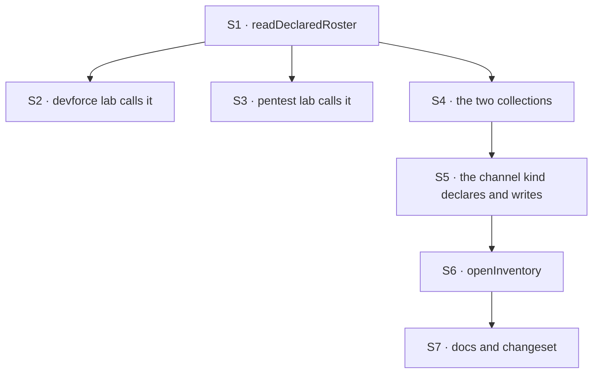

# FIX-1405 · Plan

[Spec](SPEC.md) · [Decisions](DECISIONS.md) · [Rules](BUSINESS-RULES.md) · **Plan**

For the implementing agent. IDs cross-reference [BUSINESS-RULES.md](BUSINESS-RULES.md) (BR-n) and
[DECISIONS.md](DECISIONS.md) (D-n). `tdd`. **Two PRs**, seamed at the two layers. PR-A ships alone
and is useful alone.

## Surfaces

| ID | Package · role | Change | Rules |
|---|---|---|---|
| S1 | `workforce` · `./loader` | **New** `readDeclaredRoster(root)` — a join over the three readers, returning records plus one flattened `problems`. Not a fourth walker (D1) | BR-1 – BR-5, BR-7 |
| S2 | `goals/devforce-lab` · `lab/host.mts` | **Remove** the private `LabRoster` and `readLabTree`; call S1. Keep the lab's own refusal line | BR-1 BR-4 BR-6 |
| S3 | `goals/pentest-lab` · `lab/host.mts` | **Remove** the same copy; call S1 | BR-1 BR-4 |
| S4 | `workforce` · root | **New** `defineSeatInventoryCollection` / `defineChannelInventoryCollection` — org-scoped, modelled on `defineSkillsCollection`, closed row schemas (D2) | BR-14 BR-16 |
| S5 | `workforce` · the channel kind | Declare the collections **only when the app asked**, and hold the write. Follow the fan-out entry's precedent: no slot, no declared entry | BR-8 BR-13 |
| S6 | `workforce` · a new boot binder | **New** `openInventory` — one upsert per seat and channel, in the given org. Refuses with no org; collects per-row failures | BR-8 – BR-12 |
| S7 | Docs | `packages/workforce/README.md` rows · one new `apps/docs` page · one `minor` changeset | — |

**Not a surface, deliberately:** the channel post fence, `hireWorkforce`, the three readers, and
`createWorkforceCapability`.

## PR plan

| PR | Delivers | Surfaces | depends_on |
|---|---|---|---|
| PR-A | The declared roster, and both labs off their private copies | S1 S2 S3 | — |
| PR-B | The live inventory and its boot binder | S4 S5 S6 S7 | PR-A |

PR-B depends on PR-A only for the docs page's shape; the two layers share no code.

## Sequence



## Checks

| ID | Runs after | Passes when |
|---|---|---|
| V1 | S1 | BR-1, BR-2, BR-4, BR-7. Red state: a tree with one bad worker slot, one bad document and one bad channel returns three `problems` **and** every record that loaded |
| V2 | S1 | BR-3 — a failing shared skills level gives one entry per affected seat. Red state: flattened into one |
| V3 | S1 | BR-5 — a symlinked root throws, naming it |
| V4 | S2 S3 | Both labs' suites pass; neither file declares `LabRoster` or `readLabTree` |
| VG | S2 | Goal, real path: `goals/devforce-lab/it-wakes-the-seat-a-file-declared/`, including BR-6's decoy-tree control — what makes "the records did not change" a measurement |
| V5 | S4 | BR-14, BR-16 — a row's id is the record's id and the layers join on it |
| V6 | S5 S6 | BR-8 – BR-10, BR-12. Red state for BR-9: a second run doubling the rows |
| V7 | S6 | BR-11 — no org refuses. Red state: it writes, and every flow reads back empty |
| V8 | S5 | **BR-13, the off state (BP-035).** Nothing declared, nothing written, channel tests byte for byte |
| V9 | S4 S6 | **BR-15, multi-tenant (BP-035).** Two orgs in one process, each reading only its own rows |

## Pinned names · what an app types

| Where | Name | Why pinned |
|---|---|---|
| `./loader` | `readDeclaredRoster` · `DeclaredRoster` | Public, and FIX-817 specs against it (ER-23). `read*` matches the five readers beside it |
| `DeclaredRoster` fields | `workers` · `teams` · `documents` · `channels` · `problems` | The first four are the readers' own spellings — `documents`, not `resources`, was that reader's deliberate choice — and a goal check already asserts on three |
| Root | `defineSeatInventoryCollection` · `defineChannelInventoryCollection` | Public. `define*Collection` matches `defineSkillsCollection` |
| Root | `openInventory` | Public, and it sits beside `openChannels` at boot. The pairing is the point |
| Storage | `inventory/seats/*` · `inventory/channels/*` | Public keys, breaking to move |
| Row identity | the record's `id` | D2, and the whole join rule (BR-16) |

Everything else is yours — the rows' remaining fields, the binder's internals, how the channel kind
holds the write, a `problems` entry's fields beyond `layer`.

## Guardrails

| Rule | Because |
|---|---|
| `readDeclaredRoster` calls the three readers and walks nothing itself | A fourth walk is a fourth answer to "what is in this tree" — ER-12 at this altitude |
| Each entry carries the reader's wording verbatim | The readers own one wording per refusal, checked in their own tests. Re-phrasing gives one failure two spellings |
| The inventory is never read on the post or fan-out path | D3, BR-18. The fan-out reads members from session state on purpose (BP-031); a mirror on a delivery path is a staler second answer |
| A declared entry appears only when the app asked for one | The fan-out entry in the same file works this way: an entry that exists to do nothing is worse than none |
| New nullable row fields are `== null`-guarded, older rows still read (BP-030) | Rows are persisted org state, and FIX-817 and FIX-1415 will both add to them |
| No code comment cites a spec path | The spec closes and the path rots. CI rejects one; state the reason at the line |

## Docs

- **CREATE** `apps/docs/docs/workforce/inventory.md`, after `channels.md` — what each layer
  answers, which question goes where, the boot snippet. *Voice risk:* "single source of truth" is
  the obvious phrase and it is wrong here; there are two sources answering two questions.
- **EXTEND** `packages/workforce/README.md` — Exports rows for the four new exports, Error
  Semantics rows for BR-5, BR-11, BR-12. "What channels do not do yet" stays true and is not
  edited: this adds no join or leave verb.
- **One `minor` changeset** for `@flow-state-dev/workforce` (BP-022). The labs are private.

## Sketch · pseudocode, illustrative, react to the shape

```
readDeclaredRoster(root):
    call the three readers                      ← no walking here
    problems ← for each reader's error channel:
                   one entry per reported path, tagged with its layer,
                   the reader's own message kept verbatim
               (skill errors stay per-seat, not per-level)          BR-3
    return { workers, teams, documents, channels, problems }

openInventory({ seats, channels }, { client, userId, orgId }):
    refuse if no orgId                                              BR-11
    for each record, in id order:
        upsert one row, keyed by the record's id                    BR-9
        a failure is collected and named; the walk continues        BR-12
```

**POC:** none built. Both premises are exercised by shipped code — both labs compose the three
readers today, and `defineSkillsCollection` already puts an org-scoped collection behind a package
export. Nothing here rests on an unchecked claim.

## At implement time

- **Both W3 inputs have landed**, after the epic-spec was written; ER-18 still reads them as
  unlanded specs to write against. Write against the code at `d8e4c99`:
  - **`TEAM.md` (FIX-1377, `038e6bf`)** — `readWorkforce` returns `teams` and `teamErrors`, and
    `readTeamsDirectory` is exported. That is where BR-7 and the fifth error channel come from.
  - **Custom tools as files (FIX-1416, `6c86cfc`)** — it shipped **stricter than its spec**. The
    spec said a block in a seat's own `blocks/` folder is callable without being listed;
    `resolveDeclaredTools` (`packages/workforce/src/hire.ts:282`, called at `:515`) iterates the
    seat's declared `tools:` and resolves names out of the registry, so a colocated block the file
    does not name never becomes a seat tool. BR-19 is written to the code, not the sentence. Do
    not carry the looser claim forward.
- The two lab copies are **still byte-identical** over the 35 lines this removes — two differing
  lines, a BR number in a comment and a trailing comma. Re-check before deleting; meaningful
  divergence is a finding, not a merge conflict.
- If FIX-1385 has landed a board surface reading the inventory, it is the third caller and D3's
  boundary is worth re-reading against it.

## Follow-ups

- **`createWorkforceCapability` is a stub** — a duplicate-name check, a `TODO` naming
  `AgentRegistry` (which ER-6 invent-kills), and a capability carrying nothing. Pre-existing and
  out of scope. Worth a decision: fill it, or retire it.
- **The refusal line is written twice**, once per lab (D1). A third caller is when a shared helper
  earns its place.
