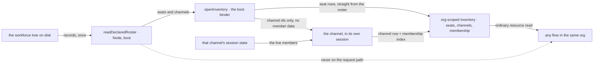

# FIX-1405 · Runtime inventory of seats and channels

**Spec** · [Decisions](DECISIONS.md) · [Rules](BUSINESS-RULES.md) · [Plan](PLAN.md)

Feature · `workforce` · medium · 2 PRs · epic [FIX-1407](https://linear.app/fixpoint-labs/issue/FIX-1407)

## Five people, before and after

| Someone who… | Today | After |
|---|---|---|
| **stands up an app from a declared tree** | Hand-rolls a reader over three loaders and gets the error-flattening wrong. Two labs did this, and their copies are identical | One call returns the whole tree — workers, teams, documents, channels — and one list of what failed to load |
| **runs a seat that needs to know which other seats exist** | Nothing to ask. The tree is on disk, the seat is in a flow, and a flow does not walk folders per request | Reads the org's live inventory the way it reads any other resource |
| **wants to know which channels a seat is in** | Open every channel session and read its members, or re-walk the tree and hope nothing minted since | One list, filtered. The tree answers what was declared; the inventory answers what is open |
| **opens channels without an org** | Every org-scoped lookup silently resolves nothing | Visible: the inventory reads empty, and the binder refuses rather than writing where nobody can read |
| **edits a `CHANNEL.md` after the channel opened** | Today the edit does not reach the channel at all — a re-bind leaves an open channel exactly as it is — and nothing at run time reports either state | The inventory mirrors what the open channel holds, never what the file says, so the gap between the two is **visible** instead of silent. **The edit still does not reach the open channel** — nothing in this wave changes that, and this card does not promise that anything will |

**Why now.** A team can be declared and hired, and nothing at run time answers *which seats and channels exist*. Every consumer that needs it — assigning a team seat, finding a member, fanning out — re-walks the tree or hard-codes an id. Two labs already grew the same private reader, byte for byte, which is the shape of a missing export.

## What changes

![Two layers over one workforce tree. On the left, boot and off the request path: a declared tree of teams, workers, channels and documents is read once by readDeclaredRoster into records plus one problems list, deriving state and registering nothing. One arrow crosses a vertical fence, at boot, carrying those records to openInventory, the boot binder, which carries no member data. On the right the inventory has two writers: the binder upserts a row per seat straight from the roster, because a seat holds no session; each open channel writes its own row and its membership index rows from its own session state. The org-scoped inventory holds one row per registered seat, one per open channel, and a membership index keyed by seat. Any flow in the same org reads it as an ordinary resource. Below the fence, three things named as not built: no second WorkerRegistry, no mega-loader, no DM verb.](figures/two-layers.svg)

Left of the fence is the tree and what it says. Right of it is what is actually open. The one arrow that crosses is boot. Nothing crosses back — a running block never walks a folder.

**Reading the declared tree, as an app writes it:**

```diff
- const roster = await readWorkforce(root);
- const resources = await readResourcesDirectory(root);
- const channels = await readChannelsDirectory(root);
- const problems = [ /* five flattenings, in the right order */ ];
- if (problems.length > 0) throw new Error(`…`);
+ import { readDeclaredRoster } from "@flow-state-dev/workforce/loader";
+
+ const roster = await readDeclaredRoster(root);
+ // roster.workers · roster.teams · roster.documents · roster.channels
+ if (roster.problems.length > 0) throw new Error(describe(roster.problems));
```

**Turning the live inventory on, at boot:**

```diff
  const instances = channelInstances(channels, { kinds });
+ const instances = channelInstances(channels, { kinds, inventory: true });
  await openChannels(channels, { client, userId, orgId });
+ await openInventory({ seats, channels }, { run, userId, orgId });
```

`openChannels` keeps the session door it already takes. **`openInventory` needs a
different one**, and this is the one place an app notices the two-writer split:
a channel's row is written by *the channel*, in its own session, so the binder
has to run an action there — and the session route `openChannels` uses runs no
block. The app supplies that door. It is app boot code, not framework API, and
it is a one-liner over the shipped client because the action client is bound to
one `flowKind` at creation while channels may be several:

```ts
// app boot — whatever your app already uses to run an action
const run = (req) =>
  createClient({ flowKind: req.flowKind, userId: req.userId })
    .sendAction(req.action, req.input, { sessionId: req.sessionId, orgId: req.orgId });
```

**Reading it, from any flow in that org:**

```diff
+ resources: {
+   seats: defineSeatInventoryCollection(),
+   openChannels: defineChannelInventoryCollection(),
+   seatChannels: defineMembershipIndexCollection(),
+ },
+ // which seats this org actually has, at run time
+ // ctx.resources.seats.list()
+ // every open channel in the org, whatever kind minted it
+ // ctx.resources.openChannels.list()
+ // just the ones this seat is in — a key match, not a scan of every channel's member list
+ // ctx.resources.seatChannels.list(membershipPrefix(seatId))
```

## How a consumer reaches each layer



Two writers, split by where the live answer lives: a seat holds no session, so the roster is its
truth; a channel's members live in its session, so the channel writes its own row. Member data
never travels through the binder. The dashed edge is what this spec refuses — a running block
reaching back to the tree.

## What stays as it is

- **A channel's own post and members fence.** `members` on the channel session still decides who may post and who the fan-out reaches. The inventory mirrors it for discovery; it does not become the check ([D3](DECISIONS.md#d3), confirmed by the Architect).
- **What counts as a declared channel.** `readChannelsDirectory` walks `teams/<id>/channels/` only — there is no `org/channels/` level the way there is for resources. `DeclaredRoster.channels` inherits that exactly, so the docs say *the channels the readers find*, never "every channel in the tree".
- **Membership itself.** No join or leave verb. Changing who is in a channel is still editing the record and opening a fresh one — [FIX-1415](https://linear.app/fixpoint-labs/issue/FIX-1415)'s ground.
- **`hireWorkforce`, the three readers, and `team.*` wildcards.** Untouched. Seats still mint synchronously from no files; the declared roster is a join over the readers, as `readWorkforce` is a join over two; the wildcards call this layer later, not at first ship (ER-7).
- **The seat's `tools:` fence.** Reaching the inventory through a tool means naming that tool, as it does for any other. This widens nothing.
- **Who is isolated from whom.** The inventory is keyed by org, and the framework does not yet put a tenant in that key — so a host serving several tenants keeps org ids distinct across them ([BR-15a](BUSINESS-RULES.md)). Rows also outlive the files that declared them: deleting a `CHANNEL.md` does not delete its row ([BR-23](BUSINESS-RULES.md)).

**Written against landed code on `main` at `d8e4c99`**, not a sibling's spec. Both W3 inputs the epic listed as unlanded have merged — `TEAM.md` (FIX-1377) and custom tools as files (FIX-1416). The second shipped **stricter** than its spec promised, so a block colocated with a seat that the seat's file does not name is still not callable. Where the two disagree, this spec follows the code.

## Sign off

1. **[D2](DECISIONS.md#d2) · The live inventory is three org-scoped resource collections, with two writers — the boot binder for seat rows, the channel itself for channel rows.** If wrong: the inventory is only as complete as the org its sessions were opened under, and an app that opens channels under no org gets an empty one.
2. **[D1](DECISIONS.md#d1) · The declared roster ships on `@flow-state-dev/workforce/loader` and collects per-record problems; only an unreadable root throws.** If wrong: a published export in the wrong place is a breaking move later, and a library that throws sets every app's boot policy for it.
3. **[D3](DECISIONS.md#d3) · The live inventory answers cross-channel discovery; the channel session keeps answering its own post and members fence.** **Confirmed by the Architect** on the epic ([#1905](https://github.com/fixpoint-labs/flow-state-dev/pull/1905#issuecomment-5738911437)): relocating the post fence "was never the intent". Recorded, not open.

**Open: none.** Number 1 is the one to weigh — it is the only one that adds a call an app has to make. Reasoning and what lost: [DECISIONS.md](DECISIONS.md). The cases: [BUSINESS-RULES.md](BUSINESS-RULES.md).
