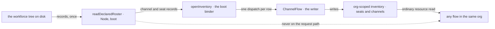

# FIX-1405 · Runtime inventory of seats and channels

**Spec** · [Decisions](DECISIONS.md) · [Rules](BUSINESS-RULES.md) · [Plan](PLAN.md)

Feature · `workforce` · medium · 2 PRs · epic [FIX-1407](https://linear.app/fixpoint-labs/issue/FIX-1407)

Written against **landed code on `main` at `d8e4c99`**, not against a sibling's spec. Both W3 inputs the epic listed as unlanded have since merged — `TEAM.md` (FIX-1377, `038e6bf`) and custom tools as files (FIX-1416, `6c86cfc`) — so this reads the tree and the `tools:` fence as they now behave.

## Five people, before and after

| Someone who… | Today | After |
|---|---|---|
| **stands up an app from a declared tree** | Hand-rolls a reader over three loaders and gets the error-flattening wrong. Two labs did exactly this, and their copies are identical | One call returns the whole tree — workers, teams, documents, channels — and one list of what failed to load |
| **runs a seat that needs to know which other seats exist** | Nothing to ask. The tree is on disk, the seat is in a flow, and a flow does not walk folders per request | Reads the org's live inventory the way it reads any other resource |
| **wants to know which channels a seat is in** | Open every channel session and read its members, or re-walk the tree and hope nothing minted since | One list, filtered. The tree answers what was declared; the inventory answers what is open |
| **opens channels without an org** | Every org-scoped lookup silently resolves nothing | Now visible: the inventory reads empty, and the binder refuses rather than writing where nobody can read |
| **edits a `CHANNEL.md` after the channel opened** | The edit does not reach the open channel | Unchanged. The inventory mirrors what is open, not what the file now says |

**Why now.** A team can be declared and hired, and nothing at run time answers *which seats and channels exist*. Every consumer that needs it — assigning a team seat, finding a member, fanning out — re-walks the tree or hard-codes a literal id. Two labs already grew the same private reader, byte for byte, which is the shape of a missing export.

## What changes

![Two layers over one workforce tree. On the left, boot and off the request path: a declared tree of teams, workers, channels and documents is read once by readDeclaredRoster into records plus one problems list, deriving state and registering nothing. A vertical fence separates it from the right, the request path, where an org-scoped live inventory holds one row per open channel and one per registered seat, written by ChannelFlow as channels open and read by any flow in the same org through an ordinary resource. An arrow from the left crosses the fence once, at boot, carrying the records the binder registers. Below the fence, three things named as not built: no second WorkerRegistry, no mega-loader, no DM verb.](figures/two-layers.svg)

Left of the fence is the tree and what it says. Right of it is what is actually open. The one arrow that crosses is boot: the records are read once, and the binder writes them in. Nothing crosses back — a running block never walks a folder.

**Reading the declared tree, as an app writes it:**

```diff
- const roster = await readWorkforce(root);
- const resources = await readResourcesDirectory(root);
- const channels = await readChannelsDirectory(root);
- const problems = [ /* five flattenings, in the right order */ ];
- if (problems.length > 0) throw new Error(`…`);
+ import { readDeclaredRoster } from "@flow-state-dev/workforce/loader";
+
+ const roster = await readDeclaredRoster(root);
+ // roster.workers · roster.teams · roster.documents · roster.channels
+ if (roster.problems.length > 0) throw new Error(describe(roster.problems));
```

**Turning the live inventory on, at boot:**

```diff
  const instances = channelInstances(channels, { kinds });
+ const instances = channelInstances(channels, { kinds, inventory: true });
  await openChannels(channels, { client, userId, orgId });
+ await openInventory({ seats, channels }, { client, userId, orgId });
```

**Reading it, from any flow in that org:**

```diff
+ resources: { openChannels: defineChannelInventoryCollection() },
+ // in a block: ctx.resources.openChannels.list()
```

## How a consumer reaches each layer



One writer, one resource, one read path. The dashed edge is the thing this spec refuses: a running block reaching back to the tree.

## What stays as it is

- **A channel's own post fence.** `members` on the channel session still decides who may post and who the fan-out reaches. The inventory mirrors it for discovery; it does not become the check ([D3](DECISIONS.md#d3)).
- **Membership itself.** No join or leave verb. Changing who is in a channel is still editing the record and opening a fresh one — [FIX-1415](https://linear.app/fixpoint-labs/issue/FIX-1415)'s ground.
- **`hireWorkforce`.** Still reads no files and mints seats synchronously. When a seat may be hired *dynamically* is not decided here.
- **`team.*` wildcards.** They call this layer later, not at first ship (ER-7).
- **The seat's `tools:` fence.** A seat reaching the inventory through a tool must name that tool in its own `tools:`, exactly as it must for any other. This widens nothing and adds no tool.
- **The three readers.** Untouched. The declared roster is a join over them, as `readWorkforce` is a join over two.

## Sign off

1. **[D3](DECISIONS.md#d3) · The live inventory answers cross-channel discovery; the channel session keeps answering its own post fence.** If wrong: every post pays a second lookup, one fact lives in two places that can disagree, and FIX-1385 builds assignment on the wrong one — a rewrite, not an adjustment.
2. **[D1](DECISIONS.md#d1) · The declared roster ships on `@flow-state-dev/workforce/loader`, collects problems, and never throws.** If wrong: a published export in the wrong place is a breaking move later, and a library that throws sets every app's boot policy for it.
3. **[D2](DECISIONS.md#d2) · The live inventory is two org-scoped resource collections, written by ChannelFlow, triggered by one boot binder.** If wrong: the inventory is only as complete as the org its sessions were opened under, and an app that opens channels under no org gets an empty one.

**Open: none.** Number 1 is the one to weigh, and it is the one [FIX-1385](https://linear.app/fixpoint-labs/issue/FIX-1385) and [FIX-817](https://linear.app/fixpoint-labs/issue/FIX-817) build against. Reasoning and what lost: [DECISIONS.md](DECISIONS.md). The cases: [BUSINESS-RULES.md](BUSINESS-RULES.md).
