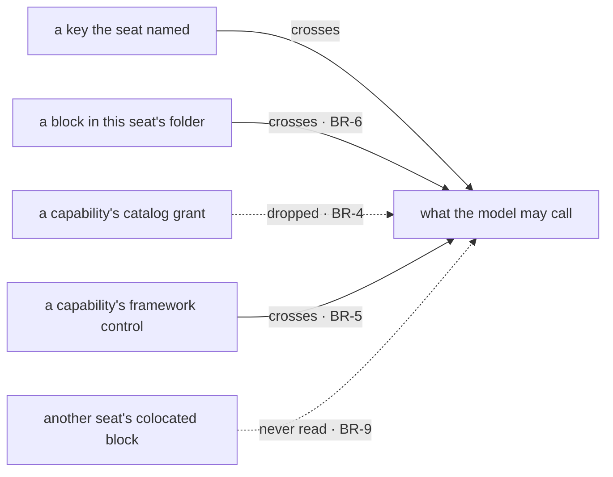

# FIX-1416 · Business rules

[Spec](SPEC.md) · [Decisions](DECISIONS.md) · **Rules** · [Plan](PLAN.md)

The cases, as rules. *Proved by* is the check the plan runs. Rows marked **unchanged** are pinned
here because this issue is the first thing to depend on them and a regression would be silent.

## Naming a tool the app shipped

| # | When | Then | Proved by |
|---|---|---|---|
| BR-1 | An app hands the generated `blocks` map over as the agent kind's catalog, and a seat's `tools:` names one of its keys | The model may call it, and calling it reaches the block's `execute` | CI · the POC, graduated |
| BR-2 | A seat names a key the catalog does not carry, including when there is no catalog | Refused when the workforce is hired, naming the tool and the fix | **unchanged** · existing suite |
| BR-3 | A map entry's key and the block's own `name` disagree — in the app's catalog **or** in a seat's own folder | Refused when the workforce is hired, naming both and saying which one the model would have seen | CI, both maps |
| BR-4 | A capability attached through `uses` contributes a catalog tool | Dropped. Every seat of this kind declares `tools:`, so the fence is always up | **unchanged** · `packages/core/test/generator-tools-fence.test.ts` + a workforce-level check |
| BR-5 | That same capability contributes a framework control through `controlTools` | It still reaches the seat | **unchanged** · same |

## A tool sitting beside the worker

| # | When | Then | Proved by |
|---|---|---|---|
| BR-6 | A `.ts` file sits in `teams/<team>/workers/<worker>/blocks/` | It is discovered and that seat may call it, with no `tools:` entry anywhere | CI · fixture tree |
| BR-7 | That seat's `tools:` is empty, or absent | It may call its own folder's blocks and **nothing else** — no catalog tool, no capability grant | CI |
| BR-8 | Two tools reaching one seat resolve to the same **tool name** — a colocated block and a catalog tool the seat named, by any spelling | Refused when the workforce is hired, naming both sources. Stated over resolved names, not map keys, so a colocated `bar` colliding with a catalog `bar` is caught at the door rather than on the first turn. No precedence is invented | CI |
| BR-9 | Two seats each have a `blocks/summarize.ts` | Neither sees the other's. Isolation is a property of what was read for that seat, exactly as it is for skills | CI |
| BR-10 | A `blocks/` folder sits at the org or the team level | Refused by `fsdev gen`, with the two supported places named. Not read, and not ignored. **This rule is what PR2 builds against**, and it is the recommendation in [DECISIONS → Open](DECISIONS.md#open) rather than an answer to it: the product question is still open, and widening this rule later is additive — it changes no file that already exists | CI |
| BR-11 | A seat delegates to a board worker | The delegating seat's colocated tools do not travel. The board worker gets its own | CI |
| BR-12 | A `tools/` folder sits anywhere in the tree | Refused by `fsdev gen`, naming `blocks/` as the convention. Today it is passed over in silence | CI |
| BR-13 | A colocated block's basename breaks the segment rules — uppercase, a dot, a Windows device name | Refused, by the rule every other file-named level already uses | CI |
| BR-14 | A worker folder has no `blocks/` folder | Nothing changes for that seat, in any observable way | CI |
| BR-15 | A colocated block **declares** its own resources (its own `resources`, or a capability through `uses` that carries them) | Refused when the workforce is hired, naming the block and both fixes: declare the store on the kind, or move the block to `workforce/blocks/` and name it in `tools:` | CI · red state first (see below) |
| BR-16 | A colocated block **uses** a store the kind already installed | It works. Declaring is what is refused, not using | CI |

The same four crossings as the figure in [SPEC.md](SPEC.md), by name rather than by position, plus
the one that is not a crossing at all because nothing reads it.

## Failure taxonomy

Every refusal here lands at one of two moments: `fsdev gen` walking the tree, or `hireWorkforce`
minting the seats. **Nothing fails on a seat's first turn**, which is the bargain the whole file
convention already makes — a bad tree is a build error with a path in it, not a model that
mysteriously cannot call something.

**BR-15 is the rule that bargain exists for, and it has a real red state.** Wired naively, a
colocated block that declares a store is hired without complaint, advertised to the model, called,
and finds the handle absent — and the turn *does not error*. The POC on this branch runs exactly
that (test 6). So the check for BR-15 is not "does it throw": it is that the block never reaches a
model at all, because hire refused it by name. Nothing degrades and nothing retries. A `gen` run that hits any
refusal writes no file, so a registry is never left quietly short.

## Acceptance criteria this issue owns

A seat in the pentest lab calls a custom block it named in `tools:`, on a real model, and the run
shows the block's own `execute` ran — the soft-expand of
[FIX-1355](https://linear.app/fixpoint-labs/issue/FIX-1355) the architect asked for. The colocated
half adds a second seat that calls a block from its own folder with `tools:` empty — and **that
block reads a store**, so the goal exercises BR-16 rather than another handler that needs nothing.
A colocated tool that needs nothing cannot show whether the resource path holds; that is precisely
how BR-15 was missed until review.
