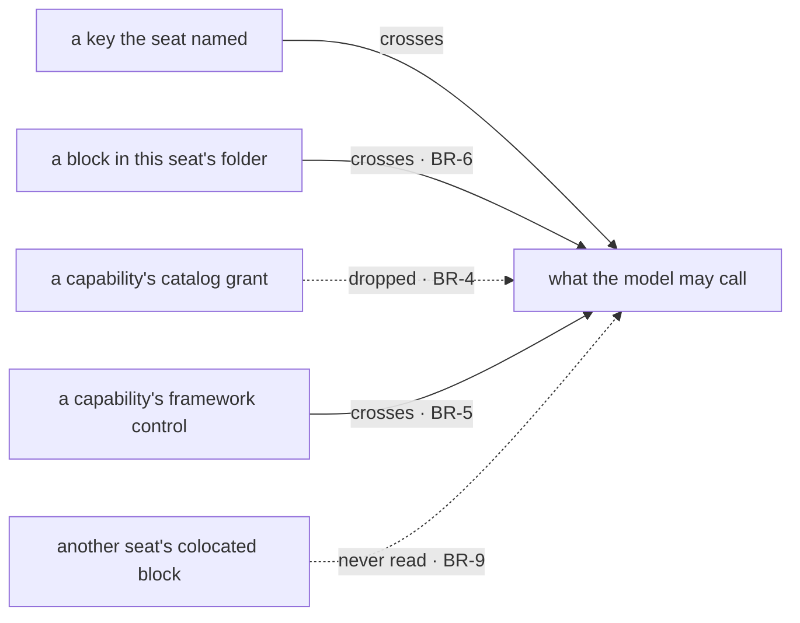

# FIX-1416 · Business rules

[Spec](SPEC.md) · [Decisions](DECISIONS.md) · **Rules** · [Plan](PLAN.md)

The cases, as rules. *Proved by* is the check the plan runs. Rows marked **unchanged** are pinned
here because this issue is the first thing to depend on them and a regression would be silent.

## The tools the app ships

| # | When | Then | Proved by |
|---|---|---|---|
| BR-1 | An app hands the generated `blocks` map over as the agent kind's catalog, and a seat's `tools:` names one of its keys | The model may call it, and calling it reaches the block's `execute` | CI · the POC, graduated |
| BR-2 | A seat names a key the catalog does not carry, including when there is no catalog | Refused when the workforce is hired, naming the tool and the fix | **unchanged** · existing suite |
| BR-3 | A map entry's key and the block's own `name` disagree — in the app's catalog **or** in a seat's own folder | Refused, naming both and saying which one the model would have seen. **Two moments, by design:** the app's catalog is a kind-construction argument, so it is checked when the kind is built, before any seat exists; a seat's own map arrives at hire, so it is checked there. Both are before any seat runs | CI, both maps, both moments |
| BR-4 | A capability attached through `uses` contributes a catalog tool | Dropped. Every seat of this kind declares `tools:`, so the fence is always up | **unchanged** · `packages/core/test/generator-tools-fence.test.ts` + a workforce-level check |
| BR-5 | That same capability contributes a framework control through `controlTools` | It still reaches the seat | **unchanged** · same |
| BR-17 | A block in the app's catalog **declares** resources — its own, or a capability through `uses` that carries them | Those declarations are merged into the kind when it is built, so the store is there when the model calls the tool | CI · red state first (see below) |
| BR-18 | A seat's `tools:` does not name that block | The store is installed anyway. The catalog is the **kind's**, and a kind's resources belong to every seat of it — the same bill `uses` already presents. Do not make this per-seat | CI |

## A tool sitting beside the worker

| # | When | Then | Proved by |
|---|---|---|---|
| BR-6 | A `.ts` file sits in `teams/<team>/workers/<worker>/blocks/` | It is discovered and that seat may call it, with no `tools:` entry anywhere | CI · fixture tree |
| BR-7 | That seat's `tools:` is empty, or absent | It may call its own folder's blocks and **nothing else** — no catalog tool, no capability grant | CI |
| BR-8 | Two tools reaching one seat resolve to the same **tool name** — a colocated block and a catalog tool the seat named, by any spelling | Refused when the workforce is hired, naming both sources. Stated over resolved names, not map keys, so a colocated `bar` colliding with a catalog `bar` is caught at the door rather than on the first turn. No precedence is invented | CI |
| BR-9 | Two seats each have a `blocks/summarize.ts` | Neither sees the other's. Isolation is a property of what was read for that seat, exactly as it is for skills | CI |
| BR-10 | A `blocks/` folder sits at the org or the team level | Refused by `fsdev gen`, with the two supported places named. Not read, and not ignored. **This rule is what PR2 builds against**, and it is the recommendation in [DECISIONS → Open](DECISIONS.md#open) rather than an answer to it: the product question is still open, and widening this rule later is additive — it changes no file that already exists | CI |
| BR-11 | A seat delegates to a board worker | The delegating seat's colocated tools do not travel. The board worker gets its own | CI |
| BR-12 | A `tools/` folder sits anywhere in the tree | Refused by `fsdev gen`, naming `blocks/` as the convention. Today it is passed over in silence | CI |
| BR-13 | A colocated block's basename breaks the segment rules — uppercase, a dot, a Windows device name | Refused, by the rule every other file-named level already uses | CI |
| BR-14 | A worker folder has no `blocks/` folder | Nothing changes for that seat, in any observable way | CI |
| BR-15 | A colocated block **declares** its own resources (its own `resources`, or a capability through `uses` that carries them) | Refused when the workforce is hired, naming the block and both fixes: declare the store on the kind, or move the block to `workforce/blocks/` and name it in `tools:` | CI · red state first (see below) |
| BR-16 | A colocated block **uses** a store the kind already installed | It works. Declaring is what is refused, not using | CI |

The same four crossings as the figure in [SPEC.md](SPEC.md), by name rather than by position, plus
the one that is not a crossing at all because nothing reads it.

## Failure taxonomy

Every refusal here lands at one of two moments: `fsdev gen` walking the tree, or `hireWorkforce`
minting the seats. **Nothing fails on a seat's first turn**, which is the bargain the whole file
convention already makes — a bad tree is a build error with a path in it, not a model that
mysteriously cannot call something.

**BR-15 and BR-17 are the rules that bargain exists for, and both have a real red state.** A seat
reaches its tools through a resolver that runs per turn, so a block arriving that way was never an
action block and is outside the walk that installs a block's stores. Wired naively:

- **Colocated (BR-15).** Hired without complaint, advertised, called, handle absent, turn reports
  success. POC test 6.
- **Catalog (BR-17).** The same, through the front door of the primary recipe — and the POC's test 7
  block *uses* its handle rather than guarding the read, which shows the sharper end: it **throws
  inside `execute`, and the turn still reports success**, because the throw becomes a failed tool
  result the model reads and moves past. Nothing surfaces to the author at any layer.

So neither check is "does it throw". BR-15's is that the block never reaches a model, because hire
refused it by name. BR-17's is that the handle is *there* — the tool runs and its store works.

The two rules differ because the maps differ in scope, not in convenience: the catalog is already
kind-wide, so registering its declarations installs nothing new; a seat's folder is one seat's, so
registering would hand seat A's store to every sibling. Nothing degrades and nothing retries. A `gen` run that hits any
refusal writes no file, so a registry is never left quietly short.

## Acceptance criteria this issue owns

A seat in the pentest lab calls a custom block it named in `tools:`, on a real model, and the run
shows the block's own `execute` ran — the soft-expand of
[FIX-1355](https://linear.app/fixpoint-labs/issue/FIX-1355) the architect asked for. The colocated
half adds a second seat that calls a block from its own folder with `tools:` empty — and **that
block reads a store**, so the goal exercises BR-16 rather than another handler that needs nothing.
A colocated tool that needs nothing cannot show whether the resource path holds; that is precisely
how BR-15 and BR-17 were both missed until review. The catalog-path seat's tool reads a store too,
for the same reason.
