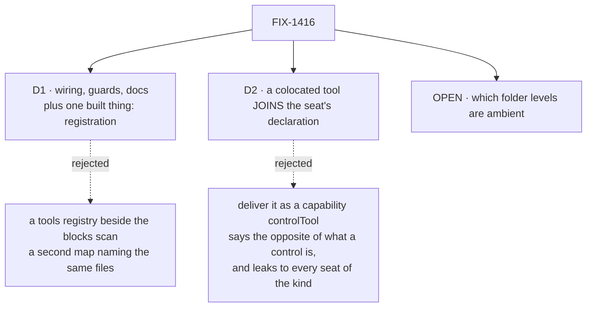

# FIX-1416 · Decisions

[Spec](SPEC.md) · **Decisions** · [Rules](BUSINESS-RULES.md) · [Plan](PLAN.md)

What was considered, what was chosen, and what each locks in. Two decisions are the sign-off
surface; one fork is still open and needs an answer before the second PR is built.

## The tree

Solid edges are what you're signing. Dashed edges lost, and the label says why.

## D1 · The primary recipe ships as wiring, guards and documentation — no new public option. The one thing it builds is registration

| | |
|---|---|
| **Instead of** | A tools registry beside the blocks scan, a `blocks → tools` adapter, or a third `tools/` convention |
| **Because** | Nearly all of it already works and nobody checked. A scanned block **is** a generator tool by definition (`GeneratorTool = BlockDefinition`, `packages/core/src/blocks/generator.ts:347`), the generated map **is** the catalog's shape (`ToolCatalog = Record<string, GeneratorTool>`, `packages/core/src/types/skill.ts:28`), the mint already refuses a name the catalog lacks (`packages/workforce/src/agent-worker-flow.ts:295`), and the fence already governs the result. The POC ran that path end to end with no adapter. The exception is stores — see the qualifier below — and one registration closes it |
| **Locks in** | The app stays the only place that decides which blocks a workforce may reach — `catalog:` is a line in the app's own code, not a file a team edits. A team cannot grant itself a non-colocated tool by editing files alone. That is deliberate, and it is the reason the colocated half below is a separate decision rather than a generalisation of this one. **And every store any catalog tool declares is installed on the kind, for every seat of it** — including seats whose `tools:` never name that tool. That is what kind-wide means, and it is the same bill `uses` already presents |

**The qualifier, found in review, and worth reading before the paragraph below.** "Already works"
was true of tools that need *nothing*. A seat reaches its tools through a resolver that runs per
turn off `ctx.flow.config` (`agent-worker-flow.ts:615-616`), so a block arriving that way was never
an action block and is outside the walk that installs a block's stores
(`defineFlow.ts:710-721`). The POC ran it on the catalog path: the flow does not know the store,
the tool is advertised to the model anyway, and a block that really uses its handle **throws inside
itself while the turn reports success** (test 7). So D1 now carries one thing it must build — at
kind construction, merge `declaredResources` from the catalog's entries into the kind — and that is
a behaviour derived from the `catalog` option that already exists, not a new door.

**This is D1's own *If wrong* firing, and it fired before anything shipped.** The card said the risk
was documenting a seam as supported when it needs more than wiring. That is exactly what review
found. Recording it because a spec instrument that catches its own failure mode is worth more than
a spec that was right by luck.

The evidence that this was a gap and not a design hole: `apps/kitchen-sink/workforce/hire.ts:43`
passes no catalog at all, and reaches its one custom block as a **flow action** through a relative
import (`apps/kitchen-sink/workforce/flows/workers/desk-clerk.ts`). The one place that *does* build
a catalog — the pentest lab, `goals/pentest-lab/lab/host.mts:279` — assembles it by hand from a
file outside the convention tree and runs no scan at all. The published docs say the generated
`blocks` map feeds "a task board's `workers`"
(`apps/docs/docs/workforce/workers-on-disk.md:411`) and say nothing about tools. So the recipe the
architect called primary has never been written down, wired, or proved — which is mostly a
documentation and proof deliverable, and one small build.

## D2 · A worker-colocated tool is ambient by joining the seat's own declaration, not by being exempted from the fence

| | |
|---|---|
| **Instead of** | Delivering it through a capability's `controlTools`, the one shipped exemption the fence has |
| **Because** | The fence governs what a **capability** contributes to a block that declared `tools:`. A block sitting beside a worker is not a capability contribution — the kind builds that seat's declared list (`agent-worker-flow.ts:615`), so "ambient" means the list it builds is *named plus colocated*. Core is untouched and the fence's guarantee stays literally true. The exemption route would say the opposite of what a control is: core's own doc reserves `controlTools` for a tool "whose presence is already implied by the block's own configuration" and sends anything granting new reach to `tools` (`packages/core/src/capability/types.ts:106`). It would also leak — a capability is installed on the **kind**, so one worker's folder would hand its tool to every seat of that kind, which is exactly the failure the resource walk already refuses by name (`codegen/discover-resource-modules.ts:80`) |
| **Locks in** | `tools:` in a worker file stops being the complete answer to *what can this seat call*. A seat with `tools: []` and a `blocks/` folder reaches those blocks, and the built-in kind's own documentation — "a seat with `tools: []` reaches nothing, delegated or not" (`agent-worker-flow.ts:51`) — becomes true only of the catalog half. Anyone auditing a seat reads the file **and** the folder. That is the cost of the ruling, and it is not recoverable later without breaking trees that relied on it |

**This is the ruling's real price and it should be paid knowingly.** The ruling — a tool in the
worker's folder is ambient "because why else would it be in that folder" — is the same argument
that makes that seat's `skills/` folder ambient, and it is a good argument. It just costs the
`tools:` list its status as a single place to look. A `fsdev` command that prints a seat's full
model-visible toolset is the obvious mitigation and is a follow-up, not this issue.

## Decided, not asked

- **The seat's own blocks ride the HIRE step, not a second option on the kind factory.**
  `hireWorkforce` already imposes every other per-seat bag — `instructions`, `teamInstructions`,
  and `seatSkills` from `manifest.skills` (`hire.ts:361`), each refused when an author writes it
  (`hire.ts:249`, `:258`, `:271`). A seat's own blocks are the same kind of thing, so they become
  the **fourth contract key** rather than a new door. The POC checked the one premise that was not
  obvious — the three existing keys all carry strings, and this one carries live blocks: a
  `BlockDefinition` on a seat's settings bag survives the mint and the model calls it (POC test 5).
   **What the kind-factory route would have bought, and why it is worth nothing here:** the
  factory knows the map before `defineFlow` runs, so it *could* merge colocated resource
  declarations statically — the hire path cannot, because the flow is built before any seat exists.
  But collecting one seat's resources onto the kind installs them for every seat of that kind, which
  is the leak this convention already refuses by name, and per-seat resource installation does not
  exist in workforce at all (kitchen-sink and the pentest lab both install resources kind-wide). The
  advantage is one the factory route could not take. With it gone, the hire path wins on symmetry,
  and **D1 adds no new public option to `defineAgentWorkerFlow`** — the one thing D1 builds is
  registration, which is derived from the `catalog` it already takes.
- **A catalog block's resource declarations are registered on the kind; a colocated block's are
  refused. Same word, two verdicts, and the asymmetry is the whole point.** The app's `catalog` is
  a kind-construction argument and is **already kind-wide** — every seat of the kind shares it — so
  merging its entries' `declaredResources` installs exactly what the kind's own `uses` would have
  installed. Nothing leaks, because there was never a per-seat boundary to leak across. The seat's
  own folder is the opposite: it is one seat's, it arrives at hire after the flow is built, and
  collecting it would install seat A's store for every sibling. So the catalog half is registered
  and the colocated half is refused, and the reason is *where the map is scoped*, not which is more
  convenient. **Both cases are the defect class [FIX-1421](https://linear.app/fixpoint-labs/issue/FIX-1421)
  shipped a detector for tonight** — an author writes what the convention documents, it is accepted,
  and nothing happens until it fails somewhere unrelated. Landing a new instance of it in the same
  epic would have been poor.
- **A colocated block may USE a store the kind already has; it may not DECLARE one, and one that
  does is refused by name at hire.** `defineFlow` collects `declaredResources` by walking the
  flow's *action* blocks (`defineFlow.ts:710-721`); a block appended through the function-valued
  `tools:` resolver is not one, so its declarations are never seen. The POC ran it: hire accepted
  the seat, the turn **did not error**, and the store handle was simply absent inside `execute`
  (test 6) — a tool advertised to the model, doing nothing, with nothing said anywhere. That is the
  defect class this epic exists to kill, so the refusal is not a stopgap. The alternative —
  collecting colocated declarations onto the kind — is more useful and costs the same leak as
  above: seat A's store installed for every sibling seat. Refusing is smaller, honest, and leaves
  the useful case open, because the two fixes are both one line: declare the store on the kind, or
  move the block to `workforce/blocks/` and name it in `tools:`.
- **One tool has one name: the file's, the map key's and the block's own must agree — on BOTH
  maps, the app's catalog and the seat's own — refused when the workforce is hired.** This is the
  engineer's call, not a fork — the alternative is an ambiguity nobody wants — but it is recorded
  here because the POC is what found it and because it binds something public. A seat authorized
  `lookup-customer` (the file name, and the catalog key) and the model was advertised
  `lookupCustomer` (the block's own `name`); the call by the authorized name never landed and the
  call by the other one did. Nothing checks they agree, and three readers each use a different one
  — the seat's `tools:` list, the model's prompt and trace, and a skill's `allowed-tools`
  validation. The guard goes at the kind's door rather than at the scan, so it also covers a
  hand-built catalog and leaves a block used only as a flow action alone.
   **Both maps, because the colocated map is filename-keyed too** and would otherwise rebuild
  the ambiguity on the second surface. Once the rule holds on both, the collision check (BR-8) is
  stated over **resolved tool names** rather than keys — which is what closes the sharper case: a
  colocated block named `bar` colliding with a catalog tool `bar` is invisible to a key-based
  check and would fail on the first turn instead of at hire.
  **What it binds:** a file's basename is now a tool name a model sees, so tool names inherit the
  segment rules — lowercase, digits, single hyphens, and **no dot**, because a dot is the joiner a
  worker id is split on (`packages/workforce/src/loader/segments.ts:29`). A namespace prefix like
  `engineering.*` therefore cannot be minted from a file name;
  [FIX-1434](https://linear.app/fixpoint-labs/issue/FIX-1434) needs to know that before it picks a
  spelling.
- **A colocated tool does not travel to a worker the seat delegates to.** The delegation fence
  narrows a board worker to the delegating seat's own `tools:` list
  (`agent-worker-flow.ts:521`), and ambient tools join the *generator's* declared list rather than
  that list — so that line keeps its exact current meaning. A delegated worker is its own seat with
  its own folder and its own ambient set, which is coherent and needs no new rule.
- **The colocated folder is called `blocks/`, not `tools/`.** The architect fence forbids a parallel
  `tools/` tree, `resources/` already demonstrates one folder name repeated at every level, and the
  tree docs currently describe a `tools/` folder as "layout, not input"
  (`apps/docs/docs/workforce/workers-on-disk.md:463`) — a line this issue reconciles rather than
  contradicts.
- **A `tools/` folder anywhere in the tree stops being silently ignored** and is reported by
  `fsdev gen` with the fix. Silence is what produced this issue's confusion in the first place.
- **Both halves stay build-time walks.** Nothing scans a folder at run time; that is settled by the
  convention and restated only because a per-seat map invites the question.

## Considered and dropped

| Alternative | Why not |
|---|---|
| A `tools/` tree, at any level | Duplicates `blocks/` with a second registry naming the same kind of file. Explicitly fenced by the architect, and the tree already reserves the name as layout |
| Name-intersecting capability tools with a seat's `tools:` instead of dropping them | Already settled and shipped as *drop* (FIX-1393); re-opening it is out of scope and the core doc explains why the intersection was inert |
| Let a seat's `tools:` widen itself with a prefix (`engineering.*`) as part of this | [FIX-1434](https://linear.app/fixpoint-labs/issue/FIX-1434). This spec does not depend on it, and the one-name rule constrains it — see "Decided, not asked" |
| Make every scanned block's `name` equal its basename, at gen time | Broader than the harm. A block used only as a flow action never reaches a model, and kitchen-sink's own block documents that the two names are allowed to differ. The one-name rule puts the guard at the door where the harm is, which also covers a hand-built catalog |
| A second option on `defineAgentWorkerFlow` for the per-seat map | Hire already carries every other per-seat bag, and the one thing the factory route could have bought — statically installed colocated resources — is closed by the kind-wide resource model regardless. See "Decided, not asked" |
| Collecting a colocated block's resource declarations onto the kind | More useful than refusing, and it installs one seat's store for every seat of that kind. Impossible on the hire path anyway. Refusal named at the door leaves the same case open through one extra line |
| **Limiting D1 instead of registering** — a catalog tool that declares resources is out of the recipe, and the author declares the store on the kind or mounts the block as a flow action | Honest, and it makes the primary recipe worse at the one thing it exists for. The catalog is already kind-wide, so registering costs nothing the kind was not already paying, and it makes D1's claim true rather than true-for-resource-free-blocks. Rejected on those grounds, not because it was unworkable |
| **Holding PR2 until the levels fork is answered** | Dropped during review. `BR-10` already encodes worker-only and refuses the other levels with a fix message, so PR2 has a rule to build against. Widening later is additive and changes no file that exists, so the fork stays open without blocking |

## Open

### Tools sitting in a folder: only the worker's own, or the team's and the org's too?

**Plain terms.** A worker gets a folder on disk. Anything in it is already theirs automatically —
their instructions, their skills. The ruling adds tools to that list. The question is how far up the
tree "automatically" goes. A team has a folder too, and so does the whole organisation. Drop a tool
in the team's folder and either every seat on that team can use it the moment the file exists, or
nobody can until each seat lists it by name.

**The trade-off.** Ambient at the team level is convenient and matches how skills already work: one
file, and a ten-person team has the tool. It also means adding one file silently changes what ten
seats can do, with nothing in any of their own files recording it — and a tool is running code with
side effects, where a skill is text in a prompt. Naming it per seat costs a line of churn per seat
per tool, and the line is the audit trail.

**My recommendation: the worker's own folder only, for now.** A team-wide custom tool goes in
`workforce/blocks/` and each seat names it. The blast radius of "one file, ten seats, no record"
is the wrong default for code the model can execute, and this is the direction that is cheap to
change later: a folder that is currently refused can start being read without altering the meaning
of any file that already exists. The other direction breaks working trees.

**What would change my mind:** if you expect a team-shared custom tool to be the *common* shape
rather than the exception — a pentest team where all six seats want the same scanner. Then a line
per seat per tool is churn people will route around, most likely by putting the tool in one seat's
folder and delegating to it, which is worse than the thing I'm trying to avoid. If that's the
picture you have of how teams will use this, take the blast radius and make the team level ambient
in the first cut.

**Cost of being wrong: low, and asymmetric.** Wrong in my direction costs a line per seat until we
widen it. Wrong in the other direction is a permissions surface we can't narrow without breaking
trees. That asymmetry is most of my argument; if you have the usage picture I don't, it outweighs
it.

## How it got here

- **Draft** — framed from the shipped fence and the shipped scan rather than from the ticket's
  wishlist; a POC ran the primary recipe end to end and found the two-names gap, which nothing in
  the repo had asked about.
- **Review round 1** — D2's delivery route moved from a kind-factory option to the hire step, after
  the POC showed a live block survives a seat's settings bag and the factory route's one advantage
  turned out to be unusable. A hole in D2 was closed: a colocated block that declares a resource is
  advertised to the model and finds no handle, silently, so declaring one is now refused by name.
  The one-name rule was extended to the colocated map and its collision check restated over
  resolved tool names. PR2 stopped waiting on the levels fork, which remains open and unanswered.
- **Review round 2** — the resource gap turned out to be wider than the colocated half: a block
  reached through `catalog:` is outside the same walk, so D1's "already works" was overstated. The
  POC reproduced it on that path (test 7) and D1 now carries one built thing — the kind registers
  what its catalog declares — with the catalog/colocated asymmetry written down. The one-name
  rule's two moments were stated explicitly instead of being implied differently in two documents.
