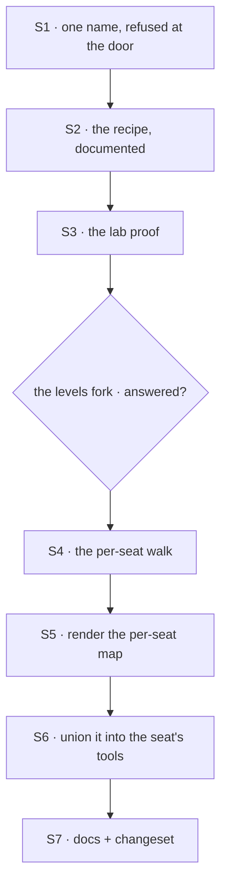

# FIX-1416 · Plan

[Spec](SPEC.md) · [Decisions](DECISIONS.md) · [Rules](BUSINESS-RULES.md) · **Plan**

Written for the implementing agent. IDs cross-reference [BUSINESS-RULES.md](BUSINESS-RULES.md)
(BR-n) and [DECISIONS.md](DECISIONS.md) (D-n). `tdd`. **Two PRs**, and the seam is the open fork:
PR1 depends on nothing and can land immediately; PR2 cannot start until
[the levels question](DECISIONS.md#open) is answered, because the answer *is* the walk's slot
patterns.

## Surfaces

| ID | Package · role | Change | Rules |
|---|---|---|---|
| S1 | `workforce` · the kind factory (`agent-worker-flow.ts`) | Refuse at construction when a catalog entry's key and its block's `name` disagree, naming both (the one-name rule) | BR-3 |
| S2 | `workforce` · docs surfaces | The catalog wiring recipe, end to end: scan → `catalog:` → `tools:` → the model. This is the deliverable D1 is mostly made of | BR-1 BR-2 BR-4 BR-5 |
| S3 | `goals/pentest-lab` · a new goal | A seat calls a custom block it named in `tools:`, on a real model. Soft-expand of FIX-1355. The lab already builds a catalog by hand (`lab/host.mts:279`); the delta is a block under its own `workforce/blocks/` and the scan, so the goal proves the *convention* path rather than the hand-wired one | BR-1 |
| S4 | `workforce` · the code walk (`codegen/discover.ts`) | A per-seat blocks slot, `teams/*/workers/*/blocks/`, beside the existing `RESOURCE_SLOT_PATTERNS` walk. Refuse a `blocks/` folder at any other level and a `tools/` folder anywhere, each naming the fix | BR-6 BR-10 BR-12 BR-13 |
| S5 | `workforce` · the renderer (`codegen/render.ts`) | A fourth export: the per-seat map, keyed by the seat's id. Deterministic ordering, as the other three are | BR-6 BR-9 |
| S6 | `workforce` · the kind factory again | Take the per-seat map as an option; union this seat's own blocks into the generator's `tools:` resolver (D2). Refuse a colocated name that collides with a catalog key the seat also named | BR-6 BR-7 BR-8 BR-9 BR-11 BR-14 |
| S7 | Docs + changeset | The worker-level `blocks/` folder; reconcile the line that calls `tools/` layout; one `minor` changeset for `@flow-state-dev/workforce` | — |

**Nothing is removed.** Worth saying out loud on an exploration ticket: the honest finding is that
the existing pieces were right and unconnected, so there is no dead surface to retire. If you find
one while building, that is a separate issue.

## Sequence



| PR | Surfaces | depends_on |
|---|---|---|
| PR1 | S1 S2 S3 | — |
| PR2 | S4 S5 S6 S7 | PR1, **and the open fork answered** |

## Checks

| ID | Runs after | Passes when |
|---|---|---|
| V1 | S1 | BR-3: the refusal fires on a mismatch, names both names, and does **not** fire when they agree. The POC's mismatched-block fixture is the red state |
| V2 | S1 | BR-1, BR-4, BR-5 pinned at workforce level, observing what the **model** receives, not a resolver result. The POC graduates here |
| V3 | S3 | VG below |
| VG | S3 | Goal, real model: a lab seat named a custom block in `tools:`, the model called it, and the block's own `execute` ran. `goals/pentest-lab/a-seat-calls-a-custom-block/run.mts`, shaped like the two goals already there |
| V4 | S4 | BR-6, BR-10, BR-12, BR-13 on fixture trees. Each refusal names a path and the fix; a `gen` run that hits one writes no file |
| V5 | S6 | BR-7 (`tools: []` plus a folder reaches the folder and nothing else), BR-8, BR-9 (two seats, same basename, neither sees the other's), BR-11, BR-14 |
| V6 | S6 | BP-035's second path: a workforce with **no** colocated folders anywhere behaves identically to today, and a kind built with no per-seat map at all still hires |

## Pinned names · three

| Where | Name | Why pinned |
|---|---|---|
| The colocated folder | `blocks/` | Public, and the invent-kill. Not `tools/` |
| Its location | `teams/<team>/workers/<worker>/blocks/` | Public. It is the fork's answer if the fork is answered my way; if it is answered the other way this row gains levels rather than moving |
| The tool name | the file's basename, which equals the block's `name` | Public — a model sees it, a trace shows it, a `tools:` list writes it |

The per-seat map's export name, the option name on the kind, and every internal helper are yours.

## Guardrails

| Rule | Because |
|---|---|
| Do not touch `packages/core` | The fence's guarantee is the thing this builds on. Changing it to make ambient work would dissolve what is being relied on, and D2 exists precisely so that nothing has to |
| A colocated tool is delivered **per seat**, never installed on the kind | A kind's capabilities are shared by every seat of that kind, so one worker's folder installed there changes every sibling. The resource walk already refuses this by name (`discover-resource-modules.ts:80`) — do not re-learn it |
| Every refusal lands at `gen` time or at the mint, never on a seat's first turn | It is the convention's existing bargain, and a tool that silently is not there is indistinguishable from a model that chose not to call it |
| A `tools/` folder is reported, not ignored | Silence is what produced this ticket. An author's most likely wrong guess deserves a sentence, not nothing |
| Do not grow the seat's declaration into a resolution *order* | There is no precedence between a named catalog tool and a colocated one — a collision is refused (BR-8). The moment one wins, the file convention has a precedence story to document and defend |

## Docs

- **EXTEND** `apps/docs/docs/workforce/workers-on-disk.md` — under "Kinds and blocks from files":
  what the `blocks` export is *for*, including the catalog wiring. Then the worker-level `blocks/`
  folder beside the existing `skills/` and `resources/` material. **Reconcile line 463**, which
  currently says a team's `tools/` folder is layout — it stays ignorable as layout, but `gen` now
  says so out loud. *Voice risk:* the outsider rule. Do not write "used to be ignored".
- **EXTEND** `apps/docs/docs/workforce/built-in-worker.md` — what `tools:` means now that it is not
  the complete answer. This is the sentence that costs a reader the most if it is vague.
- **EXTEND** `packages/workforce/README.md` — the kind factory's new option, one row in the
  existing table.
- **EXTEND** `docs/architecture/capabilities.md` → "The tools fence" — one paragraph: a
  worker-colocated tool is not an exemption, it joins the declaration. Someone will read the fence
  doc and conclude the fence was weakened; it was not.
- **No new page.** Every one of these is a section under a concept that already exists.

## Sketch · pseudocode, illustrative, react to the shape

```
when the kind builds the seat's tools, per turn:
    named    ← this seat's `tools:` list, mapped through the app's catalog   (today)
    ownFolder ← the per-seat map, looked up by this seat's id                (new)
    return named + ownFolder            ← the whole of D2

at the mint, once per seat:
    refuse if a name appears in both      (BR-8)
at the kind's construction, once:
    refuse if any catalog key ≠ its block's own name   (BR-3 · the one-name rule)
```

The generator's fence sees one declared list and cannot tell which half a tool came from. That is
the point of D2, not an accident of the sketch.

**POC:** `spec-poc/FIX-1416-blocks-as-tools/` on this branch.
Run it: `npx vitest run --root spec-poc/FIX-1416-blocks-as-tools`. It pinned four things — the
generated map is accepted as a catalog with no adapter; a seat naming a scanned block reaches its
`execute`; `tools: []` fences it; and **the model is advertised the block's own `name`, not the
scan's key**, which is the finding the one-name rule exists for. The first three held as D1 assumed; the fourth
did not, and changed the spec.

## At implement time

- **FIX-1421 is live in `packages/workforce/src/loader/`.** The walk primitives S4 builds on
  (`structural-directory.ts`, `segments.ts`) may have moved. Re-read before adding a slot pattern.
- **FIX-1434** may have landed a prefix syntax for `tools:`. If so, check it against the one-name rule's
  no-dot-in-a-basename constraint before wiring anything — a prefix that cannot come from a file
  name needs a different source, and that is its spec's problem, not this one's.
- Re-check whether any app has since started passing `catalog:`. If one has, S1's refusal may find
  a real mismatch on the first run; that is a finding, not a blocker.

## Follow-ups

- **A command that prints a seat's full model-visible toolset.** D2's cost is that `tools:` is no
  longer the single place to look; this is the mitigation. Worth filing once D2 is signed.
- **[FIX-1434](https://linear.app/fixpoint-labs/issue/FIX-1434)** — carry the one-name constraint over: a
  namespace prefix cannot be minted from a file basename, because the segment rules forbid a dot.
