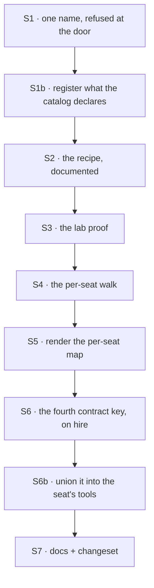

# FIX-1416 · Plan

[Spec](SPEC.md) · [Decisions](DECISIONS.md) · [Rules](BUSINESS-RULES.md) · **Plan**

Written for the implementing agent. IDs cross-reference [BUSINESS-RULES.md](BUSINESS-RULES.md)
(BR-n) and [DECISIONS.md](DECISIONS.md) (D-n). `tdd`. **Two PRs**: PR1 is the app's catalog and the
one-name guard; PR2 is the seat's own folder. **Neither waits on the open product question** — PR2
builds against BR-10 (worker-only), and widening that rule later is additive.

## Surfaces

| ID | Package · role | Change | Rules |
|---|---|---|---|
| S1 | `workforce` · the kind factory (`agent-worker-flow.ts`) | Refuse when a map entry's key and its block's `name` disagree, naming both (the one-name rule). Written once and applied to **both** maps — the app's catalog **at kind construction** here, the seat's own **at hire** in S6b | BR-3 |
| S1b | `workforce` · the kind factory, same seam | Merge `declaredResources` from the catalog's entries into the kind when it is built, so a catalog tool that needs a store has one. The catalog is already kind-wide, so this installs nothing the kind was not already scoped for | BR-17 BR-18 |
| S2 | `workforce` · docs surfaces | The catalog wiring recipe, end to end: scan → `catalog:` → `tools:` → the model. This is the deliverable D1 is mostly made of | BR-1 BR-2 BR-4 BR-5 |
| S3 | `goals/pentest-lab` · a new goal | A seat calls a custom block it named in `tools:`, on a real model. Soft-expand of FIX-1355. The lab already builds a catalog by hand (`lab/host.mts:279`); the delta is a block under its own `workforce/blocks/` and the scan, so the goal proves the *convention* path rather than the hand-wired one | BR-1 |
| S4 | `workforce` · the code walk (`codegen/discover.ts`) | A per-seat blocks slot, `teams/*/workers/*/blocks/`, beside the existing `RESOURCE_SLOT_PATTERNS` walk. Refuse a `blocks/` folder at any other level and a `tools/` folder anywhere, each naming the fix | BR-6 BR-10 BR-12 BR-13 |
| S5 | `workforce` · the renderer (`codegen/render.ts`) | A fourth export, `seatBlocks`, keyed by the seat's id (`<team>.<worker>`) then by block basename. Deterministic ordering, as the other three are | BR-6 BR-9 |
| S6 | `workforce` · **the hire step** (`hire.ts`) + `worker-config.ts` | `seatBlocks` becomes the **fourth contract key**: declared on `workerConfigSchema()`, imposed by `hireWorkforce` from the seat's entry in the generated map, refused when an author writes it — the shape `seatSkills` already has (`hire.ts:258`, `:361`). `hireWorkforce` takes the map as its option, not the kind factory | BR-6 BR-9 BR-14 |
| S6b | `workforce` · the kind factory (`agent-worker-flow.ts:615`) | Union this seat's own blocks into the generator's `tools:` resolver (D2). Refuse at the mint: the seat-map half of the one-name rule (BR-3), a resolved tool-name collision (BR-8), and a colocated block that declares resources (BR-15) | BR-3 BR-7 BR-8 BR-11 BR-15 BR-16 |
| S7 | Docs + changeset | The worker-level `blocks/` folder; reconcile the line that calls `tools/` layout; one `minor` changeset for `@flow-state-dev/workforce` | — |

**Nothing is removed.** Worth saying out loud on an exploration ticket: the honest finding is that
the existing pieces were right and unconnected, so there is no dead surface to retire. If you find
one while building, that is a separate issue.

## Sequence



| PR | Surfaces | depends_on |
|---|---|---|
| PR1 | S1 S1b S2 S3 | — |
| PR2 | S4 S5 S6 S6b S7 | PR1 |

**PR2 does not wait on the open product question.** It builds against BR-10 — the worker's own
folder is ambient, org and team `blocks/` folders are refused with a fix message. If the answer
comes back *team and org too*, that widens BR-10 and changes no file that already exists. Do not
read this as the question being settled; it is open and unanswered, and it is the user's.

## Checks

| ID | Runs after | Passes when |
|---|---|---|
| V1 | S1 | BR-3 at **kind construction** for the catalog: the refusal fires on a mismatch, names both names, and does **not** fire when they agree. The POC's mismatched-block fixture is the red state. The seat-map half of BR-3 is V5's, at hire — assert both moments, not one |
| V8 | S1b | BR-17's red state **first**, on the catalog path: a catalog block declaring a store is hired, advertised, called, and its handle is missing — the block throws inside `execute` **and the turn still reports success** (POC test 7 is this, verbatim; note it is the turn's success that makes it silent, not the absence of a throw). Then the registration, and the same tool runs with a working store. BR-18: a seat that never names the tool still has the store installed |
| V2 | S1 | BR-1, BR-4, BR-5 pinned at workforce level, observing what the **model** receives, not a resolver result. The POC graduates here |
| V3 | S3 | VG below |
| VG | S3 | Goal, real model: a lab seat named a custom block in `tools:`, the model called it, and the block's own `execute` ran. `goals/pentest-lab/a-seat-calls-a-custom-block/run.mts`, shaped like the two goals already there |
| V4 | S4 | BR-6, BR-10, BR-12, BR-13 on fixture trees. Each refusal names a path and the fix; a `gen` run that hits one writes no file |
| V5 | S6b | BR-7 (`tools: []` plus a folder reaches the folder and nothing else), BR-8 over **resolved tool names** (a colocated `bar` against a catalog `bar`, which a key-based check misses), BR-9 (two seats, same basename, neither sees the other's), BR-11, BR-14 |
| V7 | S6b | BR-15's red state **first**: a colocated block declaring a resource, wired without the guard, is hired, advertised, called, and finds no handle — **and does not throw** (POC test 6 is this, verbatim). Then the guard, and the refusal names the block and both fixes. BR-16: a colocated block reading a store the kind installed works |
| V6 | S6b | BP-035's second path: a workforce with **no** colocated folders anywhere behaves identically to today; `hireWorkforce` called with no `seatBlocks` at all still hires; and an author who writes `seatBlocks:` in a `WORKER.md` is refused by name, like the other three contract keys |

## Pinned names · five

| Where | Name | Why pinned |
|---|---|---|
| The colocated folder | `blocks/` | Public, and the invent-kill. Not `tools/` |
| Its location | `teams/<team>/workers/<worker>/blocks/` | Public. Widening it is what the open question would do; it gains levels rather than moving |
| The tool name | the file's basename, which equals the block's `name` | Public — a model sees it, a trace shows it, a `tools:` list writes it |
| The generated export | `seatBlocks` | Public: an app imports it from `workforce.gen.ts` and passes it to `hireWorkforce`. Unpinned it churns across kitchen-sink, the pentest lab and the docs |
| The contract key on a seat's bag | `seatBlocks`, matching the export | The same string in both places, so an author tracing a tool from the generated file to a seat reads one name. Also the key `hireWorkforce` refuses when authored |

The `manifest` field name, every internal helper, and the shape of the refusal messages are yours.

## Guardrails

| Rule | Because |
|---|---|
| Do not touch `packages/core` | The fence's guarantee is the thing this builds on. Changing it to make ambient work would dissolve what is being relied on, and D2 exists precisely so that nothing has to |
| A colocated tool is delivered **per seat**, never installed on the kind | A kind's capabilities and resources are shared by every seat of that kind, so one worker's folder installed there changes every sibling. The resource walk already refuses this by name (`discover-resource-modules.ts:80`) — do not re-learn it. It is also why BR-15 refuses rather than collects |
| A colocated block reaches the model only through the `tools:` slot, never as a flow action | An action block is inside `defineFlow`'s static walk and a tool is not (`defineFlow.ts:710`). Promoting one to an action to "fix" BR-15 would install one seat's surface on every seat of the kind, quietly |
| Every refusal lands at `gen` time or at the mint, never on a seat's first turn | It is the convention's existing bargain, and a tool that silently is not there is indistinguishable from a model that chose not to call it |
| A `tools/` folder is reported, not ignored | Silence is what produced this ticket. An author's most likely wrong guess deserves a sentence, not nothing |
| Do not grow the seat's declaration into a resolution *order* | There is no precedence between a named catalog tool and a colocated one — a collision is refused (BR-8). The moment one wins, the file convention has a precedence story to document and defend |

## Docs

- **EXTEND** `apps/docs/docs/workforce/workers-on-disk.md` — under "Kinds and blocks from files":
  what the `blocks` export is *for*, including the catalog wiring. Then the worker-level `blocks/`
  folder beside the existing `skills/` and `resources/` material. **Reconcile line 463**, which
  currently says a team's `tools/` folder is layout — it stays ignorable as layout, but `gen` now
  says so out loud. *Voice risk:* the outsider rule. Do not write "used to be ignored".
- **EXTEND** `apps/docs/docs/workforce/built-in-worker.md` — what `tools:` means now that it is not
  the complete answer. This is the sentence that costs a reader the most if it is vague.
- **EXTEND** `packages/workforce/README.md` — `hireWorkforce`'s new option and the fourth contract
  key, beside the three the table already lists.
- **EXTEND** `docs/architecture/capabilities.md` → "The tools fence" — one paragraph: a
  worker-colocated tool is not an exemption, it joins the declaration. Someone will read the fence
  doc and conclude the fence was weakened; it was not.
- **No new page.** Every one of these is a section under a concept that already exists.

## Sketch · pseudocode, illustrative, react to the shape

```
at hire, once per seat  (hire.ts, beside the seatSkills line):
    refuse if the author wrote `seatBlocks:`            (a contract key)
    settings.seatBlocks ← seatBlocks[manifest.id] ?? {}

at the kind, once per seat when the bag is read  (the shape `seatCatalog` has):
    resolved ← [...named through the catalog, ...values(config.seatBlocks)]
    refuse if two entries resolve to one tool NAME      (BR-8)
    refuse if any colocated block declaredResources     (BR-15)

per turn, in the `tools:` slot:
    return the already-resolved array                  ← the whole of D2

at the kind's construction, once:
    refuse if any CATALOG key ≠ its block's own name   (BR-3, catalog half)
    kind resources ← merge every catalog entry's declaredResources   (BR-17)
```

**The one-name rule has two moments and the plan means both.** The app's catalog is a
kind-construction argument, so its half is checked there, before any seat exists. A seat's own map
arrives at hire, so its half is checked there. Encode both; an acceptance test that asserts only one
passes while half the rule is unimplemented.

**Resolve at hire, not per turn.** The slot runs before every step of every generator turn, so it
does what `seatCatalog` does (`agent-worker-flow.ts:487-488`, read at `:508`, `:641`, `:649`): the
array is built once and the per-turn read is O(1). Both refusals belong on the once-per-seat side
with it — a collision or a stray resource declaration is a property of the seat, not of the turn.

The generator's fence sees one declared list and cannot tell which half a tool came from. That is
the point of D2, not an accident of the sketch.

**POC:** `spec-poc/FIX-1416-blocks-as-tools/` on this branch.
Run it: `npx vitest run --root spec-poc/FIX-1416-blocks-as-tools`. Six checks, and three of them
changed the spec:

| # | What it pinned | Verdict |
|---|---|---|
| 1–3 | The generated map is accepted as a catalog with no adapter; a seat naming a scanned block reaches its `execute`; `tools: []` fences it | Held, as D1 assumed |
| 4 | Which name the model is advertised when the file name and the block's `name` differ | **The block's own name.** The call by the authorized name never landed. Produced the one-name rule |
| 5 | Whether a live `BlockDefinition` survives the hire path onto `ctx.flow.config` | **It does**, and the model calls it. Settled the delivery route |
| 6 | What an author gets when a **colocated** block declares a resource | **Hired, advertised, called, handle absent, turn reports success.** Produced BR-15 |
| 7 | The same on the **catalog** path, with a block that really uses its handle | **The same hole, through the primary recipe's front door** — and because this block does not guard the read, it throws inside `execute` while the turn still reports success. Produced BR-17, and put the qualifier on D1 |

Tests 4, 6 and 7 are the ones an implementer should graduate first — they are the red states. Note
that tests 6 and 7 carry the only blocks that need a store; a resource-free handler cannot show
this, which is how the hole survived the first draft and half of it survived the first review round
too.

## At implement time

- **FIX-1421 is live in `packages/workforce/src/loader/`.** The walk primitives S4 builds on
  (`structural-directory.ts`, `segments.ts`) may have moved. Re-read before adding a slot pattern.
  It also shipped a detector for the declared-but-does-nothing defect class — check whether BR-15's
  refusal belongs in that detector rather than beside it, before writing a second one.
- **FIX-1434** may have landed a prefix syntax for `tools:`. If so, check it against the one-name rule's
  no-dot-in-a-basename constraint before wiring anything — a prefix that cannot come from a file
  name needs a different source, and that is its spec's problem, not this one's.
- Re-check whether any app has since started passing `catalog:`. If one has, S1's refusal may find
  a real mismatch on the first run; that is a finding, not a blocker.

## Notes from review

Two rounds (Cursor, Codex, Greptile, the FSD Architect). Six findings were folded into the
documents above — the delivery route, BR-15, the one-name rule's second map, PR2's unblocking, the
resource gap on the catalog path (BR-17/BR-18, and D1's qualifier), and the one-name rule's two
moments — and are recorded in [DECISIONS → How it got here](DECISIONS.md). Below the bar, for you to
weigh against real code:

- "POC test 4 records a verdict rather than asserting a direction." Correct for a discovery POC,
  and it is why the table above marks 4, 6 and 7 as the ones to graduate — a graduating test
  carries the direction, the POC carried the question.

These are inputs, not instructions. Adopt, adapt, or discard; you owe no justification for
discarding one. A note that turns out to reveal a design problem is a spec blind spot — surface it
and fold it back, per the challenger discipline in `issue-implement`.

## Follow-ups

- **A command that prints a seat's full model-visible toolset.** D2's cost is that `tools:` is no
  longer the single place to look; this is the mitigation. Worth filing once D2 is signed.
- **[FIX-1434](https://linear.app/fixpoint-labs/issue/FIX-1434)** — carry the one-name constraint over: a
  namespace prefix cannot be minted from a file basename, because the segment rules forbid a dot.
