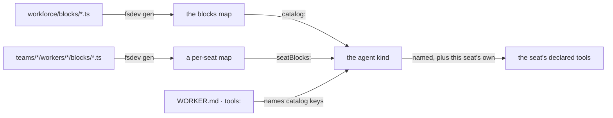

# FIX-1416 · Custom tools, authored as files

**Spec** · [Decisions](DECISIONS.md) · [Rules](BUSINESS-RULES.md) · [Plan](PLAN.md)

Feature (exploration) · `workforce` · small · 2 PRs · epic [FIX-1351](https://linear.app/fixpoint-labs/issue/FIX-1351)

## Five people, before and after

| Someone who… | Today | After |
|---|---|---|
| **writes a custom tool for their workforce** | Writes the block, runs the scan, and then nothing connects it to a worker. The generated map is documented as feeding a task board; the tool catalog a seat's `tools:` names is a separate thing, assembled by hand from files outside the convention tree | One line hands the scanned blocks over as the catalog. A seat names the block in `tools:` and calls it |
| **drops a tool into one worker's own folder** | Nothing happens, silently. The folder is passed over, and so is a `tools/` folder next to it | The block is that seat's, always, without being listed anywhere — the promise that seat's `skills/` folder already makes |
| **reads a `WORKER.md` to see what a seat can call** | The `tools:` list is the whole answer | The list **plus** whatever sits in that seat's own folder. Two places now, not one |
| **writes a block whose file name and block name disagree** | The seat is hired without complaint, and the model is advertised a name the seat's list never authorized | Refused when the workforce is hired, naming both |
| **attaches a tool-bearing capability to the workforce** | Its catalog tools are dropped for every seat; its framework controls still arrive | Unchanged, byte for byte |

**Most of this already works and nobody can tell.** The pieces landed separately — the file scan
in [FIX-1357](https://linear.app/fixpoint-labs/issue/FIX-1357), the enforced fence in
[FIX-1393](https://linear.app/fixpoint-labs/issue/FIX-1393) — and the seam between them was never
written down, wired in an app, or proved. The one app with a `workforce/blocks/` folder reaches its
block a different way entirely, as a flow action. So the honest shape of this issue is *smaller
than it looks*: one wiring line, one guard, one folder, and the documentation that makes the recipe
findable.

## What changes


The fence is the same line in both rows, and it does not move. What moves is one box across it:
a block sitting in the worker's own folder, which today nothing reads. A capability's catalog
grant stops where it stops now ([D2](DECISIONS.md#d2) says why that is not the same kind of
crossing).

**The tree an author writes:**

```diff
  workforce/
    blocks/
      desk-note.ts                   ← any seat may name this in tools:
    teams/
      support/
        workers/
          clerk/
            WORKER.md
+           blocks/
+             check-inventory.ts     ← this seat's, always, listed nowhere
```

**The one line an app adds:**

```diff
- const agent = defineAgentWorkerFlow({ uses: capabilities });
+ const agent = defineAgentWorkerFlow({ uses: capabilities, catalog: blocks, seatBlocks });
```

**And the seat's own file, unchanged in shape:**

```diff
  ---
  description: Handles the front desk.
  tools: [desk-note]
  ---
```

`check-inventory` is not in that list and the clerk can still call it. That is the whole of what
is new, and it is the part worth arguing about.

## How it reaches the seat



Both halves are build-time walks, like every other file convention here: nothing scans a folder
while an app runs, so a bundled deploy registers exactly what a local one does.

## What stays as it is

- **The fence itself.** `packages/core` is not touched. A declared `tools:` stays the complete and
  exclusive set of catalog tools, and a capability's grant stays dropped behind it.
- **Capabilities as the way to ship a *pack* of tools.** This is the single-tool door; the pack
  door is `uses` and is someone else's issue.
- **No `tools/` folder, anywhere.** One convention — `blocks/` — at every level it appears.
- **Selecting tools by namespace prefix** (`engineering.*`) is
  [FIX-1434](https://linear.app/fixpoint-labs/issue/FIX-1434) and is deliberately not here.
- **A team's file authors still cannot grant themselves a tool the app never shipped.** The app
  decides what the catalog contains; a seat decides which of it to use.

## Sign off

1. **[D1](DECISIONS.md#d1) · The primary recipe ships as a wiring line, a guard and documentation
   — no new framework surface.** *If wrong:* we have documented a seam as supported and it turns
   out to need an adapter, so the docs are wrong in public before the code is.
2. **[D2](DECISIONS.md#d2) · A worker-colocated tool is ambient by joining the seat's own
   declaration, not by being exempted from the fence.** *If wrong:* `tools:` in a worker file stops
   being the complete answer to "what can this seat call", and anyone auditing a seat has to read
   its folder too. That cost is real and it is the price of the ruling.
3. **[D3](DECISIONS.md#d3) · One tool has one name: the file's, the catalog key's and the block's
   own must agree, refused at hire when they don't.** *If wrong:* a rule that bites authors who
   never meant to name a tool, on blocks that are never used as tools.

**Open: one.** Number 2 is the one to weigh, and the open fork is its other half — **which folder
levels are ambient**, the worker's own only or its team's and the org's as well. The full ask, my
recommendation, and what would change my mind are in
[DECISIONS.md → Open](DECISIONS.md#open). The cases are in
[BUSINESS-RULES.md](BUSINESS-RULES.md).
