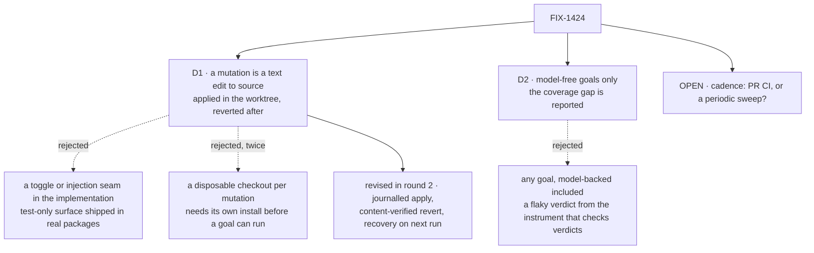

# FIX-1424 · Decisions

[Spec](SPEC.md) · **Decisions** · [Rules](BUSINESS-RULES.md) · [Plan](PLAN.md)

Two decisions are the sign-off surface, plus one open fork the owner settles. The rest is context for them.

> **Changed since you were asked to confirm D1.** Spec review round 2 found two ways the worktree guarantee as first written could not be kept. D1's shape is unchanged — a mutation is still a literal text edit in the working tree — but **how it is made safe has changed**, and BR-10 has been restated to a promise the design can actually keep. The delta is in [D1 → Revised in review round 2](#d1-revised). Read that before confirming.

## The tree

Solid edges are what you're signing. Dashed edges lost, and the label says why. `O` is the one still open.

## D1 · A mutation is a literal text edit to a package source file, applied in the working tree and reverted after the run

| | |
|---|---|
| **Instead of** | A toggle, fault-injection hook or seam built into the implementation so mutations can be switched on; or a forked checkout per mutation |
| **Because** | 28 of our 30 packages resolve their public entry straight to `./src/index.ts`, so an edited source file is live on the next run with no build step — the cheapest apply there is. A seam would put test-only surface into shipped packages to serve an internal check (tenet 3); a forked checkout would be a second verification substrate beside the suite that already certifies behaviour (tenet 2) |
| **Locks in** | The sweep owns the target file while it runs — it refuses to start with local changes to a file it will touch, and restores it on the way out. An entry is anchored on real code, so whoever edits that line inherits a stale entry to fix. What "owns" can and cannot guarantee when the runner is killed outright was [revised in round 2](#d1-revised) |

That apply is only available because of how this repo resolves workspace packages, verified rather than assumed ([evidence check](checks/verify-evidence.mjs), F1). The cost it accepts is staleness — and staleness here is loud, not silent: an anchor that no longer matches exactly once is a hard error, checked without running a single goal.

### Revised in review round 2 · how the edit is made safe

Round 2 (Greptile and Codex, independently) showed the original safety mechanism — a `finally` block plus SIGINT/SIGTERM handlers — could not deliver what BR-10 promised, in two distinct ways:

1. **A kill the runner cannot observe** (SIGKILL, OOM, a native crash, the machine going away) runs no handler at all, so the mutated source stays in the real worktree.
2. **A blind restore destroys evidence.** Cleanup restored the target from Git without checking the mutation was still the thing on disk. A developer editing that file while the goals ran would have their edit silently overwritten — and the clean-status assertion would still pass, *because the evidence was erased*.

**What changed.** Three mechanisms, none of them a new substrate:

- **A journal, written before the edit.** It lives outside the mutated file and holds the target path and its original bytes. The order is write journal, then mutate — never the other way round.
- **Revert from the captured bytes, and only if the mutation is still there.** If the file is not byte-identical to what the runner wrote, the run stops and names the file instead of overwriting it (BR-17). A concurrent edit becomes a loud stop, not a silent loss.
- **Recovery on the next run.** Both `goal:mutate` and the cheap anchor guard check for a stale journal first, refuse to proceed, name the file, and restore it (BR-16). So an unobservable kill is repaired by the next run of either command rather than never.

**What this costs, honestly.** Between an unobservable kill and the next run of either command, the worktree stays mutated. That window is real. It is bounded, it is visible in `git status` (a tracked source file, modified), and the guard that catches it already runs inside the root `typecheck` chain. BR-10's guarantee is therefore *detected and repaired*, not *never happened* — the promise is narrowed to what the mechanism delivers, and the residual is stated rather than implied.

**Why not a disposable checkout**, which both reviewers suggested and which would remove the window entirely: `goals/` is a workspace package, and every goal resolves `@flow-state-dev/*` through its own `node_modules` symlinks into `packages/`. A `git worktree add` copies source but not those links, so a goal cannot run in a fresh checkout until it has its own install — turning each sweep into a provisioning step and making its cost a function of install time. That is also a second verification substrate beside the suite, which is the reason D1 rejected a forked checkout in the first place (tenet 2). And D1's load-bearing premise — a source edit is live with no build, because 28 of 30 packages resolve `exports["."]` to `./src/index.ts` — does **not** transfer to a copy for free; it holds only where workspace resolution already points at that source. Journal-plus-recovery keeps the premise and costs three mechanisms; a disposable checkout discards the premise to close a window the guard already closes on the next run.

## D2 · The catalogue covers model-free goals only, and the behaviours that leaves uncovered are reported rather than implied

| | |
|---|---|
| **Instead of** | Letting an entry claim any goal, model-backed ones included |
| **Because** | Cost, and then the real one: determinism. A sweep runs the claimed goals once per entry, so real inference multiplies — and a model-backed goal can go red for model flakiness rather than for the mutation. An instrument whose whole job is to say *this green is trustworthy* cannot itself return a coin flip. Of 52 goals, 28 are model-free and 27 of those have a runner, so the addressable corpus is real today |
| **Locks in** | Behaviour proved only by a model-backed goal gets no mutation coverage until this is revisited. The gap is printed in the report beside the verdicts: a partial instrument presented as complete is the defect class this issue was filed against |

Two goals carry no machine-readable `Model:` line at all, so `goal:all --model-free` already treats them as model-backed — found by this spec's evidence check, filed as a follow-up, and guarded: an entry claiming a goal whose Model line can't be read is refused, not skipped.

## Decided, not asked

- **An entry names the goals it claims, and only those run.** The issue's done bar already says *the goal(s) that claim to cover it*; "something went red" is a weaker property and costs more.
- **A survivor is reported, not thrown.** Every entry gets a verdict and the run completes; the exit code is non-zero if anything survived.
- **Five verdicts, not two:** KILLED, SURVIVED, INVALID (baseline already red), STALE (anchor no longer matches), and — added in review round 2 — ERRORED (the goal never reached its assertions under the mutation). Collapsing them loses the diagnosis, and collapsing ERRORED into KILLED reports a crash as coverage, which is the defect class this issue exists to remove.
- **The shared verdict protocol gains one distinguishable exit code, additively.** Telling ERRORED from KILLED cannot be done from stdout or from "non-zero", because a mutation that stops the file parsing kills the goal process before any verdict is printed. So `goals/lib/verdict.mts` reserves a dedicated exit code for *a goal whose assertions ran and decided FAIL*; PASS stays 0, and every other non-zero exit — a throw, a module-load crash, a signal — means the goal rendered no verdict. All 51 runners already route through `runGoal`, nothing in the corpus reads the specific code, and `run-all.mts` keeps working unchanged because it only asks zero-or-not. This is an extension of the protocol, not the runner redesign the issue's constraints exclude.
- **No new goal grades the sweep.** Its own ability to fail is proved by the plan's two negative controls.

## Considered and dropped

| Alternative | Why not |
|---|---|
| More static shape rules (C5, C6, …) on `validate-control-shape.mts` | The space of ways a second sufficient cause enters a fixture is open-ended, and each new rule implies the next is unnecessary — the false-assurance pattern the guard exists to fight. Explicitly out of scope on the issue |
| An off-the-shelf mutation-testing framework (Stryker and similar) | Built to mutate code, run a *unit* suite by discovery and score a percentage. Our unit is a hand-authored real-path goal with a written claim, and a mutation score is the "complete coverage" promise the issue forbids |
| Mutating fixtures instead, or adjusting goal assertions to match a mutation | Forbidden by the issue, and rightly: it grades the fixture against itself |
| A general-purpose mutation-testing package | No second consumer, and packaging it would make it sound like a coverage product |
| A disposable checkout (or file copy) per mutation, instead of editing the real worktree | Re-examined in round 2 after two reviewers proposed it, and rejected again. A fresh checkout has no `node_modules`, so no goal can run in it without its own install; it is a second verification substrate (tenet 2); and it discards D1's cheap-apply premise rather than resting on it. [Full reasoning](#d1-revised) |
| Generating mutations automatically (flip every boundary, etc.) | Thousands of verdicts nobody reads, many of them equivalent mutants. A short hand-authored list of *regressions worth simulating* is the better trade |

## Open · Cadence: run the sweep in CI on every PR, or as a periodic sweep off the PR path?

**Plain terms.** The sweep runs real goal checks — each boots stores, serves HTTP, drives a real path — once per catalogued regression, and it gets slower with every entry added. So either every pull request waits for it and we catch a broken assurance the moment it lands, or it runs on a schedule and on demand and we learn hours or days later.

**The trade-off.** On every PR: shortest catch latency, and a merge blocker that grows; the usual end state is someone switching it off under time pressure, which is worse than never having had it. Periodically: CI stays as fast as today, nothing new blocks a merge, and a weakened assurance can sit unnoticed for up to a cycle. It also cuts against the suite's own contract — goal checks run outside CI, by hand (tenet 1).

**My recommendation: split it.** The cheap half goes in PR CI and runs no goals at all — it only checks that every entry still anchors on real code and still names real, model-free, runnable goals. Milliseconds, and it catches the way this actually rots; there is already a home for it in the guard chain the root `typecheck` runs. The full sweep runs on demand and weekly, reported, not gating. We can promote it to a gate once we know what it costs; we cannot un-slow CI later.

**What would change my mind:** if you want a merge-blocking guarantee that no PR can weaken an assurance — i.e. goals are heading toward being a gate rather than a hand-run library. That is a roadmap fact I don't have, and it makes the full sweep in PR CI right from day one.

**Cost of being wrong: low and reversible.** One asymmetry: shipping it as a gate and finding it slow teaches people to route around a safety check, which is harder to undo than turning a schedule up.

## How it got here

- **Review round 2** — two independent reviewers converged on the same two defects, both folded. A crash under mutation would have been reported as coverage (now the **ERRORED** verdict, and one added exit code in the shared protocol), and the worktree guarantee could not be kept as written (now journalled apply, content-verified revert, and recovery on the next run — see [D1 → Revised](#d1-revised)). The cadence fork is untouched and still open.
- **Draft** — framed as *a green goal we can't tell is green for the right reason*; the answer is a hand-authored catalogue of implementation regressions, each naming the goals that claim the behaviour, run by a sweep on the existing `goals/` spine; the static shape guard stays beside it. One PR.
