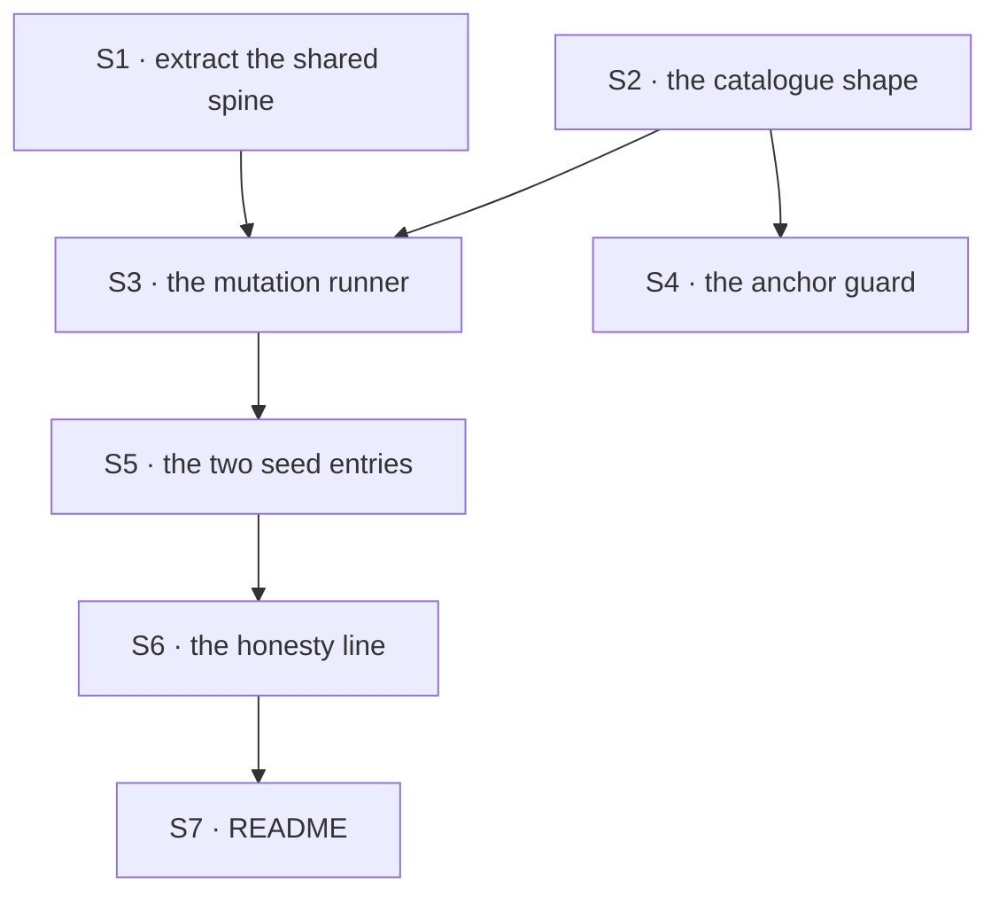

# FIX-1424 · Plan

[Spec](SPEC.md) · [Decisions](DECISIONS.md) · [Rules](BUSINESS-RULES.md) · **Plan**

Written for the implementing agent. IDs cross-reference [BUSINESS-RULES.md](BUSINESS-RULES.md) (BR-n) and [DECISIONS.md](DECISIONS.md) (D-n). `tdd`. One PR.

## Surfaces

| ID | Package · role | Change | Rules |
|---|---|---|---|
| S1 | `goals` · the shared sweep spine | **Extract** goal discovery, the `Model:` classification, per-goal spawn with the wall-clock cap and the summary table out of `scripts/run-all.mts` into a module both runners import. `run-all.mts` keeps its CLI and behaviour byte for byte | BR-11 BR-12 |
| S2 | `goals` · the catalogue | A new hand-authored list, one entry per regression worth simulating: id, the regression in plain words, target file, `find` / `replace` anchor text, and the goal ids it claims. Data only — no logic, no discovery | BR-4 BR-6 |
| S3 | `goals` · the mutation runner (`pnpm goal:mutate`) | Select → validate → refuse a dirty worktree → baseline → apply, run the claimed goals, classify, revert → report. Revert in a `finally` **and** on SIGINT/SIGTERM | BR-1 BR-2 BR-3 BR-5 BR-7 BR-8 BR-9 BR-10 BR-13 BR-15 |
| S4 | `goals` · the anchor guard (`pnpm guard:mutation-anchors`) | Runs no goals: every anchor matches exactly once, every claimed goal exists, has a runner and is readably model-free. Joins the guard chain the root `typecheck` already runs | BR-4 BR-6 |
| S5 | `goals` · seed entries | The two regressions hand-simulated in FIX-1367's review, anchored on `packages/workforce/src/hire.ts`: *skills supplied only for non-empty sets*, and *a hard-coded empty bag*. Both claim the two `workforce-seats` goals | BR-1 |
| S6 | `goals` · the report's honesty line | Print what the catalogue does not cover: hand-authored, model-backed goals excluded, and the count of goals no entry claims. Never a percentage | BR-14 |
| S7 | Docs | `goals/README.md` EXTEND. No `apps/docs` page and no changeset — `@flow-state-dev/goals` is private | — |

Nothing is removed and nothing in `packages/*` changes: the only edits to package source are the mutations themselves, reverted before the run exits.

## Sequence



## Checks

| ID | Runs after | Passes when |
|---|---|---|
| V1 | S1 | `pnpm goal:all --list` prints the same set, in the same order, as before the extraction. The refactor is invisible |
| V2 | S3 | BR-3, BR-5, BR-8, BR-13, BR-15 over a fake catalogue and stub goals, so the runner's control flow is tested without spending minutes |
| V3 | S3 | BR-9, BR-10: after a kill, a survival, a stale entry, a throw, and a SIGINT mid-goal, `git status --porcelain` for the target file is empty. **The second path (BP-035)** |
| V4 | S4 | The guard goes red on a planted broken anchor and on an entry claiming a model-backed goal; green once both are removed |
| V5 | S5 | **The done bar.** `pnpm goal:mutate` on each seed entry: baseline green, mutated red for every claimed goal, verdict KILLED, worktree clean |
| V6 | S5 | **The negative control, and the check that matters.** An entry whose `replace` is semantically inert (a comment or whitespace change) over the same goals is reported **SURVIVED**. Without this, V5 is a green nobody has seen fail |
| V7 | S6 | The report carries the uncovered-goal count and no percentage |

V6 is the check to write first. A sweep that can only report kills is indistinguishable from a sweep that always reports kills.

## Pinned names · three

| Where | Name | Why pinned |
|---|---|---|
| Script | `pnpm goal:mutate` | Typed by a person; sits beside `goal:all` |
| Script | `pnpm guard:mutation-anchors` | Joins the root `typecheck` guard chain, which names its members |
| Verdicts | `KILLED` · `SURVIVED` · `INVALID` · `STALE` | Read by a human in the report, and BR-13 keys the exit code on them |

Everything else — the catalogue's file layout, the entry type's field names, how the spine is split — is yours.

## Guardrails

| Rule | Because |
|---|---|
| Every negative control is **run**, watched go red, then removed (tenet 7, BP-003) | This is an instrument for distrusting green checks. A green from *this* instrument that nobody has seen fail writes the joke itself |
| Never mutate a fixture, and never touch a goal's assertions | The issue's hardest constraint. A fixture graded against itself is the defect, not the check |
| No C5+ static rule on `validate-control-shape.mts` | That is the open-ended path this work is an alternative to. Adding one here says the alternative didn't work |
| The report states its own limits every time it prints (D2) | A partial instrument read as complete is the pattern this issue exists to fight. The boundary belongs in the output, not only in a doc |
| One spine, extended — not a second runner beside it (tenet 2) | Two discovery paths over `goals/` drift, and then the sweep grades a corpus `goal:all` doesn't have |
| The revert path is proved under interrupt, not only on the happy path (BP-035) | A crash that leaves a package mutated damages the repository. It is the only failure here that escapes the report |

## Docs

- **EXTEND** `goals/README.md` — a section after "Running": what the sweep is, `pnpm goal:mutate`, how to add an entry (the regression first, then the anchor, then the goals it claims), the four verdicts, and plainly what it does not cover. *Voice risk:* do not write that this "ensures goals are correct" or "guarantees coverage" — the section's whole job is the opposite claim.
- **No `apps/docs` page, no changeset.** `@flow-state-dev/goals` is private and `goals/` is internal assurance machinery; no published surface changes (BP-022).

## Sketch · pseudocode, illustrative, react to the shape

```
for each selected entry:
    if the anchor does not match its file exactly once:  report STALE; continue
    if any claimed goal is unknown / not model-free:     refuse the entry; continue
    if the target file has local changes:                refuse the whole run
    run the claimed goals unmutated
        if any is red:                                   report INVALID; continue
    write file with anchor replaced          ← the whole mutation
    try:
        run the claimed goals again
        all red  -> KILLED
        any green -> SURVIVED, and name which
    finally:
        restore the file from git, always, including on a signal
print the table, the uncovered count, and exit non-zero unless every entry KILLED
```

**No POC.** The one premise worth checking — a source edit is live with no build step — was verified statically instead: [`checks/verify-evidence.mjs`](checks/verify-evidence.mjs) re-derives it (28 of 30 packages resolve `exports["."]` to `./src/index.ts`, `workforce` among them), plus the model-free corpus (28 of 52 goals, 27 with a runner), that the static guard stops at C4, and that both seed anchors match exactly once. The premise held. Its `--negative-control` mode plants a violation of each and was watched go red.

## At implement time

- **Wall-clock is unmeasured.** No `node_modules` was installed when this spec was written, so no goal was timed. Measure the two seed entries first and put the number in the PR — the open cadence fork is priced on it.
- Re-check `goals/scripts/run-all.mts` before extracting: it may have gained flags. Preserve them.
- Re-check that both seed anchors still match exactly once; if `hire.ts` moved, re-anchor rather than widening the `find` text.

## Follow-ups

- `goals/conductor/implement-phase-opens-a-pr` and `goals/workforce-seats/a-callers-own-agent-wins-every-seat` carry no machine-readable `**Model:**` line, so `goal:all --model-free` treats both as model-backed although neither runs a model. Found by this spec's evidence check; one line each in their `goal.md`. File it, don't fold it in.
- FIX-1183 (a goal can PASS while asserting over zero evidence) is the same defect family and a different shape. Nothing here addresses it, and the sweep would not catch it: a vacuous assertion goes green under every mutation, so it would surface as a **survivor** with no obvious cause. Worth saying in that issue.
