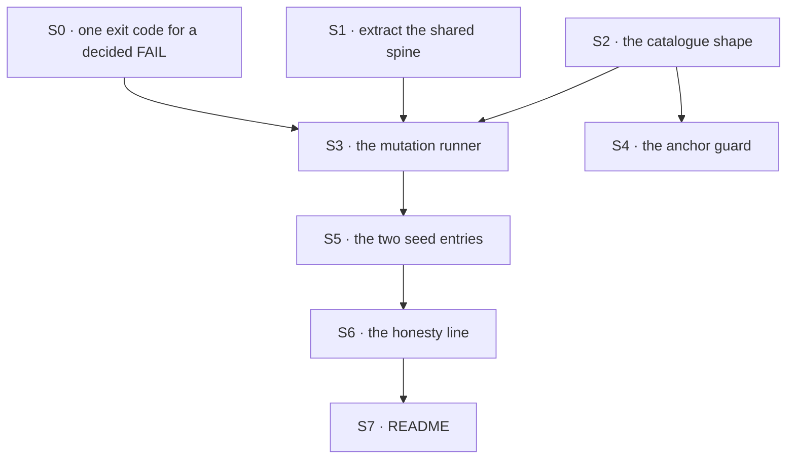

# FIX-1424 · Plan

[Spec](SPEC.md) · [Decisions](DECISIONS.md) · [Rules](BUSINESS-RULES.md) · **Plan**

Written for the implementing agent. IDs cross-reference [BUSINESS-RULES.md](BUSINESS-RULES.md) (BR-n) and [DECISIONS.md](DECISIONS.md) (D-n). `tdd`. One PR.

## Surfaces

| ID | Package · role | Change | Rules |
|---|---|---|---|
| S0 | `goals` · the shared verdict protocol (`lib/verdict.mts`) | **Additive.** Reserve a dedicated exit code for *assertions ran and decided FAIL* (`fail(...)`), keep PASS at 0, and stop routing `runGoal`'s catch branch through `fail` — a throw now exits with a code that means *no verdict rendered*. Exit-code-only, because a mutation that stops the file parsing kills the process before anything is printed. All 51 runners already route through `runGoal`; nothing in the corpus reads the specific code; `run-all.mts` is untouched and keeps working because it only asks zero-or-not. One note: `goals/delegation-floor/runs-an-unassigned-task/run.mts` hand-rolls its own PASS/FAIL tail, so it renders FAIL as a no-verdict code — which S4 refuses loudly rather than mis-scoring (BR-6) | BR-7 BR-6 |
| S1 | `goals` · the shared sweep spine | **Extract** goal discovery, the `Model:` classification, per-goal spawn with the wall-clock cap and the summary table out of `scripts/run-all.mts` into a module both runners import. `run-all.mts` keeps its CLI and behaviour byte for byte | BR-11 BR-12 |
| S2 | `goals` · the catalogue | A new hand-authored list, one entry per regression worth simulating: id, the regression in plain words, target file, `find` / `replace` anchor text, and the goal ids it claims. Data only — no logic, no discovery | BR-4 BR-6 |
| S3 | `goals` · the mutation runner (`pnpm goal:mutate`) | Select → validate → recover any stale journal → refuse a dirty worktree → baseline **once per unique claimed goal**, reused by every entry that claims it → per entry: journal, apply, run the claimed goals, classify (KILLED / SURVIVED / ERRORED), revert from the journalled bytes only if the mutation is still on disk → report. Revert in a `finally` **and** on SIGINT/SIGTERM | BR-1 BR-2 BR-3 BR-5 BR-7 BR-8 BR-9 BR-10 BR-13 BR-15 BR-16 BR-17 |
| S4 | `goals` · the anchor guard (`pnpm guard:mutation-anchors`) | Runs no goals: every anchor matches exactly once; every claimed goal exists, has a runner, is readably model-free, and routes its verdict through `runGoal`; and **no stale journal is left on disk** — if one is, refuse, name the file, restore it. Joins the guard chain the root `typecheck` already runs, which is what bounds BR-16's window | BR-4 BR-6 BR-16 |
| S5 | `goals` · seed entries | The two regressions hand-simulated in FIX-1367's review, anchored on `packages/workforce/src/hire.ts`: *skills supplied only for non-empty sets*, and *a hard-coded empty bag*. Both claim the two `workforce-seats` goals | BR-1 |
| S6 | `goals` · the report's honesty line | Print what the catalogue does not cover: hand-authored, model-backed goals excluded, and the count of goals no entry claims. Never a percentage | BR-14 |
| S7 | Docs | `goals/README.md` EXTEND. No `apps/docs` page and no changeset — `@flow-state-dev/goals` is private | — |

Nothing is removed and nothing in `packages/*` changes: the only edits to package source are the mutations themselves, reverted before the run exits.

## Sequence



## Checks

| ID | Runs after | Passes when |
|---|---|---|
| V1 | S1 | `pnpm goal:all --list` prints the same set, in the same order, as before the extraction. The refactor is invisible |
| V2 | S3 | BR-3, BR-5, BR-8, BR-13, BR-15 over a fake catalogue and stub goals, so the runner's control flow is tested without spending minutes |
| V3 | S3 | BR-9, BR-10: after a kill, a survival, a stale entry, a throw, and a SIGINT mid-goal, `git status --porcelain` for the target file is empty. **The second path (BP-035)** |
| V4 | S4 | The guard goes red on a planted broken anchor and on an entry claiming a model-backed goal; green once both are removed |
| V5 | S5 | **The done bar.** `pnpm goal:mutate` on each seed entry: baseline green, mutated red for every claimed goal, verdict KILLED, worktree clean |
| V6 | S5 | **The negative control, and the check that matters.** An entry whose `replace` is semantically inert (a comment or whitespace change) over the same goals is reported **SURVIVED**. Without this, V5 is a green nobody has seen fail |
| V7 | S6 | The report carries the uncovered-goal count and no percentage |
| V8 | S0 · S3 | **BR-7, and the third control.** A catalogue entry whose `replace` makes the target file fail to parse is reported **ERRORED**, not KILLED, and the run exits non-zero. Watched go red first: with S0 absent the same entry reports KILLED, which is the defect |
| V9 | S3 | BR-17: with a mutation live, a second process rewrites the target file. The runner refuses to revert, names the file, exits non-zero, and **the concurrent edit is still on disk afterwards** |
| V10 | S3 · S4 | BR-16: `kill -9` the runner mid-goal. The target is left mutated and a journal exists; the next `guard:mutation-anchors` run refuses, names the file, and restores it, after which `git status --porcelain` is empty |

V6 is the check to write first, V8 second. A sweep that can only report kills is indistinguishable from a sweep that always reports kills — and one that reads a crash as a kill is worse, because it manufactures the false assurance this issue exists to remove.

## Pinned names · three

| Where | Name | Why pinned |
|---|---|---|
| Script | `pnpm goal:mutate` | Typed by a person; sits beside `goal:all` |
| Script | `pnpm guard:mutation-anchors` | Joins the root `typecheck` guard chain, which names its members |
| Verdicts | `KILLED` · `SURVIVED` · `INVALID` · `STALE` · `ERRORED` | Read by a human in the report, and BR-13 keys the exit code on them |

Everything else — the catalogue's file layout, the entry type's field names, how the spine is split — is yours.

## Guardrails

| Rule | Because |
|---|---|
| Every negative control is **run**, watched go red, then removed (tenet 7, BP-003) | This is an instrument for distrusting green checks. A green from *this* instrument that nobody has seen fail writes the joke itself |
| Never mutate a fixture, and never touch a goal's assertions | The issue's hardest constraint. A fixture graded against itself is the defect, not the check |
| No C5+ static rule on `validate-control-shape.mts` | That is the open-ended path this work is an alternative to. Adding one here says the alternative didn't work |
| The report states its own limits every time it prints (D2) | A partial instrument read as complete is the pattern this issue exists to fight. The boundary belongs in the output, not only in a doc |
| One spine, extended — not a second runner beside it (tenet 2) | Two discovery paths over `goals/` drift, and then the sweep grades a corpus `goal:all` doesn't have |
| S0 is **additive only**: PASS stays 0, non-zero stays non-zero, `run-all.mts` keeps its behaviour byte for byte | The issue's constraints reuse the existing `goals/` spine and forbid redesigning the goals runner. Adding one distinguishable exit code is an extension every existing observer survives; changing what PASS or non-zero mean is the redesign, and is out of scope |
| A red verdict earns KILLED only when the goal's assertions decided it | A crash that never reached an assertion, reported as coverage, is this issue's own defect class turned on the instrument built to catch it |
| Journal before mutate, never after; and never revert a file whose contents the runner did not write | The ordering is the whole recovery guarantee, and a blind revert erases both a developer's edit and the evidence it happened |
| The revert path is proved under interrupt, not only on the happy path (BP-035) | A crash that leaves a package mutated damages the repository. It is the only failure here that escapes the report |

## Docs

- **EXTEND** `goals/README.md` — a section after "Running": what the sweep is, `pnpm goal:mutate`, how to add an entry (the regression first, then the anchor, then the goals it claims), the four verdicts, and plainly what it does not cover. *Voice risk:* do not write that this "ensures goals are correct" or "guarantees coverage" — the section's whole job is the opposite claim.
- **No `apps/docs` page, no changeset.** `@flow-state-dev/goals` is private and `goals/` is internal assurance machinery; no published surface changes (BP-022).

## Sketch · pseudocode, illustrative, react to the shape

```
if a journal from an earlier run is on disk:          restore that file from it, say so, then go on
if any target file has local changes:                 refuse the whole run

for each goal claimed by any selected entry:          ← once per goal, not once per entry
    baseline[goal] = run it unmutated

for each selected entry:
    if the anchor does not match its file exactly once:  report STALE; continue
    if any claimed goal is unknown / not model-free /
       does not route its verdict through runGoal:       refuse the entry; continue
    if any baseline[claimed goal] is not PASS:           report INVALID; continue

    write the journal: target path + its original bytes  ← before touching the file
    write file with anchor replaced                      ← the whole mutation
    try:
        run the claimed goals again
        every one exited "assertions decided FAIL"  -> KILLED
        any one still green                         -> SURVIVED, and name which
        any one exited with no verdict rendered     -> ERRORED, and name which
    finally:
        if the file is still byte-identical to what we wrote:
            restore it from the journal, drop the journal      ← always, including on a signal
        else:
            stop, name the file, KEEP the journal             ← somebody else edited it

print the table, the uncovered count, and exit non-zero unless every entry KILLED
```

**No POC.** The one premise worth checking — a source edit is live with no build step — was verified statically instead: [`checks/verify-evidence.mjs`](checks/verify-evidence.mjs) re-derives it (28 of 30 packages resolve `exports["."]` to `./src/index.ts`, `workforce` among them), plus the model-free corpus (28 of 52 goals, 27 with a runner), that the static guard stops at C4, and that the seed entries' **shared** `find` text matches `packages/workforce/src/hire.ts` exactly once — the two entries differ only in `replace`, so there is one anchor to verify, not two. The premise held. Its `--negative-control` mode now plants a violation of **all five** facts — F1's plant repoints `workforce` away from `./src/index.ts`, F5's claims a goal that does not exist — and asserts each planted failure by **identity**, not by count, so an unrelated pre-existing failure cannot stand in for a plant that stopped firing. All five were watched go red.

## At implement time

- **Baseline once per unique claimed goal**, not once per entry. Both seed entries claim the same two goals, so a per-entry baseline runs each of those real-path goals twice for nothing — and the cadence fork is priced on this number. Cache the baseline verdict per goal id and reuse it for every entry that claims it (BR-3 still reads per entry, from the cached result).
- **Wall-clock is unmeasured.** No `node_modules` was installed when this spec was written, so no goal was timed. Measure the two seed entries first and put the number in the PR — the open cadence fork is priced on it.
- Re-check `goals/scripts/run-all.mts` before extracting: it may have gained flags. Preserve them.
- Re-check that the seed entries' shared anchor still matches exactly once; if `hire.ts` moved, re-anchor rather than widening the `find` text.

## Notes from review

Recorded for the implementer, not folded into the design. Verbatim where quoted.

- **Reuse at implement time** (Cursor): "Mirror `validate-control-shape.mts` `PAIRS` for catalogue data; register `guard:mutation-anchors` like `guard:control-shape`; extract discovery/classify/spawn once in S1 so guard + mutate + list do not triple-walk `goals/`."
- **Thin the spec-phase evidence check** (Cursor): "If you keep it, plan to delete or thin it once S4 + V6 exist so facts are not maintained in two places." `checks/verify-evidence.mjs` lives on this branch only; once S4 and V6 exist, the facts have one home.
- **Guardrail against re-litigating Stryker** (Cursor): "worth one line in PLAN guardrails that implementers should **not** revisit 'just use Stryker on goals' without a new decision; the catalogue + claimed-goals model is the simplification vs generic mutation scores."
- **Keep the BR-2 / V6 inert-mutation negative control** (FSD Architect): it is load-bearing — without it, a SURVIVED verdict has never been seen to happen.
- **One shared spine, not a fork** (FSD Architect): extract a single shared spine out of `run-all.mts` rather than forking it, and do not redesign the goals runner under this ticket.

- **Assert the negative control's failure identity, not just its count** (Codex): the spec-phase evidence check now plants a violation of all five facts and asserts *which* five failed, so a pre-existing unrelated failure can't stand in for a plant that stopped firing. Carried here because the same trap applies to V4/V6/V8 — a control that counts reds rather than naming them can pass while broken.
- **Baseline caching** (Codex): folded into S3 and "At implement time" rather than left a note, because it changes the runtime figure the open cadence fork is priced on.

## Follow-ups

- `goals/conductor/implement-phase-opens-a-pr` and `goals/workforce-seats/a-callers-own-agent-wins-every-seat` carry no machine-readable `**Model:**` line, so `goal:all --model-free` treats both as model-backed although neither runs a model. Found by this spec's evidence check; one line each in their `goal.md`. File it, don't fold it in.
- `goals/delegation-floor/runs-an-unassigned-task/run.mts` imports `runGoal` but hand-rolls its own PASS/FAIL tail with `process.exit(0/1)`. Under S0 its real assertion failure reads as *no verdict rendered*, so it can never be claimed by a catalogue entry — S4 refuses it loudly (BR-6) rather than mis-scoring it. Migrating that tail to `runGoal` is a one-line change and the last hand-rolled verdict in the corpus. File it, don't fold it in.
- FIX-1183 (a goal can PASS while asserting over zero evidence) is the same defect family and a different shape. Nothing here addresses it, and the sweep would not catch it: a vacuous assertion goes green under every mutation, so it would surface as a **survivor** with no obvious cause. Worth saying in that issue.
