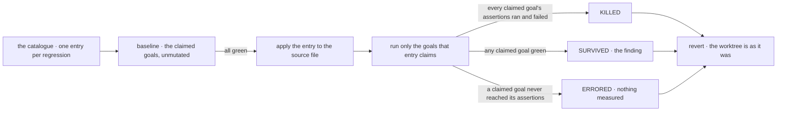

# FIX-1424 · Mutation testing over `goals/` to catch fixtures that pass for the wrong reason

**Spec** · [Decisions](DECISIONS.md) · [Rules](BUSINESS-RULES.md) · [Plan](PLAN.md)

Feature · `goals` (internal assurance suite, not a published package) · medium · 1 PR · no epic

## Five people, before and after

| Someone who… | Today | After |
|---|---|---|
| **is handed a green goal run in a review** | Has to read the fixture's causal structure by hand to know whether the green means anything. On FIX-1367 that happened three times, and three times the green was real but the claim was not being exercised | Runs one sweep. For every behaviour the catalogue covers, the goal that claims it is shown going red when the behaviour breaks — or it is named as not covering what it says |
| **writes a new goal** | Finishes when the check passes. Nothing asks whether the check is *able* to fail | Adds one line naming the regression the goal defends against, and the sweep proves the goal goes red for it. If it stays green, the goal isn't finished |
| **changes covered code a year later** | A goal that quietly stopped reaching the path it grades keeps printing PASS, and nobody re-examines an assurance that already looks satisfied | The sweep reports that goal as **surviving** the regression — green while the behaviour is broken — with the goal and the mutation named |
| **reads the sweep's report** | n/a | Sees three populations, not one: proved covered, survived, and *no entry at all*. The third is stated, never implied |
| **wants confound coverage closed** | Static shape rules (C1–C4) catch the four shapes we've already been bitten by | Unchanged. This narrows the claim-to-cause gap; it does not close it, and the report says so |

The suite is what tells us the framework still works. That only holds while a green check means the thing it claims to certify is actually exercised — and today the only instrument for that is a human noticing.

## What changes


Left is one run and a question nobody answers mechanically. Right is the same goal run twice: green unmutated, red under the regression. A goal that stays green is the finding — and no fixture is read, let alone changed, to produce it.

**What a person writes — one catalogue entry per regression worth simulating:**

```diff
+ {
+   id: "hire-skips-empty-skill-sets",
+   regression: "hire supplies a seat's skills only when the set is non-empty",
+   file: "packages/workforce/src/hire.ts",
+   find: "settings[SEAT_SKILLS_KEY] = manifest.skills ?? [];",
+   replace: "if ((manifest.skills ?? []).length > 0) settings[SEAT_SKILLS_KEY] = manifest.skills;",
+   claimedBy: [
+     "workforce-seats/a-non-agent-seat-receives-its-skills",
+     "workforce-seats/two-seats-run-their-own-configuration"
+   ]
+ },
+ {
+   id: "hire-supplies-an-empty-bag",
+   regression: "hire hard-codes an empty skill bag onto every seat",
+   file: "packages/workforce/src/hire.ts",
+   find: "settings[SEAT_SKILLS_KEY] = manifest.skills ?? [];",
+   replace: "settings[SEAT_SKILLS_KEY] = [];",
+   claimedBy: [
+     "workforce-seats/a-non-agent-seat-receives-its-skills",
+     "workforce-seats/two-seats-run-their-own-configuration"
+   ]
+ },
```

Both seed entries anchor on the **same** `find` text and differ only in `replace` — one line of the implementation, broken two ways. Entries are not required to share an anchor; these two do.

**And how it is run:**

```diff
+ pnpm goal:mutate                      # every entry
+ pnpm goal:mutate hire-skips-empty     # one
+ pnpm goal:mutate --list               # what would run, and what has no entry
```

## How a sweep runs



An entry whose baseline is already red is reported invalid, not counted as a kill: a goal failing anyway proves nothing. Nor does a goal that crashed. A mutation that stops the file parsing makes every claimed goal exit non-zero without running a single assertion, and counting that as a kill would have the instrument manufacture exactly the false assurance it was built to remove — so a goal that renders no verdict is **ERRORED**, and the entry's verdict is withheld.

## What stays as it is

- **Rules C1–C4 in `goals/scripts/validate-control-shape.mts`.** Untouched. This is the causal half beside the static half, and no C5 is added.
- **Fixtures.** Nothing in this change ever edits a fixture or a goal's assertions. The implementation is the only thing mutated.
- **Goals do not gate CI.** The suite's own contract is that goal checks run outside CI, by hand. The sweep inherits that and does not change what a PR must pass — see the open fork below.
- **No new framework package or public surface.** One catalogue, one runner, both inside `goals/`.

## One thing it cannot promise

The mutation is a real edit to a real file in your working tree, so the sweep has to put it back. It does: from bytes captured before the edit, in a `finally`, on Ctrl-C, and — if somebody edited that file while the goals ran — by stopping and telling you rather than overwriting their work. But a process killed outright (`kill -9`, an out-of-memory kill, the machine going away) runs no cleanup at all. For that case the sweep writes a journal *before* it edits, and the next sweep or anchor-guard run finds it, names the file and restores it. So the honest promise is **detected and repaired on the next run**, not *never happened*. In between, `git status` shows a modified source file — visible, not hidden.

## Sign off

1. **[D1](DECISIONS.md#d1) · A mutation is a literal text edit to a package source file, applied in the working tree and reverted after the run — not a test seam built into the implementation.** If wrong: the sweep owns the target file while it runs, and a catalogue entry goes stale whenever someone edits the line it anchors on. **Changed since round 1:** the shape is the same, but how the edit is made safe was revised after review, and the worktree promise is now stated as *detected and repaired* rather than *never happened* — [the delta](DECISIONS.md#d1-revised).
2. **[D2](DECISIONS.md#d2) · The catalogue covers model-free goals only, and behaviours proved only by a model-backed goal get no mutation coverage — stated, not implied.** If wrong: the sweep's own verdict becomes as flaky as the model, which is the false assurance this issue exists to remove.

**Open: one — the cadence.** Does this run in CI on every PR, or as a periodic sweep? The full ask, with my recommendation, is in [DECISIONS.md → Open](DECISIONS.md#open). Number 2 is the one to weigh: it fixes what this instrument will and won't ever tell us. The reasoning and what lost is in [DECISIONS.md](DECISIONS.md); the cases in [BUSINESS-RULES.md](BUSINESS-RULES.md).
