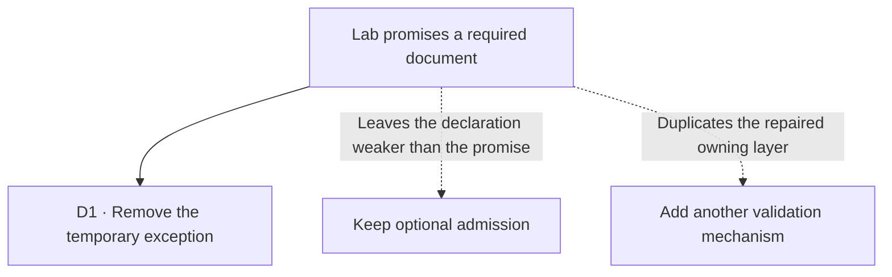

# FIX-1425 · Decisions

[Spec](SPEC.md) · **Decisions** · [Rules](BUSINESS-RULES.md) · [Plan](PLAN.md)

The chosen path uses the schema and admission mechanism that already exist.

## D1 · Restore the declaration after its upstream repair

| | |
|---|---|
| **Instead of** | Keeping optional admission or adding a separate guard |
| **Because** | FIX-1367 removed probe-based skills admission. The lab can express its actual requirement directly. Philosophy tenets [1, 3 and 5](../../docs/philosophy.md) favor a coherent declaration, subtraction, and relying on the owning layer |
| **Locks in** | A missing document is rejected during hiring; supplied valid documents retain their existing behavior |

This is an engineering call implementing the issue's stated outcome, not a new product fork. The evidence is [merged PR #1833](https://github.com/fixpoint-labs/flow-state-dev/pull/1833) and the [worker admission contract](../../docs/architecture/workforce-default-worker-kind.md#c1--composition-not-a-type).

## Decided, not asked

- Keep the useful document-description sentence; remove the paragraphs justifying the workaround. Preserve adjacent runtime code and its types within this narrow issue.
- Use the lab's existing checks, including its real-model check. A temporary missing-document probe supplies the negative case without adding a permanent test surface.
- No changeset: private goal code has no published package release.

## Considered and dropped

The existing primitive already suffices: `z.string().min(1)`. Zod's [optional schema](https://zod.dev/api#optionals) explicitly adds acceptance of `undefined`; retaining it preserves the defect. A second validation wrapper adds nothing. **Necessity verdict: build as scoped**, subtracting only the workaround the issue names.

## Open / settled

No open choices or disputed empirical claims. No POC needed: the schema behavior is established and the upstream repair has merged.

## How it got here

- **Draft** — restore the lab's required-document declaration after FIX-1367; one implementation PR, existing lab checks, current path following FIX-1427.
