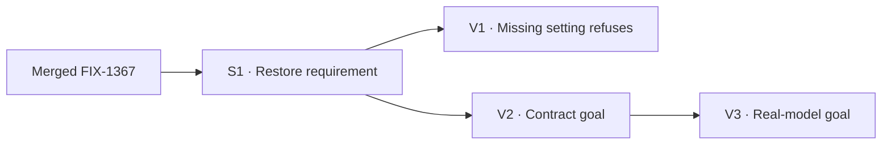

# FIX-1425 · Plan

[Spec](SPEC.md) · [Decisions](DECISIONS.md) · [Rules](BUSINESS-RULES.md) · **Plan**

Improvement; use a temporary red/green check for the changed requirement. One PR. No permanent test addition is needed for this small schema cleanup.

## Surfaces

| ID | Role / file | Change | Rules |
|---|---|---|---|
| S1 | `goals/pentest-lab/lab/workforce/flows/workers/probe.mts` · `settingsSchema` | Remove `.optional()` from `[DOCUMENT_KEY]`; remove the comment paragraphs explaining that exception, retaining the setting's useful description | BR-1, BR-2, BR-3 |

The issue's old `lab/seat-kind.mts` path moved in FIX-1427 (commit `2a4a1f4a6`). The scoped expression and its explanation remain in `settingsSchema` at lines 140–161 on the researched base.

## Sequence

The model-backed goal follows the cheaper contract check.

## Checks

Run from the repository root with workspace dependencies installed and packages built.

| ID | Runs after | Passes when |
|---|---|---|
| V1 | S1, with a before-edit characterization | In a disposable copy of the lab tree, omit a worker's `document` and call the real lab hire. Today admission accepts it; after S1 it refuses with that worker/document identified. Restoring the field admits the roster. Do not ship the temporary fixture or probe |
| V2 | S1 | `pnpm tsx goals/pentest-lab/a-post-reaches-both-declared-seats/run.mts` reports PASS; it exercises real hiring, routing, document reads, skills, and persistence without a model |
| V3 | V2 | `pnpm tsx goals/pentest-lab/a-seat-answers-from-its-own-document/run.mts` reports PASS with a real model; record the model and evidence |

V1 is the second path for D1; V2/V3 prove the goal remains useful. V3 uses the runner's configured gateway model and requires inference credentials. Unavailable credentials are a blocker, not a waived check. Record results in PR/Linear; keep permanent changes limited to S1. These goals run manually and are not replaced by a green CI badge.

## Pinned names

`document`, `[DOCUMENT_KEY]`, and both existing goal runner paths: they identify the current contract and checks, not new APIs.

## Guardrails

| Rule | Because |
|---|---|
| Use existing schema admission; add no guard or framework changes | FIX-1367 owns the framework repair; the schema is the convergence point for this lab's worker settings |
| Preserve adjacent runtime fallback, types, fixtures, and checks | This issue authorizes one field and its explanatory comment; unrelated cleanup obscures that review |
| Require both existing goal passes | A schema that rejects omission but breaks valid workers defeats the lab's purpose |

## Docs

No public docs, sidebars, package README, or changeset changes: this corrects a private lab declaration without changing the framework API. The stale explanation in `goals/pentest-lab/lab/README.md` is a separately tracked follow-up; this scope does not silently leave it unowned. The declaration's workaround explanation is removed in S1.

## Sketch / POC

No sketch or POC: the existing expression is the entire solution. No counted-corpus checker applies; this spec relies on a named local expression and behavior, not an enumerated claim about all call sites.

## At implement time

Confirm FIX-1367 remains in the base, follow any further file move, and verify the workaround is still present. If the local change cannot pass the real admission path, report that evidence rather than widening scope.

## Follow-ups

[FIX-1445](https://linear.app/fixpoint-labs/issue/FIX-1445/clear-the-pentest-labs-expired-document-workaround-narrative-and) owns the stale lab README / opt-in prose and optional-only runtime compensation. Related, not blocking; the runtime cleanup follows FIX-1425.
