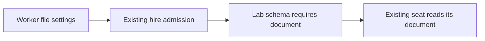

# FIX-1425 · Require the pentest lab's declared document

**Spec** · [Decisions](DECISIONS.md) · [Rules](BUSINESS-RULES.md) · [Plan](PLAN.md)

Improvement · private goal lab · small (one code surface, three checks) · one PR · no parent epic

| Someone who… | Today | After |
|---|---|---|
| Reads the lab as proof that workers require a document | The declaration still permits omission | The declaration enforces the lab's promise |
| Starts a worker without its document setting | The schema admits it; a later read refuses it | Hiring refuses the missing setting |
| Runs the supplied lab | Both checks exercise workers with documents | Both checks still pass with the stronger declaration |

## What changes


The missing-document row changes; the supplied-document row must keep working.

The existing string declaration becomes required and the comment explaining its temporary exception is removed. No public API usage changes: this is a private lab schema correction.

```diff
- [DOCUMENT_KEY]: z.string().min(1).optional(),
+ [DOCUMENT_KEY]: z.string().min(1),
```



The lab relies on the admission path already repaired by FIX-1367.

## Scope

Build as scoped. Keep the lab's other behavior, fixtures, runtime fallback and framework code unchanged. The target moved during FIX-1427; the plan names its current location. The lab README also repeats the stale workaround explanation; that is a separate follow-up under this issue's explicit scope boundary.

## Sign off

Approve the narrow cleanup and its verification. **Recommendation: proceed** now that FIX-1367 has merged. There is no unresolved product choice; the engineering call is recorded in [Decisions](DECISIONS.md#d1).

**If wrong:** a lab run fails and this local edit is cheap to reverse. Evidence that hiring still loses required settings would change the recommendation; the checks must catch that before merge. **Open: none.**
