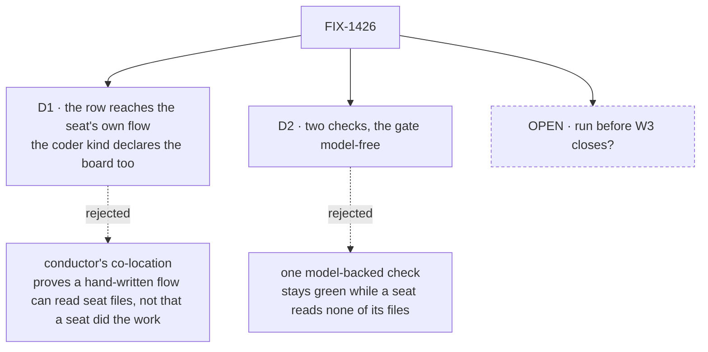

# FIX-1426 · Decisions

[Spec](SPEC.md) · **Decisions** · [Rules](BUSINESS-RULES.md) · [Plan](PLAN.md)

What was considered, what was chosen, why, and what each choice locks in. Two decisions are the
sign-off surface, plus one open question that is the owner's. Everything else here is context.

## The tree

Solid edges are what you're signing. The dashed node is the question that is yours, not mine.

## D1 · The board hands the row across flows to the seat's own instance, and the `coder` kind declares the same logical board itself

| | |
|---|---|
| **Instead of** | Conductor's shape: one flow carrying both the board and the `harnessManager` entry, with the seat's files read by that flow |
| **Because** | The claim is that *a declared seat does the work*. Under co-location the row reaches a hand-written flow that happens to read seat files, and the seat is never the thing that was woken — which is the assertion this slice exists to replace with a result. A check built on co-location would report PASS on exactly the state we are trying to rule out |
| **Locks in** | Every DevForce worker kind that can be given work carries board wiring — a `boardId` and a ledger identity shared with the coordinator board, plus its own same-flow gating dispatcher. So "a seat that can be given work" is permanently a heavier declaration than "a seat that can answer," and that asymmetry is inherited by the Lab and by anything built on it |

**Settled by a run, not a read.** The run recorded under *Settled* below confirms the mechanism
works with a real `harnessManager` at the recipient entry. It also found the cost: `defineFlow` refuses a flow that
declares a task entry with no board reachable that hands off to it, and the claim gate refuses a
dispatch whose `boardId` differs from the one the recipient's own board was built with. So the
recipient cannot declare only the remotely-addressed entry. That is a real constraint, not a
workaround — the framework's own committed test
(`packages/orchestration/test/task-board/hand-off-cross-flow.test.ts`) documents it in its header.

**What would change my mind:** if the Lab's worker kinds turn out to need board wiring anyway for
an unrelated reason, the asymmetry stops being a cost and this is strictly better. Conversely, if
W4 ([FIX-1408](https://linear.app/fixpoint-labs/issue/FIX-1408)) lands a dispatch policy that gives
a board a seat address without the double board declaration, this decision should be revisited
rather than grandfathered.

## D2 · Two checks over one tree, and the contract gate runs with no model at all

| | |
|---|---|
| **Instead of** | One model-backed check that exercises the whole path end to end |
| **Because** | A model improvising around a missing document still produces a plausible commit, so a single model-backed run reports PASS on a seat that read none of its own files — the failure this whole slice exists to detect. The gate therefore grades what the plumbing carried, with a stub in the harness slot; the model-backed sibling covers the one leg a stub cannot reach. This is the pentest lab's own shape, and it is why that lab found two framework bugs their green suites had missed |
| **Locks in** | The harness is a slot in the `coder` kind forever, since two checks drive the same tree and differ by one block. A future change that hard-codes a harness inside the kind breaks the gate, not just a test |

## Decided, not asked

- **The EM seat's filing is deterministic in both halves.** Its v1 job is mechanical: a post in the
  feature channel becomes a row on the feature board. Giving it judgment is a second slot and a
  second model, and nothing about "the EM seat does no harness work" needs it to think.
- **The honesty check runs against a local scratch repository**, and its done-condition is a commit
  the base ref does not have, not a pull request. Conductor already proves the `gh` probe; re-proving
  it makes the check expensive to re-run a year from now, which is what a goal is for.
- **Kinds are one file each under the lab tree's `workforce/flows/workers/`**, basename = the kind
  id. Not a `seat-kinds.mts` barrel. This is the locked W3 authoring path
  ([FIX-1357](https://linear.app/fixpoint-labs/issue/FIX-1357)); the barrel in `goals/pentest-lab/`
  is being folded separately under [FIX-1427](https://linear.app/fixpoint-labs/issue/FIX-1427).
- **A third seat is declared and never woken.** Without it, "the row reached the seat it named" is
  an absence rather than a graded claim. It costs nothing — it never runs.
- **Held-out tokens are graded in the prompt the manager built**, not in what the run produced. What
  a model wrote is not evidence that a file was read.

## Considered and dropped

| Alternative | Why not |
|---|---|
| Wait for the DevForce Lab proper and prove it all at once | The Lab is a showcase; a showcase that fails tells you something is wrong and not what. D-12 also forbids building it yet |
| Extend `goals/pentest-lab/` with a coding seat rather than a new directory | Its two checks are a merged proof with a verdict log. Growing them re-opens a settled artifact, and the pentest tree's identity is the four conventions, not work routing |
| Prove the cross-flow hand-off with a unit test in `orchestration` and stop there | That test already exists and passes. It proves the seam; it proves nothing about a seat that came out of a folder, which is the part nobody has run |
| Give the EM seat a real model so it decides what to file | Doubles the model surface for a claim that is structural. The EM's opinion is *that it names no harness*, not that it reasons well |
| Declare the board as a file convention in the tree | The loader walks workers, skills, resources and channels only. A `boards/` folder loads as nothing, silently ([FIX-1421](https://linear.app/fixpoint-labs/issue/FIX-1421)). Boards are declared in app code, by design |

## Settled

- **A `taskBoard` worker can hand a row across flows to a `harnessManager` entry on another flow
  instance** — **CONFIRMED**. Reproducible anchors, both committed and runnable today:
  `packages/orchestration/test/task-board/hand-off-cross-flow.test.ts` for the hand-off and the
  same-board constraint, and `packages/harness-manager/test/slot.spec.ts` for the manager driving a
  conforming harness model-free. What neither covers is the **join** — a real `harnessManager` at the
  far end of a cross-flow hand-off, settling the originating row — and that is what was run before
  drafting: two real `defineFlow` instances through `createFlowState`/`runAction`, a real
  `harnessManager`, a scripted harness, no model and no network. The row settled `completed` on the
  recipient flow with the child session attributed to the recipient's kind, and the red state was
  produced (`flowKind: "no-such-seat-instance"` errors the row `flow-not-found`). That run happened
  in a throwaway worktree; its verdict and the flow shapes are written up at
  `spec-poc/FIX-1426-crossflow-handoff/NOTES.md`, which is a **record, not a re-runnable check**.
  S8 is where the join becomes a standing check.
- **`session: "per-task"` behaves identically cross-flow** — **CONFIRMED**. The session key is a
  pure function of `(boardId, taskId)`, computed by the sender, with no flow-specific component.
- **The recipient flow must declare the same logical board itself** — **CONFIRMED**, and it reshaped
  D1's *Locks in* rather than the decision. Same `boardId`, same ledger, its own same-flow dispatcher.
- **A stock `hireWorkforce` seat exposes no task entry** — **CONFIRMED** by reading
  `packages/workforce/src`: zero references to `taskBoard`, `harnessManager` or `task:`. So the
  `coder` kind is necessarily a custom registered worker kind, not the built-in `agent` kind. This is
  the same shape the pentest lab needed for a different reason.

## Open

### Does this run before the W3 epic closes, or after?

**In plain terms.** D-12 says DevForce is design-only "until Workforce can host it," and names
running the Lab early as a way of faking progress. This is not the Lab — it is a check under
`goals/`, the same posture as the pentest lab. But it is DevForce-shaped, and you are the one who
decided DevForce waits.

**The trade-off.** Running it now means W3's remaining design gets evidence about the one seam
DevForce actually rests on, while that design is still moveable. Waiting means the evidence arrives
after the decisions it would have informed, and the W4 dispatch work
([FIX-1408](https://linear.app/fixpoint-labs/issue/FIX-1408)) is specced without knowing what the
board-to-seat path costs.

**My recommendation: run it now.** The precedent is direct — the pentest lab ran on W2's conventions
and found two framework bugs (FIX-1412, FIX-1367) that four green convention suites had missed. This
slice has already found one constraint before a line of the lab was written. The Architect's own
enrichment on the issue says goal and POC work in parallel is fine and reserves only *shipping
product surface* for after W3.

**What would change my mind.** If you read "DevForce is design only" as covering the word DevForce
rather than the Lab artifact, then the honest move is to rename this to what it actually tests —
the board-to-seat seam — and file it as W4 evidence instead. Same code, different framing, and it
stops borrowing a name you parked.

**What being wrong costs.** A check that W3 or W4 later invalidates, and an amendment to D-12's
"design only" line so the record is not misleading. Not the code: the seam it grades is W4's
regardless of what the Lab is eventually called.

## How it got here

- **Draft** — framed as the gap between two proven halves rather than as a DevForce feature; the
  cross-flow hand-off settled by a POC before drafting, which moved D1's *Locks in* to name the
  double board declaration; kind authoring moved off a barrel onto file-per-kind after an Architect
  coherence hold on the superseded [#1841](https://github.com/fixpoint-labs/flow-state-dev/pull/1841).
