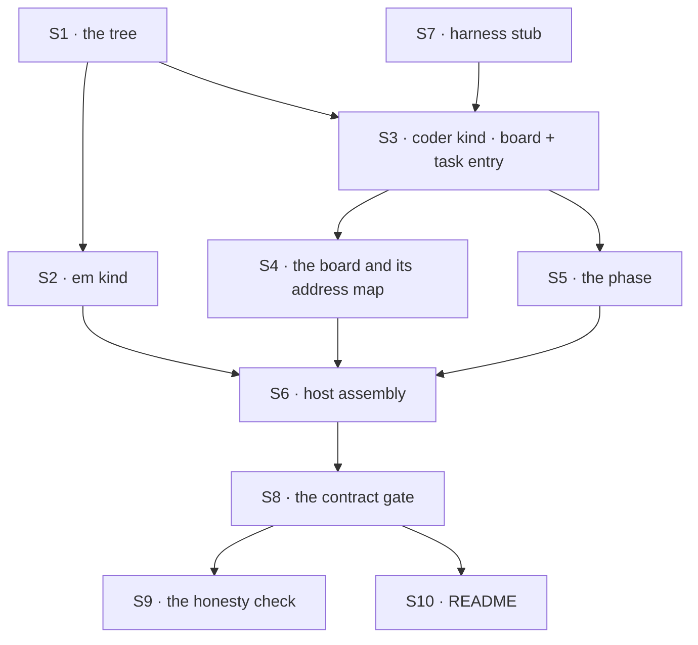

# FIX-1426 · Plan

[Spec](SPEC.md) · [Decisions](DECISIONS.md) · [Rules](BUSINESS-RULES.md) · **Plan**

Written for the implementing agent. IDs cross-reference [BUSINESS-RULES.md](BUSINESS-RULES.md)
(BR-n) and [DECISIONS.md](DECISIONS.md) (D-n). `tdd`. One PR. No package changes.

## Surfaces

| ID | Package · role | Change | Rules |
|---|---|---|---|
| S1 | `goals/devforce-lab/lab/workforce/` · the tree | Six convention files: one org resource, one team resource, one team skill, one `CHANNEL.md`, three `WORKER.md`. Each carries one held-out token appearing in exactly one file | BR-1 BR-3 BR-10 |
| S2 | `goals/devforce-lab/lab/workforce/flows/workers/em.ts` | The coordinator kind. One file, one kind, basename = the id `WORKER.md` names. Declares no harness slot at all — BR-4 is graded on the kind, not on behaviour | BR-4 BR-5 |
| S3 | `goals/devforce-lab/lab/workforce/flows/workers/coder.ts` | The working kind: a `task.actions` entry mounting `harnessManager`, **plus its own board declaration** (same `boardId`, same ledger id) and a same-flow gating dispatcher, per D1's settled constraint. The harness is a **slot** | BR-6 BR-10 BR-11 BR-12 |
| S4 | `goals/devforce-lab/lab/board.mts` | The feature board and its static assignee→seat address map. `workers: { coder: dispatcher({ flowKind: "<seat instance id>", session: "per-task" }) }`. The key is an **assignee**, not a seat | BR-5 BR-6 BR-7 BR-8 |
| S5 | `goals/devforce-lab/lab/phase.mts` | One phase: `buildPrompt` composed from the seat's own config, `isDone` = a commit the base ref lacks. No `gh`, no network | BR-10 BR-13 BR-14 BR-15 |
| S6 | `goals/devforce-lab/lab/host.mts` | Read the tree, hand-assemble `{ em, coder }` from S2/S3, hire, open the channel, register the board. **Not** a barrel that defines the kinds | BR-1 BR-2 BR-16 |
| S7 | `goals/devforce-lab/lab/harness-stub.mts` | The scripted run handle the gate puts in the slot: records the prompt and the cwd it was given, returns a configurable verdict. No model, no network. **Follow `fakeHarness` in `packages/harness-manager/test/slot.spec.ts`** — the neutral contract with no vendor SDK. Do not reach for `claudeCodeAgent` or anything in `labs/conductor`, which stays a read-only reference for the honesty check's slot options | BR-10 BR-11 BR-12 |
| S8 | `goals/devforce-lab/it-wakes-the-seat-a-file-declared/` | The contract gate: `goal.md`, `run.mts`, `fixtures/`. Every control env-gated, `GOAL_CONTROL=list` prints them | all gate rules |
| S9 | `goals/devforce-lab/it-commits-from-the-seats-own-file/` | The honesty check: same tree, same hire, same wiring, a real harness in S7's slot against a local scratch repo | BR-10 BR-13 BR-15 |
| S10 | `goals/devforce-lab/lab/README.md` | What the directory is, what it works around, what each lab-owned file is for. Opens by saying it is evidence, not an application | — |
| S11 | `spec-poc/FIX-1426-crossflow-handoff/NOTES.md` | **Removed** at implementation. It lives on the spec branch, which never merges | — |

**Why the kind files sit inside `workforce/`, not beside it.** `<root>/workforce/flows/workers/<id>.ts`
is W3's convention, not a choice this slice makes: [#1834](https://github.com/fixpoint-labs/flow-state-dev/pull/1834)
(FIX-1357) establishes it and emits `workforce/workforce.gen.ts` next to it, with
`apps/kitchen-sink/workforce/flows/workers/desk-clerk.ts` as the shipped precedent. The pentest lab
predates it and keeps its TypeScript at `lab/*.mts`, so the two labs differ on purpose — FIX-1427
moves pentest onto this path rather than this slice moving off it. `what-declares-what.svg` still
holds: `flows/` is the code side of the fence, and the loader walks only `workers/`, `skills/`,
`resources/` and `channels/`, so nothing under `flows/` is read as a convention file (BR-16).

## Sequence



Build S3 first among the kinds: its board-plus-entry shape is the one thing the POC found a
constraint on, and everything downstream assumes it.

## Checks

| ID | Runs after | Passes when |
|---|---|---|
| V0 | S1 | Every held-out token appears in exactly one convention file and in **none** of `lab/**/*.{ts,mts}` — scanned, not asserted. This runs before anything is built |
| V1 | S6 | BR-1, BR-2: one root, three seats, the complete id set; both bad trees refuse the whole hire and both corrected twins hire cleanly |
| V2 | S6 | BR-3, BR-4: each seat's exact skill union read off the seat inside a running block; the `em` kind has no harness slot to name |
| V3 | S8 | BR-5–BR-9: one row, claimed once, handed to the `coder` instance; the child session attributed to that instance; `reviewer` absent from the **dispatch record** |
| V4 | S8 | BR-11, BR-12: the cwd is the derived checkout; a bad-verdict-inside-a-normal-finish does not settle done |
| V5 | S8 | BR-16, BR-17: a `boards/` folder in the tree changes nothing and the board still came from code; an org-less read is refused while the same read with an org lands |
| VG | S9 | Goal, real harness: the scratch repo's branch carries a commit the base lacks, and the prompt that produced it carried all three tokens. `goals/devforce-lab/it-commits-from-the-seats-own-file/run.mts` |
| VC | S8 | **Every control goes red, and each on one clause naming what it perturbed.** Apply the pentest lab's own test to each: *what would this report if the behaviour it guards were silently correct?* A control that bundles two perturbations holds the second identical across both halves |

**The second path (BP-035):** every rule above is exercised on the **hand-off**, never only on a
direct call to the seat. A check that reaches the seat without going through the board proves the
seat works and says nothing about D1.

## Pinned names · the only two

| Where | Name | Why pinned |
|---|---|---|
| Kind ids | `em`, `coder` | The `WORKER.md` `flow:` lines name them, and the basenames under `flows/workers/` must match |
| Board assignee key | `coder` | It is the routing key on the row, and BR-5/BR-8 grade on it |

Everything else is yours to name, including the seat ids, the token strings and the channel name.

## Guardrails

| Rule | Because |
|---|---|
| The harness is named in **one expression**, inside the `coder` kind (D2) | Two checks drive the same tree and differ by that block. Hard-code it and the model-free gate becomes impossible, not just inconvenient |
| The `em` kind declares **no harness slot** | "The EM seat does no harness work" is a locked DevForce opinion. Graded on the kind so it cannot regress into "it happened not to" |
| A board assignee key is **not** a Workforce seat (FIX-1385) | `workers` keys are assignees; the board claims a row to a seat through an address. Conflating them is how a board becomes a mint door for sessions and posts, which is invent-killed |
| Kinds are **one file each** under `workforce/flows/workers/`; no barrel | The locked W3 authoring path (FIX-1357). A calibration goal that teaches a second door teaches two directions |
| The board is declared in **code**, never as a tree folder | The loader walks four things and silently ignores the rest (BR-16, FIX-1421). A `boards/` folder would look declared and be read by nobody |
| No token is graded in what the run **produced** | A model writes a plausible commit without reading anything. Only the prompt the manager built is evidence |
| Consume the shipped surfaces; change none | This is a goal. A framework finding is filed and worked around in the open, the way the pentest lab handled FIX-1412 |
| Do not grow this into the Lab | Invent-killed on the issue: no MCP, no product team, no second board, no philosophy flow, no UI |

## Docs

- **No `apps/docs` change.** Nothing here is user-facing framework surface; a goal is internal
  evidence. `goals/README.md` already defines the directory's conventions and needs no amendment.
- **CREATE** `goals/devforce-lab/lab/README.md` (S10), modelled on `goals/pentest-lab/lab/README.md`:
  what an author writes, what this directory adds and why each piece is here, what it works around.
  *Voice risk:* the pull toward describing DevForce the product. This README describes a check.
- **No changeset** (BP-022): `goals/` is private and publishes nothing.
- **Not the atlas.** Three open PRs are already rewriting `docs/atlas/workforce.html`. If this
  lands, whether DevForce's §03 tags change is [FIX-1427](https://linear.app/fixpoint-labs/issue/FIX-1427)-adjacent
  and goes through the `fsd/devforce` mailbox handle, not this PR.

## Sketch · pseudocode, illustrative, react to the shape

```
the coder kind (S3):
    declare a board — same boardId and ledger as the coordinator's     ← D1's cost
    declare a same-flow dispatcher seat pointing at the task entry     ← what gates it
    declare task.actions[work] = harnessManager({
        boardCollectionId, boardCollection, tenant, phase, workspace,
        harness: the slot                                              ← stub or real
    })

the board (S4):
    workers: { coder: dispatcher({ flowKind: <the coder seat's instance id>,
                                   action: work, session: "per-task" }) }
                                   ↑ static: an instance id, not a function

the gate (S8):
    scan the tree and all of lab/*.mts for the tokens        ← V0, before anything is built
    hire from the root, assert the complete seat id set
    em files one row → drain → assert the harness stub saw:
        a prompt carrying all three tokens, and the derived checkout as its cwd
    assert reviewer is absent from the DISPATCH RECORD, not just from the result
```

**POC:** `spec-poc/FIX-1426-crossflow-handoff/NOTES.md` on this branch. It records the run that
settled D1's premise on the real path — two real flows, a real `harnessManager`, a scripted harness,
no model — and carries the two flow shapes as a sketch. The premise held, **and it was not free**:
the recipient must declare the same logical board itself, which is now D1's *Locks in*. Red state
produced (`flow-not-found` on an unknown instance id), so the check reached the seam.

That run is **not re-runnable from this branch** — it happened in a throwaway worktree, and the
write-up is a record, not a check. What a reader can run today is the committed pair the notes point
at: `pnpm --filter @flow-state-dev/orchestration test hand-off-cross-flow` (the hand-off and the
same-board constraint) and `pnpm --filter @flow-state-dev/harness-manager test slot` (the manager
driving a conforming harness model-free). They do not cover the join of the two, which is S8's job.

## At implement time

- **`workforce.gen.ts` may exist by then.** [#1834](https://github.com/fixpoint-labs/flow-state-dev/pull/1834)
  (FIX-1357) was open when this was written, so S6 hand-assembles `{ em, coder }`. If it has landed,
  replace that with `import { kinds } from "./workforce/workforce.gen"` — one line, and #1834's own
  contract says a hand-passed map is not deprecated and composes with a generated one.
- **[FIX-1427](https://linear.app/fixpoint-labs/issue/FIX-1427) may have folded the pentest lab's
  `seat-kind.mts`** onto the same layout. If so, read what it produced before writing S2/S3 and
  match it rather than inventing a second reading of the same convention.
- **Re-read `packages/workforce/src` for a task entry.** It had none when this was written, which
  is why S3 exists. If a built-in kind has since gained one, S3 shrinks to a config and D1's
  *Locks in* should be revisited on the spec branch before building.
- **Check whether FIX-1412** (org threading through `openChannels`) landed. If not, the pentest
  lab's two-line client wrap is still needed and BR-17 is its control.

## Notes from review

Recorded for the implementer to weigh against real code, per this PR's review contract. Not folded
into the design — read them when you reach the surface each names.

- **S8's wait loop.** Follow the pentest lab's deadline style, not a busy-poll. The settle run's
  `until()` 10ms-interval loop was fine for a throwaway and is not a pattern to copy. *(Cursor,
  round 1)*
- **D1's double board is ergonomic cost, and it is already tracked.** [FIX-1408](https://linear.app/fixpoint-labs/issue/FIX-1408)
  owns the scale question. Nothing for this slice to solve; don't invent a helper to hide it before a
  third consumer exists. *(Cursor, round 1)*
- **Don't extract a shared lab-host helper yet.** Two labs is not a pattern. Deliberately deferred;
  re-raise at the third. *(Cursor, round 1)*
- **S8/S9 stay split, and the `reviewer` seat stays.** Different falsification targets — merging them
  or dropping the negative control would cost the thing each exists to prove. *(Cursor, round 1,
  raised as skipped)*

## Follow-ups

- The cross-flow constraint D1 names — a recipient declaring a board purely to gate an entry it is
  handed — is a real ergonomic cost and belongs to W4's dispatch policy
  ([FIX-1408](https://linear.app/fixpoint-labs/issue/FIX-1408)). File the finding there when this
  lands; do not solve it here.
- `goals/pentest-lab/` and this lab will share a fair amount of host assembly. Leave the duplication
  until there are three; two labs is not a pattern.
